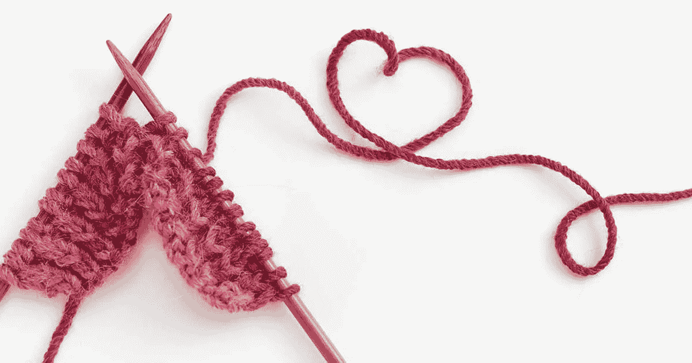
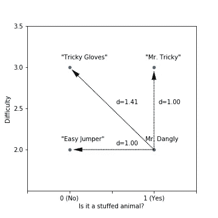
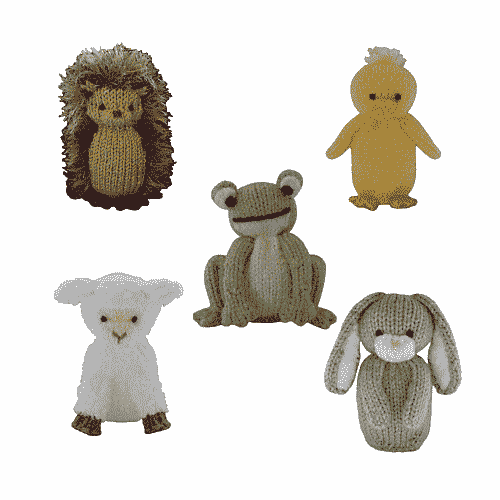
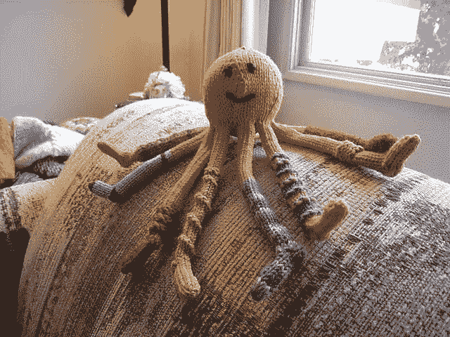

# 针织和建议

> 原文：<https://towardsdatascience.com/knitting-and-recommendations-b9d178a86c97?source=collection_archive---------12----------------------->

## 计算机如何思考:第三部分

事实证明，我对编织所知不多。回过头来看，我想当然地认为我可以在几个小时的网上浏览中获得对如此复杂的领域做出有意义的陈述所需要的所有知识，这看起来太天真了。认为一个好的数据集和一个智能算法可以完全取代专家知识是一种危险的傲慢，但这种想法太普遍了。它源于对数学解决复杂问题的能力的乐观信心，以及对“硬”工程和数学问题相对于“软”社会和人际问题的相对复杂性的一种沙文主义。它导致了许多构想拙劣的初创企业，以及许多用手机应用解决棘手社会问题的善意尝试。幸运的是，我自己对盲目无知的尝试的风险大大降低了。

我这篇文章的计划是演示两种推荐算法。推荐可能是最常见的，也绝对是人工智能在当今互联网上最明显的表现。大型在线零售商试图从浏览器中榨取尽可能多的钱，通过向你展示表面上相关的商品来诱惑你额外购买。在线内容提供商试图让你留在他们的网站上，用另一篇文章或视频提示你，他们猜测是一个类似的主题。音乐网站在提供好的推荐方面做了也许是最深的投资。当使一首歌伟大而另一首歌糟糕的因素如此模糊不清、不可捉摸时，理解音乐品味的复杂性是他们都在竞相解决的问题。

广义来说，推荐算法就是计算相似度。他们从用户喜欢的一个或多个项目中进行推断，以找到用户也会喜欢的一组类似项目。就他们如何计算这种相似性而言，大多数推荐系统分为两大类。第一个可能是最明显的。“基于内容”的推荐假设两个项目相似，如果它们具有相似的质量。要进行基于内容的推荐，你需要对你推荐的东西有很多了解。如果你推荐的东西具有清晰、可比较和可量化的属性，那就很容易了。例如，比较一台冰箱和另一台冰箱是很简单的:大小、瓦数、是否有冷冻室、冰块制造机等等。将冰箱比作搅拌机更困难。基于内容的推荐也经常错过更微妙的环境。如果你最近购买了一台冰箱，该算法可能会假设你一定非常喜欢冰箱，因此你想开始收集它们。

第二种算法叫做“协同过滤”，更加微妙。它假设如果同样的人喜欢两个东西，那么它们是相似的。换句话说，如果你和我都喜欢冰箱，我们都喜欢搅拌机，那么这意味着，在某种程度上，冰箱和搅拌机必须有一些共同点。显然，如果你只看两个人的样本，这种方法会有相当大的误差。你和我碰巧对乡村音乐和自然纪录片都有热情，这并不意味着这两件事之间有很强的联系。但是有了足够多的人，它变得非常可靠。通过汇总大量用户的意见，虚假连接往往会被大量更有意义的连接所淹没——一般来说，购买冰箱的人也更有可能看搅拌机，而不是看弧焊机。在识别难以标记的微妙文化标记方面，这些算法通常比基于内容的方法好得多。由于这个原因，它们经常被用来推荐音乐或电视节目。例如，对于基于内容的算法来说，甲壳虫乐队和门基乐队之间的区别可能很难解析。他们都是 20 世纪 60 年代的四人流行乐队。他们拥有基本相同的乐器，相似的乐观声音，他们都不幸在职业生涯后期涉足迷幻音乐。只考虑这些事实的算法可能会假设这两组非常相似。但是披头士的粉丝不太可能乐意听到 Monkees 出现在他们的播放列表中。一种协同过滤算法能够检测到这些差异——可能会建议一些听起来与披头士很不一样，但有相似粉丝群的歌曲。协同过滤算法有几个弱点。首先，他们依赖用户行为的事实意味着他们容易过度解读异常的离群值。少数有不寻常习惯的用户有时会以不可预知的方式歪曲数据。其次，与第一点相关的是，在他们能够提出合理的建议之前，他们需要与一个新项目进行大量的互动。只有少数用户看到过的项目会有一个基于小数据集的建议，因此可能会反映这一小部分用户的特质。这被称为“冷启动问题”，因为算法需要大量数据来“预热”以提供良好的推荐。

记住这两个算法，让我们回到我尴尬的失败。为了演示这两种推荐方法，我需要一个大型的项目数据集、关于这些项目的一些属性的信息(形成基于内容的算法的基础)，以及关于用户及其与这些项目的交互的信息(构建协作过滤算法)。在网上搜索了一段时间，并与一些朋友交谈后，我选择了 Ravelry，一个分享针织图案的网站，作为我的数据来源。Ravelry 可能是互联网上最大的针织和钩针图案在线收藏，其广大用户全年在世界各地上传、评论、分享、下载和保存数十万种图案。他们收集了大量我需要的数据。一封非常大胆的电子邮件之后，Ravelry 非常乐于助人的人给我提供了下载我需要的数据的方法。

Thanks, Ravelry!

现在。这是我应该停下来的地方。盘点一下。思考我正在着手的项目，对我的专业知识进行诚实的评估，并寻求一些专家的帮助。读者，我没有。这件事的后果直到很久以后才变得明显。

为了帮助用户在他们的网站上找到模式，Ravelry 记录了大量的“元数据”。这包括图案的“难度等级”,关于风格的关键词，图案是针织还是钩编，是套头衫还是手套，以及一大堆更模糊的指标。出于我们的目的，这将形成“基于内容”算法的基础。我们要建立一个算法，可以根据一个针织图案的元数据，找到另一个相似的图案。忽略网站上提供的更深奥的信息，我下载了几百个模式的最重要的度量，并开始准备数据。

以下是图案的主要特征——在这种情况下是可爱的针织毛绒玩具——出现在 Ravelry 网站上的方式:

*Mr. Dangly, in a contemplative mood*

姓名:“丹格里先生”

类别:动物

难度:1.9

工艺:针织

关键词:条纹、接缝、文字图案、加工平面

要将这一团关于针织图案的非结构化信息转化为适合我们算法的数据集，需要一系列数学技巧和转换。首先，除了“困难”之外，所有这些数据都是英语单词的形式，这些单词对计算机的意义就像一串二进制 1 和 0 对你和我的意义一样。我们的首要任务是将这些单词转化为数字。为了做到这一点，我们使用了一种叫做“一键编码”的技巧。

一键编码因电子工程中的一项技术而得名。假设您有一台机器，它可以处于两种状态之一:开或关。你可以很容易地用一盏灯来指示机器的状态。如果灯亮着(或“热”)，则机器启动。如果灯关了，机器也关了。但是如果机器有三种状态呢？说，开，关，还有“预热”。现在显示机器的状态就更复杂了。你需要第二盏灯。没有灯意味着机器关闭，第一盏灯意味着机器正在预热，如果第二盏灯亮着，则机器准备就绪。如果两盏灯都亮着，你的机器有问题。对于你的机器可能处于的每一种状态，你都需要增加一个额外的灯。这不是最有效的信息编码方式——如果机器非常复杂，你需要很多灯——但它的优点是可靠性。很难意外地发出错误状态的信号，并且很容易判断是否出了什么问题——一次有多个灯亮着。

我们可以使用相同的技术来编码我们的类别数据。我们有一个单列的数据，每行表示几个类别中的一个，而不是一个可以处于不同状态的机器。我们不使用灯光，而是将单列数据转换成多列，每一列对应一个类别，“围巾”、“套头衫”、“无檐帽”、“羊毛衫”、“围巾”等。对于每一行，所有这些列的值都是零，除了与我们的项目类别相对应的列，它被设置为 1。我们可以通过查看哪一列的值为 1 来确定数据集中每一项的类别。

关键字数据——如“fringe”、“granny-squares”等——基本上得到相同的处理:每个可能的关键字对应一列，如果该项目不包含该关键字，每行包含 0，如果包含该关键字，则包含 1。这创建了一个非常“宽”的表，有许多列。我们的填充朋友，上面的 Dangly 先生，可能(部分)由我们表中的以下行表示:

现在我们已经对这些数据进行了编码，我们可以用它来进行基于内容的推荐。

这类推荐本质上是关于计算相似度的。我们想找到与丹格里先生最相似的模式。为此，我们将使用一种叫做“欧几里德距离”的度量。

欧几里德距离测量距离就像我们在现实生活中测量距离一样——两点间直线的长度。正如我们可以计算地图上两组经纬度坐标之间的距离一样，我们也可以计算表格中两行数值数据之间的距离。如果我们想象我们的数据集只有两列，这很容易想象，“困难”(2 代表丹格里先生)，和“动物”(1 代表丹格里先生，他是一只猴子)。我们可以将它绘制在二维图表上，并将其与其他三种假设模式进行比较:“狡猾先生”——一种填充动物，像丹格利先生一样，但制作起来更复杂，难度等级为 3；“易跳投”——像丹格利先生一样容易制作，但不是填充动物玩具；还有“狡猾的手套”——一点也不像丹格利先生，既不容易制作，也不是毛绒动物。

这些假设模式的数据如下:

当我们在二维图表上绘制时，距离计算变得很清楚:

Figure 1: Euclidean distances

丹格利先生和其他三种模式之间的欧几里德距离实际上是它们之间的直线长度，就像你用尺子测量它一样。“狡猾的手套”，由于有一个更长的对角线，丹格里先生，有最大的欧几里德距离，是最不相似的。“轻松跳投”和“狡猾先生”离丹格利先生同样遥远——它们同样相似。

关于欧几里德距离的有趣而又令人困惑的事情是，这个计算适用于任何数量的额外维度。您可以想象在这个图表中添加第三个高度轴，代表其中一个关键字。对于那些不共享关键字的模式，三维空间中的线会更长。(至少对我来说)在三维以上的空间中想象这一点变得越来越困难，但我确信数学是完全正确的，实践证明了这一点。

这张图表也暴露了这种方法的一个问题。你会注意到从丹格里先生到“狡猾先生”和“容易跳楼者”的欧几里得距离是完全相等的。我们的算法假设这两种模式都与丹格利先生相似，都是同样好的推荐。这是一个好的假设吗？一个难度点的区别就相当于一个毛绒动物和一个跳楼者的区别吗？直觉上，感觉是没有。但是我怎么知道呢？如果这两个差别不是一个量级，那么差别有多大？与类别差异相比，我应该给难度差异多少权重？我完全没有资格回答。这是我选择寻求一些外界帮助的时候(太晚了)，这样我就能更多地了解编织者是如何选择图案的。结果是…令人羞愧。

事实证明，我之前丢弃的所有晦涩难懂的指标，比如“纱线重量”、“针距”和“码数”，实际上对许多针织者来说至关重要。我是个傻瓜！针织者通常会寻找与现有纱线搭配的图案，而不是为每个图案购买新的纱线。这意味着她们对图案的选择常常受到制作图案所需纱线种类的限制。将它们排除在我的算法之外意味着它生成的建议通常表面上可以接受，但根本不能反映编织者的实际偏好。

为了解决这些问题，首先我不得不回到数据的来源，诅咒自己，重新下载所有数据，包括我现在意识到对分析至关重要的额外指标。然后，在咨询了我匆忙招募的针织专家后，我创建了权重——一个衡量每个指标的值，以反映它对针织者选择图案的重要性。有了这些改进，我可以提出对真正的编织者有意义的建议。

最终的算法主要考虑图案的工艺(无论是针织、钩编还是其他)、类别、纱线重量和难度。但它也考虑了关键词、针规格和许多其他因素。对于其中的每一个，它都会计算出模式之间的“距离”。他们的共同点越多，距离就越小。

*The “Spring Collection”*

对于上面的毛绒玩具猴子 Dangly 先生，该算法推荐了“春季系列”，一套毛绒玩具图案，包括刺猬、青蛙、兔子和羔羊。它们同样易于编织，采用了相似的技术——有接缝的结构和流苏的使用(丹格里先生用的是一簇整洁的头发，春季系列用的是刺猬的刺)。从很多方面来说，这都是一个非常好的推荐。但是有些事情不太对劲。丹格利先生有一种怪癖，某种程度的奇思妙想或风格使他脱颖而出。相比之下，虽然表面上与丹格利相似，但春季系列缺少他的独特魅力。它们似乎有点乏味，而且有点甜。我觉得丹格利先生的朋友不太可能和春季系列的成员相处融洽。该算法提出了一个理论上正确的建议，但它忽略了模式的一些细微差别。它错过了一些人类看不到的东西。它忽略了他们的个性。

这使得协作算法试图做得更好。协同过滤算法与基于内容的算法非常不同。我们的基于内容的算法使用关于模式本身的元数据，而协作过滤方法关注与这些模式交互的*人*的信息。Ravelry 允许用户“喜爱”图案，并存储他们喜爱的列表。这些列表是公开的，这意味着我可以下载几十万个 Ravelry 用户的“最爱”模式列表。就个人而言，这些列表是独特的，信息不多。喜欢厚针织围巾的人可能也对新奇的茶具感兴趣，这不应该暗示我们关于围巾或廉价家居装饰的任何事情。但总的来说，在我能够从 Ravelry 检索到的各种卷中，这些信息确实变得非常有用。因为协同过滤使用了关于人类行为和偏好的相对更复杂和微妙的信息，我希望我能够更准确地捕捉到难以捉摸的丹格利先生的一些信息。

尽管数据量要大得多，但在许多方面，这种算法构造起来要简单得多。基于内容的算法使用一个数据集，其中每一列代表模式的某个方面，而对于协作算法，我构建了一个数据集，其中每一列代表一个用户，每一行的值反映了该用户是否“偏爱”该模式:

有了这个数据集，我们可以用与基于内容的算法完全相同的方式来计算相似性。在欧几里德距离计算中，每个用户是一个“维度”。相同用户喜欢的模式被认为是相似的。

在我看来，这个算法的第一个结果并不乐观。根据算法，一个小小的针织钱包非常类似于一条花边毛巾。一双编织袜子类似于一条精致的披肩。这毫无意义，直到我与我的编织专家交谈，他们指出了我未经训练的眼睛所忽略的更微妙的相似之处。钱包和毛巾都是小项目，使用各种各样的技术和模式，一个新的编织者可以用来发展他们的技能。袜子和围巾都使用了两种颜色的细纱线，这可能是那些想要用完现有羊毛库存的人的首选。但是其他的建议甚至让我的专业编织者也感到困惑。交互很少的模式——新模式或模糊模式——往往会得到特殊的或明显错误的推荐，算法的产品几乎没有任何信息来作为其相似性计算的基础。这是协作算法的一个弱点，即“冷启动问题”。有一些数学技巧可以用来解决这个问题，我最终使用了很多这些技巧(我不会在这里详细讨论它们)，但如果没有良好的用户交互，该算法对任何项目的推荐都很差。

*The Socktopus*

但是我们的朋友丹格里先生怎么样了？幸运的是，丹格里先生独特的魅力已经为他赢得了足够的关注，并为他提供了一系列的建议。领先推荐是合作推荐优势的理想例证。“Socktopus”顾名思义就是穿袜子的章鱼。他很容易制作，并使用了一些与丹格利先生相似的技术，但也缺少丹格利先生的一些特征——没有接缝，没有边缘。但至关重要的是，Socktopus 与 Dangly 先生有着相同的古怪风格和个性。协作算法发现了一些基于内容的算法没有发现的东西——不仅仅是原始信息，还有人们如何将这些信息联系起来。它能理解它们的*的含义*。

出于这个原因，协作算法非常受任何试图推荐复杂文化产品的人的欢迎，无论是书籍、电影、音乐，甚至是针织图案。但是，当在线平台广泛使用协作推荐来指导他们向用户展示什么内容时，他们有可能成为这种算法的另一个致命弱点的受害者。协作算法非常擅长发现项目之间的微妙联系，擅长定义品味的界限。他们可以区分音乐的子流派，所以死亡金属的粉丝永远不会因为听到毁灭金属(我敢保证，这是完全不同的事情)而被冒犯。他们可以很好地解析新闻文章的主题，这样那些关注他们当地运动队的人就不会被当地的政治所困扰。但是这种边界管理是有代价的。它们可以产生“泡沫”效应。

气泡效应是指用户只看到更大的内容池中的一小部分，而永远不会意识到他们那一小部分之外的任何东西。当一个算法由用户交互的内容驱动，而用户只看到算法展示给他们的内容时，就存在一个反馈回路。用户与展示给他们的东西互动，他们也与展示给他们(或喜欢他们的用户)互动的东西互动。如果不小心，用户会发现自己被包裹在“安全”内容的茧中，只能看到相同种类的内容。从商业上来说，这是在线平台的一个风险。如果用户从来没有发现他们可能喜欢的新东西，如果他们从来没有机会扩展他们的口味，他们会感到厌倦并继续前进。但这也有更微妙的社会风险。在反馈循环中，人们只看到符合他们口味的内容，他们同意的内容，符合他们现有世界观的内容。遇到挑战你对世界的信念的事情是令人不快的；听你不喜欢的音乐，看关于你不了解的事情的电影，或者读关于可怕事件的新闻。但是，遇到并试图理解新的和具有挑战性的事情是我们如何学会适应和与不同于自己的人合作。通过把自己与志同道合的人隔离开来，只看到我们喜欢的东西，我们把自己与更广阔的世界隔离开来。

当你对某件事了解不多的时候，很容易做出假设。我低估了针织及其爱好者的复杂性和细微差别。我以前从未真正遇到过这种情况，这种无知暴露出来让我很不舒服。协作式和基于内容的推荐算法都只能从过去看到的内容中推断出模式。他们和我一样，倾向于根据他们已经知道的东西做出假设。这不是算法本身的问题——数学是无可指责的。问题在于构建算法的人和使用算法的人。我对基于内容的算法的失败在于，我认为大量的数据和一些巧妙的数学运算足以理解一个复杂的领域。协作算法的风险更加微妙，但它们也源于一种傲慢，一种我们可以完全预见用户需求的信念，这种信念就像找到他们已经喜欢的东西一样简单。在这两种情况下，拥抱复杂性，并采用更全面的方法，可以帮助减轻这些风险。

这是我们在之前的算法中看到的主题，我们将在未来的文章中再次看到。这是机器学习算法的一个共同特征。它们只和用来创建它们的数据一样聪明。如果他们要真正学习，真正创造新的东西，而不仅仅是反映我们现有的知识和偏见，那么我们必须教他们。我们必须正视我们的无知。我们必须学习。

*本系列上一篇，《线性回归与数列》可用* [*此处*](/linear-regression-and-lines-of-succession-451569c39016) *。本文的代码可以在我的 github 中找到，* [*这里*](https://github.com/SimonCarryer/recommend) *。下一篇文章将于 4 月发表。*

*制作自己的* [*丹格利*](https://www.ravelry.com/patterns/library/mr-dangly) *或*[*Socktopus*](https://www.ravelry.com/patterns/library/socktopus)*，前往*[*www.ravelry.com*](http://www.ravelry.com)*(账号必填)。*