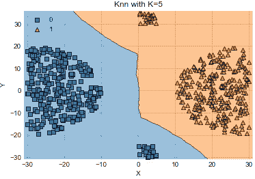

# 仅用 13 行代码实现 KNN 可视化

> 原文：<https://towardsdatascience.com/knn-visualization-in-just-13-lines-of-code-32820d72c6b6?source=collection_archive---------5----------------------->

是啊！就这么简单。让我们用数据集来想象当“k”变化时，决策边界是如何变化的。


让我们快速回顾一下…

## K-NN 是什么？它是如何工作的？

k 最近邻(KNN)算法是一种非常简单、易于理解、通用性强的机器学习算法。在 k-NN 分类中，输出是一个类成员。通过其邻居的多个投票对对象进行分类，将该对象分配到其 k 个最近邻居中最常见的类别(k 是正整数，通常很小)。如果 k = 1，那么该对象被简单地分配到该单个最近邻的类中。

在 KNN，K 是最近邻居的数量。邻居的数量是核心决定因素。如果类的数量是 2，k 通常是奇数。当 K=1 时，该算法称为最近邻算法。这是最简单的情况。假设 P1 是需要预测标签的点。


Basic steps in KNN.

KNN 有三个基本步骤。
1。计算距离。
2。找出 k 个最近的邻居。
3。为班级投票

## K 的重要性

你不能为 k 取任何随机值，整个算法都是基于 k 值的。即使对 k 的微小改变也可能导致大的变化。像大多数机器学习算法一样，KNN 的 K 是一个超参数。您可以将 K 视为预测模型的控制变量。

在这篇博客中，我们将看到决策边界如何随 k 变化。为此，我将使用不同类型的玩具数据集。你可以很容易地从下面的链接下载所有这些数据集。

[](https://www.kaggle.com/deepthiar/toydatasets) [## 可视化 KNN

### 下载数千个项目的开放数据集+在一个平台上共享项目。

www.kaggle.com](https://www.kaggle.com/deepthiar/toydatasets) 

## 了解数据集

1.  u 形的


在这个数据集中，我们可以观察到这些类是一个互锁的 u 形。这是一个非线性数据集。
蓝色点属于 0 类，橙色点属于 1 类。

2.两组同心圆


在这个数据集中，我们可以看到这些点形成了两组同心圆。这是一个非线性数据集。
蓝色点属于 0 类，橙色点属于 1 类。

3.异或运算


该数据集类似于 2 变量 XOR k 图。这是一个非线性线性数据集。

蓝色点属于 1 类，橙色点属于 1 类。

4.线性可分的


这是一个线性数据集，其中的点可以线性分离。

蓝色点属于 0 类，橙色点属于 1 类。

5.极端值


在这个数据集中，我们可以观察到两个类中都有异常点。我们将看到异常值的存在如何影响决策边界。这是一个线性数据集。
蓝色点属于 0 类，橙色点属于 1 类。

现在，我们知道了我们的外观，我们现在将继续下去，看看决策边界如何随着 k 值的变化而变化。在这里，我将 1，5，20，30，40 和 60 作为 k 值。您可以尝试任何一组值

首先，让我们导入库。

```
import matplotlib.pyplot as plt
import pandas as pd
from sklearn import datasets, neighbors
from mlxtend.plotting import plot_decision_regions
```

需要以下核心功能。

```
def knn_comparison(data, k):
 x = data[[‘X’,’Y’]].values
 y = data[‘class’].astype(int).values
 clf = neighbors.KNeighborsClassifier(n_neighbors=k)
 clf.fit(x, y)# Plotting decision region
 plot_decision_regions(x, y, clf=clf, legend=2)# Adding axes annotations
 plt.xlabel(‘X’)
 plt.ylabel(‘Y’)
 plt.title(‘Knn with K=’+ str(k))
 plt.show()
```

你可以观察到它只是一行代码，做了所有的事情—
*clf = neighbors。KNeighborsClassifier(n _ neighbors = k)*

就是这么简单优雅。现在，我们只需加载我们的 CSV 文件，并将其与 k 一起传递给该函数。我们将对所有数据集逐一执行此操作。

让我们开始吧…

## 1.u 形

```
data1 = pd.read_csv(‘ushape.csv’)
for i in [1,5,20,30,40,80]:
    knn_comparison(data1, i)
```


KNN visualization for the U-shaped dataset

## 2.两组同心圆

```
data2 = pd.read_csv(‘concertriccir2.csv’)
for i in [1,5,20,30,40,60]:
    knn_comparison(data2, i)
```


KNN visualization for the two concentric circles dataset

## 3.异或运算

```
data3 = pd.read_csv(‘xor.csv’)
for i in [1,5,20,30,40,60]:
   knn_comparison(data3, i)
```


KNN visualization for the XOR dataset

## 4.线性可分的

```
data4 = pd.read_csv(‘linearsep.csv’)
for i in [1,5,20,30,40,60]:
    knn_comparison(data4, i)
```


KNN visualization for the linearly separable dataset

## 5.极端值

```
data5 = pd.read_csv(‘outlier.csv’)
for i in [1, 5,20,30,40,60]:
    knn_comparison(data5, i)
```



KNN visualization for the outliers dataset

## 观察结果:

在所有数据集中，我们可以观察到，当 k=1 时，我们过度拟合模型。也就是说，每个点都被正确分类，你可能会认为这是一件好事，正如俗话所说的“太多太坏”，过度拟合本质上意味着我们的模型训练得太好，以至于对模型产生负面影响。

在所有的数据集中，我们可以观察到当 k = 60(一个很大的数字)时，我们对模型拟合不足。欠拟合指的是既不能对训练数据建模也不能推广到新数据的模型。欠拟合的机器学习模型不是合适的模型。在离群数据集的情况下，对于 k=60，我们的模型做得相当好。我们怎么知道这个？因为我们知道那些点是异常值，数据是线性可分的，但并不是每次都是这样，我们无法确定。此外，在 XOR 数据集中，与其他模型不同，k 的值不会在很大程度上影响模型。

研究表明，不存在适合所有类型数据集的超参数(k)的最佳值。每个数据集都有自己的要求。在小 k 的情况下，噪声将对结果具有更高的影响，而大 k 将使其计算代价昂贵。研究还表明，小 k 是最灵活的拟合，它将具有低偏差但高方差，而大 k 将具有更平滑的决策边界，这意味着较低的方差但较高的偏差。

过拟合和欠拟合是机器学习算法性能差的两个最大原因。

## 结论:

当 K 较小时，我们会限制给定预测的区域，并迫使我们的分类器对整体分布“视而不见”。K 值越小，拟合越灵活，偏差越小，但方差越大。从图形上看，我们的决策边界将会像上面观察到的那样更加参差不齐。另一方面，K 值越高，每次预测的平均点数越多，因此对异常值的适应能力越强。K 值越大，决策边界越平滑，意味着方差越低，但偏差越大。

## 参考

1.  [www . data camp . com/community/tutorials/k-nearest-neighbor-class ification-sci kit-learn](https://www.datacamp.com/community/tutorials/k-nearest-neighbor-classification-scikit-learn)
2.  [scott.fortmann-roe.com/docs/BiasVariance.html](http://scott.fortmann-roe.com/docs/BiasVariance.html)
3.  [rasbt . github . io/mlx tend/user _ guide/plotting/plot _ decision _ regions/# references](http://rasbt.github.io/mlxtend/user_guide/plotting/plot_decision_regions/#references)

你还在等什么？继续玩数据集吧！！