# 了解分类编码，甚至是新的编码！

> 原文：<https://towardsdatascience.com/know-about-categorical-encoding-even-new-ones-c266227b9cbd?source=collection_archive---------7----------------------->

对分类数据进行编码会对 ML 模型的性能产生影响。在本文中，我将向您介绍广泛的编码方法:最常用的**和最近使用的**。****

********

****Photo by [Patrick Fore](https://unsplash.com/@patrickian4?utm_source=medium&utm_medium=referral) on [Unsplash](https://unsplash.com?utm_source=medium&utm_medium=referral)****

# ****介绍****

****在数据科学问题中，数据集通常会包含分类特征。分类变量通常包含固定数量的可能值。
这些值中的每一个都被称为一个**电平。** 与分类变量相关的概率分布称为**分类分布**(伯努利或多项式分布)。****

****不幸的是，大多数机器学习算法无法处理分类特征。因此，我们必须对这些变量进行编码，以收集尽可能多的信息。****

****本文旨在介绍其中的一些方法。在处理更复杂的方法之前，我们先介绍一种简单的技术。****

******方法列表**:****

*   ****一键编码****
*   ****标签编码****
*   ****目标编码****
*   ****特征散列****
*   ****证据的重要性****
*   ****轻型 G-Boost 编码****

# ******一键编码******

****独热编码包括为给定定性变量的每个类别生成一个**布尔列**。****

****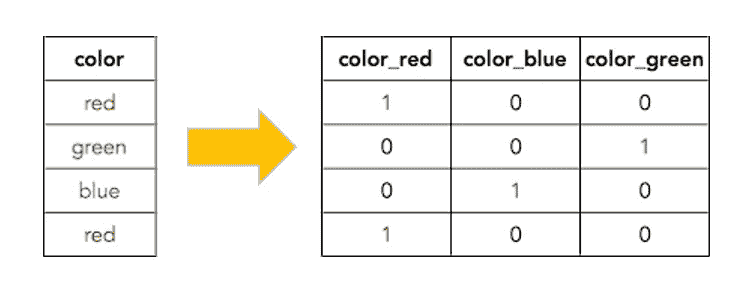****

## ******一键编码的限制******

****一键编码是对分类变量的一种非常流行的转换。然而，它**增加了**数据的**维度(**维度的诅咒)。
当数据集中的定性变量有多种模态时，通过一键编码进行的转换将导致大小显著增加。这是不可取的，尤其是当原始数据集已经很大的时候。****

# ****标签编码****

****标签编码就是用一个介于 **0** 和 **n_classes -1** 之间的值来替换一个类别值的过程(类别数)。然后，机器学习算法可以更好地决定应该如何操纵这些标签。****

****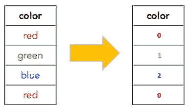****

## ******标签编码的限制******

****这里的问题是模型可能会误解数据。
事实上，通过应用标签编码，分类特征可以被视为连续特征。****

****这种方法的另一个限制是，具有高值的标签可能被认为比具有较低值的标签具有更高的优先级。****

# ******目标编码******

****目标编码是指通过用特定目标的**后验概率**和训练数据上所有目标的**先验概率**的混合来替换特征，从而将标签转换成数字形式。
好像我们在为每个目标值计算类别的频率。****

****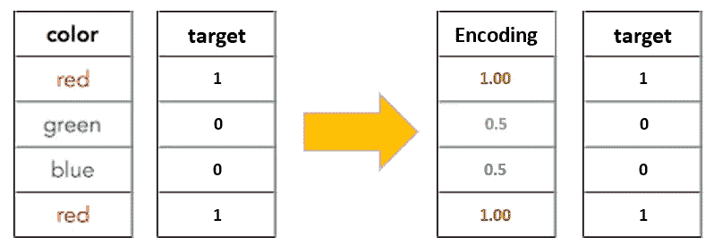****

## ****标签编码的局限性****

****这种方法的主要缺点是它依赖于目标的分布，并且它的预测能力低于二进制编码方法。****

# ****特征散列****

****特征哈希，被称为**哈希技巧**，是**降维**和实用非参数估计的有效策略。****

****但是，在我们深入这个方法的定义之前，我们将解释一下**数组**和**链表**的一些基本概念。****

*   ******数组:** 数组是具有**固定大小**的项目集合。所有元素都有索引，我们使用索引来访问数组中的特定项。****

****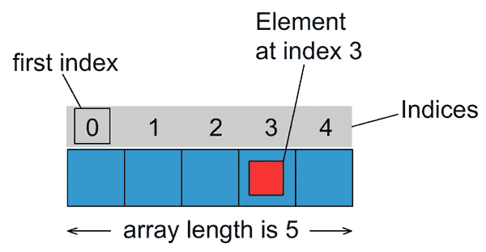****

****[https://o7planning.org/fr/11567](https://o7planning.org/fr/11567/tableaux-array-en-java)****

*   ******链表:
    链表是数据元素的线性集合。当您不想担心数组大小时，这是一种非常流行的数据结构。
    链表可以**动态增长**。我们简单地将下一个元素的地址存储在前一个元素中。这样，我们就可以把它长到任何大小。但是我们总是需要以一种**顺序的方式从一个元素到另一个元素。********

**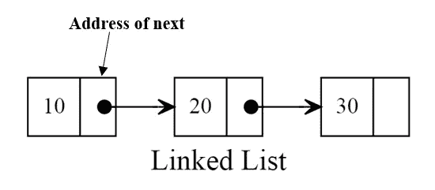**

**[https://hackernoon.com/implementing-singly-linked-list-with-ruby-om2df3ya6](https://hackernoon.com/implementing-singly-linked-list-with-ruby-om2df3ya6)**

**这些概念构成了方法**散列技巧**的基础。**

**顾名思义，我们将一个**散列函数**应用于特性，并直接使用它们的散列值作为索引，而不是在关联数组中查找索引。**

**现在，我们将逐步解释“特征散列”算法**:****

## ****1 — MOD 功能:****

****我们为什么使用 MOD？我们需要创建一个散列表来存储 MOD 值。提醒指示了索引号**和**，我们可以将分类值(*蓝色*))存储在散列表中。****

****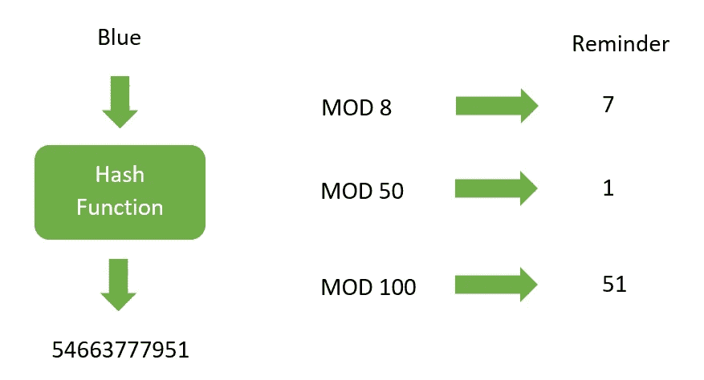****

## ****2-哈希表:****

****我们使用**散列位大小**来指定创建散列表时使用的位数。例如，在我们的例子中，我们有 MOD 8，那么比特大小是 8。****

****如果我们对“blue”的哈希值 7 进行 mod 8，它会将值“Blue”存储在哈希表的索引 7 中，如下所示。****

****有时候，我们会遇到**碰撞**的问题(比如“蓝色”&“绿色”)，所以我们可以通过使用**分离链接**来解决这个问题，分离链接是**表**和**链表**的组合。****

****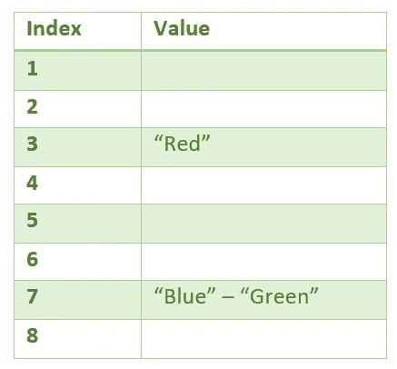****

## ****3-单独链接:****

****在上面的例子中，我们需要在索引 7 中插入单词“Blue”和“Green”。因此，我们简单地在散列表的索引 7 中创建一个链表。****

******数组**和**链表**的组合称为**分离链接**。****

****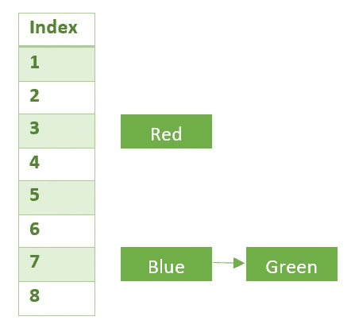****

## ****3-特征散列:****

****综上所述，我们首先需要找出分类值(颜色)的**哈希值**。然后，我们对哈希值应用 **MOD 函数**，得到这些数字的提示。最后，我们创建**新特性集**，并用相应的值填充表格。****

****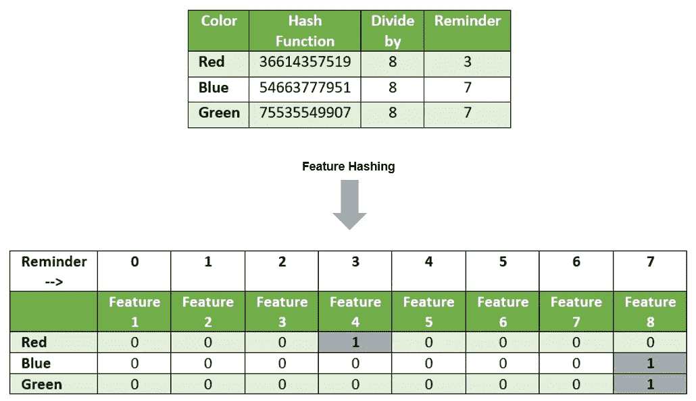****

## ****有用的小技巧！****

****通常，我们在**文本挖掘**中使用哈希技巧，我们可以将可变长度的文本文档表示为等长的数字特征向量，并实现降维。****

****下面我们来对比一下**单词袋**法和**哈希法**。
单词包创建稀疏的特征矩阵。然而，特征散列技术可以用较少数量的特征构建预定义长度的向量。****

******散列位大小**取决于训练集中类别的**数量或 n 元语法**词汇的**大小。如果词汇表很大，可能需要更多的空间来避免冲突。******

# ****证据的重要性****

****证据权重(WOE)的目标是有效地识别分类预测值列表的证据权重值的最佳记录，并为每个类别分配唯一的证据权重值。****

****证据权重可用于**组合**变量组/级别，这个过程称为**粗分类**。我们组合具有相似 WOE 的类别，然后用连续的 WOE 值替换这些类别。****

****现在，通过取**非事件**的百分比与**事件**的百分比之比的自然对数来计算 WOE。****

****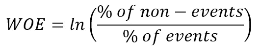****

****证据权重(WOE)是为**信贷**和**金融部门**开发的，主要用于创建预测贷款违约风险的更好模型(信贷风险模型)。****

****有一个经典的例子来突出 WEO 方法，在这里我们可以通过测量“**信用评分**来区分**好客户**和**坏客户**。WOE 公式表示为:****

****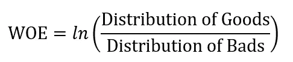****

*   ******商品的分布**——集团内良好顾客的百分比****
*   ******不良分布**——不良客户在一个组中的百分比****

## ****分类转换:****

****对于分类变量，我们计算每组中事件和非事件的数量和百分比。然后，我们通过取非事件百分比和事件百分比的自然对数来计算权重。****

****我们将举一个**的例子**来说清楚。****

****在本例中，我们有一个分类变量(*“特征”*)和三个组(*“A”、“B”和“C”*)以及一个二元目标变量(*“结果”*)和两个类( *1 和 0* )。
我们将目标变量中的 2 个类视为“事件”(类 1)和“非事件”(类 0)。然后我们计算 WOE 值，如下所示。****

****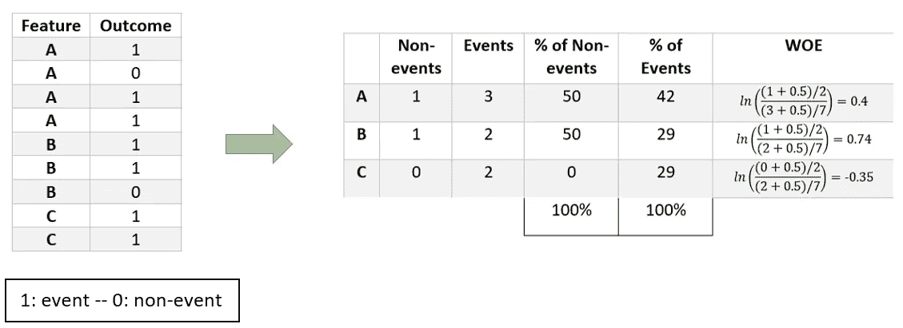****

******转换变量**将是一个具有 WOE 值的连续变量。****

****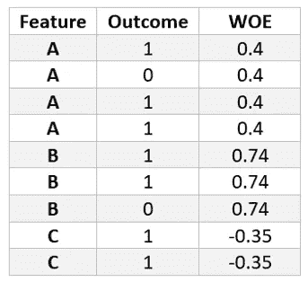****

## ****信息价值:****

****通常，我们将证据权重与信息值相关联，该信息值表示用于**将事件与非事件**分开的变量的信息量。这有助于根据变量的重要性对其进行排序。
使用以下公式计算 IV:****

********

****我们计算上例中的 IV 值:****

****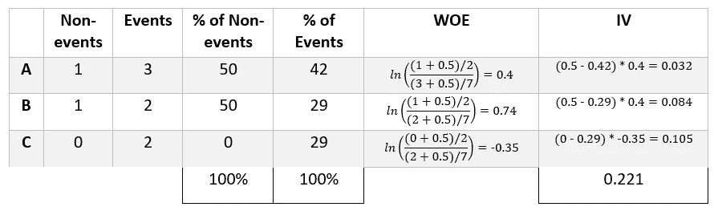****

******信息值相关规则:******

****在本例中,“特征”变量的 IV 值为 **0.221** ，则该预测因子与事件/非事件比值比具有中等强度关系。****

****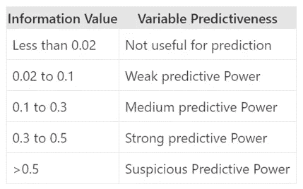****

****[https://www.listendata.com/2015/03/weight-of-evidence-woe-and-information.html](https://www.listendata.com/2015/03/weight-of-evidence-woe-and-information.html)****

## ****有用的小技巧！****

****WOE 转换的优点是:****

*   ****处理缺失值****
*   ****处理分类变量，因此不需要虚拟变量。****
*   ****该变换基于分布的对数值。这与逻辑回归输出函数一致****

****对于分类预测器，我们可以**将**组与**相似的**观察值**权重**组合，以创建具有连续证据权重值的新编码预测器。****

****为什么要合并具有相似 WOE 的类别？具有相似权重的类别具有几乎相同的事件和非事件比例。换句话说，两个类别的行为是相同的。****

# ****轻型 G-Boost 编码****

****首先简单介绍一下 **Light-GBM** (光梯度提升)。****

## ****什么是梯度增强？****

****这是一种升压算法，使用梯度下降法将损耗降至最低。我们所说的增强是指将一组弱学习者结合起来形成一个强规则。这是一个反复的过程。****

## ****为什么很轻？****

****Light GBM 是一个快速、分布式、高性能的梯度推进框架。与其他 boosting 算法不同的是，它按叶方式而不是按层方式**分割树**。LGBM 跑的非常快，所以才有了“*光*这个词。********

## **分类特征支持:**

**LightGBM 可以直接使用分类特征(没有独热或标签编码)。它有一种独特的方式来处理分类变量。**

**LGBM 应用 [**Fisher 的**](http://www.csiss.org/SPACE/workshops/2004/SAC/files/fisher.pdf) **方法**来寻找类别上的最优**拆分**。**

**我们经常用一键编码来表示分类变量，但最佳解决方案是通过将分类划分为 **2 个子集**来分割分类特征。
如果特征有 **k** 个类别，则有**个 2^(k-1)-1** 个可能的分区。然后我们需要找到最佳分区。**

**LightGBM 实现了**独占特性捆绑(EFB)** 技术，该技术基于( **D. Fisher，1958** )的研究，以找到类别的最佳分割。**

## **独家功能捆绑:**

**给定一组类别，将它们分组以使组内的**差异**最小化的实用程序是什么？
这里，注意力将被限制在原始类别到组中的各种可能的组合，假设在每个组内按比例分配。**

**因此，为了找到最佳分组，计算每个可能的**2^(k-1-1**分区的 **D** 值就足够了。**

**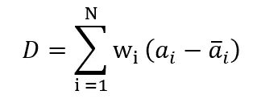**

> ****N :** 一个分区中元素的数量。
> **w_i** :元素 I 的权重
> **a_i :** 元素 I 的数值度量**

****D** 被称为 ***最小二乘划分*** ，其代表与一般平均值的平方偏差之和。为了找到最佳分割，我们选择具有最小 D 值的分区。**

## **有用的小技巧！**

**轻量级 GBM 支持分类变量，它的方法对于树学习者来说是次优的。**

**这种方法通常比一键编码执行得更好。
此外，在具有高基数的分类特征的情况下，建立在独热特征上的树往往是不平衡的，并且需要增长得非常深以实现良好的准确性。**

**leaf-wise 方法(Light GBM 使用)的一个缺点是，当数据很小时，它可能会导致过度拟合。**

# **总结:**

**在机器学习中，我们通常处理在一列或多列中包含多个标签的数据集。这些标签可以是分类的。因此，我们必须将这些特征转换成机器可读的形式。**

**在本文中，我们讨论了数据科学问题中一些最常用的编码方法，如上所述。**

# **参考**

**[1] [Deepanshu Bhalla](https://www.linkedin.com/in/deepanshubhalla) ，[证据权重(WOE)和信息价值(IV)解释](https://www.listendata.com/2015/03/weight-of-evidence-woe-and-information.html)**

**[2] [LightGBM 的文档](https://lightgbm.readthedocs.io/en/latest/index.html)**

**[3]证据权重(WoE)介绍性概述， [Statsoft 网站](https://documentation.statsoft.com/STATISTICAHelp.aspx?path=WeightofEvidence/WeightofEvidenceWoEIntroductoryOverview#targetText=Weight%20of%20Evidence,Distribution%20of%20Bad%20Credit%20Outcomes%29)**

**[4]目标编码器， [Scikit-Learn 网站](https://contrib.scikit-learn.org/categorical-encoding/targetencoder.html)**

# **脚注:**

**在这项研究中，我们提出了非常著名的技术，这些技术通常用于特征工程，以提高最大似然模型的准确性。**

**我感谢你们所有人一直和我们在一起。**

**感谢阅读。:)
*尽情享受吧！***