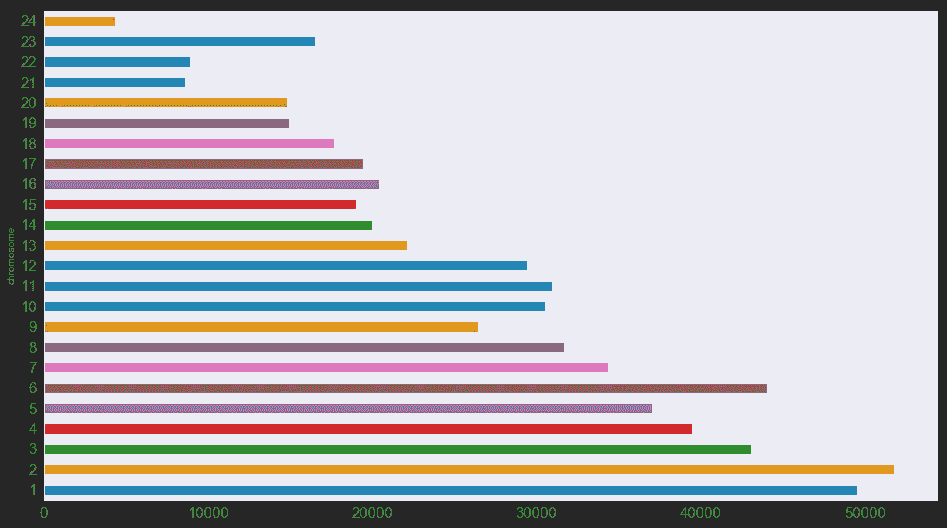

# 认识你自己:利用数据科学探索你自己的基因组

> 原文：<https://towardsdatascience.com/know-thyself-using-data-science-to-explore-your-own-genome-ec726303f16c?source=collection_archive---------18----------------------->

## 熊猫和硒的 DNA 分析

*“Nosce te ipsum”, (“know thyself”), a well-known ancient maxim, frequently associated with anatomical knowledge.*

[图片来自剑桥大学](https://exhibitions.lib.cam.ac.uk/vesalius/artifacts/geminuss-flaps1/)

[23andme](https://www.23andme.com/) 曾经提供给我一套免费的 DNA 和血统测试工具，如果我参加他们的一项临床研究。作为一个脸颊拭子和在大量问卷中展示我的勇气和灵魂的交换，我得到了我的基因组测序，并获得了无数关于我的祖先可能来自哪里，我可能与网站上的其他人有关系，以及我可能遗传了什么健康状况和特征的报告。

Seriously?

23andme 已经提供了大量面向消费者的信息图表和工具，但我知道我可以利用这些数据做更多的事情。勇敢者可以下载他们的原始基因数据，如果他们敢的话，所以我当然把它倒在熊猫身上给[看我能做什么。](https://github.com/lorarjohns/DNA_pandas_selenium)

望着。txt 文件，我可以看到我丢失了一些基因型值，用“—”表示。

大多数染色体是整数，但有三个是 X，Y 和 MT(代表线粒体)。我需要正确地指定数据类型，以便 pandas 在输入中发现混合数据时不会抛出错误。

其他专栏相当简单。我还想让 pandas 忽略文件开头的序言注释，这些注释由以八叉线开头的行组成。

因此，我需要传递的参数是:

*   分隔符(制表符分隔)
*   数据类型(作为字典)
*   na_values (' — ') *(注意:为了避免和更多的 nan 打交道，我最终决定不这么做)*
*   注释(' # ')

关于列名的快速注释:

*   rsid 代表参考 SNP 簇 id。它识别独特的 SNPs。
*   SNPs 是单核苷酸多态性(“SNPs”)，即个体之间不同的基因组位置。它们可以影响疾病风险和药物效果，告诉你你的祖先，并预测你的外表和行为。
*   所有人类都有几乎相同的 30 亿个 DNA 碱基序列(A、C、G 或 T ),分布在他们的 23 对染色体之间。但是在某些地方，由于医学或其他原因(如系谱学)，研究人员宣称存在一些有意义的差异。

我开始用基本的探索性数据分析和数据清理来导航我的新数据框架。

我将字母染色体转换为数字，将它们转换为整数，并创建了一个字典，以便稍后将它们翻译回来，以便我可以更好地处理数据。

# 一些可视化

RSIDs per chromosome

# 从 SNPedia 获取 SNPs 数据

为了获得更多关于我的 DNA 的信息，我从 [SNPedia](https://www.snpedia.com/index.php/SNPedia) 获取了文件，这是一个研究人类遗传学的维基，收集了大量数据并引用了同行评审的科学出版物。SNPedia 对常见的、可重复的 SNP(或在至少 500 名患者的荟萃分析或研究中发现的 SNP)或具有其他历史或医学意义的 SNP 进行分类。

这些列是:

*   未命名:0(实际上是 SNP 名称)
*   量级(感兴趣的主观量度)
*   名声(一种基于研究的基因型是“好”还是“坏”的主观衡量标准，对于血统和眼睛颜色等则为空白)
*   摘要(叙述性描述)

# 正则表达式的乐趣

为了与我的原始数据框架一致，我创建了一个基因型列，并使用 regex 分离出基因型，它被缝合到 SNP 名称的末尾。

出于一致性的考虑，我重命名了这些列以匹配我的原始数据帧，并确保 rsids 都是小写的。

我也使用了正则表达式来清理 rsid(因为我会找任何借口使用更多的正则表达式)。

我重写了无效的名声和总结。

# 将我的数据与 SNPedia 合并

足够恰当的是，我在我的 DNA 上做了 SNPedia 数据框架的内部连接，以查看它在我的特定基因型上有什么数据，如果有的话。

# 里面藏着什么？

我有很多“好”的基因型，但没有一个是非零的。

我有三个非零的“坏”基因型。

可悲的是，我没有超过 4 的“有趣”基因型，尽管令人振奋的是，我有一些稍微有趣的坏基因型。

# 用硒刮相关物品

我决定我可能会喜欢阅读我糟糕的遗传学，所以我用 Selenium 从 PubMed 上收集了一些科学论文的摘要。

为了以后疑病症患者的阅读，我使用 pandas DataFrame.to_csv 方法将我的发现连同摘要和超链接导出到一个 CSV 文件中。

# 研读医学文献

现在我有了一个方便的 CSV 文件，格式很好，引用了科学文章，分析和描述了我的可能没有问题，但具有试验性的基因型。Python 提供了惊人的工具来进行文字自省，这是古代的锯骨人无法想象的。

*最初发表于*[https://www . espritdecorpus . com/posts/using-data-science-to-explore-your-own-genome/](https://www.espritdecorpus.com/posts/using-data-science-to-explore-your-own-genome/)