# 了解您的数据——使用散点图和预测模型为钻石定价

> 原文：<https://towardsdatascience.com/know-your-data-pricing-diamonds-using-scatterplots-and-predictive-models-6cce92d794c1?source=collection_archive---------11----------------------->

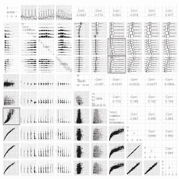

我的上一篇文章抨击了人们经常用来分组绘制定量数据的糟糕的可视化，并将饼状图、条形图和点状图放在一起进行两种可视化任务。点状图出现在顶部。我认为这是因为与判断长度、面积、阴影、方向、角度、体积、曲率等相比，人类更擅长在一个共同的尺度上比较位置的认知任务。这一发现归功于克利夫兰和麦吉尔。我喜欢写它，人们似乎也喜欢它，所以我继续我的散点图可视化系列。

# 散点图

散点图是一个二维平面，我们在其上记录一组案例项目的两个测量值的交集，通常是两个定量变量。正如人类擅长在一个维度上比较普通尺度上的位置一样，我们的视觉能力允许我们在二维空间中看到一系列点时做出快速、准确的判断并识别模式。这使得散点图成为数据分析师在探索数据和向他人传达结果时的宝贵工具。

在这篇文章的第一部分中，我将展示散点图的各种用途，并概述一些策略，以帮助确保关键模式不会被数据中的规模或定性群体差异所掩盖(例如，男女测试分数和收入之间的关系不同)。这篇文章的动机是提出一个钻石价格模型，你可以用它来帮助确保你不会被敲竹杠，这个模型是基于探索性散点图结合(某种程度上)有根据的推测得出的。在第 2 部分中，我将讨论使用面板(也称为小面，也称为小倍数)来揭示数据中的关键模式，以及使用局部回归(黄土)来检查数据中的中心趋势。与我上一篇文章中嘲笑的 3D 柱状图和饼状图相比，这种可视化的糟糕例子要少得多，尽管我仍然能够找到[这个可爱的散点图+趋势线](http://www.showmethemath.com/Concepts_Explained/Scatter_Plot/homeworkScatterPlotAnswer.gif)。

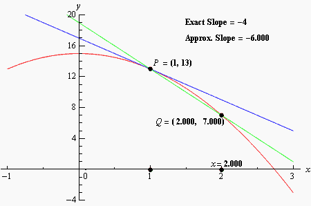

# 散点图和笛卡尔坐标系

散点图比我在上一篇文章中提到的可视化有着更丰富的历史。散点图的表面形成了一个二维笛卡尔坐标系，DeCartes 在 1657 年左右发明/发现了这个同名平面，这代表了科学中最基本的发展之一。笛卡尔平面统一了度量、代数和几何，直观地描述了变量(或函数)之间的关系。在笛卡儿平面之前，数学分为代数和几何，两者的统一使许多新的发展成为可能。当然，这包括现代地图制作——制图学，但是[笛卡尔平面也是微积分发展的重要一步](http://en.wikipedia.org/wiki/Cartesian_coordinate_system#History),没有它，我们的现代几乎不可能。

散点图是帮助理解变量之间关系的强大工具，尤其是在这种关系是非线性的情况下。比方说，你想知道在购买钻石时，你支付的价格是否合适。您可以使用许多钻石的价格和特征数据来帮助确定任何给定钻石的广告价格是否合理，并且可以使用散点图来帮助确定如何以合理的方式对该数据进行建模。考虑一下钻石价格与其克拉重量(与其大小相对应)之间的重要关系:

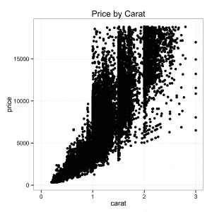

一些事情马上就浮现出来了。我们可以看到一个非线性关系，我们还可以看到，随着克拉大小的增加，关系的离散度(方差)也增加。通过快速浏览数据散点图，我们了解到价格和克拉大小之间的两个重要函数关系。因此，我们也认识到，对这些数据运行线性模型是一个坏主意。

# 钻石

如果你曾经使用过 R，你可能会看到 Hadley Wickham 的 ggplot2 附带的 diamonds 数据集的引用。它记录了超过 5 万颗钻石的克拉大小和价格，从 2008 年在[收集的](http://r.789695.n4.nabble.com/Year-of-data-collection-for-diamonds-dataset-in-ggplot2-td4506598.html)[http://www.diamondse.info/](http://www.diamondse.info/)开始，如果你在市场上寻找一颗钻石，探索这个数据集可以帮助你了解商店里有什么以及价格点。这特别有用，因为每颗钻石都是独一无二的，这与我们习惯购买的大多数制成品不同——你不能只输入型号就在亚马逊上查价格。即使是专家也无法像通过数据获得的整个市场的图片一样包含那么多关于价格的信息(尽管没有什么可以替代定性专业知识来确保你的钻石是零售商声称的那样)。

但是，即使你不打算买钻石，钻石行业的社会经济和政治历史也是迷人的。钻石催生了南非的采矿业，如今南非是非洲最大、最先进的经济体。我在约翰内斯堡工作了一个夏天，我可以向你保证，南非的城市看起来更像洛杉矶和旧金山，而不是拉各斯、开罗、摩加迪沙、内罗毕或拉巴特。钻石首先驱使英国人和荷兰人殖民南部非洲，并引发了从布尔战争到塞拉利昂、利比里亚、科特迪瓦、津巴布韦和刚果民主共和国的现代战争的各种冲突，在 20 世纪 90 年代内战最激烈的时候，200 克拉的千年之星钻石被卖给了德比尔人。在 20 世纪 30 年代[的“犹太财产的雅利安化”](http://www.archives.gov/research/holocaust/articles-and-papers/turning-history-into-justice.html)期间，钻石是犹太人可以向纳粹隐瞒的少数资产之一，国会研究服务中心报告说[基地组织利用冲突钻石规避国际制裁，并从 1998 年东非爆炸案到 9 月 11 日袭击](http://royce.house.gov/uploadedfiles/rl30751.pdf)为行动融资。

虽然钻石数据集充满了价格和相当深奥的认证评级，但隐藏在数据中的是一场传奇营销活动如何渗透并被我们的文化所包容的反映，关于不同社会阶层如何反应的暗示，以及对钻石市场如何运作的洞察。

据《大西洋月刊》报道，故事开始于 1870 年，当时在南非奥兰治河附近发现了数吨钻石。在那之前，钻石很稀有——每年从印度和巴西开采的钻石只有几磅。在当时，钻石在珠宝之外没有用途，就像今天在许多工业应用中一样，所以价格只取决于稀缺的供应。因此，该项目的投资者在 1888 年成立了德比尔斯卡特尔，以控制全球价格——大多数人认为这是历史上最成功的卡特尔，[直到 2000 年左右控制了全球 90%的钻石供应](http://en.wikipedia.org/wiki/De_Beers#Diamond_monopoly)。但是第一次世界大战和大萧条见证了钻石销售的暴跌。

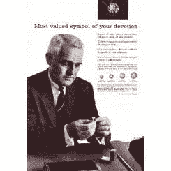

根据《纽约时报》的报道，1938 年，戴比尔斯卡特尔写信给费城广告公司 N. W .艾耶尔父子公司，调查“利用各种形式的宣传”是否会推动美国的钻石销售，当时美国似乎是唯一有潜力的市场。调查显示，钻石在大多数考虑结婚的夫妇的优先考虑清单中排名靠后——这是富人的奢侈品，“钱都打水漂了”被《纽约时报》比作《广告狂人》的佩吉·奥尔森(Peggy Olson)的弗朗西丝·格雷蒂(Frances Gerety)在 N.W .艾耶尔父子公司接管了德比尔夫妇的账户，并朝着公司的目标“创造一种局面，让几乎每个宣誓结婚的人都感到被迫购买一枚订婚钻戒。”几年后，她创造了一个口号，“钻石永恒”

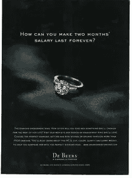

《大西洋月刊》的杰伊·爱泼斯坦认为，这一活动催生了现代需求广告——其目的不是直接销售，也不是强化品牌，而仅仅是为了打动产品本身所包含的魅力、情感和情绪。该公司向电影明星赠送钻石，发出强调名人互赠钻石大小的新闻包，将钻石借给参加奥斯卡颁奖典礼和肯塔基赛马会等重要活动的社交名流，并说服英国王室将钻石佩戴在其他宝石之上。在广告中，钻石还被作为一种地位的象征进行营销，以反映“一个男人…生活中的成功”，并带有“粗花呢、旧皮革和抛光木材的香气，这是一个好俱乐部的特征。”20 世纪 80 年代的一则广告引入了两个月的基准:“两个月的工资难道不是为永恒的东西付出的小小代价吗？"

以任何合理的标准来衡量，弗朗西斯·格雷蒂成功了——订婚意味着在美国得到一枚钻戒。你能想到两个人订婚不戴钻戒的电影吗？当你在脸书宣布订婚时，网站会显示什么图标？仍然认为这场营销活动可能不是历史上最成功的大规模说服努力？我给你看一部詹姆斯·邦德的电影，片名带有钻石卡特尔的商标:

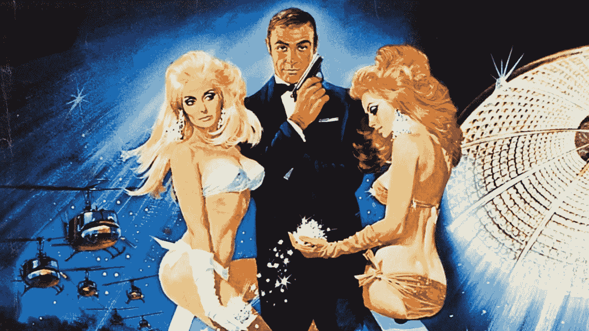

令人肃然起敬，令人恐惧。让我们打开数据集。

您应该考虑做的第一件事是使用 ggpairs()函数绘制关键变量之间的关系。该函数成对地绘制每个变量与其他变量的关系。对于与钻石数据行数一样多的数据集，您可能希望先进行采样，否则会花费很长时间来渲染。另外，如果你的数据集有超过 10 列，将会有太多的绘图窗口，所以首先是列的子集。

不管怎样，情节是这样的:

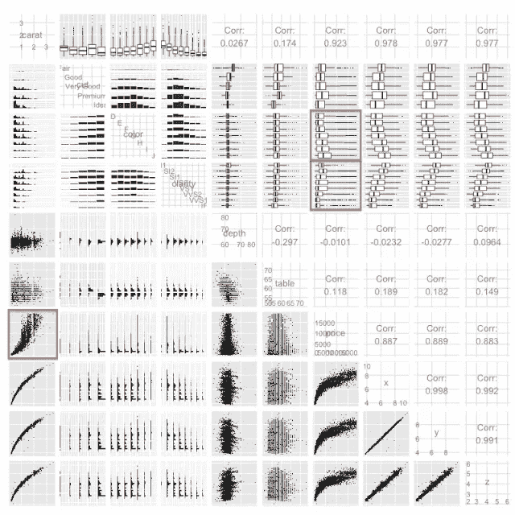

正在发生的是，ggpairs 以一种非常聪明的方式绘制出每个变量与另一个变量的关系。在图矩阵的下三角中，它对定性-定性对使用分组直方图，对定量-定量对使用散点图。在上面的三角形中，它绘制了定性-定性对的分组直方图(使用 x 变量而不是 y 变量作为分组因子)，定性-定量对的箱线图，并提供了定量-定量对的相关性。我们真正关心的是价格，所以让我们把重点放在价格上。我们可以看到价格与净度和颜色之间的关系，这一点我们将在以后开始数据建模时记住，但推动价格的关键因素是钻石的大小/重量。然而，正如我们上面看到的，价格和钻石大小之间的关系是非线性的。如何解释这种模式？在供应方面，没有明显瑕疵的大块钻石可能比小块钻石更难找到。这可能有助于解释指数曲线——我想我是在为我即将成为妻子的妻子选购钻石时注意到这一点的。当然，这与钻石的重量是体积的函数这一事实有关，而体积是 x * y * z 的函数，这表明我们可能对克拉重量的立方根特别感兴趣。

在需求方面，市场上购买较便宜、较小钻石的顾客可能比更富有的买家对价格更敏感。如果不是因为求婚时赠送钻石的社会规范，许多小于 1 克拉的顾客肯定不会购买钻石。而且，能买得起一克拉以上钻石的消费者越来越少。因此，我们不应该期望大钻石的市场像小钻石那样竞争激烈，所以随着克拉数的增加，价格的变化也会增加。

通常情况下，任何货币变量的分布都是高度偏斜的，并且会随着数量级的变化而变化。这可能是由路径依赖(例如，富人越来越富)和/或产生最终价格/美元金额的乘法过程(例如，逐年通货膨胀)造成的。因此，通过把它放在对数标度上来研究压缩任何这样的变量是一个好主意(更多信息请看 Tal Galili 博客上的这篇客座博文[)。](http://www.r-statistics.com/2013/05/log-transformations-for-skewed-and-wide-distributions-from-practical-data-science-with-r/)

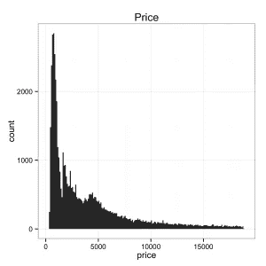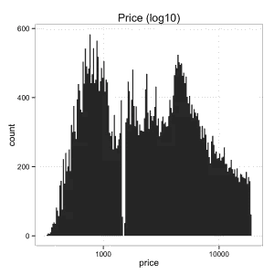

事实上，我们可以看到钻石的价格严重倾斜，但当放在 log10 尺度上时，似乎表现得更好(即，更接近正态分布的钟形曲线)。事实上，我们可以看到，数据显示了 log10 规模上的双峰的一些证据，这与我们关于钻石客户性质的两级“富人买家，穷人买家”推测一致。让我们重新绘制我们的数据，但现在让我们把价格放在 log10 标度上:

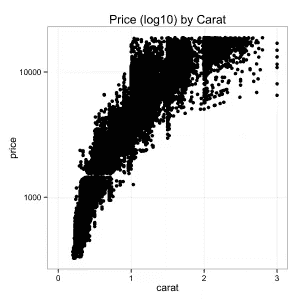

更好，虽然还是有点古怪——让我们试着使用我们上面推测的克拉的立方根:

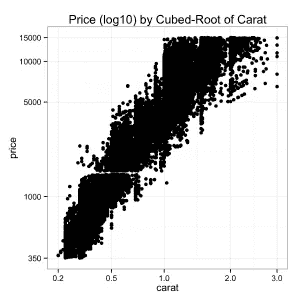

很好，在应用了上面的变换以在一个很好的尺度上得到我们的变量之后，看起来像一个几乎线性的关系。

# 过度绘画

请注意，到目前为止，我还没有做任何关于过度绘制的事情——由于舍入的原因，多个点具有相同的值。事实上，价格四舍五入到美元，克拉四舍五入到两位数。不错，尽管当我们得到这么多数据时，我们会有一些严重的过度渲染。

通常，您可以通过使点变小，使用“抖动”随机移动点以使多个点可见，以及使用透明度来处理这一问题，这可以在 ggplot 中使用“alpha”参数来完成。

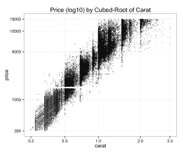

这让我们更好地了解关键位置的数据有多密集和稀疏。

# 利用颜色了解定性因素

当我环顾钻石时，我也注意到净度似乎是价格的一个因素。当然，许多消费者都在寻找一定大小的钻石，所以我们不应该期望净度像克拉重量一样是一个重要因素。我必须承认，即使我的祖父母是珠宝商，我最初也很难区分 VVS1 级和 SI2 级钻石。当然，大多数人需要一个环来区分。此外，[根据 BlueNile 的说法，钻石的切割对珠宝商描述为钻石典型特征的“火热”品质有着更重要的影响](http://www.bluenile.com/diamonds/diamond-cut)。关于净度，该网站称，“[许多这些瑕疵都是微小的，不会以任何可察觉的方式影响钻石的美丽](http://www.bluenile.com/diamonds/diamond-clarity)”然而，当我们将价格可视化为图上的一种颜色时，清晰度似乎可以解释价格中剩余的大量差异:

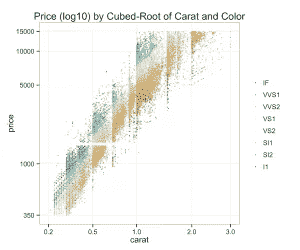

不管 BlueNile 怎么说，我们在切割上没有看到太多的变化(尽管这个数据集中的大多数钻石都是理想的切割):

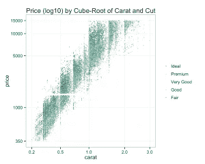

颜色似乎也解释了价格的一些差异，尽管 [BlueNile 声称 D-J 的所有颜色等级基本上都不明显](http://www.bluenile.com/diamonds/diamond-color)。

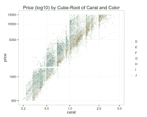

在这一点上，我们已经有了一个很好的想法，我们可能如何建模价格。但是，我们 2008 年的数据存在一些问题——我们不仅需要考虑通货膨胀，而且现在的钻石市场与 2008 年相比也有很大不同。事实上，当我用模型拟合这些数据，然后试图预测我在市场上发现的钻石的价格时，我一直得到的预测都太低了。经过进一步挖掘，我找到了[全球钻石报告](http://www.bain.com/publications/articles/global-diamond-report-2013.aspx)。事实证明，由于全球金融危机，价格在 2008 年暴跌，自那以后，价格(至少是批发抛光钻石的价格)以大约 6%的复合年增长率增长。[中国购买订婚钻戒的夫妇数量迅速增长](http://diamonds.blogs.com/diamonds_update/diamond-prices/)也可能有助于解释这一增长。在查看了 PriceScope 上的数据后，我意识到不同克拉尺寸的[钻石价格增长不均衡](http://www.pricescope.com/diamond-prices/diamond-prices-chart)，这意味着我最初估计的模型不能简单地通过通货膨胀来调整。虽然我可以用那个模型做得很好，但我真的想根据新的数据来评估一个新的模型。

谢天谢地，我能够没有太多麻烦地拼凑出一个 [python 脚本来抓取 diamondse.info](https://github.com/solomonm/diamonds-data/blob/master/dinfo.py) 。该数据集的规模约为 2008 年钻石数据集的 10 倍，包含了除美国宝石学院(GIA)之外的一系列权威机构认证的世界各地的钻石。您可以按如下方式读入这些数据(预先警告—超过 50 万行):

我的 [github 储存库有复制上面](https://github.com/solomonm/diamonds-data)的每一个数字所必需的代码——大多数看起来非常相似，尽管这个数据集包含比原始数据集更昂贵的钻石。无论您使用的是原始的 diamonds 数据集还是当前更大的 diamonds 数据集，您都可以根据我们从散点图中获得的信息来估计模型。我们将回归克拉，克拉的立方根，净度，切割和对数价格的颜色。我在这个模型中只使用 GIA 认证的钻石，并且只看低于$10K 的钻石，因为这些是我见过的大多数零售商出售的钻石类型，因此也是我最关心的类型。通过从数据集中剔除最昂贵的钻石，我们的模型也不太可能被价格和克拉高端的异常值抛弃。新数据集的列与旧数据集的列基本相同，因此我们可以运行下面的代码(如果您想在旧数据集上运行它，只需设置 data=diamonds)。

以下是我搜集的数据集的结果:

这些是非常好的 R 平方值，我们几乎解释了 4c 的所有价格差异。如果我们想知道一颗钻石的价格是否合理，我们现在可以使用这个模型并对结果求幂(因为我们取了价格的对数)。我们需要将结果乘以 exp(sigma /2)，因为我们的误差在预期中不再为零:

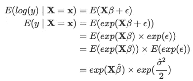

为了更深入地了解最后一步，请看一下关于对数正态分布变量的[维基百科页面。感谢](http://en.wikipedia.org/wiki/Log-normal_distribution#Arithmetic_moments)[米盖尔](https://sites.google.com/site/miguelgodinhomatos/)捕捉到这个。让我们看一个蓝色尼罗河的例子。我就用全型号，m4。

给定我们的钻石的特征和 95%置信区间的上限和下限，结果产生价格的期望值—请注意，因为这是一个线性模型，所以 predict()只是将每个模型系数乘以我们数据中的每个值。结果是这颗钻石比完整模型下的预期值稍微贵了一点，尽管它并没有超出我们 95%的置信区间。大多数人认为 BlueNile 比 diamondse.info 有更好的声誉，然而，在一个依赖于容易伪造的证书并且非专家很容易被愚弄的行业中，声誉是很有价值的。

这说明了将模型从一个数据集推广到另一个数据集的重要一点。首先，数据集之间可能存在重要的差异——正如我在上面所推测的那样——这使得估计值存在系统性偏差。第二，过度拟合——我们的模型可能会拟合数据集中存在的噪声。即使是针对样本外预测进行交叉验证的模型也可能会过度拟合噪声，从而导致数据集之间的差异。当然，虽然这个模型可能会让你感觉到你的钻石是否是对 diamondse.info 钻石的敲竹杠，但并不清楚 diamondse.info 是否应该被视为钻石价格是否合理的普遍真理的来源。尽管如此，在 diamondse.info 上有一个 95%区间的预期价格比我们在开始这个练习之前应该愿意为一颗钻石支付的价格要多得多。

重要的一点是——尽管我们可以根据 4c 的函数几乎完美地预测 diamondse.info 的价格，但你不应该从这个练习中得出一个结论，那就是*在哪里*购买钻石是不相关的，这显然是过去某些圈子里的传统智慧。如果你[在蒂芙尼和好市多](http://www.businessweek.com/articles/2013-05-06/tiffany-vs-dot-costco-which-diamond-ring-is-better)购买同样的钻石，你几乎肯定会多付钱。但是[好市多也出售一些昂贵的钻石](https://web.archive.org/web/20140217105722/http://www.costco.com:80/2.12-ctw-Round-Brilliant-Cut-Internally-Flawless,-D-Color-Diamond-%22Audrey%22-Platinum-Wedding-Set.product.100006730.html)。不管怎样，你可以用这种模型来给你一个指示，看看你是否支付过高。

当然，天然钻石的价值很大程度上是由社会建构的。像金钱一样，钻石只是因为社会认为它们有价值才值钱——投资钻石没有明显的经济效益或回报，除非是在非常主观的意义上，涉及到你和你的另一半的关系。为了了解社会创造了多少价值，你可以比较天然钻石和人造钻石的价格，由于最近的技术发展，人造钻石的质量与“天然”钻石相当。当然，天然钻石的价格要高得多。

最后一件事——生活中很少有保证，我在这里也不能保证。尽管我们在这里所拥有的看起来相当不错，但是数据和模型从来都不是绝对可靠的，显然你仍然可以基于这个模型被采纳(或者被说服传递大量信息)。始终与一个有信誉的经销商购物，并确保她的动机是反对卖给你一个过高的钻石或更糟的是，不符合其证书。没有什么可以替代与一个你可以信任的知名珠宝商建立个人联系和持久的业务关系。

绘制数据有助于您理解数据并获得关键见解。但是如果你不小心的话，即使散点图可视化也可能是欺骗性的。考虑 alr3 软件包附带的另一个数据集——肯尼斯·g·哈伯德(Kenneth G. Hubbard)从 1976 年到 1992 年收集的内布拉斯加州米切尔的土壤温度数据，我在 Weisberg，S. (2005)偶然发现了这些数据。*应用线性回归*，第三版。纽约:威利(我无耻地窃取了这个例子)。让我们天真地绘制数据:

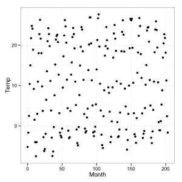

看起来有点像噪音。这里有什么故事？当其他方法都失败时，想想它。X 轴上是什么？月份。Y 轴上是什么？温度。嗯，内布拉斯加州有四季，所以温度应该每 12 个月波动一次。

但是我们把 200 多个月放在一个非常狭小的空间里。

让我们把它拉长，看看它是什么样子:

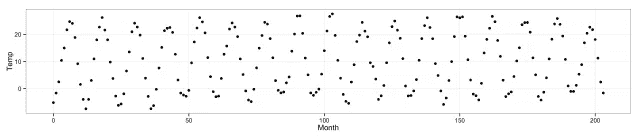

不要犯那个错误。

这就结束了散点图系列的第一部分。第二部分将说明使用分面/面板/小倍数的优势，并展示拟合趋势线的工具(包括线性回归和局部回归(黄土))如何有助于获得关于数据的更多见解。

你还可以通过我的同事迪安·埃克莱斯、莫伊拉·伯克和克里斯·萨登教授的 Udacity 课程了解更多关于[探索性数据分析的知识，该课程将在未来几周内推出。–>](https://www.udacity.com/course/ud651)

*最初发布于*[*https://solomonmg . github . io/blog/2018/visualization-series-scatter plot-understand-the-diamond-market/*](https://solomonmg.github.io/blog/2018/visualization-series-scatterplot-understanding-the-diamond-market/)*。*