# 了解你的敌人

> 原文：<https://towardsdatascience.com/know-your-enemy-7f7c5038bdf3?source=collection_archive---------7----------------------->

## 你如何创造和抵御对抗性攻击

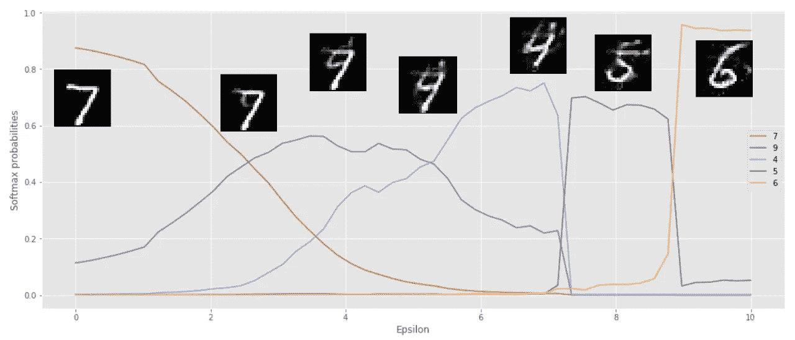

机器学习的当前驱动力是产生越来越精确的模型，而对这些模型的安全性和鲁棒性关注较少。正如我在[上一篇文章](https://medium.com/@oknagg/know-your-enemy-the-fascinating-implications-of-adversarial-examples-5936bccb24af)中提到的，像图像分类器这样的 ML 模型很容易受到输入的微小干扰，从而导致它们做出错误的决定。这篇文章的目的是通过 MNIST 数字分类器的例子告诉你如何创建和防御强大的白盒对抗性攻击。内容:

1.  计划的梯度下降(PGD)攻击
2.  对抗性训练产生稳健的模型
3.  对抗性稳健模型的意想不到的好处(如下)

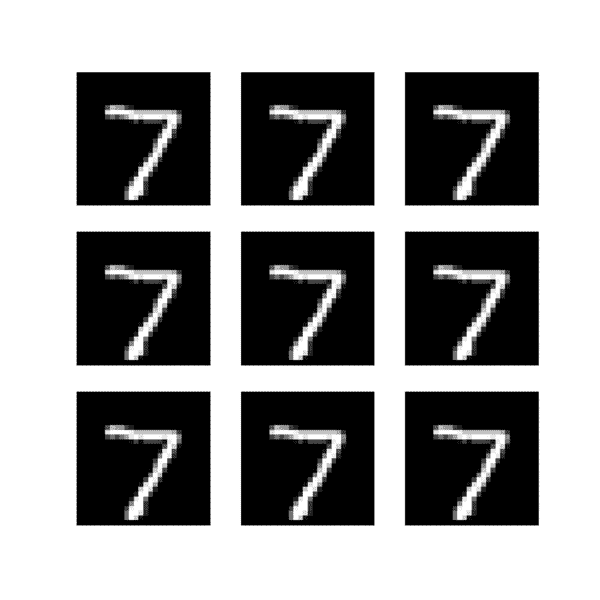

Class interpolation with high epsilon adversarial examples. This isn’t from a VAE or GAN — it’s from an MNIST **classifier** trained against the projected gradient descent attack.

*查看* [*这款 Jupyter 笔记本*](https://github.com/oscarknagg/adversarial/blob/master/notebooks/Creating_And_Defending_From_Adversarial_Examples.ipynb) *包含了生成本帖中所有数字并训练你自己的对抗性健壮模型的代码。*

# 投影梯度下降(PGD)

PGD 攻击是一种白盒攻击，这意味着攻击者可以访问模型梯度，即攻击者拥有模型权重的副本。这种威胁模型给予攻击者比黑盒攻击更大的权力，因为他们可以专门设计他们的攻击来愚弄您的模型，而不必依赖于通常导致人类可见的干扰的转移攻击。PGD 可以被认为是最“完整”的白盒对手，因为它解除了攻击者在寻找最佳攻击时可以投入的时间和精力的任何限制。

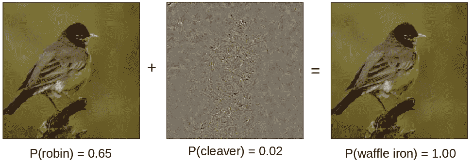

Left: natural image. Middle: Adversarial perturbation found by PGD attack against ResNet50 model, size of perturbation is magnified x100 to be more visible. Right: adversarial example.

理解 PGD 攻击的关键是将寻找一个对立的例子框定为一个*约束优化问题。* PGD 试图找到使特定输入的模型损失最大化的扰动，同时保持扰动的大小小于指定量，称为*ε*。这种约束通常表示为扰动的 L 或 L∞ [范数](https://en.wikipedia.org/wiki/Norm_(mathematics)),添加这种约束是为了使对立示例的内容与未受扰动的样本相同，或者甚至是为了使对立示例与人类察觉不到的不同。

PGD 在现实世界中可能遭受的攻击有:

*   修改恶意软件的代码，以绕过基于[ML](https://devblogs.nvidia.com/malware-detection-neural-networks/)[的检测](https://arxiv.org/abs/1812.10360v1)
*   扰乱图像以绕过 Tumblr 的色情禁令
*   欺骗 ML 交易策略让他们放弃所有的钱

PGD 算法可以总结为以下 5 个步骤，尽管攻击者可以自由应用任何优化改进，如[动量](https://distill.pub/2017/momentum/)、[亚当](https://arxiv.org/abs/1412.6980)、多次重启等

1.  从样品周围 L^p 球的随机扰动开始
2.  在损失最大的方向采取[梯度步骤](https://en.wikipedia.org/wiki/Gradient_descent)
3.  必要时将扰动投射回 L^p 球
4.  重复 2–3 直到收敛

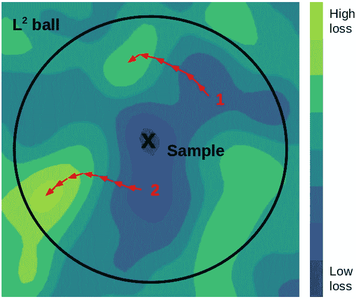

Projected gradient descent with restart. 2nd run finds a high loss adversarial example within the L² ball. Sample is in a region of low loss.

“投射到 L^P 球”可能是一个陌生的术语，但简单地说就是将某个体积外的点移动到该体积内最近的点。在 2D 的 L 范数的情况下，这是将一个点移动到以原点为中心的特定半径的圆上相应的最近点。

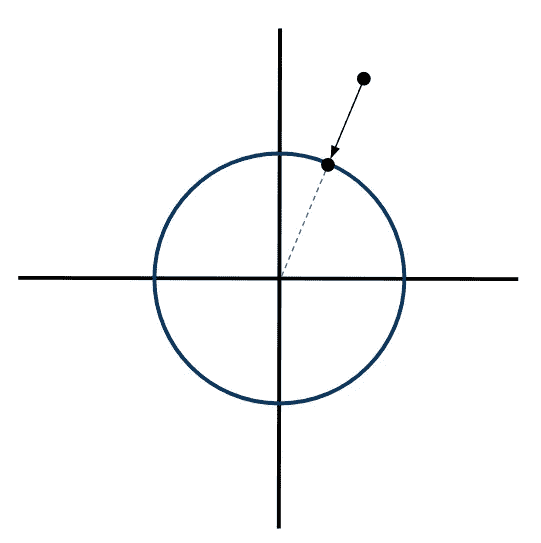

Projecting a point back into the L² ball in 2 dimensions

对于那些有实践思维的人来说，下面的 PyTorch 函数是 PGD 的一个实现，用于为一批图像生成有针对性的或无针对性的对立示例。

对来自 MNIST 的样本运行这段代码会产生以下结果。请记住，由于其较低的维度/分辨率，MNIST 的对立示例比 ImageNet 等数据集更明显——然而，一个不健壮的分类器会被这些图像完全愚弄。

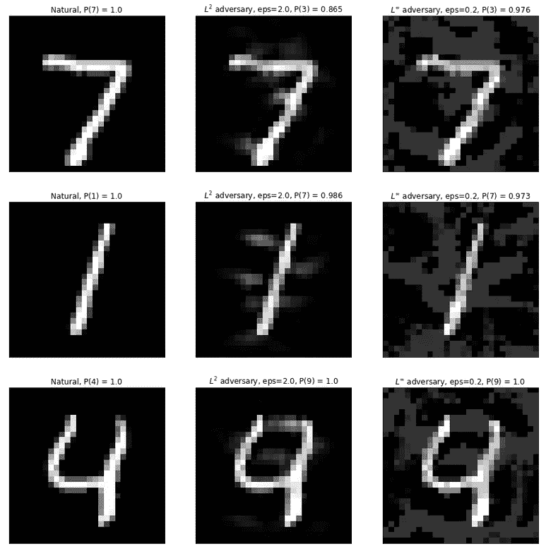

Left column: natural examples. Middle column L² bounded adversarial examples. Right column: L∞ bounded adversarial examples.

然而，我们是数据科学家，可以做得比有趣的图片更好。下面的图表量化了非稳健分类器对不同大小的对抗性扰动ε的准确性。您可以看到性能很差，因为上面显示的 L 和 L∞有界攻击的大小将我们模型的准确性降低到大约随机猜测的水平。让我们看看我们能做些什么！

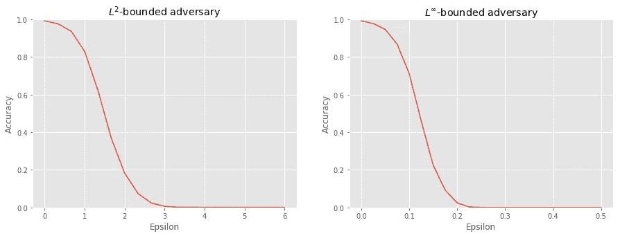

# 对抗训练

对抗这种攻击的当前技术状态是对抗训练，这与生成对抗网络(GANs)的训练方案不同，尽管对抗训练的分类器表现出类似 GAN 的特性，我将在后面演示。

对抗性训练只是将 PGD 攻击放入你的训练循环中。这可以被视为“终极数据扩充”,而不是执行*随机*变换(重新缩放、裁剪、镜像等)。)作为预处理步骤，我们创建特定于*的*扰动，这种扰动最能愚弄我们的模型，事实上，当在小数据集上训练时，对抗性训练的模型确实表现出较少的过度拟合。

这似乎是一个显而易见的方法，但这种训练方法是否会真正收敛还不清楚。原因如下:在常规训练中，我们最小化数据集 *{x，y}* 、模型参数*θ*的预期自然损失。

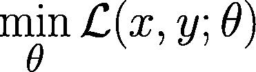

然而，在对抗训练中，我们最小化下面的损失函数，其中δ是一组扰动，我们希望我们的模型对于例如前面讨论的 L 和 L∞扰动是不变的。

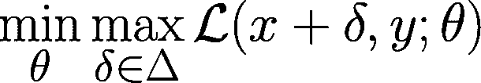

因此，我们现在正在解决一个保证是非凸的极大极小问题，也就是鞍点问题。这与下面的 GAN 损失函数有相似之处，GAN 损失函数也是一个两人的 minimax 游戏，其中玩家是鉴别者和生成者，而不是对手和网络。

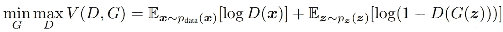

然而，在实践中，这种训练确实以增加训练时间为代价收敛(并且比 GAN 训练更一致),因为我们为网络的每个训练步骤解决多步优化问题(即 PGD)。以下代码片段训练 MNIST 模型对抗 L∞对手。

下面的图量化了针对 L 和 L∞对手训练的模型的对抗准确性——在鲁棒性方面肯定有所提高。

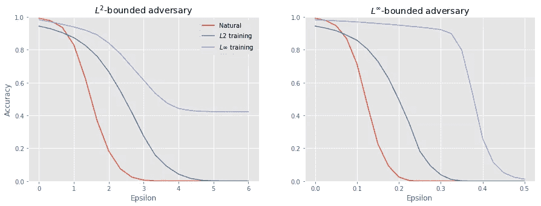

这里有几个有趣的地方需要注意:

*   L∞训练的模型(紫色)对 L(左)和 L∞(右)有界攻击都更鲁棒
*   两种稳健模型在自然样本(ε= 0)上的精度都低于非稳健模型:L∞模型约为 0.5%，L 模型约为 3%
*   左攻击看起来效力饱和(左)。这是一个错觉，因为为了节省计算时间，我固定了 PGD 步骤的数量。允许 PGD 攻击运行直到收敛，仍然可能增加ε的有效性

我解释 L 训练模型的不良稳健和非稳健性能的假设是 L 有界扰动在 MNIST 上是语义相关的。如果你看一下之前定义的对抗性损失，我们正在训练我们的模型，使其对集合δ中的扰动不变，即 L 扰动。如果这些是语义相关的对 MNIST 的干扰，那么 L 对抗性训练正在积极地阻碍我们模型的学习能力！(另一个假设是，我需要为 L 训练搜索更多的超参数……)

# 健壮模型的意想不到的好处

MNIST 分类器的对抗性训练有一些意想不到的好处，不仅仅是对攻击的鲁棒性。其中最有趣的是使用*大ε对立示例*在类之间平滑插值的能力。这些是使用前面描述的 PGD 方法产生的，除了我们允许对抗性扰动的大小比训练中使用的大得多。

下面显示的是在 L 训练模型上使用 PGD 攻击创建的有针对性的大ε对抗示例。有一些伪像，但是最终的结果是非常清楚的期望类的图像。这是可能的，因为输入空间中的鲁棒模型的梯度与人类感知很好地对齐，所以用 PGD 跟踪该梯度产生了似是而非的图像。

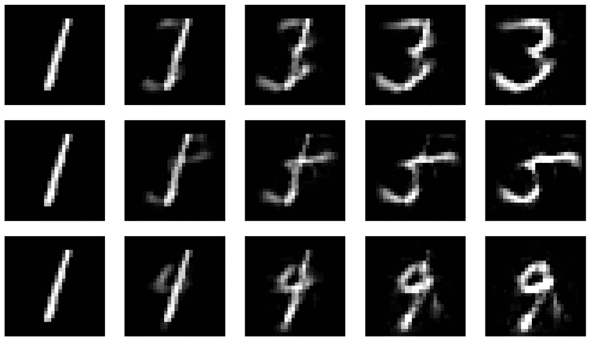

Leftmost: original sample. Rightmost: targeted (3, 5, 9) adversarial examples with epsilon = 7.5

对非健壮模型做同样的事情会产生垃圾图像，这些图像与所需的类只有一点相似之处。

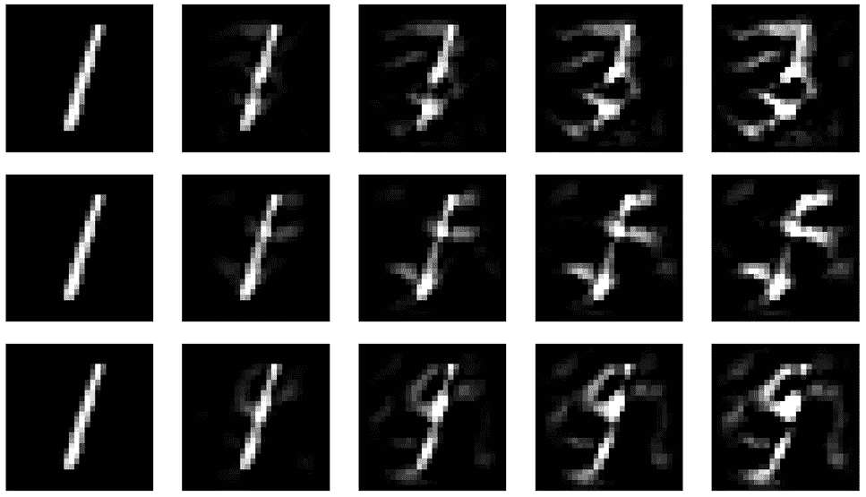

Gross.

有趣的是，对 L 鲁棒模型的无目标对抗性攻击产生了从最相似到最不相似的类的轨迹。下面显示的是当我们将对立扰动的 L 范数从 0 增加到 10 时的对立例子和预测概率。

Progression of untargeted attack on L2 model

这种现象不仅仅是 MNIST 独有的，因为 [Madry 等人](https://arxiv.org/pdf/1805.12152.pdf)能够在 ImageNet 训练的模型上产生相同类型的插值。

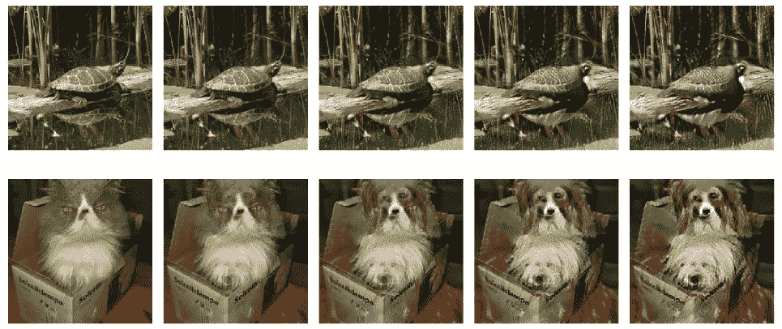

Figure 4 from [https://arxiv.org/pdf/1805.12152.pdf](https://arxiv.org/pdf/1805.12152.pdf) showing interpolation from turtle -> bird and cat -> dog.

L∞不会产生像 L 模型一样有趣的插值(如果你想产生一些，请查看我的 [Juypter 笔记本](https://github.com/oscarknagg/adversarial/blob/master/notebooks/Adversarial_Training.ipynb))，但它确实有自己意想不到的好处——即非常稀疏的权重。

稀疏权重本身被认为是有用的，因为它们更易于解释，更易于修剪，因此模型规模更小。对 L∞模型第一层中的 32 个卷积滤波器的人工检查显示了一些有趣的特征。

*   大多数滤波器是零(即权重是稀疏的)
*   非零过滤器仅包含 1 个非零权重

由于非零滤波器只有一个权重，因此它们只是原始图像的缩放。将重新缩放与 ReLu 激活相结合意味着这些是阈值滤波器，即 ReLu( *ax-b* )，对于任何小于 *b* 的扰动，其激活将保持不变。输入数据的阈值化/二进制化是一种众所周知的对抗性防御，因为它破坏了小扰动——对抗性训练已经使模型独立地学习了这一点！

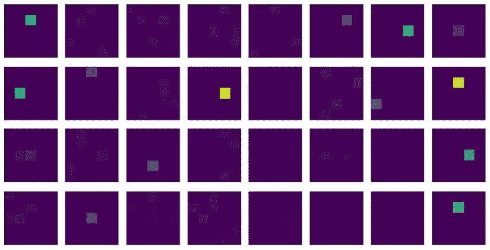

随着深度学习获得更广泛的采用，我们必须保持谨慎[不要将人工智能模型拟人化](https://blog.keras.io/the-limitations-of-deep-learning.html)，因为我们已经看到它们可能会以不同于人类的方式灾难性地失败。然而，一些恒星研究正在进行，以防止这种类型的攻击，并在某些情况下[证明](http://proceedings.mlr.press/v80/mirman18b/mirman18b.pdf) [对特定扰动的鲁棒性](https://github.com/eth-sri/diffai)，所以也许真正鲁棒的深度网络可能就在眼前。

*感谢阅读。请随意阅读我的* [*上一篇文章*](/know-your-enemy-the-fascinating-implications-of-adversarial-examples-5936bccb24af) *其中强调了一些关于对抗性例子的令人惊讶的结果，或者查看一下* [*这个 Jupyter 笔记本*](https://github.com/oscarknagg/adversarial/blob/master/notebooks/Creating_And_Defending_From_Adversarial_Examples.ipynb) *其中包含了生成这篇文章中所有数字的代码，并训练您自己的对抗性健壮模型。*

## 参考

[稳健性可能与准确性不一致](https://arxiv.org/pdf/1805.12152.pdf)—齐普拉斯等人 2018 年

[走向抗对抗性攻击的深度学习模型](https://arxiv.org/pdf/1706.06083.pdf) — Madry 等 2017