# 了解你的敌人

> 原文：<https://towardsdatascience.com/know-your-enemy-the-fascinating-implications-of-adversarial-examples-5936bccb24af?source=collection_archive---------5----------------------->

## 为什么对立的例子比你意识到的更重要

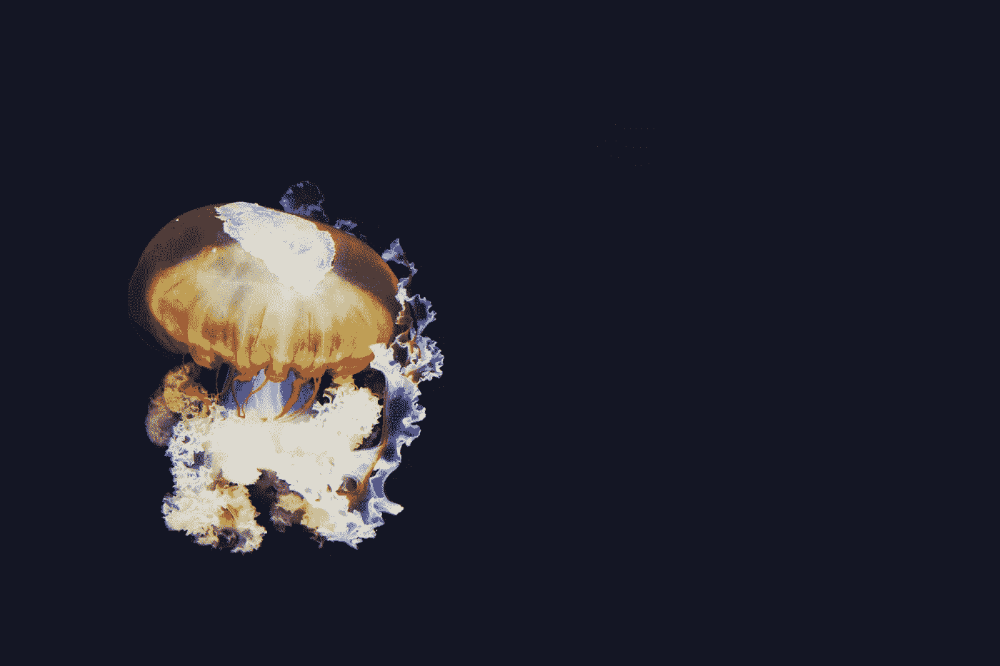

Photo by [naomi tamar](https://unsplash.com/photos/1QbHek3ZnGk?utm_source=unsplash&utm_medium=referral&utm_content=creditCopyText) on [Unsplash](https://unsplash.com/search/photos/deep-sea?utm_source=unsplash&utm_medium=referral&utm_content=creditCopyText)

对抗性的例子是对 ML 模型的输入，这些模型是特制的，以使模型出错——计算机的视错觉。如下所示，典型的对立例子是通过在自然图像中加入少量精心计算的噪声而产生的。事实上，这种攻击可以欺骗最先进的图像识别模型，同时通常人类察觉不到，这表明了人类和深度卷积网络处理视觉信息的方式存在根本差异。这不仅提出了有趣的理论问题，而且也对神经网络在安全关键应用中的就绪性提出了质疑。

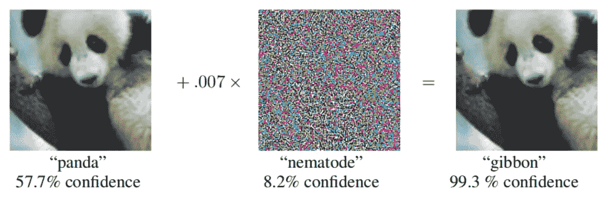

Adversarial example from [Goodfellow et al](https://arxiv.org/pdf/1412.6572.pdf). In this an imperceptibly small amount of noise is added to the first image to trick GoogLeNet — the state of the art ImageNet model in 2014.

对立的例子是一种特别有趣的机器学习现象，因为围绕它们有太多开放的问题。为什么他们愚弄深度网络而不是人类？有可能完全保护神经网络免受这些攻击吗？到目前为止，还没有人能够制造出一个对对立例子完全鲁棒的 [MNIST](https://en.wikipedia.org/wiki/MNIST_database) 数字分类模型，尽管 MNIST 被大多数机器学习实践者视为一个玩具问题。

本帖将涵盖以下内容:

1.  如何创造一个对立的例子
2.  定义和分类敌对的例子和攻击方法
3.  对立的例子转移到物理世界
4.  对立范例在模型间的转移
5.  对立的例子转移到人类身上(kinda)

# **如何创造一个对抗性的例子**

创建对立样本非常简单，并且与神经网络的训练方式(即梯度下降)密切相关。梯度下降的原理很简单。要找到一个未知函数的最小值，首先从一个随机点开始，然后向该函数的梯度方向迈出一小步。对于足够小的步长和非病理函数，这将总是收敛(至少收敛到局部最小值)。

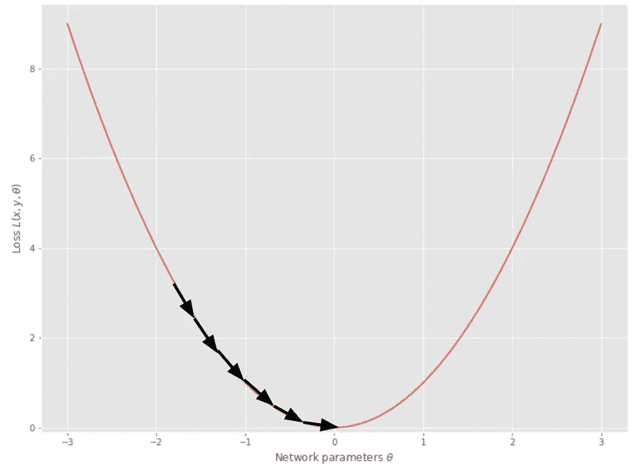

Gradient descent finding the minimum of f(x) = x²

为了将此应用于网络训练，我们首先定义训练数据和网络参数的损失函数(如均方误差，如下所示),该损失函数表示模型输出对于特定样本的错误程度。因此，找到这个损失函数的最小值相当于找到一组好的网络参数。

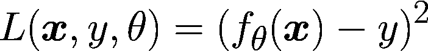

Mean squared error loss for a single sample, x, and label y. Theta represents the weights of a neural network.

其次，我们将这种损失相对于参数θ进行微分，并更新参数，使得该样本上的损失将减少。在实践中，有更多的细节，如学习率，批量大小，势头等。但原理只是梯度下降。

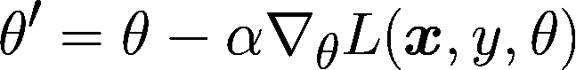

创造一个对立的例子是通过颠倒这个过程来完成的。如果我们保持模型的参数不变，并对输入数据, **x** 的损失进行微分，那么我们可以更新 **x** ,使得模型的预期损失在该样本上增加。

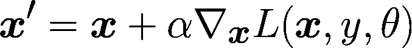

Gradient ascent on the sample, x, to increase the loss L

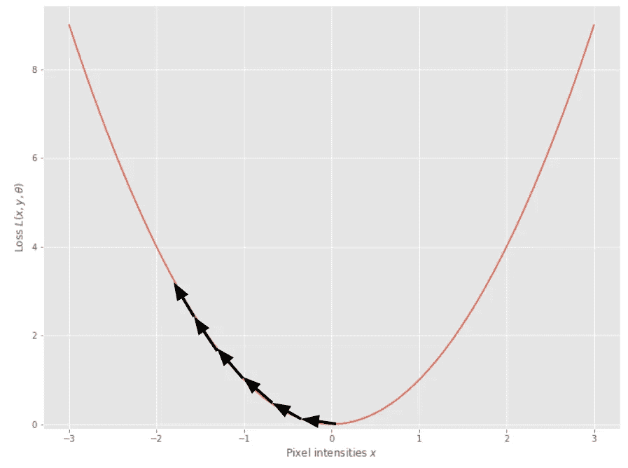

## 快速梯度符号法

*在这一节中，我将讨论图像像素的扰动，只是为了说明不仅仅是图像分类模型容易受到恶意攻击。*

这就把我们带到了快速梯度符号法(FGSM)，这是创造一个对立例子的最简单的方法。这与梯度上升的单个步骤完全相同，除了我们将每个像素上的扰动固定为固定大小ε，因此保证在相反的例子中没有像素比原始图像大ε。这个方法产生了这篇文章顶部的例子。

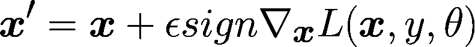

在实践中，这种简单的非常简单的方法导致现有技术的 ImageNet 模型的准确性下降到几乎为零，而图像对于人类来说是察觉不到的。这对神经网络具有超人的图像识别性能(经常在 ImageNet 上声称)的形象来说是一个相当不幸的打击，并暴露了深度神经网络学习的分类函数中的一些根本盲点。你会将自动驾驶汽车中的视觉处理交给一个可能被几个移动像素愚弄的网络吗？

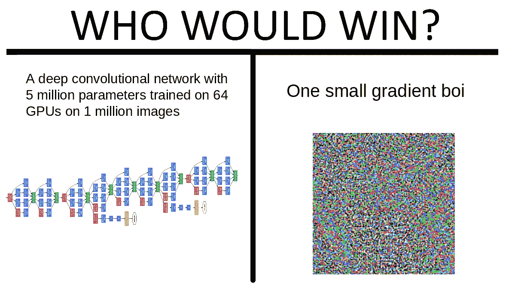

Alternative meme: “One-weird trick to fool any neural network — ML ENGINEERS HATE HIM”

## **为什么神经网络容易受到这些攻击？**

尽管这可能是围绕对立例子的最有趣的问题，但我不能给你一个满意的答案——这是一个完全开放的问题！已经提出了许多建议，包括

*   神经网络在输入空间的区域过于线性([参考](https://arxiv.org/abs/1412.6572))
*   预测对弱相关特征的依赖性([参考](https://arxiv.org/pdf/1805.12152v3.pdf)
*   内部权重矩阵的大奇异值([参考](https://arxiv.org/pdf/1704.08847.pdf)
*   对立的例子可能是高维输入空间不可避免的属性

# 定义对立的例子

在我继续展示一些从对立的例子中得出的有趣结果之前，我将把它们正式化，并对可以执行的攻击类型进行分类。

对抗示例通常被定义为满足以下条件的ε有界示例**x’**

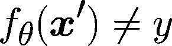

即，具有参数*θ*的分类器的决定不是真正的标签 *y* 。有界对抗性例子也满足

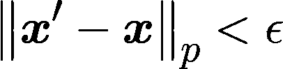

即，在特定的[范数](http://mathworld.wolfram.com/Norm.html)(也称为测量距离的方式)下，对立示例和原始示例之间的距离小于某个小ε。

规范 p 的选择决定了对对立例子的限制。所有这些规范都旨在量化一个对抗性的例子对人类来说是多么难以察觉。

*   l⁰·诺姆。ε限定了相对于 **x** 可以修改的**x’**中的像素总数(尽管它们可以被修改任意数量)
*   L norm。ε限定了**x’**中像素值和 **x** 中相应像素值之间的总平方距离。
*   L∞又名最大范数。ε限定了**x’**中任何像素与 **x** 中相应像素之间的最大差值。

然而，最近的一些工作采取了不同的方法，采用了不同的方法，并使用了一个无限的定义。对抗性扰动是对图像的任何修改，它保留了原始图像的语义，但欺骗了机器学习模型，即使攻击可能被人类察觉。这是一类定义不太明确的扰动，但正如下面的例子所证明的那样，这是一类有用的扰动。

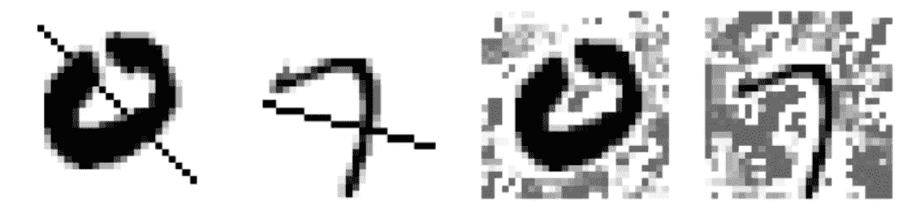

Unrestricted adversarial attacks on MNIST. These images are adversarial in the sense that the semantic meaning is preserved for humans but led to incorrect classifications from a machine learning model.

## 对敌对攻击进行分类

可以在机器学习模型上执行的算法类型(也称为攻击)也可以分类。

1.  白盒攻击。攻击者可以访问完整的模型架构，包括它的梯度
2.  黑箱攻击。攻击者不能访问模型梯度，而只能访问*概率得分*或者更严格地说，只能访问最终模型*决策。*

你可能会提出一个问题，尽管像上述 FGSM 方法这样的白盒攻击非常有效，但攻击者有多大可能获得为自动驾驶汽车的视觉组件供电的网络的全部权重？事实证明，黑盒攻击和白盒攻击一样有效。这一事实以及我将在接下来的几段中与您分享的一些结果，使得对抗性攻击的安全含义更加真实。

# 对立例子的迷人特性

## 对立的例子转移到物理世界

读到这里，你可能会认为对立的例子只是学术上的好奇，或者至少局限于数字环境，比如躲避垃圾邮件过滤器。人们很容易相信，到目前为止你所看到的难以察觉的失真在现实世界中永远不会有效，因为它们会被相机质量、视点、照明等的变化所破坏……嗯 [*库拉金等人*](https://arxiv.org/pdf/1607.02533.pdf) 想和你谈谈。

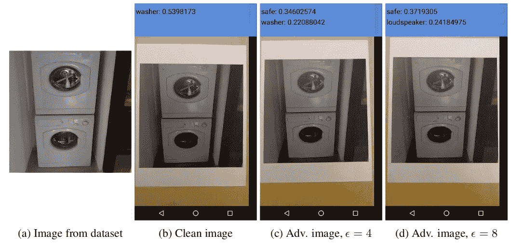

Figure 1 from [https://arxiv.org/pdf/1607.02533.pdf](https://arxiv.org/pdf/1607.02533.pdf) demonstrating that print-out photos of adversarial images can fool classifiers in real life. In this case an Inception network is fooled into classifying a picture of a washing machine is a safe.

在他们出色的论文*中，Kurakin 等人*演示了对 TensorFlow 相机演示应用的黑盒攻击，该应用使用了强大的 Inception 分类器。他们能够证明，用 FGSM 方法创建的对立范例的打印输出正确分类的比率是常规范例打印输出的一半。这是一个远不如数字领域成功的攻击，但仍然是对神经网络的一个打击。

[Athalye 等人](https://arxiv.org/pdf/1707.07397.pdf)更进了一步，通过发明期望超过转换(EOT)攻击来生成真正健壮的真实世界对抗实例。EOT 攻击的前提如下:我们预计一些对抗性的扰动将由于自然发生的图像变换(照明、视点等)而变得无效，因此我们应该优化我们的对抗性示例来说明这一点。他们通过使用交替梯度上升步骤和随机变换的迭代攻击过程来实现这一点。

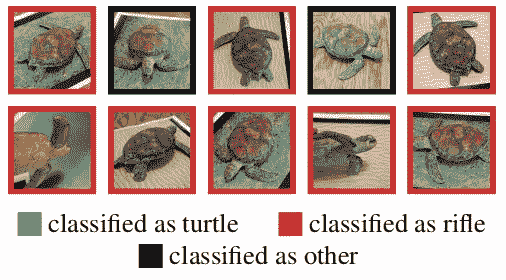

Adversarial turtle from [Athalye et al](https://arxiv.org/pdf/1707.07397.pdf). Athalye et al were able to use their EOT method generate a 3D printed turtle that was reliably classified as a rifle from most viewpoints.

用类似的方法[布朗等人](https://arxiv.org/pdf/1712.09665.pdf)能够使用 EOT 攻击生成一个敌对标签，可以打印出来并应用到任何图像上。这些对立的例子被设计成在大范围的位置、比例、旋转和背景图像上是鲁棒的，因此可以应用于任何东西。这些攻击扩展了对抗性示例的定义，因为它们对人类来说是清晰可见的，但是它们也产生了一些伪装的版本。一个占图像 10%的敌对补丁能够在 90%的时间里欺骗网络。相比之下，一个相同大小的烤面包机的标签在 10%的情况下导致了烤面包机的分类！

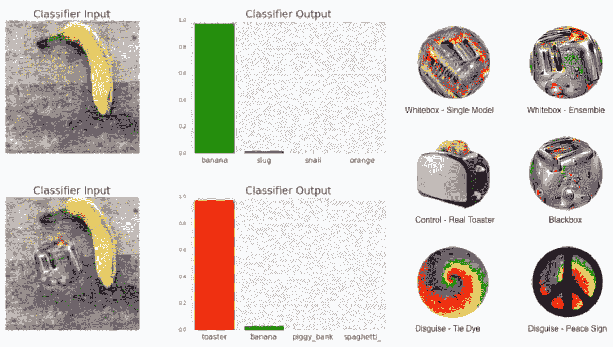

**Left:** adversarial patch successfully fooling a VGG16 network into classifiying a banana as a toaster. **Right:** a variety of disguised and undisguised adversarial patches, plus a real toaster for reference. See [this](https://www.youtube.com/watch?v=i1sp4X57TL4) YouTube video for a demonstration.

也许这只是我的看法，但我发现敌对贴纸在艺术上令人愉悦，事实上它甚至包含了一些类似烤面包机的视觉特征！一般来说，对抗性例子越强，就越符合人类的感知。这一有趣的现象是一个经验主义的暗示，表明人类感知和卷积神经网络之间存在某种联系——这是我将在后面的章节中更多讨论的内容。

## 对立范例在量词间的转移

当我第一次发现对立的例子时，我认为一个显而易见的防弹攻击是使用一组模型。一个对立的例子显然可以通过利用特定梯度的特性来欺骗一个模型，但它永远不会同时欺骗多个模型，对吗？事实证明我错了。

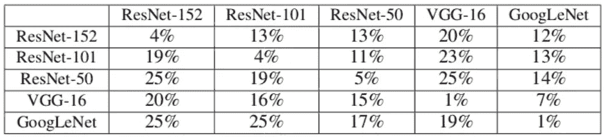

Table 1 from [Liu et al](https://arxiv.org/pdf/1611.02770.pdf).

刘等全面考察了对立范例在多种分类器上的可迁移性。上表中的每个单元格显示了为攻击行模型而生成的对立示例上的列模型的准确性，例如，第一行中左起第四个单元格表明对 ResNet-152 的攻击导致 VGG016 的准确性下降到 20%(从 70%)。因此，我们可以看到，一群顶级模特仍然有可能被针对单个模特的攻击所愚弄！

作者更进一步，通过对 Clarifai.com[和 T3](https://clarifai.com/)发动黑盒攻击，使用精心制作的对立例子来欺骗分类器群，充分证明了对立例子的可转移性。他们推断，既然我们不知道 Clarifai 模型的数据集、架构或训练程序，那么他们可以通过欺骗合奏来提高他们的机会。令人印象深刻的是，使用这种方法，他们能够让 Clarifai.com 模型在 76%的情况下生成不相关的标签！

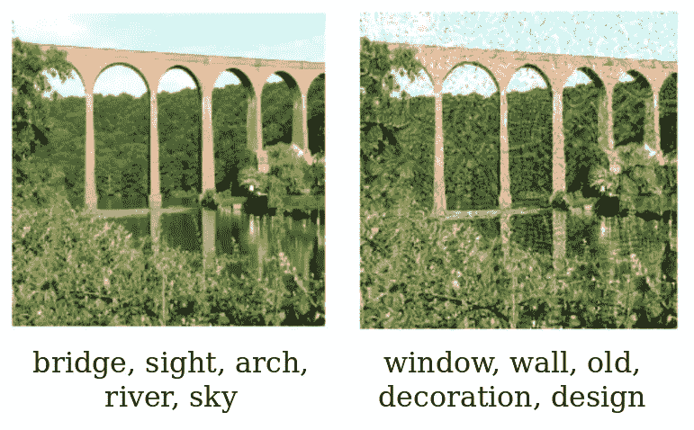

Clarifai.com tags before and after adversarial perturbation.

仍然有理由相信只有神经网络容易受到这种攻击，但 [Papernot 等人](https://arxiv.org/pdf/1605.07277.pdf)表明，对立的例子在各种模型类型之间转移，包括经典的机器学习算法，如支持向量机和决策树。

我相信本节中讨论的结果提供了证据，证明对立的例子不是任何特定模型的缺陷，而是在高维空间中执行分类时可能固有的问题。一些最近的结果支持这个观点，但是很明显人类能够避免这种情况。

## 对立的例子愚弄了有时间限制的人类

在前面的章节中，我已经向你展示了强大的对抗性例子更符合人类的感知，并且对抗性例子可以在分类器之间转移。在这篇精彩的论文中，Elsayed 等人展示了对立的例子可以转移到所有分类器中表现最好的——人类视觉系统。

这项精心设计的研究中，人类参与者重复执行以下试验的变体:

1.  参与者被要求将目光投向屏幕中央的十字
2.  参与者被短暂地呈现了一个大约 65 毫秒的图像
3.  参与者都带着高对比度的随机面具(我不确定为什么需要这一步)
4.  将图像分为两类，例如猫和狗

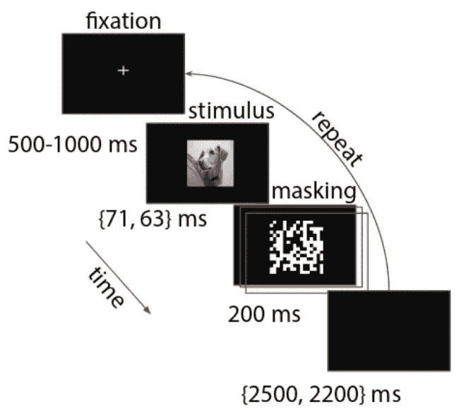

Visual summary of the experimental setup.

你可能已经注意到，参与者只能在很短的时间间隔内看到图像。事实上，这项研究旨在通过以下选择，最大限度地增加将对立的例子传递给人类的机会

*   人类是有时间限制的。这限制了大脑可以使用自上而下和循环处理的数量，并且[被认为](https://www.biorxiv.org/content/biorxiv/early/2018/02/12/240614.full.pdf)使视觉处理更类似于人工前馈神经网络
*   对立的例子是从 10 个高性能 ImageNet 模型的集合中创建的，并使用比典型情况大得多的扰动
*   *重要的是，这些扰动对人类来说是可见的，但不会改变一个没有时间限制的人的决定——它们保留了原始图像的类别*

尽管如此，对抗性攻击降低了人类在这些试验中的准确性，降低了大约 10%,并且参与者的池足够大，使得这一结果具有统计学意义！

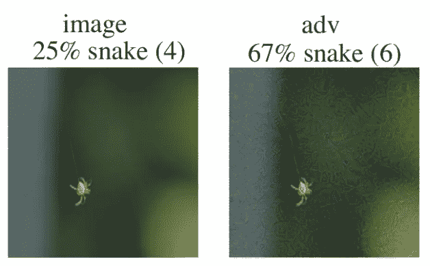

Part of figure 3 from [Elsayed et al.](https://arxiv.org/pdf/1802.08195.pdf) This is an example of an adversarial image that was able to fool time-limited humans. Original class: spider, adversarial class: snake. Note that although the adversarial perturbation is visible (and contains some snake-like features, especially around the strand of silk) it is still clearly a picture of a spider.

在我看来，这篇论文展示了深层卷积网络和人类视觉的初始快速视觉反应之间的明确联系。然而，人类的视觉比第一个反应要复杂得多，涉及到不同感兴趣区域之间许多被称为[扫视](https://en.wikipedia.org/wiki/Saccade)的眼球运动。有可能人类视觉系统的这个或一些其他特征是“秘密调味汁”，使人类视觉不受对立例子的影响，尽管甚至人类视觉也会遭受视错觉的影响(尽管这些与对立例子非常不同)。或者，也许有一天我们会发现一种方法，为无限时间的人类产生对立的例子——一个真正令人不安的想法！

我不能说这篇文章是对对立例子的全面回顾，因为我只触及了这个领域中正在做的杰出工作的一小部分，但是我希望在读完这篇文章后，你会同意我的观点，对立例子是一种迷人的现象。我相信有一天研究界会发现图像识别技术不会受到攻击，并且在这个过程中我们会学到很多关于人类视觉系统的知识。

请继续关注后续文章，在这篇文章中，我将用代码指导您完成一次具体的对抗性攻击。我还将从最近的文献中提供一种对抗性训练方法，并说明它提供了一些意想不到的好处！

*更新:* [*这里是*](/know-your-enemy-7f7c5038bdf3) *。*