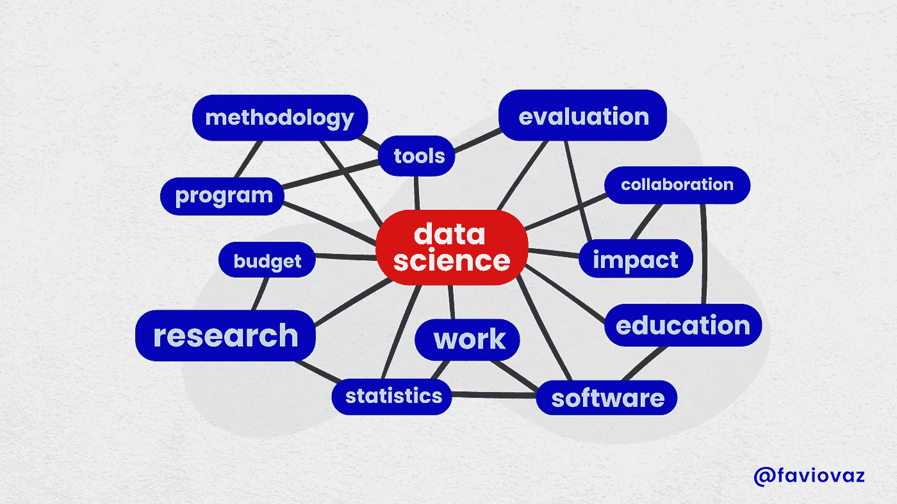

# 知识数据科学与语义技术。

> 原文：<https://towardsdatascience.com/knowledge-data-science-with-semantics-technologies-ff54e4fe306c?source=collection_archive---------17----------------------->

## 数据科学(可能的)未来简介。

Illustration by [Héizel Vázquez](https://www.instagram.com/heizelvazquez/)

欢迎来到关于数据科学的新系列。在这里，我将开始介绍一些指导我们学习的概念和定义。要理解这篇文章，我建议你阅读我过去写的其他文章:

*   [关于数据和科学](/https-towardsdatascience-com-on-data-and-science-e96849b5f363)
*   [构建数据科学的未来](/building-the-future-of-data-science-d5587a402e42)
*   [本体与数据科学](/ontology-and-data-science-45e916288cc5)

我将尝试为我们的领域定义一个新的开始，我称之为:

> 知识数据科学

我是从[知识工程](https://en.wikipedia.org/wiki/Knowledge_engineering)领域取的这个想法，但是仅仅是名字，定义会有点不同。还有另一种类似的方法，你可以在这里阅读。让我首先回顾一下[我对数据科学的定义](/creating-intelligence-with-data-science-2fb9f697fc79):

> 数据科学是通过**数学**、**编程**和**科学方法**来解决业务/组织问题，其中涉及通过**分析数据**和**生成预测模型**来创建**假设**、**实验**和**测试**。它负责**将**这些**问题转化为也能以**创造性**方式回应初始假设的适定问题**。还必须包括对所获结果的**有效沟通**，以及解决方案如何为企业/组织增加**价值**。

这里是我们需要谈论的*知识数据科学:*

> 知识数据科学是通过数学、编程、科学方法和语义技术解决业务/组织问题的方法，涉及通过分析数据和在知识表示系统内生成预测模型来创建假设、实验和测试。它负责将这些问题转化为适定的问题，这些问题也可以以一种创造性的方式对最初的假设做出回应。它还必须包括对所获结果的有效沟通，以及解决方案如何为企业/组织增加价值。

所以这里的主要区别是增加了语义技术和知识表示系统的概念。在本文中，我将描述这些。

你们中的一些人在读到这里时可能会想:我刚刚开始进入这个新领域，现在又出现了一个？或者:为什么我们需要更多关于数据科学的定义？为什么不专注于解决业务问题，就这样？

我听到了。但是让我告诉你一些事情。数据科学领域的一些人需要谈论我们领域的理论部分；这是我们能够将它的研究系统化并使其他人容易进入它的唯一方法。为什么我要给它添加一个新的部分(语义)？因为是时候了，我们开始理解它能给我们的领域和我们的工作方式带来的奇迹。这在开始时可能看起来不明显，但希望在本系列结束后，您会看到这一点。

# 语义技术

[阅读这篇文章，了解更多背景知识。](/deep-learning-for-the-masses-and-the-semantic-layer-f1db5e3ab94b)

Illustration by [Héizel Vázquez](https://www.instagram.com/heizelvazquez/)

语义这个词本身就意味着意义或理解。因此，我们在这里将要讨论的语义技术是关于数据的含义，而不是数据的结构。

当我们理解的时候，我们正在解码组成一个复杂事物的部分，并把我们一开始得到的原始数据转化成有用的和直观的东西。我们通过**建模**来做到这一点。你可以想象，我们需要这样的模型来理解数据的意义。

我们通常通过创建一个叫做**知识图**的东西来做到这一点，它依赖于我们链接数据。这里的关键是，在这个新模型下，我们不是在寻找可能的答案，而是在寻找答案。我们想要事实——这些事实从何而来并不重要。

这里的数据可以代表概念、物体、事物、人，实际上是你脑海中的任何东西。图表填充了概念之间的关系和联系。

因此我们可以说，语义技术是那些使用语义、[本体](/ontology-and-data-science-45e916288cc5)、链接数据和知识图的概念来帮助我们理解我们所拥有的数据的含义的技术。这种技术有很多很好的例子，比如:

*   [ArangoDB](https://www.arangodb.com/)
*   [Neo4j](https://neo4j.com/)
*   [Talend](https://www.talend.com/)
*   [海王星](https://aws.amazon.com/neptune/)
*   [安佐](https://www.cambridgesemantics.com/product/)

还有更多。其中一些是问题的完整解决方案，但其他的则侧重于事务性(OLTP)图数据库。而类似剑桥语义公司的 AnzoGraph 是一个分析(OLAP)图形数据库。不久前，我在一篇文章中谈到了这种差异:

 [## 图形数据库。有什么大不了的？

### 继续分析语义和数据科学，是时候讨论图形数据库以及它们必须…

towardsdatascience.com](/graph-databases-whats-the-big-deal-ec310b1bc0ed) 

为什么所有这些对你来说都很重要？因为人们不会在表格中思考(像在传统的 RDBMS 中)，但他们会立即理解图形。当你在白板上画出一个知识图表的结构时，它对大多数人的意义是显而易见的。

同样重复我以前写的，我厌倦了编写极长的 SQL 查询，甚至是从数据库中获取简单数据的 NoSQL 查询。这可能是解决这一问题的方法，甚至更多。

# 知识表示系统

Illustration by [Héizel Vázquez](https://www.instagram.com/heizelvazquez/)

我们在数学世界中表示事物的方式是最基本的。人工智能的大多数理论进步，特别是机器和深度学习，都来自于更好地表示系统和数据，并找到新的有用的技术来分析它。几乎所有我们用来完成这类任务的算法都依赖于代数、微积分和统计。

但是最近几年，以图表的方式表达信息的转变变得越来越重要。你可以在我开头列出的其他文章和文章的其余部分找到原因。但这里重要的部分是，我们需要一种数据表示，不仅包括数据本身，还包括其中的交互是一等公民。

这就是知识表示系统给我们的。一种毫不费力地表示数据及其关系的方法。正如我之前提到的:

> 关系数据库将高度结构化的数据存储在具有预先确定的列和行的表中，而图形数据库可以映射多种类型的关系数据和复杂数据。因此，图形数据库的组织和结构不像关系数据库那样严格。所有关系都存储在边的顶点中，这意味着顶点和边都可以有与之关联的属性。这种结构允许数据库能够描述不相关的数据集之间的复杂关系。

美国数据科学家可以通过这种方式找到很多帮助来组织我们组织中的数据。我们需要专注于解决问题，而不是处理数据。正如你以前可能听到的，处理和清理数据几乎是我们所做的一切，这种情况必须结束。我们需要开始考虑建立一个数据平台，让我们能够解决问题，并且能够以更好的方式处理数据。

知识表示系统的一个很好的例子是数据结构，我之前定义为:

> […]支持公司所有数据的平台。它是如何被管理、描述、组合和普遍访问的。该平台由企业知识图构成，创建统一的数据环境。

使用像[剑桥语义](https://www.cambridgesemantics.com/)的 [Anzo](https://www.cambridgesemantics.com/product/) 这样的工具，你可以自动生成查询(是的，这是一个东西)，使用它们来处理复杂的图形使提取特征变得容易，并最终完全自动化。以下是 Anzo 的一个示例:

[https://www.cambridgesemantics.com/product/](https://www.cambridgesemantics.com/product/)

这个新领域的开始要求我们了解更多关于语义学、本体论、语义网、知识图等等。我以前写过这方面的文章，在下一部分，我将深入探讨这些内容以及它们与数据科学的联系。

对这个激动人心的话题，我期待更多。如果您有任何建议，请告诉我:)

如果您有任何问题，请在 Twitter 上关注我:

 [## 法维奥·巴斯克斯

### Favio Vázquez 的最新推文(@FavioVaz)。数据科学家。物理学家和计算工程师。我有一个…

twitter.com](https://twitter.com/faviovaz) 

和 LinkedIn:

 [## 法维奥·瓦兹奎——首席执行官——克洛斯特| LinkedIn

### ‼️‼️重要提示:由于 LinkedIn 的技术限制，我现在只能接受来自我…

www.linkedin.com](https://www.linkedin.com/in/faviovazquez/) 

那里见:)