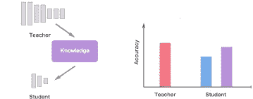
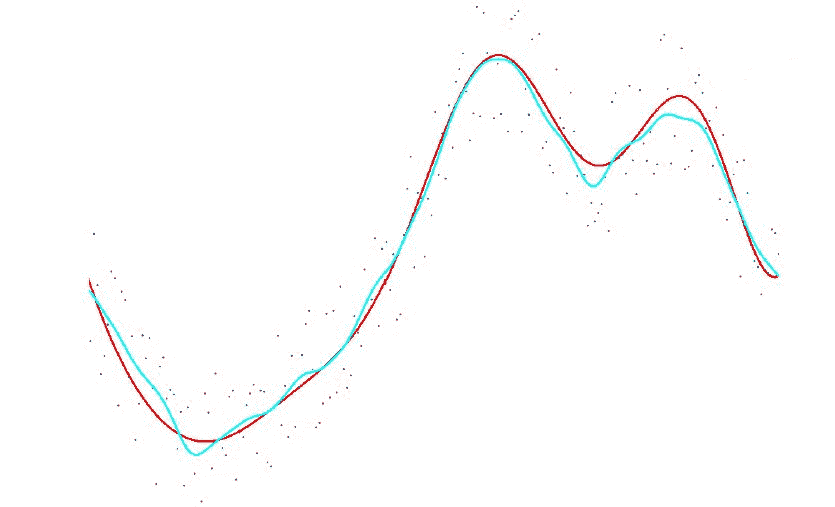
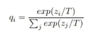
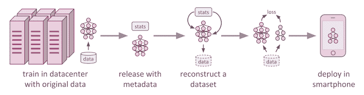

# 知识蒸馏——一种为压缩和加速神经网络而开发的技术

> 原文：<https://towardsdatascience.com/knowledge-distillation-a-technique-developed-for-compacting-and-accelerating-neural-nets-732098cde690?source=collection_archive---------25----------------------->

Photo by [Kai Dahms](https://unsplash.com/@dilucidus?utm_source=medium&utm_medium=referral) on [Unsplash](https://unsplash.com?utm_source=medium&utm_medium=referral)

最近的增长见证了深度学习行业的显著增长。随着 AlexNet 在 2012 年 ImageNet 比赛中的突破，更先进的深度神经网络 *(ResNet-50，VGGNet，以及许多其他)*被开发出来，不断改写记录。然而，这些网络需要大量的计算来产生良好的结果。例如，AlexNet 有 6230 万个参数，使用两个 Nvidia Geforce GTX 580 GPU 训练 90 多个 epochs 需要大约 6 天时间。

因此，这些网络的潜力只能通过繁重的计算来完全利用。相比之下，我们日常生活中使用的大多数移动设备通常对存储和计算资源有严格的限制，这使得它们无法充分利用深度神经网络。因此，为了保持类似的准确性，同时牢记这些限制，开发了一种压缩和加速神经网络的新技术，称为**知识提取**。

> 在这篇文章中，我们将关注知识的提炼以及如何用它来解决这个问题。

# 知识蒸馏

## 直觉

The red plot is of the large model(Teacher), the blue plot is of the student network trained without distillation, and the purple plot is of the student network trained using distillation.

我们的主要目标是训练一个能够在测试数据集上产生良好结果的模型。为了做到这一点，我们训练了一个笨重模型，它可以是许多不同训练过的模型的集合，或者仅仅是一个用正则化子训练的非常大的模型，例如*退出*。一旦笨重的模型*(教师)*准备就绪，我们就使用一种称为*提炼*的技术，将笨重模型学到的复杂知识转移到更适合部署在具有内存和繁重计算约束的设备中的小模型*(学生)*。

> 通过复杂的知识，我的意思是，繁琐的模型可以区分大量的类。在这样做的时候，它给所有不正确的类分配概率。然而，这些概率是非常小的，它们告诉我们很多关于这个繁琐的模型是如何概括的。一张狗的图片很少会被误认为是猫，但这种错误仍然比误认为是鸽子多很多倍。

繁琐的模型需要很好地概括，所以当我们将知识提取到较小的模型时，它应该能够以与大模型相同的方式概括。例如，如果一个大模型是许多不同模型的集合，那么与在用于训练集合的相同训练集上以正常方式训练的小模型相比，使用提取知识学习的小模型将能够在测试数据集上更好地概括。

将繁琐模型的泛化能力转移到小模型的一种明显的方式是使用由繁琐模型产生的类别概率*(通过称为蒸馏的技术产生)*作为用于训练小模型的“软目标”。对于转移阶段，我们可以使用相同的训练集或单独的集*(完全由未标记的数据组成)*。

Scatters dots are the data points in the dataset. The blue plot is the cumbersome model(teacher) trained on a complex dataset and the red plot is the small model(student) generalizing on the soft targets generated from the teacher model.

> 对于软目标，我们可以取所有单个预测分布的几何平均值。当软目标具有高熵时(你可以在这里阅读更多关于熵的信息)，它们为每个训练案例提供的信息比硬目标多得多，训练案例之间的梯度差异也小得多，因此小模型通常可以在比原始笨重模型少得多的数据上进行训练，并使用高得多的学习率。

## 蒸馏

蒸馏是产生软目标概率分布的一般解决方案。在这种情况下，我们使用 softmax 激活函数产生类别概率，该函数将为每个类别计算的 logits *z_i* 转换成概率 *q_i:*

Equation-1

> 这里 T 是温度，通常设置为 1。使用更高的概率分布导致更柔和的概率分布。
> 
> z_i 是为数据集中每个数据点的每个类计算的逻辑值。

在蒸馏的最简单变型中，通过在转移集上训练笨重的模型，并对转移集中的每种情况使用软目标分布，将知识转移到小模型，该软目标分布由 softmax 函数中的高温产生。在训练小型或蒸馏模型时使用相同的高温，但是在训练之后，温度被设置为 1。

如果我们有转移集的正确标签，这项技术可以得到显著的改进。一种方法是取两个目标函数的加权平均值。第一个目标函数是软目标的交叉熵，并且使用提取模型的 softmax 中与用于从繁琐模型生成软目标相同的高温来计算该交叉熵。第二个目标函数是正确标签的交叉熵。这是使用提取模型的 softmax 中完全相同的 logits 进行计算的，但温度为 1。保持第二目标函数的权重相当小产生了最好的结果。

> 因为由软目标产生的梯度的幅度缩放为 1/T，所以当使用硬目标和软目标时，将它们乘以 T 是重要的。这确保了当用元参数进行实验时，如果用于蒸馏的温度改变，则硬目标和软目标的相对贡献大致保持不变。

## 运行一个示例

Process of deploying deep learning models in embedded devices.

在这个例子中，我们将考虑我们正在处理一个非常复杂的数据集 *(X)* ，并且使用一个浅层网络*(可以部署在移动设备中)*在这个数据集上获得良好的准确性，使用传统的模型构建技术几乎是不可能的。因此，为了获得良好的准确性，我们将使用知识提炼技术:

*   首先，我们将在数据中心使用大型模型*(老师)*训练数据集 X，该模型能够分解数据集 X 的复杂性，以产生良好的准确性。
*   现在，我们将使用原始数据集 X 或转移集*(数据集 X 的较小版本)*从大模型中生成软目标，然后使用它们通过蒸馏技术获得数据集中每种情况的概率分布。
*   下一步是基于移动设备的内存和计算限制来构建一个浅层网络*(学生)*。
*   这个浅层网络将根据第二步中产生的概率分布进行训练，并在此基础上进行推广。
*   一旦该模型被训练，它就准备好被部署在移动设备中。

> 为了估计提取模型的结果有多好，我们将查看神经网络 中的论文 [**知识蒸馏的作者使用知识提取在 MNIST 数据集上能够实现的数字。**](https://arxiv.org/pdf/1503.02531.pdf)

## 结果

为了了解蒸馏是如何工作的，MNIST 数据集使用一个非常大的神经网络*(教师)*进行训练，该网络由两个隐藏层组成，每个隐藏层都有 1200 个经过校正的线性隐藏单元。以下模型已经训练了超过 60，000 个训练案例。该网络实现了 67 个测试错误，而较小的网络*(学生)*具有两个隐藏单元，每个具有 800 个校正的隐藏单元 146 个测试错误。

但是，如果仅仅通过增加匹配大网在 20℃下产生的软目标的额外任务来调整较小的网，它会产生 74 个测试误差。这表明软目标可以将大量知识转移到提取的模型，包括从翻译的训练数据中学习的关于如何概括的知识，即使转移集不包含任何翻译。

> 如果你想比较其他数据集的结果，你可以查看原始的[论文](https://arxiv.org/pdf/1503.02531.pdf)以获得更多信息。

# 结论

*   简单模型的能力没有被硬标签训练充分利用:通过知识提炼来提高。
*   随着知识的丰富和流畅，软标签更容易匹配。
*   知识提炼框架主要关注准确性和压缩率，但忽略了对实际应用至关重要的已学习学生网络的健壮性。
*   学生模型可以用在嵌入式设备中，产生可比较的结果，在某些情况下，它甚至可以复制复杂网络的结果。

为了更深入地了解知识的提炼，我建议你去阅读原文， [**在神经网络中提炼知识**](https://arxiv.org/pdf/1503.02531.pdf) 。

> 如果你喜欢这篇文章并想保持联系，你可以在 LinkedIn [这里](https://www.linkedin.com/in/rahil-vijay/)找到我。