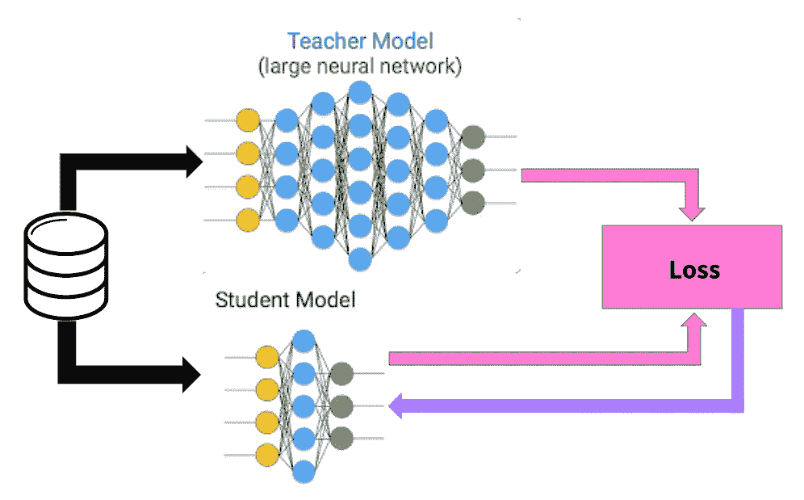
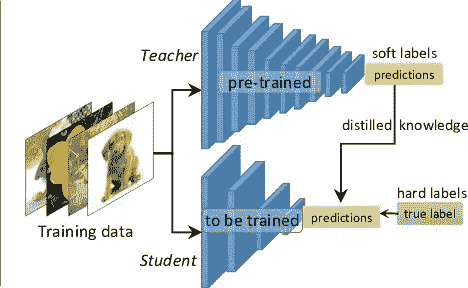
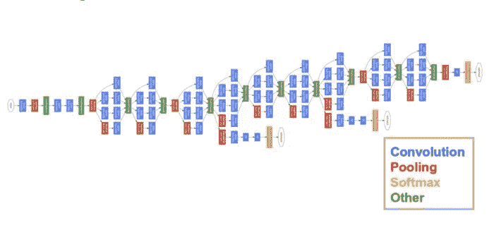
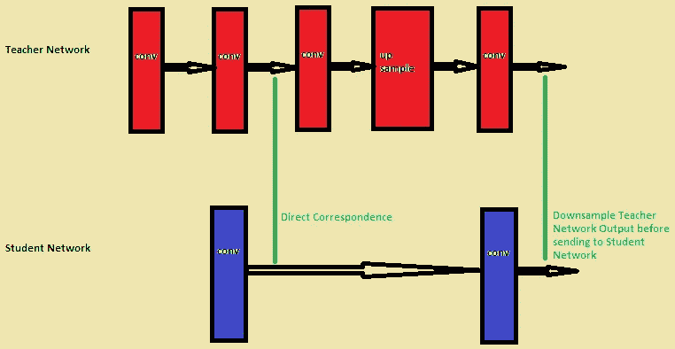

# 知识蒸馏:简体

> 原文：<https://towardsdatascience.com/knowledge-distillation-simplified-dd4973dbc764?source=collection_archive---------2----------------------->

## 窥探师生网络的世界

## 什么是知识蒸馏？

近年来，神经模型在几乎每个领域都取得了成功，包括极其复杂的问题陈述。然而，这些模型体积庞大，具有数百万(和数十亿)个参数，因此不能部署在边缘设备上。

知识提炼指的是模型压缩的思想，通过一步一步地教会一个较小的网络，使用一个更大的已经训练好的网络来做什么。“软标签”指的是在每个卷积层之后由更大的网络输出的特征图。然后，较小的网络被训练来学习较大网络的确切行为，尝试在每个级别复制其输出(不仅仅是最终损失)。

## 我们为什么需要这个？

深度学习已经在包括计算机视觉、语音识别、自然语言处理等众多领域取得了令人难以置信的性能。然而，这些模型中的大多数在计算上过于昂贵，以至于不能在诸如移动电话或嵌入式设备上运行。要了解更多关于模型压缩的需求和相关的常用技术，请访问下面的博客。

 [## 深度学习—模型优化和压缩:简化

### 看看最先进的机器学习模型的压缩、修剪和量化领域

towardsdatascience.com](/machine-learning-models-compression-and-quantization-simplified-a302ddf326f2) 

## 这和从零开始训练一个模型有什么不同？

显然，对于更复杂的模型，理论上的搜索空间要比较小的网络大。但是，如果我们假设使用更小的网络可以实现相同(甚至相似)的收敛，那么教师网络的收敛空间应该与学生网络的解空间重叠。

不幸的是，仅凭这一点并不能保证学生网络在同一位置收敛。学生网络可能有一个与教师网络非常不同的汇聚点。但如果引导学生网复制教师网的行为(教师网已经搜索过更大的解空间)，则有望使其收敛空间与原教师网收敛空间重叠。

## 师生网络——它们到底是如何工作的？

1.  *训练教师网络:*高度复杂的教师网络首先使用完整数据集单独训练。这一步需要很高的计算性能，因此只能离线完成(在高性能 GPU 上)。

An example of a highly complex and Deep Network which can be used as a teacher network : GoogleNet

*2。建立对应关系:*在设计学生网络时，需要在学生网络和教师网络的中间输出之间建立对应关系。这种对应可以包括将教师网络中某一层的输出直接传递到学生网络，或者在将其传递到学生网络之前执行一些数据扩充。

An example of establishing correspondence

*3。通过教师网络向前传递:*通过教师网络传递数据以获得所有中间输出，然后对其应用数据扩充(如果有)。

*4。通过学生网络反向传播:*现在使用来自教师网络的输出和对应关系在学生网络中反向传播误差，这样学生网络可以学习复制教师网络的行为。

## 下一步是什么？

对上述传统的学生教师提出了许多新的修改建议，如引入多名教师(即，将一个合奏转变为一个单一的网络)，引入一名助教(教师先教助教，助教再教学生)等。然而，这个领域仍然非常年轻，在许多方面还没有被探索。

*这个博客是努力创建机器学习领域简化介绍的一部分。点击此处查看完整系列*

 [## 机器学习:简化

### 在你一头扎进去之前就知道了

towardsdatascience.com](/machine-learning-simplified-1fe22fec0fac) 

或者只是阅读系列的下一篇博客

 [## 培养你自己的 RNN 细胞:简化

### 一窥单个 RNN 细胞的“深层”世界

towardsdatascience.com](/growing-your-own-rnn-cell-simplified-b68ba2c0f082) 

## 参考

*[1]王，，等.“DeepVID:基于的图像分类器深度视觉解释与诊断”IEEE 可视化与计算机图形学汇刊 25.6(2019):2168–2180。
[2] Mirzadeh，Seyed-Iman 等，“通过教师助理改进知识升华:弥合学生和教师之间的差距。”arXiv 预印本 arXiv:1902.03393 (2019)。
[3]辛顿、杰弗里、奥里奥尔·维尼亚尔斯、杰夫·迪恩。"从神经网络中提取知识."arXiv 预印本 arXiv:1503.02531 (2015)。
[4]刘，晓东，等.【用改进多任务深度神经网络用于自然语言理解】arXiv 预印本 arXiv:1904.09482 (2019)。*