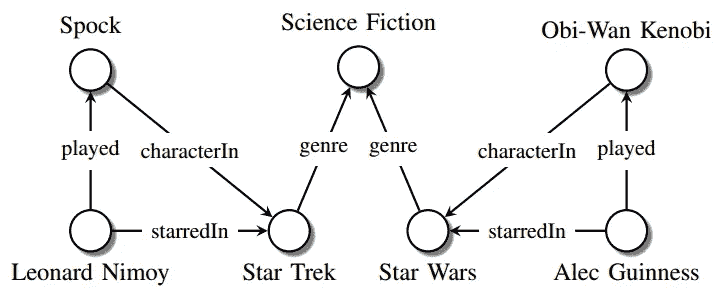
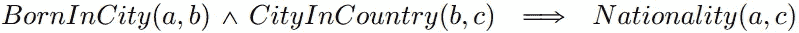

# 知识图:机器学习的完美补充

> 原文：<https://towardsdatascience.com/knowledge-graph-bb78055a7884?source=collection_archive---------2----------------------->

Photo by [Alina Grubnyak](https://unsplash.com/@alinnnaaaa?utm_source=medium&utm_medium=referral) on [Unsplash](https://unsplash.com?utm_source=medium&utm_medium=referral)

如今，网络上的信息数量惊人，而且还在不断增加。例如，有超过 19.4 亿个网站与万维网和搜索引擎(例如，Google、Bing 等)链接。)可以通过这些链接，以极高的精度和速度提供有用的信息。在大多数成功的搜索引擎中，最重要的特征是使用知识图表。不仅是搜索引擎，社交网站(如脸书等。)、电子商务网站(如亚马逊等。)也在使用知识图来存储和检索有用的信息。

# 简史

**1960 年**、[、**、*语义网络*、**、](https://en.wikipedia.org/wiki/Semantic_network)被发明出来，以解决对知识表示框架的日益增长的需求，该框架可以捕捉广泛的**实体——真实世界的物体、事件、情形或抽象概念**和关系，并最终可以应用于扩展的英语对话任务。语义网络背后的主要思想是捕捉广泛的问题，包括计划、行动、时间、个人信念和意图的表示，并且足够通用以适应每个问题。

根据维基百科，**在 1980 年末**，两所荷兰大学开始了一个名为 ***知识图*** 的项目，这是一种语义网络，但增加了一些限制，以方便图上的代数运算。

**2001 年**，蒂姆·伯纳斯·李创造了术语 [***语义网***](https://en.wikipedia.org/wiki/Semantic_Web) 是语义网与 Web 结合的一种应用。

> 蒂姆·伯纳斯·李说“语义网是当前网络的延伸，在其中信息被赋予明确的含义，更好地使计算机和人合作工作。”

**2012 年**，谷歌将其知识图谱命名为 [**知识图谱**](https://googleblog.blogspot.com/2012/05/introducing-knowledge-graph-things-not.html) 。

# 未定义的定义

每个公司/团体/个人都创建他们自己版本的知识图，以限制复杂性并将信息组织成数据和知识。比如谷歌的知识图、知识库、微软的 Satori、脸书的实体图等。

因此，知识图没有正式的[定义。从更广的角度来看，知识图是语义网络的变体，带有附加的约束，其范围、结构、特征甚至用途都没有完全实现，并且处于发展过程中。](https://www.authorea.com/users/6341/articles/107281-what-is-a-knowledge-graph/_show_article)

# 知识图示例

Source: Maximilian Nickel et al. A Review of Relational Machine Learning for Knowledge Graphs: From Multi-Relational Link Prediction to Automated Knowledge Graph Construction

# 你为什么要兴奋？

随着时间的推移，机器学习和基于知识图的知识表示学习正在迅速发展，无论是在规模上还是在深度上，但方向不同。一方面，机器学习技术在执行各种任务(如分类、生成等)方面越来越好。)在各种数据集上，具有很高的精确度和召回率。另一方面，知识表示带来了以高可靠性、可解释性和可重用性来表示实体和关系的能力。知识表示学习的最新进展包括从图中挖掘逻辑规则。

Source: Bishan Yang et al. Embedding Entities and Relations for Learning and Inference in Knowledge Bases.

然而，将知识图和机器学习结合起来将系统地提高系统的准确性，并扩展机器学习能力的范围。例如，从机器学习模型中推断出的结果将具有更好的可解释性和可信度。

以下是将知识图引入机器学习中可以利用的一些机会:

## 数据不足

拥有足够数量的数据来训练机器学习模型是非常重要的。在数据稀疏的情况下，知识图可以用来扩充训练数据，例如，用相似类型的实体名称替换原始训练数据中的实体名称。这样，使用知识图可以创建大量的正面和负面例子。

## 零射学习

如今，机器学习模型面临的主要挑战是，如果没有经过适当训练的数据，就无法区分两个数据点。在机器学习中，这被认为是零射学习问题。这就是知识图表可以发挥很大作用的地方。来自机器学习模型的归纳可以用来自知识图的推断来补充，例如，用训练数据中没有出现情况类型的图片。

## 可解释性

机器学习行业的主要问题之一是解释机器学习系统所做的预测。一个问题是导致来自机器学习模型的预测的隐式表示。知识图可以通过将解释映射到图中适当的节点并总结决策过程来缓解这个问题。

> 注意:上述机会在研讨会报告[知识图:语义网上知识表示的新方向(Dagstuhl 研讨会 18371)](http://drops.dagstuhl.de/opus/volltexte/2019/10328/) 中有更详细的解释

# 一些使用案例

*   **问答**是知识图最常用的应用之一。知识图包含丰富的信息，问答是帮助终端用户更有效地从知识图中检索信息的好方法。
*   **存储研究信息**是另一个有用的应用知识图。最近，许多公司正在使用知识图来存储从研究的各个阶段产生的信息，这些信息可用于建立可访问的模型、风险管理、过程监控等。
*   网飞使用知识图表为其**推荐系统**存储大量不同的信息，这有助于发现电影、电视节目、人物等之间的关系。稍后，这些关系可用于预测客户接下来可能喜欢看什么。
*   **供应链管理**也受益于知识图的使用。公司可以轻松跟踪不同组件的库存、涉及的人员、时间等，这使他们能够更快速、更经济地移动物品。

**还有更多……**

# 公开挑战

1.  **一套连贯的最佳实践**，可以在知识图的创建过程中应用，将有助于工程师、开发人员和研究人员理解和重用知识图。
2.  给定一组非结构化数据和知识图，**知识整合**的问题是识别数据中提到的实体是否与知识图中呈现的现实世界实体相匹配。虽然这个问题可以使用机器学习算法来解决，但是这些算法的结果直接取决于训练数据的质量。给定各种各样数据集，知识集成变得相当困难。
3.  **知识不是一成不变的，而是不断进化的**。例如，如果一个知识图表跟踪病人的健康状况，那么在某个特定时刻存储的数据可能在稍后的某个时刻是错误的。那么，我们如何捕捉这种知识进化的本质呢？
4.  如何**评价一个知识图谱**？哪些质量改进(例如，完整性、正确性、链接等。)更重要？

# 感谢

*   知识图表:语义网上知识表示的新方向(Dagstuhl 研讨会 18371) *Dagstuhl 报道*8(2018):29–111。
*   保罗海姆，黑科。"知识图精化:方法和评估方法综述."*语义网*8(2016):489–508。
*   《知识图的关系机器学习回顾》*IEEE 会议录*104(2015):11–33。
*   艾伦和弗里希(1982)。“语义网络中有什么”。在:第 20 届会议录。ACL 年度会议，多伦多，第 19-27 页。
*   奈杰尔等人《语义网再访》 *IEEE 智能系统*21(2006):96–101。