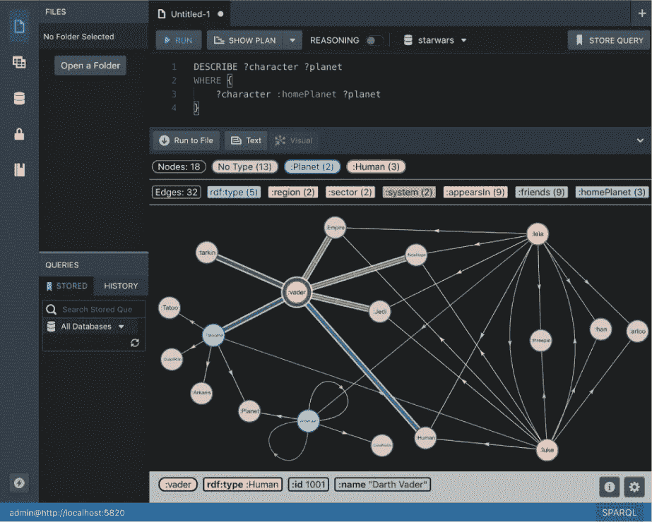
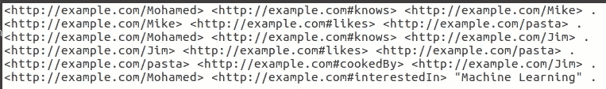
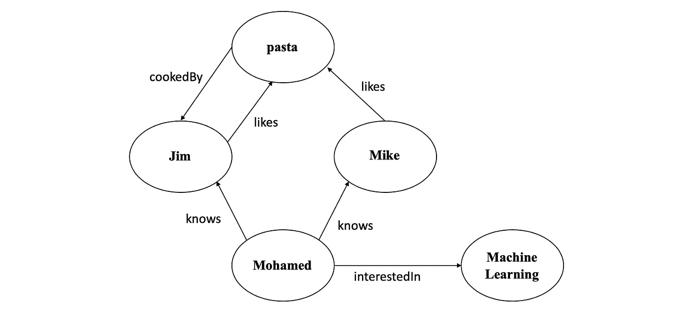
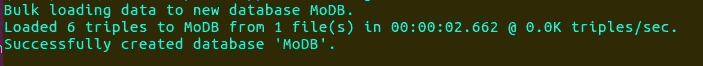
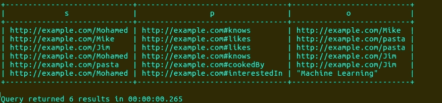
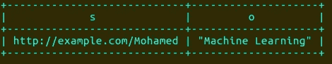
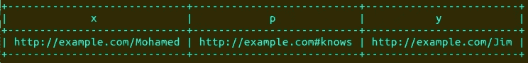
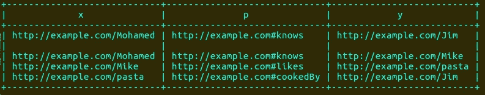

# 使用 Stardog 的知识图查询

> 原文：<https://towardsdatascience.com/knowledge-graph-queries-using-stardog-ba882f84ceea?source=collection_archive---------21----------------------->

## Stardog:一个允许你探索和查询知识图表的平台。



Image by Stardog. Knowledge graph visualization in Studio

Stardog 不仅仅是一个查询引擎，它是一个前沿平台，允许你探索和查询知识图表。

Stardog 可用于在知识图上运行 SPARQL 查询。如果你不熟悉知识图或者 SPARQL 查询，我建议你看我的博客:[使用 Apache Jena (SPARQL 引擎)提取和查询知识图](/extract-and-query-knowledge-graphs-using-apache-jena-sparql-engine-5c66648797a4)。对于本教程，您可以下载任何知识图表，如 [AGROVOC](http://aims.fao.org/vest-registry/vocabularies/agrovoc) ，或者您可以创建自己的图表，如下所示:



目前，图表如下所示:



# 明星日志

> 知识图的功能取决于它所能访问的数据，因此我们构建了数据库连接器来简化数据的统一。Stardog 拥有所有主要 SQL 系统和最流行的 NoSQL 数据库的连接器。此外，我们构建了 BITES 管道来处理您的非结构化数据，如研究论文、简历和监管文档。BITES 使用 NLP 实体识别来识别和提取概念，将这些数据关系添加到知识图中。一旦你的数据在 Stardog 中统一，你就可以在每个数据点上看到 360 度的视图。


Image from [Stardog](https://www.stardog.com/)

# 下载并安装 Stardog

有不同的下载选项，您可以轻松运行下面的`curl`命令:

```
curl [https://downloads.stardog.com/stardog/stardog-latest.zip](https://downloads.stardog.com/stardog/stardog-latest.zip) –output stardog-latest.zip
```

然后使用以下命令将其解压缩:

```
unzip stardog-latest.zip
```

现在你应该可以运行命令`./stardog-admin.`了，我建议你添加路径到你的`.bsahrc`或者你可以直接使用`export PATH=/home/.../stardog:$PATH.`之后，你需要使用下面的命令启动 Stardog 引擎:

```
stardog-admin server start
```

您应该得到以下内容:


# 建立一个数据库

然后打开另一个终端，运行下面的命令，从给定的知识图构建一个数据库。

```
stardog-admin db create -n MoDB data.nt
```

如果运行成功，您应该会得到类似的输出:



注意:`MoDB`是数据库名，`data.nt`是你的知识图名。

# 运行 SPARQL 查询

最简单的查询之一是返回所有的三元组。这是查询:

```
stardog query MoDB "select * where { ?s ?p ?o }"
```

这是输出结果:



或者你可以通过提问来搜索所有感兴趣的东西`Mohamed`？(该查询将返回所有的三元组，其中`interestedIn`是关系)

```
stardog query MoDB "select * where { ?s <[http://example.com#interestedIn](http://example.com#interestedIn)> ?o }"
```

输出:



到目前为止，我们一直直接从终端运行查询。相反，您可以将查询写到一个文件中，我们称之为`que.sparql.`要从文件中执行前面的查询，请在`que.sparql`中粘贴以下内容:

```
select * where {
 ?s <[http://example.com#interestedIn](http://example.com#interestedIn)> ?o
 }
```

要执行查询文件，请运行以下命令:

```
stardog query MoDB que.sparql
```

# 返回最短路径

以下查询将返回两个实体之间的最短路径，在我们的示例中为`Mohamed`和`Jim`:

```
stardog query MoDB "PATHS START ?x = <[http://example.com/Mohamed](http://example.com/Mohamed)> END ?y = <[http://example.com/Jim](http://example.com/Jim)> VIA ?p"
```



# 返回所有可能的路径

默认情况下，Stardog 将返回最短路径。要返回所有路径，只需在`PATHS`后添加关键字`ALL`:

```
stardog query MoDB "PATHS ALL START ?x = <[http://example.com/Mohamed](http://example.com/Mohamed)> END ?y = <[http://example.com/Jim](http://example.com/Jim)> VIA ?p"
```

输出是:



请注意，如果您从`Mohamed`查询到`Mike`，您将只获得一条路径，因为从`pasta`到`Mike`没有关系。

这些查询可以应用于任何知识图。