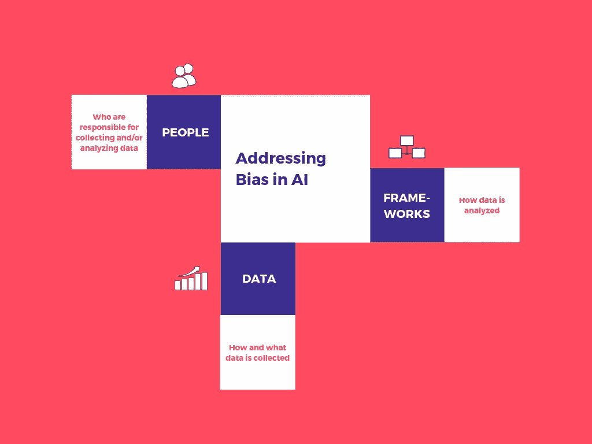
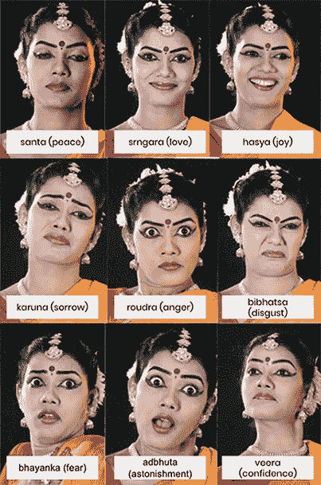
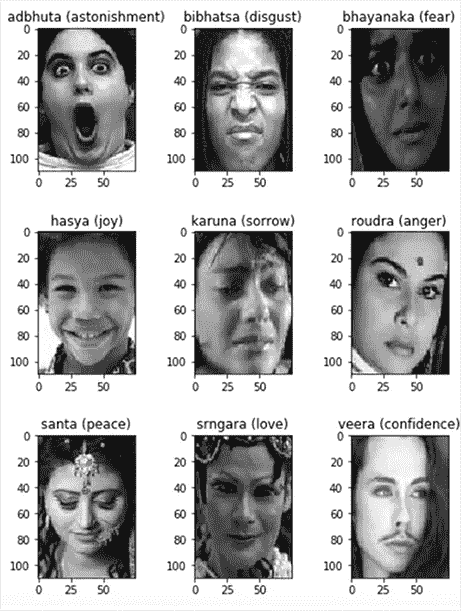
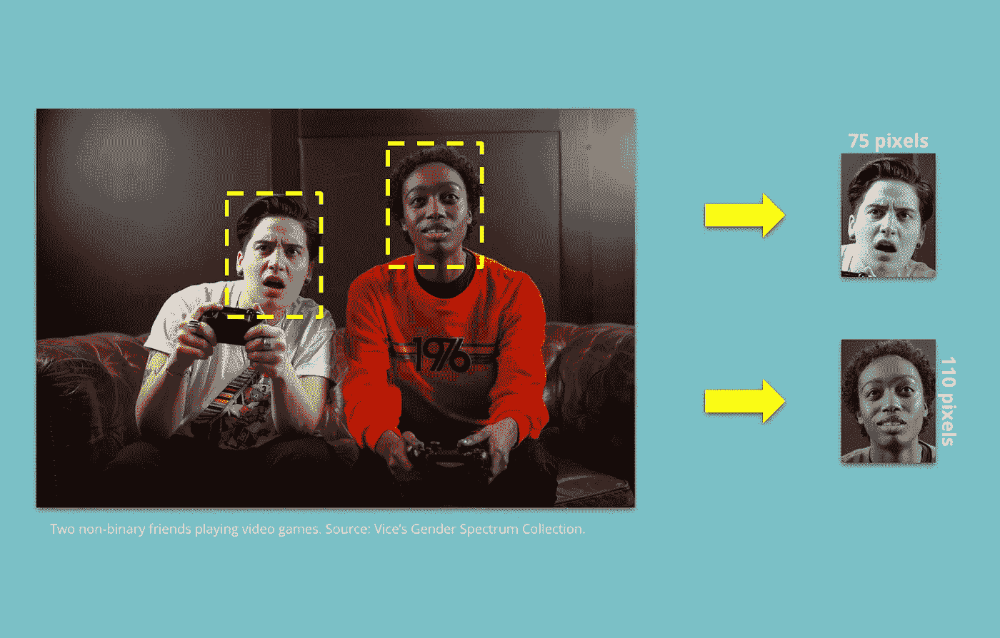
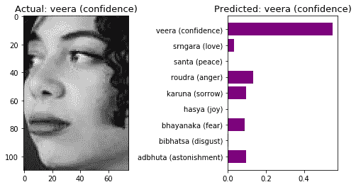
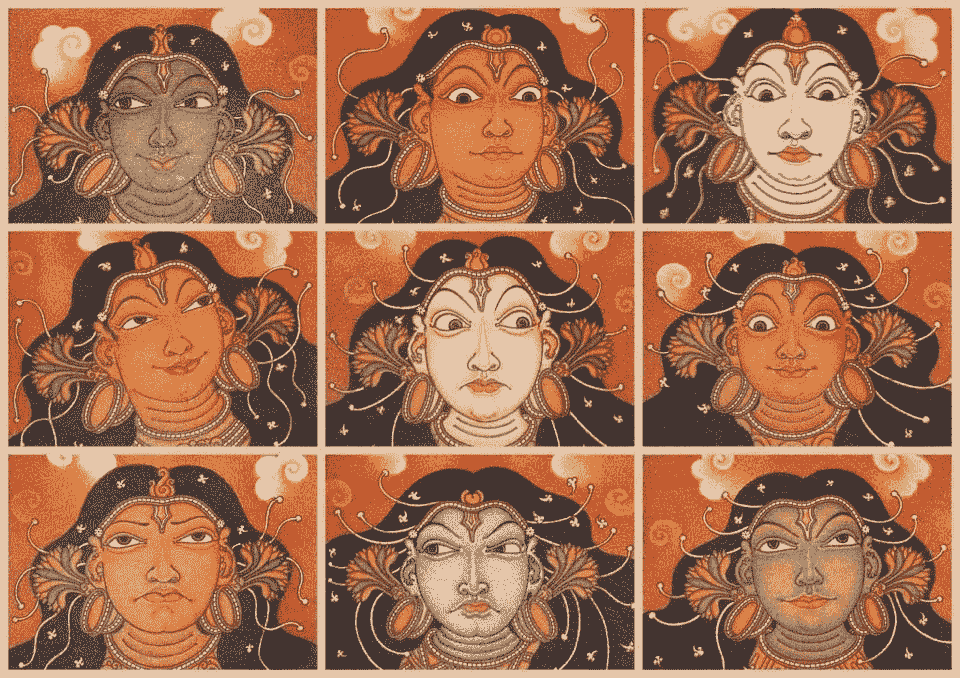

# 面部表情识别中的偏见

> 原文：<https://towardsdatascience.com/knowyourai-developing-a-framework-to-address-bias-in-facial-expression-recognition-b3b8040b0a68?source=collection_archive---------22----------------------->


Image: A dancer depicting the navarasa (nine emotions), source: [shakti-e.monsite.com](http://shakti.e-monsite.com/en/pages/useful-links/face-expressions.html).

## 我如何使用南亚艺术美学来建立一个卷积神经网络。

我从小到大最喜欢的电视节目之一是探索频道的 docu 系列节目“它是如何制作的”这是一场揭示日常用品——从铝箔到实验室玻璃器皿——是如何制作的展览。当你观看自动化机器时，解说员平静的声音解释了这个过程，有时在工厂工人的帮助下，毫不费力地快速建造物体。考虑你周围的物理对象；你可能会有根据地猜测它们是如何制成的或者是由什么制成的。但是，如果我让你告诉我，当你看着手机解锁时，你让 Siri 或 Alexa 为你做一些事情，或者在你打字之前，单词和整个句子是如何自动完成的，会发生什么呢？换句话说，你知道你的人工智能(AI)是怎么做出来的吗？


A machine testing highlighters after they’ve been made. Source: [huffpost.com](https://www.huffpost.com/entry/how-its-made-gifs_n_4596781?guccounter=1&guce_referrer=aHR0cHM6Ly93d3cuZ29vZ2xlLmNvbS8&guce_referrer_sig=AQAAAKSpQ-vEtgZ0Arf2HvGY5Ubd0KgftlA58UrQFelpGHxzYySkBbodqAz8wJCLPvpI5q0nbTg9DbuJo6XBm6IrVzCp7NLZRDra8CRmIsgy8XAOYnspHD5zxTL_LntNqqAU-8tEe_534Xl2x77IP_6Tz6Ex2W4qPugDIe6B6oWCVetB)

AI 无缝地融入了我们的生活，并为我们做出了无数甚至我们可能都没有意识到的决定。但是人工智能的存在不仅仅是帮助我们完成日常任务。人工智能为我们做出的决定有可能会有偏差。使用“[犯罪风险评估算法](https://www.technologyreview.com/s/612775/algorithms-criminal-justice-ai/)的警察部门正瞄准低收入和少数族裔人口，因为他们更有可能犯罪，无人驾驶的汽车[无法检测深色皮肤的行人](https://www.vox.com/future-perfect/2019/3/5/18251924/self-driving-car-racial-bias-study-autonomous-vehicle-dark-skin)，许多大型科技公司很难识别女性和有色人种的面孔——这样的例子不胜枚举。现在比以往任何时候都更重要的是#了解你的未来。

在我对事物如何运作的好奇心的驱使下，我决定建立自己的人工智能系统，它不会使对代表性不足的社区的偏见永久化。我开发了一个面部识别系统，该系统基于一个解决人工智能偏见的框架，从人们的脸上检测情绪。在这篇文章中，我将向你介绍我开发这个项目的主要步骤，但是如果你想更深入地了解我的代码和分析，请查看我的 [GitHub 库](https://github.com/jasminevasandani/know-your-ai)。


I developed a facial recognition system that detects emotions from people’s faces.

# 步骤 1:理解人工智能中的偏见是如何存在的

当 AI 有偏见时，**正在收集的数据**不是包容性的，或者是有选择地选择来促进某种(有偏见的)叙事。此外， [**为人工智能系统做决策的人**](https://www.theguardian.com/technology/2019/apr/16/artificial-intelligence-lack-diversity-new-york-university-study)会影响项目的结果。最后，**用来分析数据的框架**当它们实际上是基于特定的社会信仰时，就被理解为科学真理。



Addressing bias in AI by understanding the data (how and what data is collected), the people (who are responsible for collecting and/or analyzing that data), and the frameworks (how the data is analyzed). Credit: Jasmine Vasandani.

以下是我如何确保我没有在我的项目中延续偏见:

1.  **数据**:我的数据集包括有色人种、性别不合群的人、年轻人和老年人，以及带面部饰品的人的图像。
2.  **人物**:我是一个色彩数据科学家的酷儿女，深受 AI 偏见的影响并深感忧虑。
3.  **框架**:为了对情绪进行分类，我脱离了“快乐”、“悲伤”、“愤怒”等一般分类，转而引用了 *navarasa* (或九种情绪)所定义的情绪。

# 第二步:使用“纳瓦拉沙”对情绪进行分类



The navarasa. Image credit: Leesa Mohanty.

为了从图像中检测面部表情，我建立了一个卷积神经网络(CNN，或 convnet)，它由一系列层组成，这些层处理一幅图像，并告诉你它在图像中“看到”了什么情绪。由我来告诉 convnet 检测哪种类型的情绪。对我来说，重要的是不要用一个通用的框架来理解情绪，因为每种文化都有自己对情绪分类的方式。例如，这里的一个眼色(无论“这里”对你来说是什么意思)可能与其他地方的一个眼色不是一回事。相反，我实现了 *navarasa* 作为一个框架来对情绪进行分类。*纳瓦拉萨*在梵文文本 *Natya Shastra* (公元前 200-200 年或公元前 500-500 年)中被定义，由南亚艺术家和哲学家 Bharata Muni 所写。Natya Shastra 被认为是今天南亚古典艺术的基础文本。这段文字创造了梵语术语 *rasa* ，字面上可以翻译为“汁液”或“果汁”，但也可以表示“精华”、“味道”、“风味”或“情感”。在文本中，巴拉塔陈述道*纳瓦拉萨*是“所有人类情感的基础” [](https://www.telegraphindia.com/opinion/powerful-feelings/cid/1448393) 组成*纳瓦拉萨*的九种情绪是:

*   adbhuta (惊愕)
*   *bibhatsa* (厌恶)
*   *bhayanaka* (恐惧)
*   *哈斯亚*(欢乐)
*   *卡鲁纳*(悲伤)
*   *鲁德拉*(愤怒)
*   *圣诞老人*(和平)
*   *srngara* (爱情)
*   *veera* (信心)

*navarasa* 可以有不同的翻译，但我还是坚持上面的翻译。对我来说，使用 navarasa 作为情绪分类的框架只是第一步。在这个项目未来的迭代中，我希望实现其他文化情感框架，以更好地通过人工智能来表现人类表达的复杂性。既然我已经确定了我的框架，是时候构建一个图像数据集了，我将用它来输入到 convnet 中。

*Classical South Asian dancers depicting the navarasa.*

# 步骤 3:构建包容性影像数据集

我用来构建面部表情检测器的 convnet 的一切都是可定制的。例如，我可以使用 convnet 构建一个系统来告诉我房间图像中显示的是什么家具，根据面部图像判断一个人的年龄，图像中显示的是什么颜色，等等。对于我的 convnet，我已经定制了输出，即*纳瓦拉萨*。但是现在我需要告诉模型在什么样的图像中检测导航系统。为了建立我的图像数据集，我手工挑选了 1035 张图像，其中大部分人脸代表了有色人种、性别不合群的人、年轻人和老年人，或者戴着面部饰品的人。

我使用的图片来自以下来源:

*   [副的性别谱收藏](https://broadlygenderphotos.vice.com/)
*   [Flickr](https://www.flickr.com/)
*   [Pexels](https://www.pexels.com/)
*   [去飞溅](https://unsplash.com/)
*   [科技股照片中的有色人种女性](https://www.flickr.com/photos/wocintechchat/)
*   [印度电影人脸数据库](http://cvit.iiit.ac.in/projects/IMFDB/)
*   [田，杨(2000)](http://www.consortium.ri.cmu.edu/ckagree/)
*   [巴西菲人脸数据库](https://fei.edu.br/~cet/facedatabase.html)

建立一个大型数据集，同时确保图像不仅具有包容性，而且能够代表*纳瓦拉萨*的九种情绪，这是一项艰巨的任务。我为每种情绪收集了几乎等量的图像，但如果有更少的情绪来组织图像，我可以建立一个更大的数据集。我的数据集的质量可以改进，我希望继续建立一个表达各种情绪的包容性面部图像数据库。下面是根据*导航系统*分类后的图片预览。



My images dataset categorized into the navarasa. Image source for [srngara face](https://www.flickr.com/photos/tjook/4746803656/in/photolist-9XdG49-vcFh7S-62Lxcp-pZWg1t-ain93R-4pF4Tj-qVmc3t-nAdLsE-6AvFTU-eEBsvZ-oeP8XZ-8VQ7Mk-nSHdPx-Ji7CH-nQkN6k-8esBmm-bnJ5Xz-N3Wfum-WKbD95-q1eDgh-e7wfGD-iGsRxx-aHcyre-rBfkRk-az6phv-avEQh5-aipWsh-dNyWsX-XtizkB-jbhRuk-9rgG3b-nZ9ti4-YoYm6E-31Dnp-p4jisb-qouL-9JdMW-4pSazz-8NpcSZ-pHLuGS-8moqdb-dQGBn4-4BZ2ib-p4jivC-21X7AXj-9goFCZ-95nxEX-bo1c8t-bCumKj-q1eRpW).

# 步骤 4:准备图片来训练我的模型

我现在有了我的 convnet 的输入(图像数据集)和输出( *navarasa* )。现在，我需要准备构建并激活我的 convnet，以便它可以开始从图像中预测面部表情。该过程的下一步是确保所有的图像都是相同的尺寸和相同的配色方案。所以我检查了我的整个图像数据集，将每张图像设置为相同的矩形尺寸，并将其全部灰度化。使用 python，我从图像中检测人脸，将它们裁剪成特定的大小，并将其转换成灰度。我可以选择一个不同的维度来设置所有图像，并将它们保存为彩色图像，但是这些参数特别适合我的数据集。



Image processing: detect face, crop, and convert to grayscale.

除了上述规范之外，我的所有图像都需要采用数值形式，以便由我的 convnet 处理。所以我把这些图像转换成一个由像素值组成的矩阵。在下图中，最左边的图显示了一个像素化的图像，中间显示了对应于像素颜色的值，左边显示了如果仅用像素值来描绘图像的效果。


Far left: pixelated, middle: pixelated with values, far right: pixel values. Image source: [http://ai.stanford.edu/~syyeung/cvweb/tutorial1.html](http://ai.stanford.edu/~syyeung/cvweb/tutorial1.html).

将图像转换成像素值的矩阵相对容易，下面是如何用 python 实现的基础知识。

```
**import** **numpy** **as** **np
from** **PIL** **import** Image#Create a variable to store the path to your image directory
image_dir = #image_directory_path#Open the image
img = Image.open(image_dir)#Convert the image to a numpy array
np.array(img)
```

# 步骤 5:实现卷积神经网络(convnet)

简单来说，convnet 通过一系列层来处理图像的像素值，其中每一层都定位图像中的视觉趋势。例如，如果某人微笑的图像通过 convnet 的层，则 convnet 会将上翘的嘴、[微笑的](https://www.wikihow.com/Smize)眼睛和抬高的脸颊识别为属于笑脸的独特特征。因此，当另一个人微笑的图像通过 convnet 时，它会告诉你图像中的人在微笑。下面是一个 convnet 层的可视化。一幅图像(最左边的输入)通过一个 convnet 的各层，输出是九个*纳瓦拉萨*之一。如果你想更深入地了解 convnets，请查看这个视频教程。


An example of what the layers of a convnet look like. In this example, if the input image were to be passed through the model, its output would be “santa” (peace).

Convnets 最适合大型数据集，但我的数据集相对较小，只有 1000 多张图片。幸运的是，有一个叫做`[ImageDataGenerator](https://keras.io/preprocessing/image/)`的工具可以解决我的小数据集问题。通过实现`ImageDataGenerator`，我的数据集中的每张图片都得到了细微的调整，比如翻转、放大、倾斜等等。这个过程欺骗了 convnet，让它认为我正在处理一个更大的独特图像数据集。如果你想知道我构建的 convnets 的精度和损耗值，请查看我的 [GitHub 库](https://github.com/jasminevasandani/know-your-ai)。


An example of how an image gets altered to trick the convnet into thinking there are new images being introduced to it. [Image source](https://www.flickr.com/photos/istolethetv/14547691835/in/photolist-oawHX2-MoQjvg-6JGaA5-HYdVtW-q1eLJd-eAgHvG-p4ndog-q16Pjx-ZnewPd-pHFi3Z-eAeqyP-9UZu2w-7kq24n-aiTZTf-gqi1T-pHHmuy-kYe27-2LURLm-8VTg3Y-6p68bA-qovm-Kz3Xy-pHHreU-dYZZGa-AKSRe-8dVuHW-duDNw2-aiTZph-d6ekGm-WNRTKn-p4jiCS-7mTWPN-pHLAZw-eAigCL-q168Uv-a7DxQd-i2dZo4-nVizxY-6JBVbB-gp1Gm-HYdHD3-p4njnR-nQG9z5-asfFGj-62LwUH-hsFKq-4rTTJh-cKzJK5-pY1cDY-d6efmY).

# 第六步:从图像中预测“纳瓦拉沙”

最后，我现在可以根据 convnet 认为图像表达的情绪来生成预测。convnet 只会预测它认为哪个*纳瓦拉萨*在图像中被表达，它还会告诉你它在图像中检测到了其他*纳瓦拉萨*中的哪个。



**PREDICTION #1.**

在“预测 1”可视化中，有一个正在表达 *veera* (信心)的人的图像。convnet 做出了准确的预测，并有 55%的把握在图像中检测到了 *veera* 。convnet 还在图像中看到了 roudra(愤怒)、karuna(悲伤)和其他情绪的痕迹。由于 *veera* 收到的概率最高，因此 convnet 选择这种情绪作为最终预测。


**PREDICTION #2**. [Image Source](https://www.flickr.com/photos/elsie/194190566/in/photolist-iah6d-Ef1spU-4WGJUf-8fMdRs-ibsSwE-Q8B4nc-tcfam-86DEUW-9WgVjD-8fMfpL-2bk9r3T-SaFyS9-2cjBMSL-4d6ZZY-au9oGf-8VQcD4-AeeVZ-f1twt6-3ZNYnZ-3DESNa-cxm8Jj-bnJ7iV-jswjT-8bee5i-Za363N-8muQCn-8NpcVz-9HH3cE-eAgFtY-cK8Ukf-fw6jh2-eAgNEQ-5fRiqV-8VQ8bg-8Nsikm-HZXa6L-6xQbxB-oVLY2z-9DgEpY-eAgKFA-9DdKkx-8cie2v-24uiHV-8bYaeJ-N27C7-5mtZsF-2a76gzY-8esBcb-riaFPr-2U22rj).

在“预测 2”可视化中，有一个人正在表达 adbhuta(惊讶)的图像，但 convnet 的最强预测只有 15%，而且是针对 bhayanaka(恐惧)的不正确情绪。不准确的预测可能是由许多原因造成的，其中一些原因是该图像可能在其特定的 rasa(情感)上与其他图像不相似，照片的质量差，等等。


**PREDICTION #3.**

在“预测 3”可视化中，有一个人正在表达 *hasya* (喜悦)的图像。convnet 几乎 100%确定这是某人表达喜悦的图像。

# 结论和后续步骤



Artistic depiction of the navarasa. [Source](https://in.pinterest.com/pin/294000681896061451/visual-search/?x=16&y=11&w=530&h=374).

完全使用开源资源并在有限的时间框架内工作，我能够建立一个人工智能系统，它不会使对服务不足的社区的偏见永久化。首先，我确定了人工智能中的偏见是如何延续的:通过收集什么数据，谁解释数据，以及如何分析数据。在我的项目中，我使用这个框架来直接解决和减轻偏见。对我来说，确定我的下一步很容易，那就是建立一个包容性的图像数据集，并开发一个基于文化特定情感的预测人工智能。如果有更多的时间和资源，我会扩大我的数据集，以包括更多关于*纳瓦拉沙*的图像和艺术描述，与合作者一起工作，并测试更多的人工智能方法。总的来说，我对这个项目的结果很满意，因为它帮助我开发了一个基于项目的框架来解决人工智能中的偏见。

作为这篇文章的读者，无论你是否是人工智能专家，我希望我已经激发了你对#KnowYourAI 的好奇心。

**要查看这个项目中使用的代码，请查看我的** [**GitHub 资源库**](https://github.com/jasminevasandani/know-your-ai) **。**

A classical dancer depicting the navarasa.

*感谢在我完成这个项目时支持和指导我的以下人员:Anuva Kalawar、ADI wid(Boom)Devahastin Na Ayudhya、Matthew Brems、Riley Dallas、Tim Book。再次特别感谢 Anuva Kalawar，没有他，这个项目就不会存在。*

*Jasmine Vasandani 是一名数据科学家。你可以在这里了解她的更多:*[*www.jasminev.co/*](http://www.jasminev.co/)