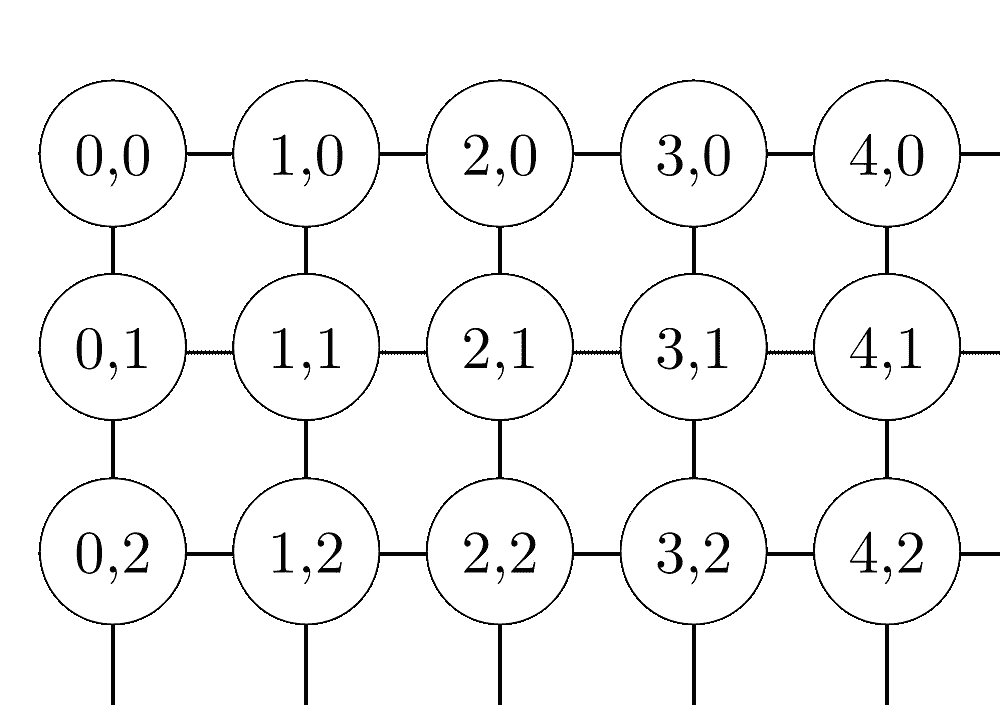

# Kohonen 自组织地图

> 原文：<https://towardsdatascience.com/kohonen-self-organizing-maps-a29040d688da?source=collection_archive---------2----------------------->

## 一种特殊类型的人工神经网络

EMNIST Dataset clustered by class and arranged by topology

# 背景

自组织地图是由芬兰教授和研究员 Teuvo Kohonen 博士于 1982 年提出的，它是一种无监督的学习模型，旨在应用于*维护*输入和输出空间之间的拓扑很重要的情况。该算法的显著特点是高维空间中相近的输入向量也被映射到 2D 空间中的邻近节点。它本质上是一种降维方法，因为它将高维输入映射到低维(通常是二维)离散表示，并保留其输入空间的底层结构。

一个有价值的细节是，整个学习是在没有监督的情况下进行的，即节点是*自组织的*。它们也被称为*特征图*，因为它们本质上是重新训练输入数据的特征，并且简单地根据彼此之间的*相似性*将它们自己分组。这对于将复杂或大量的高维数据可视化，并将它们之间的关系表示到低维(通常是二维)域中，以查看给定的未标记数据是否具有任何结构，具有实用价值。

# 结构

Kohonen Architecture

自组织映射(SOM)在结构和算法特性上都不同于典型的人工神经网络。首先，它的结构由单层线性 2D 神经元网格组成，而不是一系列层。该网格上的所有节点都直接连接到输入向量*，但彼此不连接*，这意味着节点不知道其邻居的值，并且仅更新其连接的权重作为给定输入的函数。网格*本身就是地图*，它在每次迭代中根据输入数据的输入来组织自己。这样，在聚类之后，每个节点具有其自己的 *(i，j)* 坐标，这允许人们通过勾股定理来计算 2 个节点之间的欧几里德距离。

Kohonen network’s nodes can be in a rectangular (left) or hexagonal (right) topology.

# 属性

此外，自组织映射使用与纠错学习相反的竞争学习来调整其权重。这意味着*在每次迭代中只有一个节点*被激活，其中输入向量的实例的特征被呈现给神经网络，因为所有节点竞争对输入做出响应的权利。

所选结点(最佳匹配单元(BMU))是根据当前输入值和格网中所有结点之间的相似性选择的。

选择在输入向量和所有节点之间具有最小欧几里德差的节点*以及其在某个半径内的相邻节点*，以稍微调整它们的位置来匹配输入向量。

通过遍历格网上的所有结点，整个格网最终会与完整的输入数据集相匹配，相似的结点会被组合到一个区域，而不相似的结点会被分开。

A Kohonen model with the BMU in yellow, the layers inside the neighbourhood radius in pink and purple, and the nodes outside in blue.

# 变量

*   *t* 是当前迭代
*   *n* 是迭代极限，即网络可以经历的总迭代次数
*   λ是时间常数，用于衰减半径和学习速率
*   *i* 是节点网格的行坐标
*   *j* 是节点网格的列坐标
*   *d* 是节点和 BMU 之间的距离
*   *w* 是权重向量
*   *w_ij(t)* 是网格中节点 *i，j* 与输入向量在迭代 *t* 处的实例之间连接的权重
*   *x* 是输入向量
*   *x(t)* 是输入向量在迭代 *t* 时的实例
*   *α(t)* 为学习率，在区间[0，1]内随时间递减，保证网络收敛。
*   *β_ij(t)* 是邻域函数，单调递减，表示节点 *i，j* 到 BMU 的距离，以及它对步骤 *t* 的学习的影响。
*   *∑(t)*是邻域函数的半径，其确定在更新向量时在 2D 网格中检查多远的邻居节点。随着时间的推移逐渐减少。

# 算法

1.  将每个节点的权重 *w_ij* 初始化为随机值
2.  选择一个随机输入向量 *x_k*
3.  重复第 4 点。和 5。对于图中的所有节点:
4.  计算输入向量 *x(t)* 和与第一节点相关联的权重向量 *w_ij* 之间的欧几里德距离，其中 *t，I，j = 0。*
5.  追踪产生最小距离 *t* 的节点。
6.  找到整体最佳匹配单元(BMU)，即与所有计算出的单元距离最小的节点。
7.  确定 Kohonen 图中 BMU 的拓扑邻域 *βij(t)* 其半径 *σ(t)*
8.  对 BMU 邻域中的所有节点重复:通过添加输入向量 *x(t)* 和神经元的权重 *w(t)* 之间的差的一部分来更新 BMU 邻域中的第一个节点的权重向量 *w_ij* 。
9.  重复整个迭代过程，直到达到选定的迭代极限 *t=n*

步骤 1 是**初始化**阶段，而步骤 2–9 代表**训练**阶段。

# 公式

根据以下公式对变量进行更新和更改:

邻域内的权重被更新为:

第一个等式告诉我们，节点 *i，j* 的新的更新权重 *w_ij (t + 1)* 等于旧的权重 *w_ij(t)* 和旧的权重与输入向量 *x(t)* 之差的一部分的总和。换句话说，权重向量向输入向量“移动”得更近。要注意的另一个重要因素是，更新的权重将与邻域半径中的节点和 BMU 之间的 2D 距离成比例。

此外，相同的等式 3.1 没有考虑到学习与节点距 BMU 的距离成比例的影响。更新的权重应该考虑这样的因素，即学习的效果在邻域的末端接近于零，因为学习的量应该随着距离而减少。因此，第二个方程增加了额外的邻域函数因子 *βij(t)* ，是更精确的深度方程。

半径和学习率都类似地随时间呈指数衰减。

邻域函数的影响 *β_i(t)* 计算如下:

每个节点的权重向量和当前输入实例之间的欧几里德距离是通过勾股公式计算的。

从所有节点的计算距离中选择 BMU 作为最小距离。

# 进一步阅读

*   更深入地阅读算法的各个方面:[https://eklavyafcb.github.io/som.html](https://eklavyafcb.github.io/som.html)
*   在[https://github.com/EklavyaFCB/EMNIST-Kohonen-SOM](https://github.com/EklavyaFCB/EMNIST-Kohonen-SOM)可以找到该算法的一个很好的实现