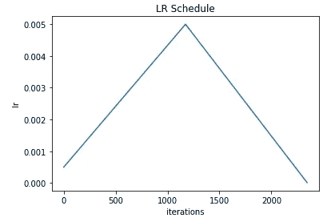

# kt rain:Keras 的一个轻量级包装器，用于帮助训练神经网络

> 原文：<https://towardsdatascience.com/ktrain-a-lightweight-wrapper-for-keras-to-help-train-neural-networks-82851ba889c?source=collection_archive---------9----------------------->

[*ktrain*](https://github.com/amaiya/ktrain) 是一个在深度学习软件框架 [Keras](https://keras.io/) 中帮助构建、训练、调试和部署神经网络的库。(从`v0.7`开始，ktrain 在 TensorFlow 中使用`tf.keras`而不是独立的 Keras。)受 *fastai* 库的启发， *ktrain* 只需几行代码，就能让您轻松:

*   在给定数据的情况下，使用学习率查找器估计模型的最佳学习率
*   采用学习率计划，如[三角学习率政策](https://arxiv.org/abs/1506.01186)、[1 周期政策](https://sgugger.github.io/the-1cycle-policy.html)和 [SGDR](https://arxiv.org/abs/1608.03983) 来更有效地训练您的模型
*   为文本分类(例如，NBSVM、fastText、带有预训练单词嵌入的 GRU)和图像分类(例如，ResNet、Wide Residual Networks、Inception)采用快速且易于使用的预设模型
*   加载和预处理各种格式的文本和图像数据
*   检查错误分类的数据点，以帮助改进模型
*   利用简单的预测 API 保存和部署模型和数据预处理步骤，对新的原始数据进行预测

*ktrain* 是开源的，可以在 GitHub [这里](https://github.com/amaiya/ktrain)获得。它需要 Python 3，可以用 pip 安装如下:`pip3 install ktrain`

我们将通过例子展示几个关于 *ktrain* 的用例。

# 将模型和数据包装在学习者对象中

ktrain 设计用于与 Keras 无缝协作。在这里，我们加载数据并定义模型，就像您在 Keras 中通常所做的那样。以下代码直接复制自 [Keras fastText 文本分类示例](https://github.com/keras-team/keras/blob/master/examples/imdb_fasttext.py)。它加载 IMDb 电影评论数据集，并定义一个简单的文本分类模型来推断电影评论的情感。

```
*# load  and prepare data as you normally would in Keras*
**from** **tensorflow**.**keras.preprocessing** **import** sequence
**from** **tensorflow.keras.datasets** **import** imdb
NUM_WORDS = 20000
MAXLEN = 400
**def** load_data():
    (x_train, y_train), (x_test, y_test) = imdb.load_data(num_words=NUM_WORDS)
    x_train = sequence.pad_sequences(x_train, maxlen=MAXLEN)
    x_test = sequence.pad_sequences(x_test, maxlen=MAXLEN)
    **return** (x_train, y_train), (x_test, y_test)
(x_train, y_train), (x_test, y_test) = load_data()*# build a fastText-like model as you normally would in Keras*
**from** **tensorflow.keras.models** **import** Sequential
**from** **tensorflow.keras.layers** **import** Dense, Embedding, GlobalAveragePooling1D
**def** get_model():
    model = Sequential()
    model.add(Embedding(NUM_WORDS, 50, input_length=MAXLEN))
    model.add(GlobalAveragePooling1D())
    model.add(Dense(1, activation='sigmoid'))
    model.compile(loss='binary_crossentropy', optimizer='adam', metrics=['accuracy'])
    **return** model
model = get_model()
```

要使用 *ktrain* ，我们只需使用`get_learner`函数将模型和数据包装在一个`ktrain.Learner`对象中:

```
import **ktrain**
learner = **ktrain.get_learner**(model, 
                             train_data=(x_train, y_train),
                             val_data = (x_test, y_test))
```

默认的批处理大小是 32，但是可以通过向`get_learner`提供一个`batch_size`参数来改变。学习者对象有助于以各种方式训练您的神经网络。例如，调用学习者对象的`fit`方法允许你以不同的学习速度进行交互式训练:

```
# train for three epochs at 0.005
**learner.fit**(5e-3, 3)# train for additional three epochs at 0.0005
**learner.fit**(5e-4, 3)
```

由学习者对象包装的底层 Keras 模型总是可直接访问的，如下:`learner.model`

接下来，我们展示了学习者对象也可以用于找到一个好的初始学习率，并且容易地使用各种不同的学习率计划，这些计划在训练期间自动改变学习率。

# 调整学习率

学习率是在神经网络中设置的最重要的超参数之一。各种优化器(如 Adam 和 SGD)的默认学习速率可能并不总是适合给定的问题。神经网络中的训练包括最小化损失函数。如果学习率太低，训练将会很慢或者停滞不前。如果学习率太高，损失将无法最小化。这两种情况都会对模型的性能产生负面影响。要为您的模型找到一个最佳的学习率，可以通过以低学习率开始并逐渐增加学习率来模拟训练。 [Leslie Smith 展示了](https://arxiv.org/abs/1506.01186)当绘制学习率与损失的关系图时，与持续下降的损失相关的最大学习率是一个很好的培训选择。他将此称为 LR 范围测试(也称为 LR Finder)。遵循与 *fastai* 库类似的语法，这可以在 *ktrain* 中完成，如下所示:

```
**learner.lr_find()
learner.lr_plot()**
```

上面的代码将为上面加载的模型和数据显示以下图形:


We must select the maximal learning rate where the loss is still falling prior to divergence.

根据该图，0.005 的学习率似乎是一个合理的选择，因为损失在更高的学习率下开始发散。

# 学习费率表

许多研究表明，在训练过程中以各种方式改变学习率可以提高神经模型的性能，使损失最小化，并提高验证的准确性。例如，除了最初的[1 周期论文](https://arxiv.org/pdf/1803.09820.pdf)之外，Sylvain Gugger 的[本实验](https://sgugger.github.io/the-1cycle-policy.html)中还演示了具有循环动量的[1 周期学习率计划](https://arxiv.org/pdf/1803.09820.pdf)的好处。 *ktrain* 允许您轻松采用几种不同的学习率策略。这里，我们展示一些例子:

在 *ktrain* 中训练模特的不同方法:

```
# employs a static learning rate of 0.005 for 3 epochs
**learner.fit**(0.005, 3)# employs an SGDR schedule with a cycle length of one epoch.
# learning rate is varied between 0.005 and near-zero value.
**learner.fit**(0.005, 3, cycle_len=1)# employs an SGDR schedule with a cycle length
# that increases by a factor of 2 each cycle
**learner.fit**(0.005, 3, cycle_len=1, cycle_mult=2)# employs the 1cycle learning rate policy
**learner.fit_onecycle**(0.005, 3)# employs a triangular learning rate policy with automatic stopping
**learner.autofit**(0.005)# employs a triangular learning rate policy with both maximum
# and base learning rates reduced when validation loss stalls
**learner.autofit**(0.005, 20, reduce_on_plateau=3)
```

我们将在下面详细介绍每一种方法，并从 SGDR 学习率政策开始。

## SGDR 学习率政策

[带重启的随机梯度下降(或 SGDR)](https://arxiv.org/abs/1608.03983) 在用前述学习率探测器识别的初始学习率和接近零的学习率之间循环学习率。使用余弦退火来衰减学习速率。`fit`方法允许你以类似于 *fastai* 库的语法轻松使用 SGDR 学习率策略。当提供 **cycle_len** 参数时，余弦退火用于衰减周期持续时间内的学习速率。这里，我们显示了两个周期，每个周期具有一个时期的长度:


**SGDR:** learner.fit(0.005, 2, cycle_len=1)

**cycle_mult** 参数以指定的因子增加循环的长度。这里，周期长度随着每个周期而加倍( **cycle_mult=2** ):


**SGDR**: learner.fit(0.005, 3, cycle_len=1, cycle_mult=2)

## 1 周期和三角学习率政策

除了`fit`，还有`autofit`方法(采用[三角学习率策略](https://arxiv.org/abs/1506.01186))和`fit_onecycle`方法(采用[1 周期策略](https://arxiv.org/pdf/1803.09820.pdf))。两者都是由 NRL 海军研究实验室的 Leslie Smith 提出的。`fit_onecycle`方法在前半段训练中将学习速率从基本速率提高到最大速率，在后半段训练中将学习速率衰减到接近零值。最大学习率是使用上述学习率查找器设置的。



**1cycle policy**: learner.fit_onecycle(0.005, 3)

此外，如果将 Adam、Nadam 或 Adamax 优化器与`fit_onecycle`一起使用，[动量](https://www.quora.com/What-is-the-difference-between-momentum-and-learning-rate)在 0.95 和 0.85 之间循环，使得动量在低学习率时高，动量在高学习率时低。以这种方式改变动量在本文中被提出，并被证明可以加速收敛。


cyclical momentum in the **1cycle policy**

`autofit`方法简单地在每个时期执行一个周期策略(可以认为是[三角策略](https://arxiv.org/abs/1506.01186)的变体):


**Triangular Policy**: learner.autofit(0.005, 2)

像这样每个时期执行一个周期，更适合与明显有效的内置 Keras 训练回调一起使用。这样的 Keras 回调可以很容易地通过`autofit`的方法参数来启用，例如**early _ stopping**(early stopping 回调)、**reduce _ on _ plateau**(ReduceLROnPlataeu)和**check point _ folder**(model check point)。例如，当 **reduce_on_plateau** 启用时，如果验证损失没有改善，峰值和基本学习率都会定期降低(或退火),这有助于提高性能:


**Triangular Policy with ReduceLROnPlateau:** learner.autofit(0.005, 8, reduce_on_plateau=2)

如果未向`autofit`提供时期数，则自动启用提前停止回调，训练将继续，直到验证损失不再增加。也有更多的理由让`autofit`进一步微调训练过程。在 Jupyter 笔记本中键入`help(learner.autofit)`了解更多详情。最后，虽然这里没有显示，但是`autofit`方法(像 1 周期策略)在 0.95 和 0.85 之间循环动量。

在前面的章节中，我们手动定义了一个模型，并在 *ktrain* 之外加载了数据。 *ktrain* 公开了许多方便的函数，可以轻松地从各种来源加载数据，并毫不费力地使用一些非常强大的基线模型。我们将展示一个图像分类和文本分类的例子——每一个都只需要几行代码。

# 图像分类:给狗和猫分类

图像分类和深度学习介绍中使用的一个标准数据集是[狗对猫数据集](https://www.kaggle.com/c/dogs-vs-cats)。我们将在 *ktrain* 中使用该数据集作为图像分类的示例。在下面的代码块中，`images_from_folder`函数用于加载训练和验证图像作为 Keras [目录迭代器](https://keras.io/preprocessing/image/#flow_from_directory)对象，并为训练图像增加数据。然后使用`image_classifier`函数在 [ImageNet](https://en.wikipedia.org/wiki/ImageNet) 上建立一个 [ResNet50](https://keras.io/applications/#resnet) 模型。我们在目测了`lr_plot`生成的剧情后，选择 7e-5 作为学习率。由于我们在本例中调用`autofit`时没有指定历元数，当验证损失没有改善时，训练将自动停止。默认情况下，[提前停止](https://keras.io/callbacks/#earlystopping)耐心值为 5，而[减少延迟](https://keras.io/callbacks/#reducelronplateau)耐心值仅为 2。这些可以使用`autofit`的 early_stopping 和 reduce_on_plateau 参数来更改。该代码块的精度通常在 **99.35%** 和 **99.55%** 之间，如[本笔记本](https://github.com/amaiya/ktrain/blob/master/tutorial-03-image-classification.ipynb)所示。

```
# import ktrain modules
import **ktrain**
from **ktrain import vision as vis**# get default data augmentation with 
# horizontal_flipping as only modification
data_aug = **vis.get_data_aug**(horizontal_flip=True)# load the data as Keras DirectoryIterator generators
(trn, val, preproc) = **vis.images_from_folder**(
                         datadir='data/dogscats',
                         data_aug=data_aug,
                         train_test_names=['train', 'valid'], 
                         target_size=(224,224), color_mode='rgb')# build a pre-trained ResNet50 model and freeze first 15 layers
model = **vis.image_classifier**('pretrained_resnet50', 
                             trn, val, freeze_layers=15)# wrap model and data in a Learner object
learner = **ktrain.get_learner**(model=model, 
                             train_data=trn, val_data=val, 
                             workers=8, use_multiprocessing=False,
                             batch_size=64)
**learner.lr_find()** # simulate training to find good learning rate
**learner.lr_plot()** # visually identify best learning rate# train with triangular learning rate policy
# ReduceLROnPlateau and EarlyStopping automatically enabled.
# ModelCheckpoint callback explicitly enabled.
**learner.autofit**(7e-5, checkpoint_folder='/tmp')
```

通过在训练后调用`learner.view_top_losses(preproc, n=3)`，我们可以查看验证集中分类错误最严重的前 **n** 个例子。这可以揭示如何改进您的模型或数据处理管道，以及是否要删除“垃圾”数据的数据集。例如，在狗和猫的数据集中，下图是验证集中分类错误最多的示例之一:


A misclassified example in the validation set

正如你所看到的，这张图片被贴上了“猫”的标签，尽管图片上同时出现了一只狗和一只猫，但狗的特征更加突出。这可能会有问题，因为该数据集将类视为互斥的。类别不**互斥的数据集称为多标签分类问题，将在本文稍后讨论。**

## 对新数据的预测

有了训练好的模型，我们可以将我们的模型和由`images_from_folder`返回的**预预测**对象包装在一个**预测器**对象中，从而轻松地对新的原始图像进行分类:


The Predictor object automatically preprocesses raw data before making predictions.

**preproc** 对象自动预处理并适当转换原始数据，以便准确地做出预测。**预测器**对象可以保存到磁盘，并在以后作为已部署应用程序的一部分重新加载:


有关详细的解释和结果，请参见我们的[图像分类教程笔记本](https://github.com/amaiya/ktrain/blob/master/tutorial-03-imageclassification.ipynb)。

# 文本分类:识别有毒在线评论

Kaggle 上的[有毒评论分类挑战](https://www.kaggle.com/c/jigsaw-toxic-comment-classification-challenge)涉及将维基百科评论分类为一个或多个所谓的*有毒评论的类别*。有毒在线行为的类别包括*有毒*、*重度 _ 有毒*、*淫秽*、*威胁*、*侮辱*、*身份 _ 仇恨*。与前面的例子不同，这是一个**多标签分类问题**，因为类别不是互斥的。例如，一条评论可能属于多个类别的有害在线行为。 *ktrain* 从数据中自动检测多标签分类问题，并适当配置内置模型。

数据集可以从[比赛现场](https://www.kaggle.com/c/jigsaw-toxic-comment-classification-challenge)以 CSV 文件的形式下载(即下载文件 [**train.csv**](https://www.kaggle.com/c/jigsaw-toxic-comment-classification-challenge/data) )。我们将使用`texts_from_csv`方法加载数据，该方法假设 **label_columns** 字段已经在电子表格中进行了一次热编码(Kaggle 的 **train.csv** 文件就是这种情况)。然后，我们将使用`text_classifier`方法加载一个类似 [fastText](https://arxiv.org/abs/1607.01759) 的模型。最后，我们使用`autofit`方法来训练我们的模型。在第二个示例中，我们明确地将历元数指定为 8。使用三角形学习率策略，因此执行 8 个三角形循环。

```
import **ktrain
from ktrain import text as txt**DATA_PATH = 'data/toxic-comments/train.csv'
NUM_WORDS = 50000
MAXLEN = 150
label_columns = ["toxic", "severe_toxic", "obscene", 
                 "threat", "insult", "identity_hate"](x_train, y_train), (x_test, y_test), preproc =    
               **txt.texts_from_csv**(DATA_PATH,
                                 'comment_text',
                                 label_columns=label_columns,
                                 val_filepath=None, 
                                 max_features=NUM_WORDS, 
                                 maxlen=MAXLEN,
                                 ngram_range=1)# define model a fastText-like architecture using ktrain
model = **txt.text_classifier**('fasttext', (x_train, y_train), 
                             preproc=preproc)# wrap model and data in Learner object
learner = **ktrain.get_learner**(model, train_data=(x_train, y_train),
                                   val_data=(x_test, y_test))# find a good learning rate
**learner.lr_find()**
**learner.lr_plot()**# train using triangular learning rate policy
**learner.autofit**(0.0007, 8)
```

上面的代码块在 Titan V GPU 上仅用 6 分钟的训练就实现了大约为 **0.98** 的 ROC-AUC。如我们 GitHub 项目中的[示例笔记本](https://github.com/amaiya/ktrain/blob/master/examples/text/toxic_comments-bigru.ipynb)所示，使用带有预训练单词向量的双向 GRU(在 *ktrain* 中称为“bigru ”)可以获得更好的结果。

和前面的例子一样，我们可以实例化一个**预测器**对象来轻松地对新的原始数据进行预测:


# 更多信息

有关 *ktrain* 的更多信息和细节，请参见 GitHub 上的[教程笔记本:](https://github.com/amaiya/ktrain/)

*   教程笔记本 1: [简介*k train*](https://nbviewer.jupyter.org/github/amaiya/ktrain/blob/master/tutorials/tutorial-01-introduction.ipynb)
*   教程笔记本 2: [调整学习率](https://nbviewer.jupyter.org/github/amaiya/ktrain/blob/master/tutorials/tutorial-02-tuning-learning-rates.ipynb)
*   教程笔记本 3: [图像分类](https://nbviewer.jupyter.org/github/amaiya/ktrain/blob/master/tutorials/tutorial-03-image-classification.ipynb)
*   教程笔记本 4: [文字分类](https://nbviewer.jupyter.org/github/amaiya/ktrain/blob/master/tutorials/tutorial-04-text-classification.ipynb)
*   教程笔记本 5: [从无标签文本数据中学习](https://nbviewer.jupyter.org/github/amaiya/ktrain/blob/master/tutorials/tutorial-05-learning_from_unlabeled_text_data.ipynb)
*   教程笔记本 6: [文本序列标注](https://nbviewer.jupyter.org/github/amaiya/ktrain/blob/master/tutorials/tutorial-06-sequence-tagging.ipynb)
*   教程笔记本 7: [图形神经网络](https://nbviewer.jupyter.org/github/amaiya/ktrain/blob/master/tutorials/tutorial-07-graph-node_classification.ipynb)
*   教程笔记本 A1: [关于其他主题的附加技巧](https://nbviewer.jupyter.org/github/amaiya/ktrain/blob/master/tutorials/tutorial-A1-additional-tricks.ipynb)，例如为模型设置全局权重衰减、调试 Keras 模型、预览数据扩充方案，以及在 *ktrain* 中使用内置回调
*   教程笔记本 A2: [讲解文字和图像分类](https://nbviewer.jupyter.org/github/amaiya/ktrain/blob/master/tutorials/tutorial-A2-explaining-predictions.ipynb)
*   教程笔记本 A3: [文字分类与抱脸变形金刚](https://nbviewer.jupyter.org/github/amaiya/ktrain/blob/develop/tutorials/tutorial-A3-hugging_face_transformers.ipynb)
*   [附加示例](https://github.com/amaiya/ktrain/tree/master/examples)

**2019–08–16:**在 **Google Colab** 上使用 *ktrain* ？请参见 BERT 的演示。