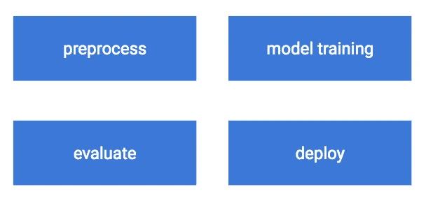
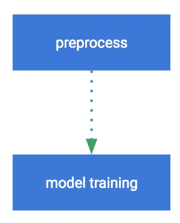
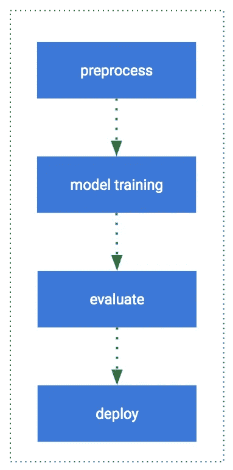
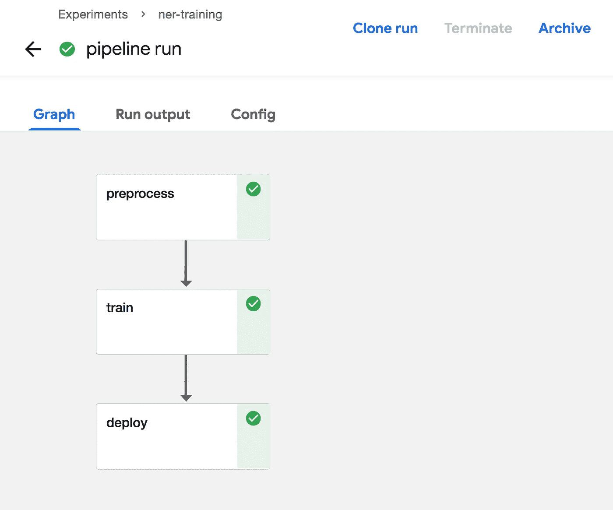
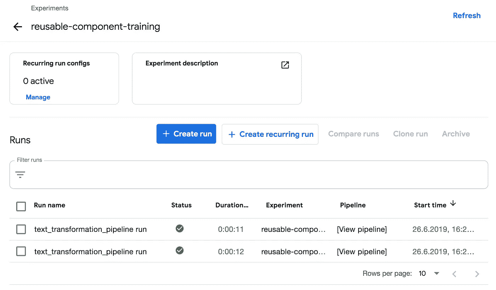
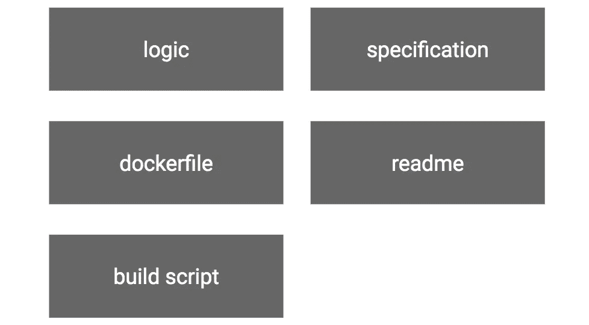
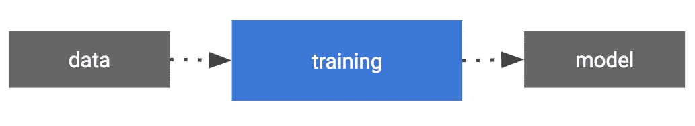
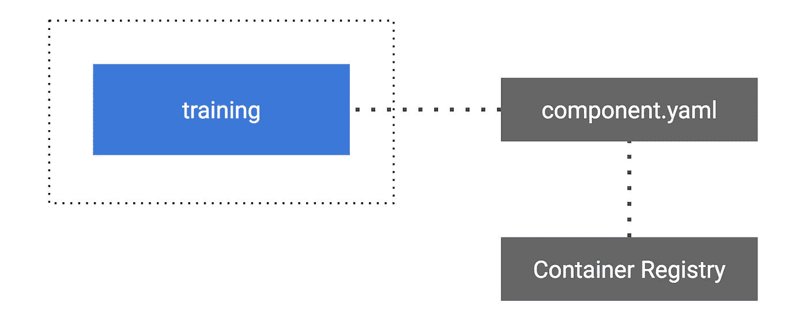
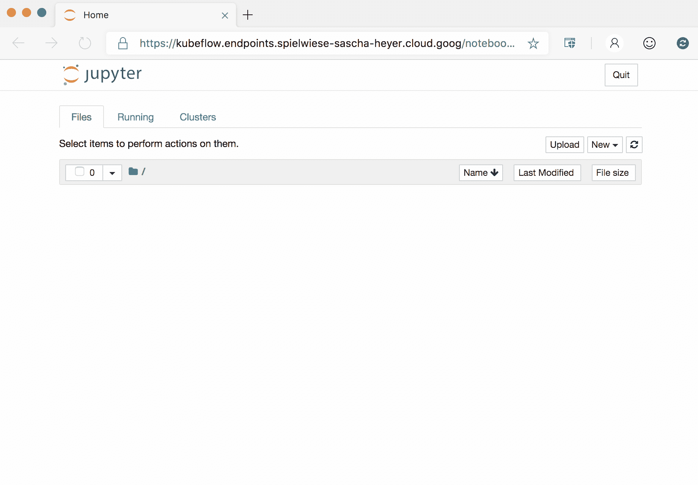

# Kubeflow 组件和管道

> 原文：<https://towardsdatascience.com/kubeflow-components-and-pipelines-33a1aa3cc338?source=collection_archive---------14----------------------->

## Kubeflow 是一个大的生态系统，一堆不同的开源工具 ML tools。

我想让事情变得简单，因此我们涵盖了组件、管道和实验。通过管道和组件，您可以获得构建 ML 工作流所需的基础知识。Kubeflow 中集成了更多的工具，我将在接下来的文章中介绍它们。

Kubeflow 起源于谷歌。

> 使在 Kubernetes 上部署机器学习(ML)工作流变得简单、可移植和可扩展。
> 来源:Kubeflow 网站


Photo by [Ryan Quintal](https://unsplash.com/@ryanquintal?utm_source=unsplash&utm_medium=referral&utm_content=creditCopyText) on [Unsplash](https://unsplash.com/?utm_source=unsplash&utm_medium=referral&utm_content=creditCopyText)

# 目标

*   演示如何**建造**管道。
*   演示如何**创建**组件。
*   演示如何**使用**组件。
*   演示如何在笔记本电脑中运行**管道和实验。**
*   易于理解和使用的**示例**。

# 管道

## 成分

在管道中执行**一步**的代码。换句话说，一个 ML 任务的容器化实现。
组件类似于函数，它有名称、参数、返回值和主体。流水线中的每个组件**独立执行**和必须打包成 docker 映像。



The components.

## 图表

组件之间的表示。它显示了管道正在执行的步骤。



The graph.

## 管道

流水线描述了机器学习的工作流程，它包括组件和图。



The pipeline.

## 奔跑

一次运行是一条**流水线的单次**执行**，**为了比较，所有运行都被**保留。**



A run is a single execution of a Pipeline.

## **重复运行**

**循环**运行可用于重复管道运行，如果我们想要以预定的方式在新数据上训练更新的模型版本，这很有用。

## 实验

类似于**工作空间，它包含**不同的**运行**。跑分可以**比较。**



An overview of all runs in this specific experiment.

# **组件类型**

Kubeflow 包含两种类型的组件，一种用于快速开发，另一种用于重用。

## 轻量级组件

用于笔记本环境中的**快速开发**。快速简单，因为不需要构建容器映像。

## 可重复使用的集装箱组件

可以通过**将**装载到 Kubeflow 管道中来重复使用。这是一个内含 T42 的组件。

要求**多**实施**时间**。

# 可重用成分

在本节中，您将获得可重用组件的基础知识。

## 组件结构

组件本身很简单，只由几个部分组成:

*   组件**逻辑**
*   一个**组件规格**为 yaml。
*   构建容器需要一个 **Dockerfile** 。
*   一个**自述文件**解释组件及其输入和输出。
*   助手**脚本**到**构建**组件，然后**将**组件推送到 Docker 仓库。



Parts of a reusable Kubeflow component.

## 部件规格

本**规范描述了用于 Kubeflow 管道的**容器**组件**数据模型。

*以 YAML 格式编写(component.yaml)。*

*   **元数据**描述组件本身，如名称和描述
*   **接口**定义组件的输入和输出。
*   **实现**指定组件应该如何执行。

## 处理输入

一个组件通常需要某种输入，比如训练数据的路径或者模型的名称。它可以消耗多个输入。

*   **在 component.yaml 中定义输入**
*   **将**输入定义为容器的**参数**。
*   **解析组件逻辑中的** **参数**。



The training component might require training data as input and produces a model as output.

## 处理输出

需要输出来在组件之间传递数据。重要的是要知道流水线**中的每个组件都独立执行**。

*   组件在不同的进程中运行，不能共享数据。
*   传递小数据的过程不同于传递大数据的过程。

**对于小数据**

*   值可以作为输出直接传递。

**对于大数据**

*   **大型数据**必须**序列化**为文件，以便在组件之间传递。
*   **上传**数据到我们的存储系统。
*   并且**将此文件的一个**引用**传递给下一个组件。**
*   管道中的下一个**组件**将获取该引用，并且**下载**序列化数据。

## Dockerize 组件

每个组件都是一个容器映像，需要一个 order 文件来构建映像。

映像构建完成后，我们将组件容器映像推送到 **Google 容器注册表**。

构建组件容器映像并将其上传到 Google [容器注册表](https://console.cloud.google.com/gcr/images/spielwiese-sascha-heyer?project=spielwiese-sascha-heyer)只是几行代码:

```
# build_image.sh
image_name=gcr.io/ml-training/kubeflow/training/train
image_tag=latestfull_image_name=${image_name}:${image_tag}docker build --build-arg -t "${full_image_name}" 
docker push "$full_image_name"
```

在第一次 docker 推送时，您可能会得到以下错误消息:

> 您没有执行此操作所需的权限，并且您可能有无效的凭据。要验证您的请求，请遵循以下步骤:[https://cloud . Google . com/container-registry/docs/advanced-authentic ation](https://cloud.google.com/container-registry/docs/advanced-authentication)

在这种情况下，只需运行以下 gcloud 命令并再次推送:

```
$ gcloud auth configure-docker
```

# 使用管道

## 加载组件

有权访问 Docker 存储库和 component.yaml 的每个人都可以在**管道**中使用**组件**。



Load a component from a component.yaml URL.

然后可以基于 component.yaml 将组件**加载到**。

```
operation = kfp.components.load_component_from_url(
'[https://location-to-your-yaml/component.yaml'](https://storage.googleapis.com/spielwiese-sascha-heyer/test9/component.yaml'))help(operation)
```

## 创建管道

**dsl** 装饰器通过管道 SDK 提供，用于定义管道并与之交互。`dsl.pipeline`为返回管道的 Python 函数定义一个装饰器。

```
[@dsl](http://twitter.com/dsl).pipeline(
  name='The name of the pipeline',
  description='The description of the pipeline'
)
def sample_pipeline(parameter):
    concat = operation(parameter=first)
```

## 编译管道

为了编译管道，我们使用了`compiler.Compile()`函数，它也是管道 SDK 的一部分。编译器生成一个 yaml 定义，Kubernetes 使用它来创建执行资源。

```
pipeline_func = sample_pipeline
pipeline_filename = pipeline_func.__name__ + '.pipeline.zip'compiler.Compiler().compile(sample_pipeline, 
                            pipeline_filename)
```

## 创造一个实验

管道总是实验的一部分，可以用 Kubeflow 管道客户端`kfp.client()`创建。目前无法删除实验。

```
client = kfp.Client()try:
    experiment = client.get_experiment(experiment_name=EXPERIMENT_NAME)
except:
    experiment = client.create_experiment(EXPERIMENT_NAME)

print(experiment)
```

## 运行管道

为了运行管道，我们使用实验 id 和在前面步骤中创建的编译管道。`client.run_pipeline`运行管道，并提供与库巴流实验的直接链接。

```
run_name = pipeline_func.__name__ + ' run'
run_result = client.run_pipeline(experiment.id, 
                                 run_name, 
                                 pipeline_filename)
```

# GitHub 上的例子

我创建了一个基本的管道来演示本文中的所有内容。为了简单起见，管道不包含任何特定于 ML 的实现。

[https://github . com/SaschaHeyer/Machine-Learning-Training/tree/master/kube flow/lightweight-component-Training](https://github.com/SaschaHeyer/Machine-Learning-Training/tree/master/kubeflow/lightweight-component-training)



Usage

*感谢阅读。
更多如 Kubeflow 整流罩、Katib 等话题敬请关注。*

*这篇文章的代码可以在*[*GitHub*](https://github.com/SaschaHeyer/Machine-Learning-Training/tree/master/kubeflow/reusable-component-training)*上找到。*

*您的反馈和问题非常感谢，您可以在 Twitter 上找到我*[*@ HeyerSascha*](https://twitter.com/HeyerSascha)*。*

# 关于作者

[Sascha Heyer](https://twitter.com/HeyerSascha)[Io Annotator 的创始人一个用于文本和图像的 AI 注释平台
，它提供了几种图像和文本注释工具。](https://ioannotator.com)