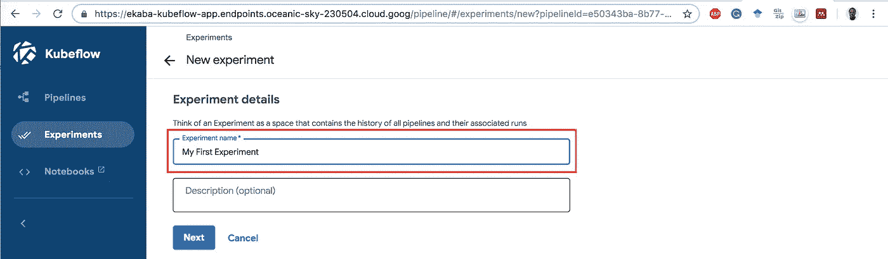

# 诗人的库伯流

> 原文：<https://towardsdatascience.com/kubeflow-for-poets-a05a5d4158ce?source=collection_archive---------5----------------------->

## 机器学习生产流水线的容器化指南


本系列文章提供了一种在 Kubernetes 上使用 Kubeflow 生产机器学习管道的系统方法。构建机器学习模型只是一个更广泛的任务和过程系统的一部分，这些任务和过程共同交付一个机器学习产品。Kubeflow 使得利用容器化的微服务范例来分离在 Kubernetes 上编排的应用程序的模块化组件成为可能。虽然 Kubernetes 是平台不可知的，但本系列将重点关注在 Google 云平台上部署一个机器学习产品，利用 Google Cloud BigQuery、Google Cloud Dataflow 和在 Google Kubernetes 引擎上编排的 Google Cloud 机器学习引擎。

# 内容

内容安排如下:

*   [简介](https://medium.com/p/a05a5d4158ce#1fb7)
*   [微服务架构](https://medium.com/p/a05a5d4158ce#ca52)
*   [码头工人](https://medium.com/p/a05a5d4158ce#a20b)
*   [Kubernetes](https://medium.com/p/a05a5d4158ce#58d3)
*   [Kubeflow](https://medium.com/p/a05a5d4158ce#6474)
*   [Kubeflow 管道](https://medium.com/p/a05a5d4158ce#e593)
*   [在 Kubeflow 管道上部署端到端机器学习解决方案](https://medium.com/p/a05a5d4158ce#a200)

# 源代码和贡献:

完整的源代码可以在 [Github](https://github.com/dvdbisong/kubeflow-for-poets) 上获得。贡献和更正是受欢迎的拉请求。

# 介绍

机器学习通常被正确地视为使用数学算法来教会计算机学习任务，这些任务在计算上不可编程为一组指定的指令。然而，从工程的角度来看，这些算法的使用只占整个学习过程的一小部分。构建高性能和动态的学习模型包括许多其他重要的组成部分。这些组件实际上主导了交付端到端机器学习产品的关注空间。

典型的机器学习生产管道如下图所示。


从上图中，可以观察到管道中的流程流是迭代的。这种重复模式是机器学习实验、设计和部署的核心。

## 效率挑战

很容易认识到，在构建学习模型时，流水线需要大量的开发操作来实现从一个组件到另一个组件的无缝转换。这种零件的互操作性产生了机器学习操作，也称为 MLOps。这个术语是机器学习和 DevOps 的混合体。

进行机器学习的传统方式是在 Jupyter 笔记本电脑上执行所有的实验和开发工作，模型被导出并发送给软件开发团队进行部署和端点生成，以集成到下游软件产品中，而 DevOps 团队处理机器的基础设施和配置以进行模型开发。这种单一的工作方式导致机器学习过程不可重用，难以扩展和维护，更难以审计和执行模型改进，并且容易充满错误和不必要的复杂性。

然而，通过将微服务设计模式整合到机器学习开发中，我们可以解决这些问题，并真正简化生产过程。

## 谷歌云平台上的一句话(GCP)

该教程将重点关注在谷歌云平台的基础设施上开发和部署生产模型。云的优势是易于根据资源需求分发和扩展单个工作流组件。然而，当使用微服务时，容器化管道是机器无关的，可以快速部署在任何其他本地基础设施或公共云服务提供商，如 AWS 或 Azure 上。

谷歌云平台拥有一系列强大的人工智能无服务器服务，我们将整合这些服务来处理生产管道的一些组件。这些服务包括 Google BigQuery，用于暂存我们的转换数据集以进行轻松分析，Google Dataflow 用于大规模数据转换，Google Cloud Machine Learning Engine 用于大规模模型训练和模型部署。


# 微服务架构

微服务架构是一种开发和部署企业云原生软件应用的方法，它涉及将应用的核心业务功能分离成分离的组件。每个业务功能都代表应用程序作为服务提供给最终用户的一些功能。微服务的概念与整体架构形成对比，后者将应用程序构建为其“单独”功能的组合。


微服务使用表述性状态转移(REST)通信进行交互，以实现无状态互操作性。所谓无状态，我们指的是[“服务器不存储关于客户端会话的状态”](https://stackoverflow.com/a/3105337/3353760)。这些协议可以是 HTTP 请求/响应 API 或异步消息队列。这种灵活性允许微服务轻松扩展并响应请求，即使另一个微服务出现故障。

## 微服务的优势

*   松散耦合的组件使应用程序具有容错能力。
*   能够横向扩展，使每个组件高度可用。
*   组件的模块化使得扩展现有功能变得更加容易。

## 微服务的挑战

*   软件架构的复杂性增加了。
*   微服务管理和编排的开销。然而，我们将在接下来的会议中看到 Docker 和 Kubernetes 如何努力缓解这一挑战。

# 码头工人


Docker 是一个虚拟化应用程序，它将应用程序抽象到被称为*容器*的隔离环境中。容器背后的想法是提供一个统一的平台，其中包括用于开发和部署应用程序的软件工具和依赖项。

开发应用程序的传统方式是在单个服务器上设计和托管应用程序。这种设置导致了许多问题，包括著名的“它在我的机器上工作，但在你的机器上不工作”。此外，在这种体系结构中，应用程序难以扩展和迁移，从而导致巨大的成本和缓慢的部署。

## 虚拟机与容器


**Left:** Virtual machines. **Right:** Containers

虚拟机(VMs)模拟物理机的功能，使得通过使用虚拟机管理程序来安装和运行操作系统成为可能。虚拟机管理程序是物理机(主机)上的一个软件，它使虚拟化成为可能，在虚拟化中，多个客户机由主机管理。

另一方面，容器通过自己的库和软件依赖关系隔离了应用程序的宿主环境，然而，与 VM 相反，机器上的容器都共享相同的操作系统内核。Docker 是容器的一个例子。

## 使用 Docker

首先在本地机器上安装 Docker 软件，使其能够运行 Docker 容器。参观 https://www.docker.com/get-started开始吧。

需要注意的关键概念是:

*   docker file:docker file 是一个指定如何创建图像的文本文件。
*   **Docker 图像:**通过构建 Docker 文件来创建图像。
*   **Docker 容器:** Docker 容器是图像的运行实例。

下图突出显示了构建映像和运行 Docker 容器的过程。


## 介绍 DockerHub

DockerHub 是一个托管 Docker 图像的库。


## 编写 docker 文件时的关键例程

以下是创建 docker 文件时的关键例程。

```
+------------+-----------------------------------------------------+
| **Command**    | **Description** |
+------------+-----------------------------------------------------+
| **FROM**       | The base Docker image for the Dockerfile.           |
| **LABEL** | Key-value pair for specifying image metadata.       |
| **RUN**        | It execute commands on top of the current image as  |                              |              new layers.                                         |
| **COPY**       | Copies files from the local machine to the          |
|              container filesystem.                               |
| **EXPOSE**     | Exposes runtime ports for the Docker container.     |
| **CMD**        | Specifies the command to execute when running the   |   |              container. This command is overridden if another    |   |              command is specified at runtime.                    |
| **ENTRYPOINT** | Specifies the command to execute when running the   |      |              container. Entrypoint commands are not overridden   |
|              by a command specified at runtime.                  |
| **WORKDIR**    | Set working directory of the container.             |
| **VOLUME**     | Mount a volume from the local machine filesystem to | |              the Docker container.                               |
| **ARG**        | Set Environment variable as a key-value pair when   |              |              building the image.                                 |
| **ENV**        | Set Environment variable as a key-value pair that   | |              will be available in the container after building.  |
+------------+-----------------------------------------------------+
```

## 构建并运行一个简单的 Docker 容器

在这个简单的例子中，我们有一个名为`date-script.sh`的 bash 脚本。该脚本将当前日期赋给一个变量，然后将日期打印到控制台。Dockerfile 会将脚本从本地机器复制到 docker 容器文件系统，并在运行容器时执行 shell 脚本。构建容器的 Dockerfile 文件存储在`docker-intro/hello-world`中。

```
***# navigate to folder with images***
cd docker-intro/hello-world
```

让我们来看看 bash 脚本。

```
cat date-script.sh*#! /bin/sh*
DATE**=**"**$(**date**)**"
echo "Todays date is $DATE"
```

让我们来看看文档。

```
***# view the Dockerfile***
cat Dockerfile*# base image for building container*
FROM docker.io/alpine
*# add maintainer label*
LABEL maintainer**=**"dvdbisong@gmail.com"
*# copy script from local machine to container filesystem*
COPY date-script.sh /date-script.sh
*# execute script*
CMD sh date-script.sh
```

*   Docker 映像将基于 Alpine Linux 包构建。参见[https://hub.docker.com/_/alpine](https://hub.docker.com/_/alpine)
*   当容器运行时,`CMD`例程执行脚本。

## 建立形象

```
***# build the image***
docker build -t ekababisong.org/first_image .
```

生成输出:

```
Sending build context to Docker daemon  2.048kB
Step 1/4 : FROM docker.io/alpine
latest: Pulling from library/alpine
6c40cc604d8e: Pull complete 
Digest: sha256:b3dbf31b77fd99d9c08f780ce6f5282aba076d70a513a8be859d8d3a4d0c92b8
Status: Downloaded newer image for alpine:latest
 ---> caf27325b298
Step 2/4 : LABEL maintainer="dvdbisong@gmail.com"
 ---> Running in 306600656ab4
Removing intermediate container 306600656ab4
 ---> 33beb1ebcb3c
Step 3/4 : COPY date-script.sh /date-script.sh
 ---> Running in 688dc55c502a
Removing intermediate container 688dc55c502a
 ---> dfd6517a0635
Step 4/4 : CMD sh date-script.sh
 ---> Running in eb80136161fe
Removing intermediate container eb80136161fe
 ---> e97c75dcc5ba
Successfully built e97c75dcc5ba
Successfully tagged ekababisong.org/first_image:latest
```

## 运行容器

```
***# show the images on the image***
docker imagesREPOSITORY                    TAG                 IMAGE ID            CREATED             SIZE
ekababisong.org/first_image   latest              e97c75dcc5ba        32 minutes ago      5.52MB
alpine                        latest              caf27325b298        3 weeks ago         5.52MB***# run the docker container from the image***
docker run ekababisong.org/first_imageTodays date is Sun Feb 24 04:45:08 UTC 2019
```

## 用于管理图像的命令

```
+---------------------------------+--------------------------------+
| **Command**                         | **Description** |
+---------------------------------+--------------------------------+
| **docker images**                   | List all images on the         |   |                                   machine.                       |
| **docker rmi [IMAGE_NAME]** | Remove the image with name     | |                                   IMAGE_NAME on the machine.     |
| **docker rmi $(docker images -q)**  | Remove all images from the     | |                                   machine.                       |
+------------+-----------------------------------------------------+
```

## 用于管理容器的命令

```
+-------------------------------+----------------------------------+
| **Command**                       | **Description** |
+-------------------------------+----------------------------------+
| **docker ps**                     | List all containers. Append -a   |
|                                 to also list containers not      | |                                 running.                         |
| **docker stop [CONTAINER_ID]** | Gracefully stop the container    |                                 |                                 with [CONTAINER_ID] on the       |   |                                 machine.                         |
| **docker kill CONTAINER_ID]**     | Forcefully stop the container    |
|                                 with [CONTAINER_ID] on the       |                              |                                 machine.                         |
| **docker rm [CONTAINER_ID]**      | Remove the container with        |   |                                 [CONTAINER_ID] from the machine. |
| **docker rm $(docker ps -a -q)**  | Remove all containers from the   | |                                 machine.                         |
+------------+-----------------------------------------------------+
```

## 运行 Docker 容器

让我们分解下面运行 Docker 容器的命令。

```
docker run -d -it --rm --name [CONTAINER_NAME] -p 8081:80 [IMAGE_NAME]
```

在哪里，

*   `-d`:以分离模式运行容器。该模式在后台运行容器。
*   `-it`:以交互模式运行，附带终端会话。
*   `--rm`:退出时取出容器。
*   `--name`:指定容器的名称。
*   `-p`:从主机到容器的端口转发(即主机:容器)。

## 使用 Docker 在`nginx`网络服务器上提供网页

## 文档文件

```
# base image for building container
FROM docker.io/nginx
# add maintainer label
LABEL maintainer="dvdbisong@gmail.com"
# copy html file from local machine to container filesystem
COPY html/index.html /usr/share/nginx/html
# port to expose to the container
EXPOSE 80
```

## 建立形象

```
**# navigate to directory**
cd docker-intro/nginx-server/**# build the image**
docker build -t ekababisong.org/nginx_server .Sending build context to Docker daemon  2.048kB
Step 1/4 : FROM docker.io/nginx
latest: Pulling from library/nginx
6ae821421a7d: Pull complete
da4474e5966c: Pull complete
eb2aec2b9c9f: Pull complete
Digest: sha256:dd2d0ac3fff2f007d99e033b64854be0941e19a2ad51f174d9240dda20d9f534
Status: Downloaded newer image for nginx:latest
 ---> f09fe80eb0e7
Step 2/4 : LABEL maintainer="dvdbisong@gmail.com"
 ---> Running in 084c2484893a
Removing intermediate container 084c2484893a
 ---> 2ced9e52fb67
Step 3/4 : COPY html/index.html /usr/share/nginx/html
 ---> 1d9684901bd3
Step 4/4 : EXPOSE 80
 ---> Running in 3f5738a94220
Removing intermediate container 3f5738a94220
 ---> 7f8e2fe2db73
Successfully built 7f8e2fe2db73
Successfully tagged ekababisong.org/nginx_server:latest**# list images on machine**
docker imagesREPOSITORY                       TAG                 IMAGE ID            CREATED             SIZE
ekababisong.org/nginx_server     latest              0928acf9fcbf        18 hours ago        109MB
ekababisong.org/first_image      latest              773973d28958        20 hours ago        5.53MB
```

## 运行容器

```
**# run the container**
docker run -d -it --name ebisong-nginx -p 8081:80 ekababisong.org/nginx_server**# list containers**
docker psCONTAINER ID        IMAGE                          COMMAND                  CREATED             STATUS              PORTS                  NAMES
b3380cc02551        ekababisong.org/nginx_server   "nginx -g 'daemon of…"   7 seconds ago       Up 4 seconds        0.0.0.0:8081->80/tcp   ebisong-nginx
```

## 在运行的服务器上查看网页

打开 web 浏览器并转到:0.0.0.0:8081


## 清除

```
**# shutdown the container**
docker stop b3380cc02551**# remove the container**
docker rm ebisong-nginx
```

## 将图像推送到 Dockerhub

登录 Docker 并提供您的`userid`和`password`。

```
**# login to docker**
docker login**# tag the image**
docker tag 096e538abc1e ekababisong/ebisong-nginx-server:latest**# push to Dockerhub**
docker push ekababisong/ebisong-nginx-serverThe push refers to repository [docker.io/ekababisong/ebisong-nginx-server]
db4c3e547e3f: Pushed
6b5e2ed60418: Mounted from library/nginx
92c15149e23b: Mounted from library/nginx
0a07e81f5da3: Mounted from library/nginx
latest: digest: sha256:733009c33c6cf2775fedea36a3e1032006f1fe3d5155f49d4ddc742ea1dce1f1 size: 1155
```

## 卷

本地目录可以作为卷安装到正在运行的容器中，而不是容器文件系统本身。对于卷，数据可以与容器共享，同时保存在本地机器上。卷在`docker run`命令中贴有`-v`标签。

## 将卷挂载到容器化的`nginx` Web 服务器

```
docker run -d -it --name ebisong-nginx -p 8081:80 -v /Users/ekababisong/Documents/Talks/kubeflow-for-poets/docker-intro/nginx-server/html:/usr/share/nginx/html  ekababisong.org/nginx_server
```

现在，无论对文件`index.html`做了什么更改，都可以从 Docker 容器中的`nginx`服务器的 web 浏览器上立即看到。

## 从 Dockerhub 运行 Tensorflow Jupyter 图像

注意:这张图片很大，从 Dockerhub 中提取需要一段时间。

```
**# pull the image from dockerhub**
docker pull jupyter/tensorflow-notebookUsing default tag: latest
latest: Pulling from jupyter/tensorflow-notebook
a48c500ed24e: Pull complete
...
edbe68d32a46: Pull complete
Digest: sha256:75f1ffa1582a67eace0f96aec95ded82ce6bf491e915af80ddc039befea926aa
Status: Downloaded newer image for jupyter/tensorflow-notebook:latest
```

## 运行 Tensorflow Jupyter 容器

这个命令启动一个运行 Jupyter 笔记本服务器的*短暂*容器，并在主机端口 8888 上公开服务器。服务器日志出现在终端中。访问 http:// <主机名> :8888/？浏览器中的 token= < token >加载 Jupyter 笔记本仪表板页面。它是短暂的，因为 Docker 在笔记本服务器退出后销毁了容器。这是因为`docker run`命令中的`--rm`标签。

```
**# run the image**
docker run --rm -p 8888:8888 jupyter/tensorflow-notebook
```

下图显示了一个从 Docker 容器运行的笔记本。


按下`control + c`收回本地终端。

# 库伯内特斯

当微服务应用程序被部署到生产环境中时，它通常会有许多正在运行的容器，需要为这些容器分配适量的资源来响应用户的需求。此外，还需要确保容器在线、正在运行并相互通信。高效管理和协调集装箱化应用集群的需求催生了 Kubernetes。

Kubernetes 是一个软件系统，它解决了部署、扩展和监控容器的问题。因此，它被称为*容器编排器*。其他类似的例子有 Docker Swarm、Mesos Marathon 和 Hashicorp Nomad。

Kubernetes 是由谷歌作为开源软件构建和发布的，现在由[云本地计算基金会(CNCF)](https://www.cncf.io/) 管理。谷歌云平台提供了一个名为 [**的托管 Kubernetes 服务，谷歌 Kubernetes 引擎(GKE)**](https://cloud.google.com/kubernetes-engine/) 。[针对 Kubernetes (EKS)的亚马逊弹性容器服务](https://aws.amazon.com/kubernetes/)也提供托管的 Kubernetes 服务。

## 库伯内特的特点

*   **水平自动缩放:**根据资源需求动态缩放容器。
*   **自我修复:**重新配置失败的节点以响应健康检查。
*   **负载平衡:**有效地在 pod 中的容器之间分配请求。
*   **回滚和更新:**轻松更新或恢复到以前的容器部署，而不会导致应用程序停机。
*   **DNS 服务发现:**使用域名系统(DNS)作为 Kubernetes 服务来管理容器组。

## 库伯内特斯的成分

Kubernetes 发动机的主要部件有:

*   **主节点**:管理 Kubernetes 集群。出于容错目的，它们可以是处于高可用性模式的多个主节点。在这种情况下，只有一个是主，其他的都是从。
*   **工作节点**:运行被调度为 pod 的容器化应用程序的机器。

下图提供了 Kubernetes 架构的概述。稍后，我们将简要介绍各个子组件。


## 主节点

*   **etcd(分布式密钥存储):**管理 Kubernetes 集群状态。这个分布式密钥库可以是主节点的一部分，也可以在主节点之外。然而，所有主节点都连接到它。
*   **api 服务器:**管理所有管理任务。`api server`接收来自用户的命令(`kubectl` cli、REST 或 GUI)，执行这些命令，并将新的集群状态存储在分布式密钥库中。
*   **调度器:**通过分配 pod 将工作调度到工作节点。它负责资源分配。
*   **控制器:**确保 Kubernetes 集群保持所需的状态。理想状态是 JSON 或 YAML 部署文件中包含的状态。

## 工作节点

*   **kube let:**`kubelet`代理运行在每个工人节点上。它将工作节点连接到主节点上的`api server`,并从它那里接收指令。确保节点上的单元运行正常。
*   kube-proxy: 它是运行在每个工作节点上的 Kubernetes 网络代理。它会监听`api server`，并将请求转发给适当的 pod。这对负载平衡很重要。
*   **pod:**由一个或多个共享网络和存储资源以及容器运行时指令的容器组成。豆荚是库伯内特最小的可部署单位。

## 编写 Kubernetes 部署文件

Kubernetes 部署文件定义了各种 Kubernetes 对象所需的状态。Kubernetes 对象的示例有:

*   一个或多个容器的集合。
*   **副本集:**主节点中`controller`的一部分。指定在任何给定时间应该运行的 pod 的副本数量。它确保在集群中维护指定数量的 pod。
*   **部署:**自动创建`ReplicaSets`。它也是主节点中`controller`的一部分。确保集群的当前状态与所需状态相匹配。
*   **名称空间:**将集群划分成子集群，以便将用户组织成组。
*   **服务:**一组逻辑单元，具有访问它们的策略。
*   *服务类型:*指定服务的类型，如`ClusterIP`、`NodePort`、`LoadBalancer`、`ExternalName`。例如，`LoadBalancer`使用云提供商的负载均衡器对外公开服务。

编写 Kubernetes 部署文件的其他重要标记。

*   **规格:**描述集群的期望状态。
*   **元数据:**包含对象的信息。
*   **标签:**用于将对象的属性指定为键值对。
*   **选择器:**用于根据标签值选择对象的子集。

部署文件被指定为一个`yaml`文件。

下一节中的示例将在前面的章节中推送到 Dockerhub 的 nginx 服务器映像部署到 Kubernetes 集群。该图像可在[https://hub.docker.com/r/ekababisong/ebisong-nginx-server](https://hub.docker.com/r/ekababisong/ebisong-nginx-server)获得。

## 服务对象的示例

这个`Service`对象的代码片段保存在`kubernetes-intro/deployment.yaml`中。

```
kind: Service
apiVersion: v1
metadata:
  name: nginx-server-service
spec:
  *# service applies to the application with name `nginx-server`*
  selector:
    app: nginx-server
  ports:
    - protocol: "TCP"
      *# port inside cluster*
      port: 8080
      *# forward to port inside the pod*
      targetPort: 80
      *# accessible outside cluster*
      nodePort: 30001
  *# load balance between 5 instances of the container application*
  type: LoadBalancer
```

## 部署对象的示例

这个`Deployment`对象的代码片段保存在`kubernetes-intro/deployment.yaml`中。

```
apiVersion: extensions/v1beta1
kind: Deployment
metadata:
  name: nginx-server-deployment
spec:
  replicas: 5
  template:
    metadata:
      labels:
        app: nginx-server
    spec:
      containers:
        - name: nginx-server
          image: ekababisong/ebisong-nginx-server
          ports:
            - containerPort: 80
```

## 使用 Minikube 在本地机器上运行 Kubernetes

Minikube 使得在本地机器上安装和运行单节点 Kubernetes 集群变得很容易。前往[https://kubernetes.io/docs/tasks/tools/install-minikube/](https://kubernetes.io/docs/tasks/tools/install-minikube/)获取安装 Minikube 的说明。

1.  安装一个管理程序，例如 [VirtualBox](https://www.virtualbox.org/wiki/Downloads) 。
2.  安装 Kubernetes 命令行界面`kubectl`。对于 mac:

```
brew install kubernetes-cli
```

检查安装的版本:

```
kubectl version
```

3.安装 Minikube。对于 mac:

```
brew cask install minikube
```

## Minikube 命令概述

```
+---------------------+--------------------------------------------+
| **Command**             | **Description** |
+---------------------+--------------------------------------------+
| **minikube status**     | Check if Minikube is running.              |
| **minikube start** | Create local kubernetes cluster.           |                                 
| **minikube stop**       | Stop a running local kubernetes cluster.   |
| **minikube dashboard**  | Open Minikube GUI for interacting with the | |                       Kubernetes cluster. Append & to open in    | |                       background mode minikube dashboard &.      |
| **minikube ip**         | get ip address of Kubernetes cluster.      |
+------------+-----------------------------------------------------+
```

## `kubectl`命令概述

```
+-------------------------------------------+----------------------+
| **Command**                                   | **Description** |
+-------------------------------------------+----------------------+
| **kubectl get all**                           | list all resources.  |
| **kubectl get pods** | list pods.           |                                 
| **kubectl get service** | list services.       | 
| **kubectl get deployments --all-namespaces**  | list deployments for | |                                             all namespaces.      | | **kubectl create -f [DEPLOYMENT_FILE.yaml]**  | create a new resource|  |                                             based on the desired | |                                             state in the yaml    |  |                                             file.                | | **kubectl apply -f [DEPLOYMENT_FILE.yaml]**   | if the resource      |  |                                             already exists,      | |                                             refresh the resource |  |                                             based on the yaml.   |             |                                             file.                |
| **kubectl delete -f [DEPLOYMENT_FILE.yaml]**  | remove all resources |  |                                             from the yaml file.  |
| **kubectl get nodes**                         | get the nodes of the | |                                             Kubernetes cluster.  | | **kubectl delete deployment [DEPLOYMENT_NAME]** | delete the         | |                                               deployment with    | |                                               [DEPLOYMENT_NAME]. |
| **kubectl delete svc [SERVICE_NAME]** | delete the service   | |                                             with [SERVICE_NAME]. |
| **kubectl delete pod [POD_NAME]**             | delete the pod with  | |                                             [POD_NAME].          |
+------------+-----------------------------------------------------+
```

## 使用`kubectl`在带有 Minikube 的本地机器上部署 Kubernetes

```
***# create local kubernetes cluster***
minikube startStarting local Kubernetes v1.13.2 cluster...
Starting VM...Getting VM IP address...
Moving files into cluster...
Setting up certs...
Connecting to cluster...
Setting up kubeconfig...
Stopping extra container runtimes...
Machine exists, restarting cluster components...
Verifying kubelet health ...
Verifying apiserver health ....
Kubectl is now configured to use the cluster.
Loading cached images from config file.Everything looks great. Please enjoy minikube!***# navigate to the directory with deployment file***
cd kubernetes-intro/***# create a new resource from yaml file***
kubectl create -f deployment.yamlservice "nginx-server-service" created
deployment.extensions "nginx-server-deployment" created***# launch minikube dashboard***
minikube dashboardVerifying dashboard health ...
Launching proxy ...
Verifying proxy health ...
Opening http://127.0.0.1:54356/api/v1/namespaces/kube-system/services/http:kubernetes-dashboard:/proxy/ in your default browser...
```


```
***# list pods***
kubectl get podsNAME                                      READY     STATUS    RESTARTS   AGE
nginx-server-deployment-f878d8679-5ptlc   1/1       Running   0          10m
nginx-server-deployment-f878d8679-6gk26   1/1       Running   0          10m
nginx-server-deployment-f878d8679-9hdhh   1/1       Running   0          10m
nginx-server-deployment-f878d8679-pfm27   1/1       Running   0          10m
nginx-server-deployment-f878d8679-rnmhw   1/1       Running   0          10m***# get ip address of kubernetes cluster***
$ minikube ip192.168.99.102
```

## 在由 Kubernetes 编排的 pod 上运行网页

让我们通过运行 [192.168.99.102:30001](http://192.168.99.102:30001/) 来访问 Kubernetes 集群中的应用程序。我们使用端口`30001`,因为我们从集群外部访问应用程序。


## 删除部署并停止 Minikube

```
***# delete the deployment***
kubectl delete -f deployment.yamlservice "nginx-server-service" deleted
deployment.extensions "nginx-server-deployment" deleted***# stop minikube***
minikube stopStopping local Kubernetes cluster...
Machine stopped.
```

## 在 Google Kubernetes 引擎上部署 Kubernetes

为了从本地 shell 在 GCP 上创建和部署资源，必须安装和配置 Google 命令行 SDK `gcloud`。如果您的机器不是这种情况，请遵循[https://cloud.google.com/sdk/gcloud/](https://cloud.google.com/sdk/gcloud/)中的说明。否则，更简单的选择是使用已经安装了`gcloud`和`kubectl`(Kubernetes 命令行界面)的 Google Cloud Shell。

## 创建 GKE 集群

```
*# create a GKE cluster*
gcloud container clusters create ekaba-gke-cluster
```

Kubernetes 集群在 GCP 上创建，有 3 个节点(默认)。

```
Creating cluster ekaba-gke-cluster in us-central1-a... Cluster is being deployed...done.
Created [https://container.googleapis.com/v1/projects/oceanic-sky-230504/zones/us-central1-a/clusters/ekaba-gke-cluster].
To inspect the contents of your cluster, go to: https://console.cloud.google.com/kubernetes/workload_/gcloud/us-central1-a/ekaba-gke-cluster?project=oceanic-sky-230504
kubeconfig entry generated for ekaba-gke-cluster.
NAME               LOCATION       MASTER_VERSION  MASTER_IP     MACHINE_TYPE   NODE_VERSION  NUM_NODES  STATUS
ekaba-gke-cluster  us-central1-a  1.11.7-gke.4    35.226.72.40  n1-standard-1  1.11.7-gke.4  3          RUNNING
```


要了解有关使用 Google Kubernetes 引擎创建集群的更多信息，请访问[https://cloud . Google . com/Kubernetes-Engine/docs/how-to/creating-a-cluster](https://cloud.google.com/kubernetes-engine/docs/how-to/creating-a-cluster)。

```
***# get the nodes of the kubernetes cluster on GKE***
kubectl get nodesNAME                                               STATUS    ROLES     AGE       VERSION
gke-ekaba-gke-cluster-default-pool-e28c64e0-8fk1   Ready     <none>    45m       v1.11.7-gke.4
gke-ekaba-gke-cluster-default-pool-e28c64e0-fmck   Ready     <none>    45m       v1.11.7-gke.4
gke-ekaba-gke-cluster-default-pool-e28c64e0-zzz1   Ready     <none>    45m       v1.11.7-gke.4
```

## 在 GKE 上部署 Nginx Web 服务器

```
***# navigate to directory with deployment file***
cd kubernetes-intro/***# create new resource from yaml file***
kubectl create -f deployment.yamlservice "nginx-server-service" created
deployment.extensions "nginx-server-deployment" created
```

部署详情可在 GCP Kubernetes 发动机控制台上查看:

**Kubernetes 引擎控制台上的工作负载**


**GKE 控制台上的部署详情**


**列表框**

```
***# list pods***
kubectl get podsNAME                                       READY     STATUS    RESTARTS   AGE
nginx-server-deployment-6d4cf7bb78-4swcb   1/1       Running   0          41m
nginx-server-deployment-6d4cf7bb78-5cdqc   1/1       Running   0          41m
nginx-server-deployment-6d4cf7bb78-bkjrp   1/1       Running   0          41m
nginx-server-deployment-6d4cf7bb78-d8b2l   1/1       Running   0          41m
nginx-server-deployment-6d4cf7bb78-mhpss   1/1       Running   0          41m
```

**获取 GKE 上吊舱部署的外部 IP**

```
***# get kubernetes service***
kubectl get serviceNAME                   TYPE           CLUSTER-IP      EXTERNAL-IP      PORT(S)          AGE
kubernetes             ClusterIP      10.23.240.1     <none>           443/TCP          1h
nginx-server-service   LoadBalancer   10.23.248.194   35.188.151.138   8080:30001/TCP   57m
```

## 在 GKE 上运行的应用程序

通过运行[35.188.151.138:8080](/35.188.151.138:8080)来访问部署在 GKE 上的应用程序。


## 删除在 GKE 的部署

```
***# delete the deployment***
kubectl delete -f deployment.yamlservice "nginx-server-service" deleted
deployment.extensions "nginx-server-deployment" deleted
```

## 删除 GKE 上的 Kubernetes 集群

```
***# delete the kubernetes cluster***
gcloud container clusters delete ekaba-gke-clusterThe following clusters will be deleted.
 - [ekaba-gke-cluster] in [us-central1-a]Do you want to continue (Y/n)?  YDeleting cluster ekaba-gke-cluster...done.
Deleted [https://container.googleapis.com/v1/projects/oceanic-sky-230504/zones/us-central1-a/clusters/ekaba-gke-cluster].
```

# 库贝弗洛

Kubeflow 是一个平台，旨在增强和简化在 Kubernetes 上部署机器学习工作流的过程。使用 Kubeflow，通过将组件(如培训、服务、监控和记录组件)放入 Kubernetes 集群上的容器中，管理分布式机器学习部署变得更加容易。

Kubeflow 的目标是抽象出管理 Kubernetes 集群的技术细节，以便机器学习从业者可以快速利用 Kubernetes 的能力和在微服务框架内部署产品的好处。在 2017 年底开源之前，Kubeflow 一直是谷歌在 Kubernetes 上实现机器学习管道的内部框架。

## 使用 Kubeflow

以下是 Kubeflow 上运行的一些组件:


## 在 GKE 建立一个 Kubernetes 集群

```
***# create a GKE cluster***
gcloud container clusters create ekaba-gke-clusterCreating cluster ekaba-gke-cluster in us-central1-a... Cluster is being health-checked (master is healthy)...done.
Created [https://container.googleapis.com/v1/projects/oceanic-sky-230504/zones/us-central1-a/clusters/ekaba-gke-cluster].
To inspect the contents of your cluster, go to: https://console.cloud.google.com/kubernetes/workload_/gcloud/us-central1-a/ekaba-gke-cluster?project=oceanic-sky-230504
kubeconfig entry generated for ekaba-gke-cluster.
NAME               LOCATION       MASTER_VERSION  MASTER_IP      MACHINE_TYPE   NODE_VERSION  NUM_NODES  STATUS
ekaba-gke-cluster  us-central1-a  1.11.7-gke.4    35.193.101.24  n1-standard-1  1.11.7-gke.4  3          RUNNING***# view the nodes of the kubernetes cluster on GKE***
kubectl get nodesNAME                                               STATUS    ROLES     AGE       VERSION
gke-ekaba-gke-cluster-default-pool-0f55a72b-0707   Ready     <none>    4m        v1.11.7-gke.4
gke-ekaba-gke-cluster-default-pool-0f55a72b-b0xv   Ready     <none>    4m        v1.11.7-gke.4
gke-ekaba-gke-cluster-default-pool-0f55a72b-g4w8   Ready     <none>    4m        v1.11.7-gke.4
```

## 创建 OAuth 客户端 ID 来标识云 IAP

Kubeflow 使用云身份感知代理(Cloud IAP)安全地连接到 Jupyter 和其他正在运行的 web 应用。Kubeflow 使用电子邮件地址进行身份验证。在本节中，我们将创建一个 OAuth 客户端 ID，用于在请求访问用户的电子邮件帐户时识别 Cloud IAP。

*   转到 GCP 控制台中的[API&服务- >凭证](https://console.cloud.google.com/apis/credentials)页面。
*   转到 OAuth 同意屏幕:
*   分配一个应用程序名称，例如 My-Kubeflow-App
*   对于授权域，请使用[您的产品 ID].cloud.goog


*   转到凭据选项卡:
*   单击创建凭据，然后单击 OAuth 客户端 ID。
*   在应用程序类型下，选择 Web 应用程序。


*   选择一个**名称**来标识 OAuth 客户端 ID。
*   在“授权重定向 URIs”框中，输入以下内容:

```
https://<deployment_name>.endpoints.<project>.cloud.goog/_gcp_gatekeeper/authenticate
```

*   <deployment_name>必须是库巴流部署的名称。</deployment_name>
*   <project>是 GCP 项目 ID。</project>
*   在这种情况下，它将是:

```
[https://ekaba-kubeflow-app.endpoints.oceanic-sky-230504.cloud.goog/_gcp_gatekeeper/authenticate](https://ekaba-kubeflow-app.endpoints.oceanic-sky-230504.cloud.goog/_gcp_gatekeeper/authenticate)
```


*   记下 OAuth 客户端窗口中出现的客户端 ID 和客户端密码。这是启用云 IAP 所必需的。

```
***# Create environment variables from the OAuth client ID and secret earlier obtained.*** export CLIENT_ID**=**506126439013-drbrj036hihvdolgki6lflovm4bjb6c1.apps.googleusercontent.com
export CLIENT_SECRET**=**bACWJuojIVm7PIMphzTOYz9D
export PROJECT**=**oceanic-sky-230504
```

## 下载 kfctl.sh

```
***# create a folder on the local machine***
mkdir kubeflow***# move to created folder***
cd kubeflow***# save folder path as a variable***
export KUBEFLOW_SRC**=$(**pwd**)*****# download kubeflow `kfctl.sh`***
export KUBEFLOW_TAG**=**v0.4.1curl https://raw.githubusercontent.com/kubeflow/kubeflow/**${**KUBEFLOW_TAG**}**/scripts/download.sh | bash% Total    % Received % Xferd  Average Speed   Time    Time     Time  Current
                                 Dload  Upload   Total   Spent    Left  Speed
100   800  100   800    0     0   1716      0 --:--:-- --:--:-- --:--:--  1716
+ '[' '!' -z 0.4.1 ']'
+ KUBEFLOW_TAG=v0.4.1
+ KUBEFLOW_TAG=v0.4.1
++ mktemp -d /tmp/tmp.kubeflow-repo-XXXX
+ TMPDIR=/tmp/tmp.kubeflow-repo-MJcy
+ curl -L -o /tmp/tmp.kubeflow-repo-MJcy/kubeflow.tar.gz https://github.com/kubeflow/kubeflow/archive/v0.4.1.tar.gz
  % Total    % Received % Xferd  Average Speed   Time    Time     Time  Current
                                 Dload  Upload   Total   Spent    Left  Speed
100   125    0   125    0     0     64      0 --:--:--  0:00:01 --:--:--    64
100 8099k    0 8099k    0     0  1309k      0 --:--:--  0:00:06 --:--:-- 2277k
+ tar -xzvf /tmp/tmp.kubeflow-repo-MJcy/kubeflow.tar.gz -C /tmp/tmp.kubeflow-repo-MJcy
...
x kubeflow-0.4.1/tf-controller-examples/tf-cnn/README.md
x kubeflow-0.4.1/tf-controller-examples/tf-cnn/create_job_specs.py
x kubeflow-0.4.1/tf-controller-examples/tf-cnn/launcher.py
++ find /tmp/tmp.kubeflow-repo-MJcy -maxdepth 1 -type d -name 'kubeflow*'
+ KUBEFLOW_SOURCE=/tmp/tmp.kubeflow-repo-MJcy/kubeflow-0.4.1
+ cp -r /tmp/tmp.kubeflow-repo-MJcy/kubeflow-0.4.1/kubeflow ./
+ cp -r /tmp/tmp.kubeflow-repo-MJcy/kubeflow-0.4.1/scripts ./
+ cp -r /tmp/tmp.kubeflow-repo-MJcy/kubeflow-0.4.1/deployment ./***# list directory elements***
ls -ladrwxr-xr-x   6 ekababisong  staff   204 17 Mar 04:15 .
drwxr-xr-x  25 ekababisong  staff   850 17 Mar 04:09 ..
drwxr-xr-x   4 ekababisong  staff   136 17 Mar 04:18 deployment
drwxr-xr-x  36 ekababisong  staff  1224 17 Mar 04:14 kubeflow
drwxr-xr-x  16 ekababisong  staff   544 17 Mar 04:14 scripts
```

## 部署 Kubeflow

```
***# assign the name for the Kubeflow deployment*
*# The ksonnet app is created in the directory ${KFAPP}/ks_app***
export KFAPP**=**ekaba-kubeflow-app***# run setup script***
**${**KUBEFLOW_SRC**}**/scripts/kfctl.sh init **${**KFAPP**}** --platform gcp --project **${**PROJECT**}*****# navigate to the deployment directory***
cd **${**KFAPP**}***# creates config files defining the various resources for gcp*
**${**KUBEFLOW_SRC**}**/scripts/kfctl.sh generate platform
*# creates or updates gcp resources*
**${**KUBEFLOW_SRC**}**/scripts/kfctl.sh apply platform
*# creates config files defining the various resources for gke*
**${**KUBEFLOW_SRC**}**/scripts/kfctl.sh generate k8s
*# creates or updates gke resources*
**${**KUBEFLOW_SRC**}**/scripts/kfctl.sh apply k8s***# view resources deployed in namespace kubeflow***
kubectl -n kubeflow get  all
```

Kubeflow 可从以下网址获得:[https://e kaba-kube flow-app . endpoints . oceanic-sky-230504 . cloud . goog/](https://ekaba-kubeflow-app.endpoints.oceanic-sky-230504.cloud.goog/)

**注意:**URI 可能需要 10-15 分钟才能可用。Kubeflow 需要提供一个签名的 SSL 证书并注册一个 DNS 名称。

**kube flow 主屏幕**


# 库伯弗洛管道公司

Kubeflow Pipelines 是一个简单的平台，用于在 Kubernetes 上构建和部署容器化的机器学习工作流。Kubeflow 管道使得实现生产级机器学习管道变得容易，而不需要考虑管理 Kubernetes 集群的底层细节。

Kubeflow 管道是 Kubeflow 的核心组件，也是在部署 Kubeflow 时部署的。


## Kubeflow 管道的组件

管道描述了机器学习工作流，其中管道的每个组件都是一组自包含的代码，这些代码被打包为 Docker 图像。每个管道都可以单独上传，并在 Kubeflow 管道用户界面(UI)上共享。管道接收运行管道所需的输入(参数)以及每个组件的输入和输出。

Kubeflow 管道平台包括:

*   用于管理和跟踪实验、作业和运行的用户界面(UI)。
*   用于安排多步骤 ML 工作流的引擎。
*   用于定义和操作管道和组件的 SDK。
*   使用 SDK 与系统交互的笔记本电脑。(摘自:[库贝弗管道概述](https://www.kubeflow.org/docs/pipelines/pipelines-overview/))

## 执行示例管道

1.  点击名称**【样本】基本—条件**。


2.点击**开始实验**。


3.给实验起个名字。



4.给出运行名称。


5.点击**运行名称**开始运行。


# 在 Kubeflow 管道上部署端到端机器学习解决方案

Kubeflow 管道组件是管道任务的实现。组件是工作流中的一个步骤。每个任务将一个或多个工件作为输入，并可能产生一个或多个工件作为输出。

每个组件通常包括两个部分:

*   客户端代码:与端点对话以提交作业的代码。比如连接谷歌云机器学习引擎的代码。
*   运行时代码:执行实际工作的代码，通常在集群中运行。例如，为云 MLE 上的训练准备模型的代码。

组件由接口(输入/输出)、实现(Docker 容器映像和命令行参数)和元数据(名称、描述)组成。

## 简单的端到端解决方案管道概述

在这个简单的例子中，我们将实现一个深度神经回归器网络来预测比特币加密货币的收盘价。机器学习代码本身非常基础，因为它不是本文的重点。这里的目标是在具有 Kubeflow 管道的 Kubernetes 上使用微服务架构来编排机器学习工程解决方案。

管道由以下组件组成:

1.  将 Github 上托管的原始数据移动到存储桶中。
2.  使用谷歌数据流转换数据集。
3.  在云机器学习引擎上进行超参数训练。
4.  用优化的超参数训练模型。
5.  部署在云 MLE 上服务的模型。

## 为每个组件创建一个容器图像

首先，我们将把客户机和运行时代码打包成一个 Docker 映像。该映像还包含安全服务帐户密钥，用于针对 GCP 进行身份验证。例如，使用数据流转换数据集的组件在其映像中内置了以下文件:

| _ _ data flow transform
| _ _ _ _ _ _ _ _ Docker file:Docker file 来构建 Docker 映像。
|_____ build.sh:启动容器构建并上传到 Google 容器注册表的脚本。
|_____ dataflow_transform.py:在云数据流上运行 beam 管道的代码。
|_____ service_account.json:在 GCP 上验证容器的安全密钥。
|_____ local_test.sh:本地运行图像管道组件的脚本。

## 在上传到 Kubeflow 管道之前构建容器

在将管道上传到 Kubeflow 管道之前，请确保构建组件容器，以便将最新版本的代码打包并作为映像上传到容器注册中心。代码提供了一个方便的`bash`脚本来构建所有容器。

## 使用 Kubeflow 管道 DSL 语言编译管道

管道代码包含组件如何相互作用的规范。每个组件都有一个输出，作为管道中下一个组件的输入。Kubeflow Pipelines SDK 中的 Kubeflow 管道 DSL 语言`dsl-compile`用于编译 Python 中的管道代码，以便上传到 Kubeflow 管道。

通过运行以下命令，确保 Kubeflow Pipelines SDK 安装在本地计算机上:

```
***# install kubeflow pipeline sdk***
pip install https://storage.googleapis.com/ml-pipeline/release/0.1.12/kfp.tar.gz --upgrade*# verify the install*
which dsl-compile
```

通过运行以下命令编译管道:

```
***# compile the pipeline***
python3 **[**path/to/python/file.py] **[**path/to/output/tar.gz]
```

对于示例代码，我们使用了:

```
python3 crypto_pipeline.py crypto_pipeline.tar.gz
```

# 将管道上传并执行到 Kubeflow 管道

1.  将管道上传到 Kubeflow 管道。


2.单击管道以查看流量的静态图。


3.创建一个`Experiment`和`Run`来执行流水线。


4.完成管道运行。


## 完整的数据流管道


## 云 MLE 上部署的模型


## 删除 Kubeflow

```
***# navigate to kubeflow app***
cd **${**KFAPP**}*****# run script to delete the deployment***
**${**KUBEFLOW_SRC**}**/scripts/kfctl.sh delete all
```

## 删除 Kubernetes 集群

```
***# delete the kubernetes cluster***
gcloud container clusters delete ekaba-gke-cluster
```

# 参考

以下资源有助于创建和部署 Kubeflow 管道。

*   [如何创建和部署 Kubeflow 机器学习管道(第一部分)](/how-to-create-and-deploy-a-kubeflow-machine-learning-pipeline-part-1-efea7a4b650f)
*   [如何将 Jupyter 笔记本电脑部署为 Kubeflow ML 管道的组件(第 2 部分)](/how-to-deploy-jupyter-notebooks-as-components-of-a-kubeflow-ml-pipeline-part-2-b1df77f4e5b3)