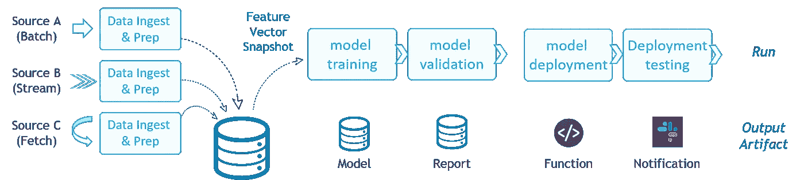
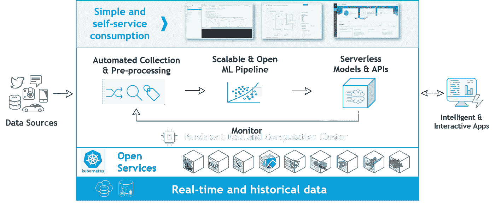
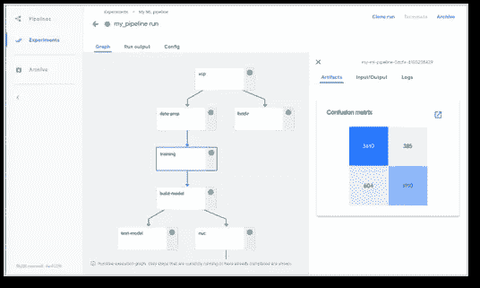

# Kubernetes，ML 管道的开放和可扩展方法

> 原文：<https://towardsdatascience.com/kubernetes-the-open-and-scalable-approach-to-ml-pipelines-1e972a965f0d?source=collection_archive---------12----------------------->

还在等 ML 训练结束？厌倦了手动运行实验？不确定如何重现结果？在开发运维及数据争论上浪费太多时间？

如果你是一个业余爱好者，这没关系，但是数据科学模型应该被整合到真正的商业应用中。如果看不到积极的投资回报，企业就不会投资数据科学。这就要求采用“工程化”的方法——否则它只不过是一个美化了的有数据的科学项目。

工程师在现代敏捷开发中使用微服务和自动化 CI/CD ( [持续集成和部署](https://www.infoworld.com/article/3271126/what-is-cicd-continuous-integration-and-continuous-delivery-explained.html))。你写代码，推送，它会在大规模的集群上自动测试。如果通过测试，它将进入某种形式的 beta/ [金丝雀](https://www.quora.com/What-is-Canary-testing)测试阶段，并从那里投入生产。 [Kubernetes](https://kubernetes.io/) ，一个云原生集群编制器，是现在被开发人员和开发者广泛使用的工具，用来构建一个敏捷的应用交付环境。

领先的 ML 工程师和 AI/ML 驱动的公司已经在使用 Kubernetes，它带有预集成的工具和可扩展的框架，用于数据处理、机器学习和模型部署。一些 Kubernetes 框架还支持水平扩展和高效使用 GPU，这进一步减少了总体等待时间和成本。

不要满足于专有的 SaaS/云解决方案或传统架构，如 [Hadoop](https://hadoop.apache.org/) 。获得基于 Kubernetes 的解决方案，打造可扩展的前瞻性数据科学平台。以下帖子回顾了用于扩展和操作数据科学工作的流程和 Kubernetes 框架的最佳实践，并提供了有关 Kubernetes (K8s)的 [KubeFlow](https://www.kubeflow.org/docs/started/) ML 工具包的详细信息。

# 数据科学管道

数据科学家在开发阶段通常会经历以下步骤:

1.  从 CSV 或密集格式(如[拼花地板](https://parquet.apache.org/))收集数据，需要从外部来源手动提取。
2.  手动标记、探索和丰富数据，以识别潜在的模式和特征。
3.  模型训练和验证。
4.  使用真实/新鲜数据进行模型测试，或者作为更大应用程序的一部分。
5.  如果对结果不满意，冲洗并重复。

*Data Science Pipeline and Output Artifacts*

一旦完成了开发，尽管困难重重，模型还是被部署到生产环境中，在那里展示了花哨的仪表板来识别异常或预测行为。我们中那些在人工智能旅程中更先进的人也创建人工智能驱动的用户交互/应用程序或触发警报和行动。

但随后数据发生了变化…模型精度漂移…用户要求更新应用程序和仪表板等…现在我们发现自己再次运行大部分管道来生产新模型。这是我们开始谷歌持续开发和集成方法的地方，但是稍后会有更多的内容。

构建管道所需的工具可分为以下六类:

A.来自离线或在线来源的自动数据收集器。

B.用于数据标注、探索和模型开发的交互式工具。

C.用于大规模聚合、连接和透视数据的分析工具/数据库。

D.并行模型培训框架。

E.模型和 API 服务框架。

F.管理、监控和仪表板。

将所有这些工具集成到一个平台下的唯一明智的方法就是使用 Kubernetes！

# Kubernetes，ML 平台的选择

Kubernetes 在同一个集群上托管多个打包的和预集成的数据和数据科学框架。它们通常是可伸缩的或者是自动伸缩的，并且它们是通过声明性的方法来定义/管理的:指定您的需求是什么，服务将不断地寻求满足它们，这提供了弹性并最大限度地减少了手动干预。

[KubeFlow](https://www.kubeflow.org/) 是一个开源项目，集合了领先的相关 K8 框架。KubeFlow 组件包括 [Jupyter](https://jupyter.org/) 笔记本、KubeFlow [Pipeline](https://www.kubeflow.org/docs/pipelines/pipelines-quickstart/) (工作流和实验管理)、可扩展培训服务(针对 [TensorFlow](https://www.tensorflow.org/) 、 [PyTourch](https://pytorch.org/) 、 [Horovod](https://eng.uber.com/horovod/) 、 [MXNet](https://mxnet.apache.org/) 、 [Chainer](https://chainer.org/) )、模型服务解决方案以及 Iguazio 的无服务器框架 [(Nuclio](https://nuclio.io/) 。KubeFlow 还提供了[示例](https://www.kubeflow.org/docs/examples/resources/)和预集成/测试组件。

除了典型的数据科学工具，Kubernetes 还可以托管数据分析工具，如 [Spark](https://spark.apache.org/) 或 [Presto](https://prestosql.io/) ，各种数据库和监控/日志解决方案，如 [Prometheus](https://prometheus.io/) 、 [Grafana](https://grafana.com/) 、 [Elastic Search](https://www.elastic.co/) 等。它还支持使用无服务器功能(即自动构建/部署/扩展代码，如 AWS [Lambda](https://aws.amazon.com/lambda/) )执行各种数据相关任务或 APIs 模型服务，请在我的帖子([无服务器:它能简化数据科学项目吗？](/serverless-can-it-simplify-data-science-projects-8821369bf3bd))。

Using Kubernetes for Data-Science and Analytics

与专有云或 SaaS 解决方案相比，Kubernetes 的主要优势在于其工具会定期添加和升级，谷歌的搜索和堆栈溢出通常是最快的帮助途径，并且该解决方案可以部署在任何地方(任何云，甚至是本地或笔记本电脑)。社区项目还迫使相关的组件/服务符合一组简化互操作性、安全性、监控等的标准/抽象。

您可以自己构建和管理 Kubernetes 数据科学平台([遵循文档](https://www.kubeflow.org/docs/started/))，或者使用云提供商或 Iguazio 等公司的托管和预集成解决方案。

# 构建高效的数据科学管道

不幸的是，仅仅押注于一个可信的平台是不够的。相信我，这是我的经验之谈:一旦你采纳了三条指导原则，生活会变得更容易:

1.  **使其功能化** —创建可重用的抽象函数/步骤，可以接受参数。
2.  **使其可扩展** —将并行性应用于每一步(或者尽可能经常地，在合理的范围内)。
3.  **自动化** —通过使用声明性语义和工作流来避免手动和重复的任务。

数据科学的当前趋势是建立“ML 工厂”，即非常类似于敏捷软件开发，建立自动管道来获取数据、预处理数据、运行培训、生成、部署和监控模型。Kubernetes 提供的声明式自动化部署和扩展方法是一个很好的基线，但它缺少一种在此基础上管理此类管道的方法。

KubeFlow 项目中一个相对较新的工具是 [Pipelines](https://www.kubeflow.org/docs/pipelines/pipelines-overview/) ，这是一组旨在创建和管理 ML 管道的服务和 UI。我们可以编写自己的代码，或者从谷歌、亚马逊、微软、IBM、英伟达、 [Iguazio](https://www.iguazio.com/) 等公司提供的大量预定义组件和算法中构建。

Kubeflow Piplines UI

一旦我们有了一个工作流，我们就可以按预定的时间间隔运行它一次，或者自动触发它。管道、实验和运行被管理，并且它们的结果被存储和版本化。管道解决了复制和解释我们的 ML 模型的主要问题。这也意味着我们可以直观地比较运行，并在各种对象/文件存储库中存储版本化的输入和输出工件。

一个主要的挑战是如何大规模地进行实验和数据处理。管道协调各种水平扩展和 GPU 加速的数据和 ML 框架。单个逻辑流水线步骤可以在 TensorFlow、Spark 或 [Nuclio 函数](https://github.com/nuclio/nuclio)的十几个并行实例上运行。管道也有映射到现有云服务的组件，因此我们可以提交一个逻辑任务，该任务可能在托管的[谷歌人工智能和数据服务](https://cloud.google.com/products/ai/)上运行，或者在亚马逊的 [SageMaker](https://docs.aws.amazon.com/sagemaker/index.html) 或 [EMR](https://aws.amazon.com/emr/) 上运行。

KubeFlow 和它的管道，就像这个类别中的大多数工具一样，仍然在发展，但是它背后有一个庞大而活跃的多厂商社区。这保证了一个可行和开放的框架。很像 Kubernetes 的第一天，云提供商和软件供应商有他们自己的管理容器的专有解决方案，随着时间的推移，他们都让位于社区要求的开源标准。

如果你下周碰巧在巴塞罗那的 KubeCon，请参观 KubeFlow 会议和各种成员展示的演示，包括我自己。我将于 5 月 20 日出席无服务器从业者峰会(Fira Gran Via Hall 8.0 Room D4+cc 8.17–20)，并于 5 月 23 日下午与谷歌的 Maulin Patel 会面[https://KC cnce u19 . sched . com/event/MPaf/economics-and-best-practices-of-running-aiml-workloads-on-kubernetes-maul in-Patel-Google-yaron-haviv-iguazio](https://kccnceu19.sched.com/event/MPaf/economics-and-best-practices-of-running-aiml-workloads-on-kubernetes-maulin-patel-google-yaron-haviv-iguazio)。