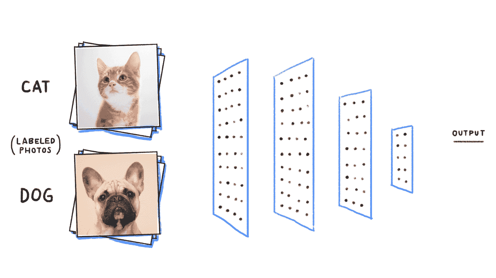
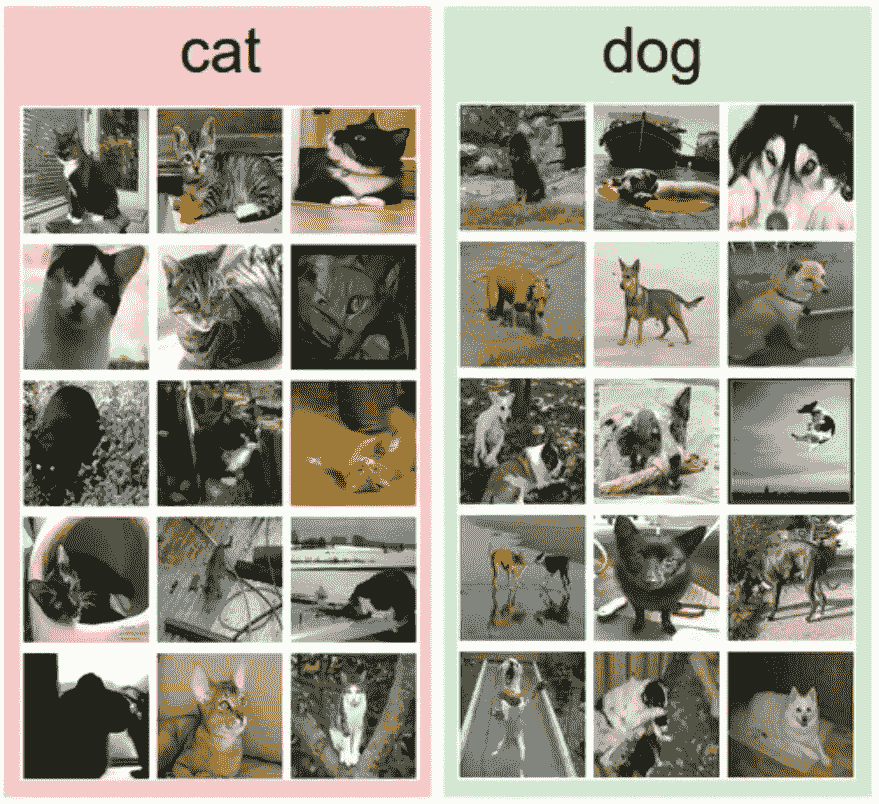
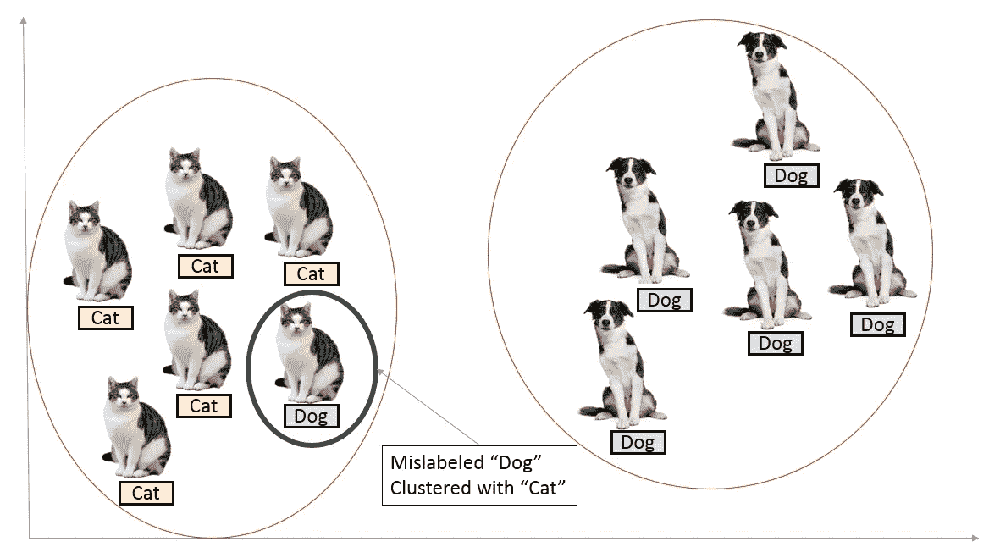
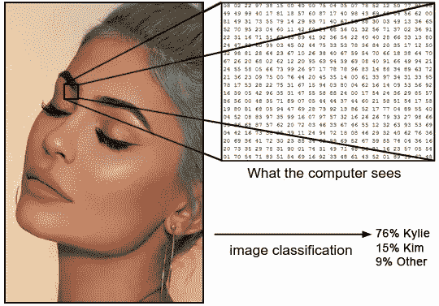
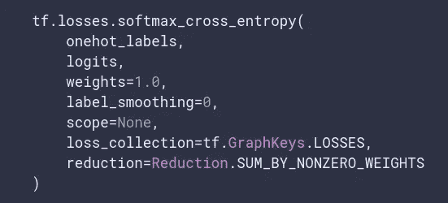

# 标签平滑:更高模型精度的一个要素

> 原文：<https://towardsdatascience.com/label-smoothing-making-model-robust-to-incorrect-labels-2fae037ffbd0?source=collection_archive---------6----------------------->

# 1.介绍

**图像分类**是从一组固定的类别中给输入图像分配一个标签的任务。这是计算机视觉中的核心问题之一，尽管它很简单，却有大量的实际应用。

**示例:**例如，在下图中，一个图像分类模型获取一张图像，并将概率分配给两个标签:*{猫，狗}* 。如图所示，请记住，对于计算机来说，图像是一个大型的三维数字数组。在这个例子中，猫图像是 248 像素宽，400 像素高，并且具有三个颜色通道红色、绿色、蓝色(或简称为 RGB)。因此，图像由 248 x 400 x 3 个数字组成，即总共 297，600 个数字。每个数字都是从 0(黑色)到 255(白色)的整数。我们的任务是将这 25 万个数字转换成一个标签，比如*“cat”*。

同样地，你可以训练一个模型，让它通过看卡戴珊的照片告诉你你在看哪个——金，凯莉，还是其他

# 2.训练分类模型

训练将图像分类为猫图像或狗图像的模型是二元分类的一个例子。

**图像分类流水线**。我们已经看到，图像分类的任务是获取代表单个图像的像素阵列，并为其分配标签。我们的完整渠道可以概括如下:

*   **输入:**我们的输入由一组 *N* 图像组成，每个图像都标有一个 *K* 不同的类。我们将该数据称为*训练集*。

training dataset

**学习:**我们的任务是使用训练集来学习每个类的样子。我们称这个步骤为*训练分类器*或*学习模型*。

# **3。数据标注错误问题**

但是如果你的训练数据包含不正确的标注呢？如果一只狗被贴上猫的标签会怎样？如果凯莉被贴上肯德尔的标签，或者金被贴上坎耶的标签怎么办？如果你从互联网上获取数据，这种错误的数据标注可能会发生。

这最终会导致您的问题要么学习数据集中的噪声，要么学习不正确的要素。但是，这在一定程度上是可以避免的。如果你在一个小数据集上训练，你可以检查所有的标签并手动检查，或者使用你的爪牙来做脏活。下一节将分享另一种数学方法。

所以，问题是你的模型将会学习不正确的特征(从一只狗身上),并将这些特征与标签“猫”联系起来。我们如何解决这个问题？为了深入了解这一点，让我们看看在图像分类问题中使用的损失函数。

在我们得到损失函数之前，我们应该确定分段模型给出了每类的概率**:**

…maybe this is not how *you* see her…

在图像分类问题中，我们使用 [softmax loss](https://ml-cheatsheet.readthedocs.io/en/latest/loss_functions.html) ，其定义如下两类:

> l =(*y*log(*p*)+(1*y*)log(1*p*))

这里， *L* 为损失， *y* 为真实标签(0 —猫，1 —狗)， *p* 为图像属于 1 类即狗的概率。模型的目标是减少损失。

损失本质上驱动了你的“梯度”，简单来说就是决定了模型的“学习”。因此，我们需要密切关注损失。

比方说，你得到一张狗的图片，概率为 0.99。你的损失将是:

l =-(1 *(log(0.99)+(1–0.99)* log(0.01))≈0

哪个好！预测准确的情况下损失应该不大！

*如果你的数据有不正确的标签，这种损失会特别大，从而导致* ***在学习*** *时出现问题。*

那么我们该如何处理呢？在下一节中，我们将看到一种在标签不正确的情况下将损失最小化的方法。

# **3。标签平滑** —一种可能的解决方案

向标签平滑问好！

当我们将交叉熵损失应用于分类任务时，我们期望真正的标签为 1，而其他标签为 0。换句话说，我们毫不怀疑真正的标签是真的，其他的不是。总是这样吗？也许不是。许多手动注释是多个参与者的结果。他们可能有不同的标准。他们可能会犯一些错误。他们毕竟是人。因此，我们一直坚信的地面真相标签可能是错误的。

一个可能的解决办法是放松我们对标签的信心。例如，我们可以将损失目标值从 1 稍微降低到 0.9。自然地，我们稍微增加了其他人的目标值 0。这种想法被称为标签平滑。

下面是张量流中定义的交叉熵损失的论点:

arguments in softmax cross entropy loss

这是 Tensorflow [文档](https://www.tensorflow.org/api_docs/python/tf/losses/softmax_cross_entropy)对`label_smoothing`参数的描述:

> 如果`label_smoothing`不为零，则将标签向 1/num_classes 方向平滑:new _ onehot _ labels = onehot _ labels *(1-label _ smoothing)+label _ smoothing/num _ classes

这是什么意思？

假设你正在训练一个二元分类模型。你的标签应该是 0-猫，1-不是猫。

现在，假设你`label_smoothing` = 0.2

使用上面的等式，我们得到:

new _ onehot _ labels =[0 1]*(1—0.2)+0.2/2 =[0 1]*(0.8)+0.1

new_onehot_labels =[0.9 0.1]

这些是软标签，而不是硬标签，即 0 和 1。当有一个不正确的预测时，这将最终给你较低的损失，随后，你的模型将惩罚和学习不正确的程度稍低。

> 本质上，标签平滑将帮助您的模型围绕错误标签的数据训练*，从而提高其健壮性和性能。*

# 4.进一步阅读

[标签平滑什么时候有帮助？](https://arxiv.org/pdf/1906.02629.pdf)