# 滞后变量回归和真理

> 原文：<https://towardsdatascience.com/lagged-variable-regressions-and-truth-4edb7b9e8f47?source=collection_archive---------7----------------------->

## 动态回归模型提供了巨大的代表性，但也有偏见风险

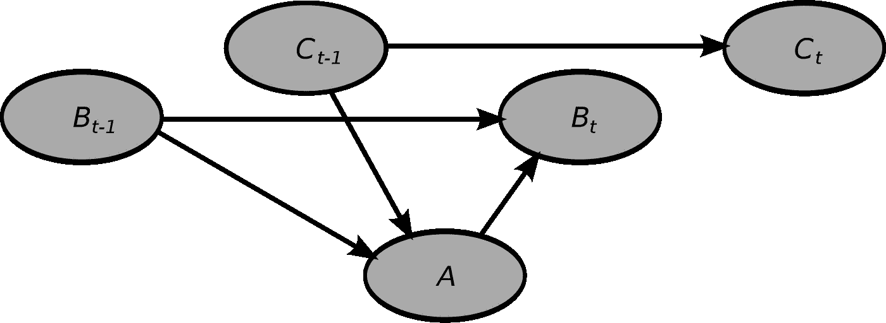

Variables related to each other over adjacent time steps, originally in the context of dynamic Bayesian networks (Wikimedia user Guillaume.lozenguez, [CC BY-SA 4.0](https://creativecommons.org/licenses/by-sa/4.0))

*   使用**有理传递函数**和**公共滤波器**，将非线性结构时间序列模型转化为滞后变量的回归
*   见普通最小二乘滞后变量回归中的**偏差**由于误差中剩余的序列相关性，
*   使用**广义最小二乘法**消除偏差，恢复过程参数，即“真相”

托布勒(Tobler)的(非常可信的)地理第一定律指出:“耳边的事物比远处的事物更加相关。无论我们对底层的数据生成机制知之甚少，我们经常可以利用纯粹的邻近性——在时间或空间上——来获得优势。但我们也知道，回归因变量的时移副本，即受所有相同因素影响的副本，会带来一些警告。

最大的警告是普通最小二乘(OLS)回归中潜在的渐近偏差，这是任何额外数据都无法缓解的。当回归变量与误差项同时相关时，就会发生这种情况。正如 Peter Kennedy 在[计量经济学指南](https://books.google.com/books/about/A_Guide_to_Econometrics.html?id=B8I5SP69e4kC&source=kp_book_description)中所解释的，“这是因为 OLS 程序在为解释因变量的变化而将‘信用’分配给回归变量时，错误地将因变量的一些扰动产生的变化分配给了与扰动同时相关的回归变量”简而言之，当回归变量和误差相关时，OLS 无法将两者的影响分开。

从被动预测的角度来看，偏差可能无关紧要，本文标题中的“t *ruth* ”指的是时间序列背后的真实数据生成过程。此后，我们的目标是过程参数的质量评估。对于客观事实和参数具有科学意义的情况，我将转向非线性、非平稳、结构化的时间序列模型，即运动表现的“体能-疲劳”模型。该模型通过潜在的*健康*和*疲劳*结构将训练历史与运动表现联系起来，并通过有科学意义的参数进行调整。

通过使用输入到输出的合理传递函数重写这个模型，一组“公共过滤”操作将变得显而易见。应用这些过滤器会将模型转换为动态线性回归，但是过滤操作也会有副作用:MA(2)相关结构的错误。我们将在 OLS 回归中看到回归变量和误差之间同期相关性的破坏力，但最终，我们将通过适应这种结构的 GLS 回归得到真相。

# 非线性结构时间序列模型

运动表现的“体能-疲劳”模型具有以下形式:

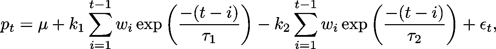

其中 *p_t* 是(运动)表现的数字测量值， *w_t* 是训练“剂量”，而 *ϵ_t* 是同分布高斯误差。该模型可以被视为具有两个非线性特征的线性回归，

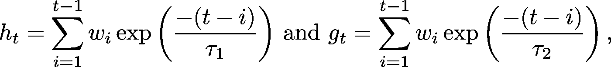

运动员“健康”和“疲劳”的潜在表征。这些特征是具有指数衰减的运动训练历史的卷积，不同之处仅在于衰减速率。通常，*疲劳* ( *g_t* )相对短暂，并与更快的指数衰减相关联，但与*适应度*相比，也具有相对较大的回归权重。

借助一点代数知识，*体能*和*疲劳*可以转化为动态形式:

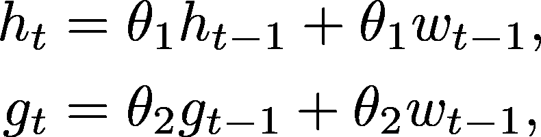

其中*θ_*1 = exp(-1/*τ_*1)*θ_*2 = exp(-1/*τ_*2)。

如果我们将健康和疲劳的动态表示插入到原始模型中，我们会得到

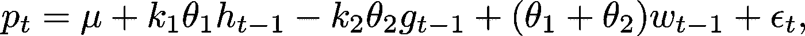

这看起来更好，但不是立即有用的，因为 h _t 和 g _t 取决于未知参数。

## 理性传递函数到救援

再努力一点，我们可以对任何时间索引变量 *y* 使用由**B**y _ t=*y*_ {*t*-1 }定义的“后移运算符” **B** ，得到

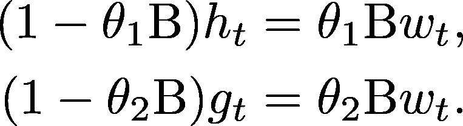

求解 *h* _ *t* 和 *g* _ *t* 并将它们插回到原始模型中，我们得到:

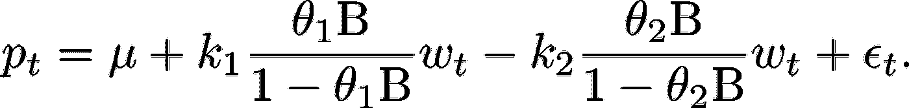

因此，我们有两个对外生输入序列 *w_t* 进行操作的有理传递函数。对于有理传递函数，形式为(1- *θ* B)的分母项对应于一个自回归脉冲响应，即一个具有长记忆的过程，这对我们来说是一个麻烦。我们可以选择去掉分母成分，但这不是没有代价的。

在[多输入传递函数模型的识别](https://www.researchgate.net/publication/276953549_Identification_of_Multiple-Input_Transfer_Function_Models)(刘& Hanssens，1982)中讨论的“公共滤波器”通过(1- *θ* B 来预乘时间序列方程的右侧和左侧。它不会改变传递函数权重，因此您可以连续应用多个公共滤波器，除了会导致复杂性和由于滞后而丢失一些行之外，您还没有破坏输入和输出序列之间的关系。

关键是，如果我们要使用公共滤波器(1-*θ*_ 1b)(1-*θ*_ 2b)，我们就可以去除自回归成分:

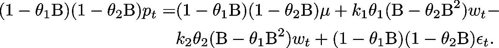

上面的内容看起来仍然很难看，但是在展开应用后移运算的多项式之后，我们得到:

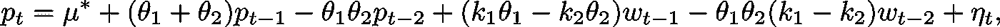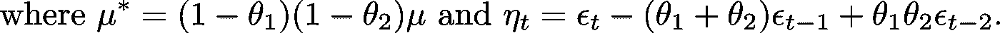

这是对两个自身滞后版本和外部培训输入的性能回归，但有一个转折。存在由公共滤波器引起的 MA(2)误差结构的问题，并且它具有真实的后果。

# R 中的一个模拟例子

本节将使用可从 [R 要点](https://gist.github.com/baogorek/6d682e42079005b3bde951e98ebae89e)复制或直接下载为 [csv 文件](https://drive.google.com/open?id=1kk40wiVYzPXOkrPffU55Vzy-LLTrgAVh)的模拟数据。要运行下面的 R 代码，请在下面的 R 代码块中更改文件路径:

```
train_df <- read.csv("c:/devl/data/train_df.csv")
head(train_df)
```

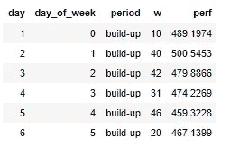

以下计算显示了模拟的滞后变量模型中所有系数的理论值:

```
# True parameter values:
mu <- 496
theta1 <- exp(-1 / 60)
theta2 <- exp(-1 / 13)
k1 <- .07
k2 <- .27#Theoretical coefficient for intercept is
(1 - theta1) * (1 - theta2) * mu#Theoretical coefficient for performance lagged once is
theta1 + theta2#Theoretical coefficient for performance lagged twice is
-theta1 * theta2#Theoretical coefficient for training lagged once is
k1 * theta1 - k2 * theta2#Theoretical coefficient for training lagged twice is
-theta1 * theta2 * (k1 - k2)
```

因此，目标是恢复以下等式:

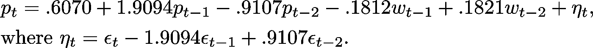

***侧注:*** *反其道而行之，通过代入求解θ_1 和θ_2，得出两个参数之一的二次方程。它们导致相同的两个根，所以选择θ_1 为两者中较大的一个。有了θ_1 和θ_2，求解μ就变得简单了，k1 和 k2 构成了一个含有两个方程和两个未知数的线性系统。*

## 拟合滞后回归模型

为了准备回归，下面的代码将性能和训练变量分别延迟一次和两次。`dplyr`套装让一切变得简单:

```
library(dplyr)train_aug <- train_df %>%
  mutate(perf_lag1 = lag(perf, n = 1, order_by = day),
         perf_lag2 = lag(perf, n = 2, order_by = day),
         train_lag1 = lag(w, n = 1, order_by = day),
         train_lag2 = lag(w, n = 2, order_by = day))
```

让我们看看当我们使用 OLS 回归这些滞后变量的表现时会发生什么:

```
my_lm <- lm(perf ~ perf_lag1 + perf_lag2 + train_lag1 + train_lag2,
            data = train_aug[3:nrow(train_aug), ])
summary(my_lm)
```

上面的代码产生了部分输出:

```
Coefficients:
            Estimate Std. Error t value Pr(>|t|)    
(Intercept) 33.99821   12.09470   2.811 0.005327 ** 
perf_lag1    0.48066    0.05619   8.553 1.18e-15 ***
perf_lag2    0.46189    0.05504   8.393 3.45e-15 ***
train_lag1  -0.15602    0.04406  -3.541 0.000475 ***
train_lag2  -0.02346    0.04516  -0.520 0.603807    
---
Signif. codes:  0 ‘***’ 0.001 ‘**’ 0.01 ‘*’ 0.05 ‘.’ 0.1 ‘ ’ 1

Residual standard error: 8.518 on 252 degrees of freedom
Multiple R-squared:  0.9117,	Adjusted R-squared:  0.9103 
F-statistic: 650.4 on 4 and 252 DF,  p-value: < 2.2e-16
```

由于残差中仍然存在序列相关，OLS 系数估计中明显存在偏差。

幸运的是，R 的`nlme`包通过`gls`函数提供了广义最小二乘(GLS)模型拟合，它处理 MA(2)误差结构:

```
library(nlme)
my_gls <- gls(perf ~ perf_lag1 + perf_lag2 + train_lag1 +
              train_lag2,
              data = train_aug[3:nrow(train_aug), ],
              corARMA(form = ~day, p = 0, q = 2))
summary(my_gls)
```

下面的部分输出来自上面的代码:

```
Correlation Structure: ARMA(0,2)
 Formula: ~day 
 Parameter estimate(s):
    Theta1     Theta2 
-1.9059497  0.9117409 

Coefficients:
                 Value  Std.Error    t-value p-value
(Intercept)  0.6571088 0.11700730    5.61596       0
perf_lag1    1.9187158 0.00815689  235.22646       0
perf_lag2   -0.9200058 0.00815495 -112.81568       0
train_lag1  -0.1662026 0.02238219   -7.42566       0
train_lag2   0.1664704 0.02241510    7.42671       0
```

通过 GLS 回归，我们已经将真实的参数值恢复到合理的估计误差范围内。

# 讨论

之前关于体能-疲劳模型的文章已经使用重型机械来估计参数:[非线性最小二乘法](/modeling-cumulative-impact-part-i-f7ef490ed5e3)、l [具有复杂样条卷积特征的线性回归](/modeling-cumulative-impact-part-ii-2bf65db3bb98)和[卡尔曼滤波器](/the-kalman-filter-and-external-control-inputs-70ea6bcbc55f)，仅举三个例子。对几个滞后变量的线性回归(通过 GLS 拟合)能够恢复理论上的基本过程说明了动态回归模型的表达能力

在投入和产出各滞后几次的情况下盲目回归的代价是什么？只关注提前一步的预测精度，大概不会很多。带有滞后变量的 OLS 回归“解释”了 *next* 性能值的大部分变化，但它也表明了一个与用于模拟数据的过程完全不同的过程。这个过程的内部被 GLS 回归恢复了，这就谈到了标题中提到的“真相”。

进一步研究和讨论的主题是，对所有动态回归使用具有 MA( *q* )误差结构的 GLS 回归是否明智。通过`nlme`在 R 中实现非常容易。另一方面，它的预报功能没有使用误差结构，因此需要用户作出额外的努力，使 GLS 的预报能与 OLS 的预报竞争。对于开箱即用的一步预测，可能很难证明 GLS 过程的额外复杂性。为了获得真正的底层系统参数，通过 GLS 合并 MA( *q* )误差结构很可能使我们更接近真相*。*