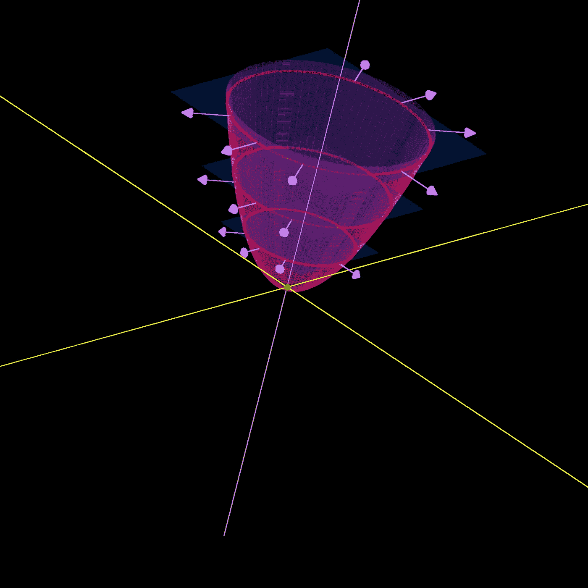
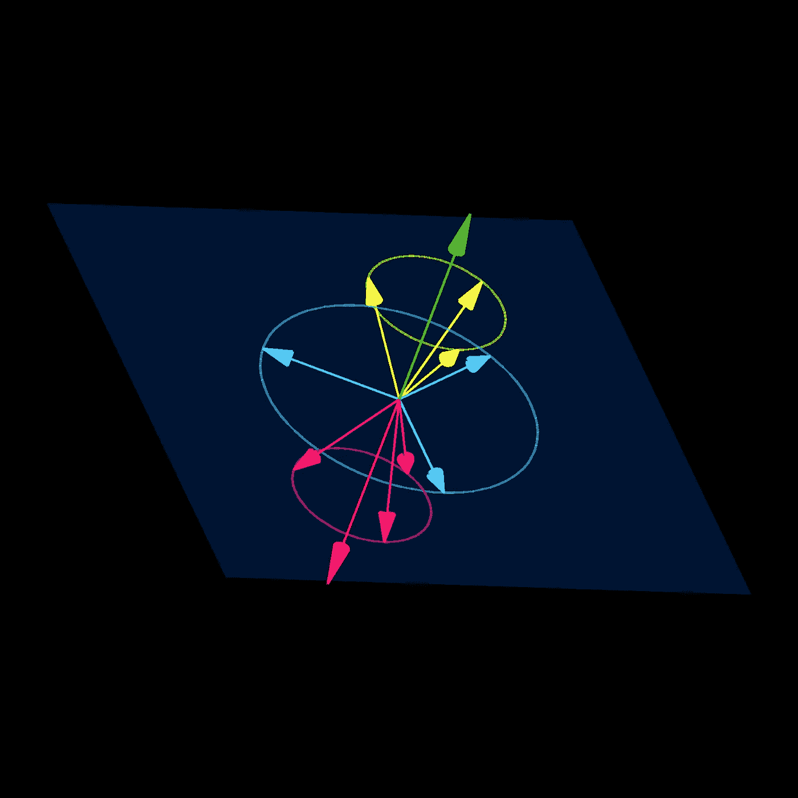
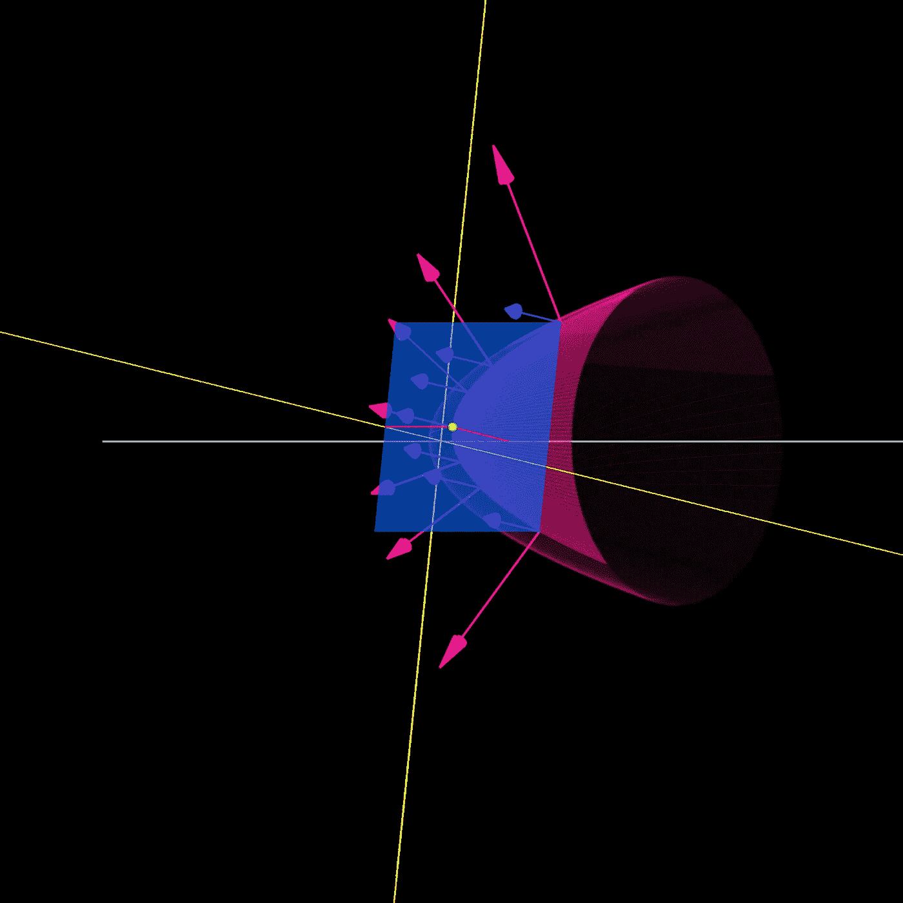
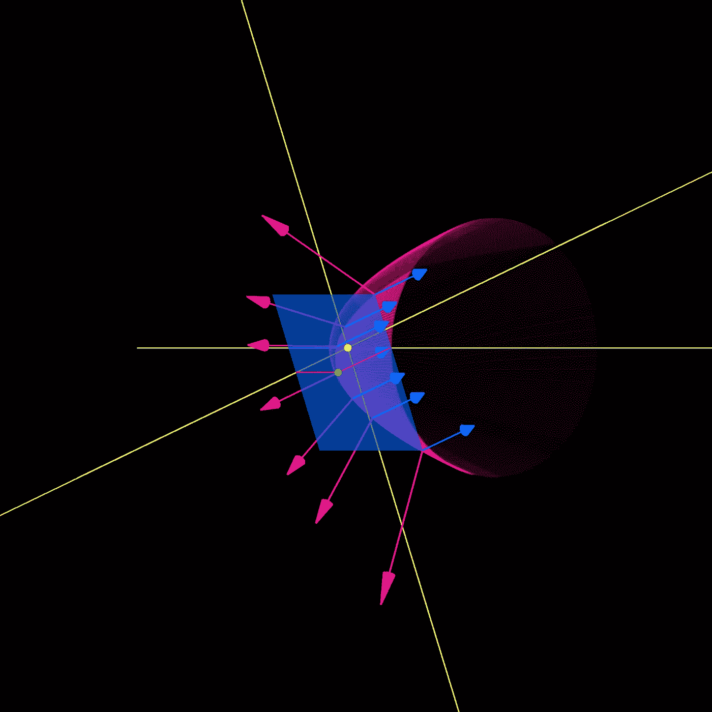
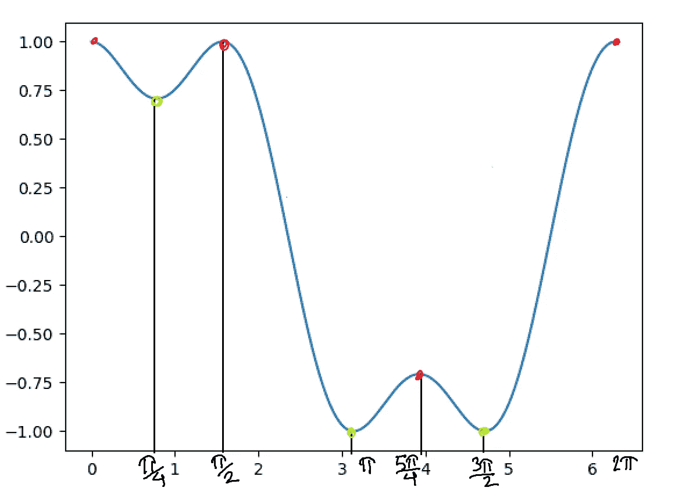
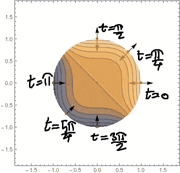
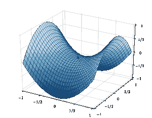
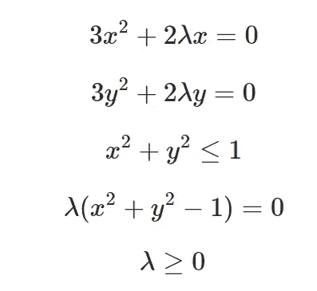

# 拉格朗日乘数与可视化和代码

> 原文：<https://towardsdatascience.com/lagrange-multipliers-with-pictures-and-code-ace8018dac5e?source=collection_archive---------1----------------------->

## 终极优化武器，端到端解释。

在这个故事中，我们将通过拉格朗日乘数进行一次空中优化之旅。我们什么时候需要它们？每当我们遇到有约束的优化问题时。以下是一些例子:

1.  对冲基金希望决定其投资组合中包含的股票比例，以使他们获得最大可能的预期回报，并保持在一定的风险偏好范围内(例如，风险可以根据回报的方差来衡量)。
2.  一个学区想要为他们的学生确定午餐菜单上各种项目的分配。他们希望将每顿午餐的成本降至最低，同时确保孩子们获得一定量的所有必需营养。
3.  一家卡车运输公司想要将货物从源仓库运输到目的地城市。给定每个仓库-城市对的运输成本、每个仓库的总供应量和每个城市的总需求，决定从每个仓库向每个城市运送多少，以使总成本最小化并满足需求(约束)。

我们可以看到，约束优化可以解决从物流到金融领域中出现的许多实际的、真实的问题。在博客的其余部分，我们将从没有约束的普通优化开始。然后，我们将添加等式约束。然后，我们将描述具有等式和不等式约束的完全一般约束优化问题的解(这些条件被称为 KKT —卡鲁什、库恩、塔克条件)。最后，我们在一些玩具问题上展示了这些条件的力量。许多人认为 Nocedal 和 Wright 的书是数值优化的圣经，我们将大致遵循第 13 章，避开严格的证明(总是可以从文本中读到)并更多地关注视觉直觉。

# 无约束优化

在这个场景中，我们的控制中有一些变量和一个依赖于它们的目标函数。对变量没有约束，目标函数将被最小化(如果这是一个最大化问题，我们可以简单地否定目标函数，然后它将变成一个最小化问题)。

在任何一点，对于一个一维函数，函数的导数指向一个增加它的方向(至少对于小的步长)。这意味着，如果我们有一个函数 f(x)并且导数*f’(x)*为正，那么增加 x 将增加 f(x)，减少 x 将减少 f(x)。如果我们要最小化 f(x)，我们只需向与 *f'(x)* 符号相反的方向迈出一小步，就可以减小 f(x)。如果我们在一个点上*f’(x)*= 0 呢？然后，我们可能已经到达 f(x)的一个最优值，因为没有别的地方可去。

如果有多个变量(比如 x 和 y)，我们可以对每个变量求导。如果我们用这两个数字构造一个二维向量，我们就得到了函数的梯度。现在，沿梯度方向移动将增加函数，而向相反方向移动将减少函数(对于小步长)。

这意味着只要梯度不为零，我们就不可能处于最小值，因为我们可以简单地沿着与梯度相反的方向迈出一小步，并进一步减小函数。这意味着最小化函数的点的必要(但非充分)条件是梯度在该点必须为零。

让我们举一个具体的例子，这样我们就可以想象这是什么样子。考虑函数 f(x，y) = x +y，这是一个抛物面，当 x=0，y=0 时最小化。关于 x 和 y 的导数分别变成 2x 和 2y。所以，梯度变成了矢量∇f = [2x，2y]。我们可以看到，只有当 x=0，y=0 时，这才是零。否则，梯度指向 f(x，y)将增加的方向。所以，与梯度相反的方向会减少 f(x，y)。如下图所示。粉色曲线是在绿点(0，0)处最小化的目标函数 f(x，y)。紫色箭头是梯度，它指向 f(x，y)增加的方向。为了减少它，我们向相反的方向移动，直到到达绿点。



Fig 1: Paraboloid with gradients. Made using [https://github.com/ryu577/pyray](https://github.com/ryu577/pyray)

总而言之，当优化函数 f 时，在无约束优化问题中，处于局部最优的必要(但非充分)条件是:

∇f = 0

这就像当你站在山顶时(那将是一匹千里马)。你怎么知道你在顶端？无论你朝哪个方向走，你最终都会*降低*你的高度。所以你肯定是在当地的一个最佳状态。现在，你旁边可能还有一座更高的山。所以，你可能不在*环球* optima。事实上，如果我们将地球表面视为我们的领域(将海拔高度视为我们的目标函数)，如果你在任何一座古老的山峰(或建筑)的顶部，那么你就处于局部最优，但只有当那座山是珠穆朗玛峰时，你才处于全局最优。在本文中，我们将满足于寻找局部最优解。

如果我们想待在一个国家的范围内呢？这将意味着限制我们可以搜索最优解的空间，使这成为约束优化的一个例子。在某种程度上，无约束优化只是约束优化的一个特例。

# 平等约束

对于无约束最小化/最大化问题，我们简单地寻找梯度为零向量的点。如果梯度不为零，我们就向它指向的相反方向迈一小步(如果我们最小化；沿着它，如果我们最大化)并继续这样做，直到我们确实到达一个点，在那里它*是*零，因此，没有其他地方可去(这种优化方法被称为梯度下降)。请注意，我们不必完全沿着梯度移动。只要我们沿着梯度有正投影(阴影)的方向移动，我们最终会增加目标函数(如果我们沿着负梯度有正投影，则目标函数会减少)。下图说明了这一点。绿色箭头是蓝色平面的梯度(因此与其垂直)，红色箭头是负梯度。因为浅蓝色的箭头位于平面上，如果我们沿着它们走一步，平面的方程将产生 0。黄色箭头沿着绿色箭头有一个正阴影(投影)。因此，沿着它们移动将导致当插入平面的方程时产生正数的点(“增加”它)。类似地，粉色箭头沿着红色箭头有一个正阴影(反向渐变)。因此，沿着它们移动将导致在插入平面方程时产生负数的点(“减少”它)。



Fig 2: Vectors on opposite sides of a plane. See text for explanation. Made using [https://github.com/ryu577/pyray](https://github.com/ryu577/pyray)

对于无约束最小化，我们寻找梯度为零的点。这是因为如果不是这样，我们可以通过与梯度相反的方向来降低目标函数。

同样的想法可以扩展到我们有等式约束的情况。像以前一样，我们需要找到一个点，在这个点上我们找不到任何*可能的*方向来移动目标函数减小的地方。对于无约束优化，这仅仅意味着不存在这样的方向。当我们有一个约束时，还有另一种可能性。如果减少目标函数的方向存在，但是约束禁止我们沿着它前进。

假设你想最大化你银行账户里的钱。一个立即增加收入的方法是卖掉一个肾。但是你可能有一个约束，说你不会失去一个重要的器官。所以，即使有一条简单的途径可以增加你的收入，你的约束也会阻止你去实现它。

这意味着等式约束的存在实际上降低了梯度条件的严格性。虽然对于没有等式约束的局部最优，它需要为零，但现在只要沿着任何有正阴影的方向移动会导致我们违反约束，它就可以非零。这只有在约束平面垂直于渐变时才会发生(如图 2 中的平面和绿色箭头)。

让我们回到我们的目标函数 f(x，y)=x +y。让我们添加一个等式约束，y=1。这是架飞机。在下面的图 3 中，目标函数是粉红色的，平面是蓝色的。由于我们被约束在平面上，我们不能沿着平面的梯度(下图中的蓝色箭头)在任何有正或负阴影的方向上移动，因为这将增加或减少约束的等式，而我们希望保持它不变。该平面与我们的目标函数(粉红色抛物面)的方程相交于一条抛物线上。下图中的粉色箭头是目标函数在这条抛物线上各点的梯度。如果粉红色的箭头有一个沿着蓝色平面的投影，我们可以沿着与该投影对应的向量相反的方向移动。这将使我们保持在平面上，确保我们不违反约束，同时仍然减少目标函数。然而，在下面图 3 中的绿点处，粉色箭头(目标函数的梯度)在蓝色平面上没有任何投影。换句话说，粉色箭头平行于蓝色箭头(这是约束平面的渐变)。



Fig 3: Constraint gradient aligns with objective function gradient at optima. Made using [https://github.com/ryu577/pyray](https://github.com/ryu577/pyray)

为了降低目标函数，我们需要沿着负梯度的方向移动。但是一旦我们这么做了，我们就会离开约束平面。因此，该约束使得不可能在绿点处进一步降低目标函数。这意味着它一定是局部最小值。检查该条件的一个简单方法是要求目标函数的粉色渐变平行于约束平面的蓝色渐变。如果两个向量平行，我们可以把其中一个写成另一个的倍数。我们称这个倍数为λ。如果目标函数的梯度是∇f，约束的梯度是∇c，则上述条件是:

**∇f = λ ∇c**

上面的λ叫做拉格朗日乘数。因此，我们现在有一个具体的条件来检查时，寻找局部最优的约束优化问题。

# 不等式约束

不等式约束意味着你必须呆在定义约束函数的边界的一边，而不是在边界上(等式约束就是这种情况)。例如，呆在栅栏的边界内。如果我们知道如何处理不等式约束，我们就可以解决任何约束优化问题。这是因为等式约束可以转换为不等式约束。假设我们要求:c(x) = 0。另一种表达方式是:c(x)≥0，c(x)≤ 0。因此，每个等式约束总是可以用两个不等式约束来代替。

正如带有等式约束的约束优化可以用前面部分描述的拉格朗日乘子来处理一样，带有不等式约束的约束优化也可以。将不等式约束条件与等式约束区分开来的是不等式约束的拉格朗日乘数必须为正。要知道为什么，再次考虑沿着梯度有一个正分量的方向迈出一小步。如果我们能沿着这个方向迈出一步(如果我们是最大化；相反，如果我们是最小化)；我们不可能处于最大值/最小值。对于不等式约束，这意味着拉格朗日乘数为正。要了解原因，让我们回到我们之前考虑的约束优化问题(图 3)。

最小化:f(x，y) = x +y

服从:c(x，y)=y-1=0

现在，让我们将等式约束改为不等式约束。这可以通过两种方式实现，结果完全不同。我们可以要求:

c(x，y) = y-1 ≥0。在这种情况下，约束允许图 3 中蓝色平面前面的任何东西。很容易看出，图 3 中的绿点仍然是局部最优。此外，由于表示约束梯度的蓝色箭头和表示目标函数梯度的粉色箭头指向相同的方向，因此我们有:

**∇f = λ ∇c**

λ>0。

另一种可能是，c(x，y) = y-1≤0。现在，可行区域变成了蓝色飞机后面的一切*。约束梯度将翻转。因此，图 3 最终将看起来像这样:*



Fig 4: Flipping the sign of inequality constraint from figure 3.

请注意，现在，

1.  绿点不再是局部最优，因为我们可以自由移动到(0，0)；也就是上面图 4 中的黄点。
2.  在绿点，我们仍然有∇f=λ ∇c.，因为蓝色向量指向粉红色向量的相反方向，我们有λ <0.

So, it is clear that for an inequality constraint, the condition ∇f=λ ∇c indicates we’re at a local optima only when λ> 0。

将所有这些放在一起，对于一般的优化问题:

最小化 f( **x** )

服从于:

对于 i ∈等式，c_i( **x** ) =0

对于 i ∈不等式，c_i( **x** )≥0

我们得到了达到局部最优所需的全套条件:

拉格朗日乘数条件；

**∇f =∑_ Iλ_ I ∇c_i(x)+∑_ jλ_ j ∇c_j(x)；**等式(1)

其中 i ∈等式和 j ∈不等式约束。

对于所有 I，c _ I(**x**)= 0；等式(2)

对于所有 j，c _ j(**x**)≥0；等式(3)

λ_ j≥0；等式(4)

还要注意，对于我们考虑的两个不等式约束问题，当我们有 y-1≥0 时，图 3 中的绿点就是解。此时，我们在约束平面上(y-1=0)。所以，我们实际上有 c( **x** )=0 和λ > 0。

另一方面，当我们考虑 y-1≤0 时，图 4 中的黄点(x=0，y=0)成为局部最小值。这一点也是无约束问题的解决方案。所以，我们这里只有∇f=0。由于拉格朗日条件要求∇f = λ ∇c，我们得到λ ∇c = 0。现在，∇c 在这一点上≠0，这意味着我们必须有:λ=0。

这意味着如果约束是活动的(c( **x** )=0)，我们应该得到λ≥0，而如果不是(c( **x** )≠ 0)，我们应该得到λ=0。所以，在所有情况下，其中一个应该是零。这导致了最后一个条件(互补条件):

λ_j c_j( **x** ) = 0 对于所有 j ∈不等式；等式(5)

等式(1)到(5)被称为 KKT 条件。请注意，我们并没有真正为它们提供严格的证明，只是基于简单的例子来构造它们。为了证明这一点，读者应该参考诺塞达尔和赖特的书的第 13 章。

很多人看到这五个方程时，觉得问题变得更加复杂了。这些方程实际上如何帮助我们解决约束优化问题。感受这一点的最好方法是通过一些具体的例子。在下一节中，我们拿一个我们事先知道答案的样本问题，看看 KKT 条件如何帮助我们正确地识别所有局部最优解。

# 代码示例

广义优化问题的特殊情况涉及线性目标函数和线性约束。这被称为线性约束线性规划(LCLP)。目标函数和约束也可以是二次的，这样的优化问题称为二次约束二次规划(QCQP)。有一些软件包能够解决这类针对大量约束条件(数百万)的优化问题。然而，对于具有更多可管理的约束的简单问题，我们可以利用能够解决大多数(更一般的)多项式约束多项式程序的算法。这意味着目标函数和约束可以是任意多项式函数。这是因为有一个用于求解多项式方程组的通用框架，称为“Buchberger 算法”,并且上述 KKT 条件可以简化为多项式方程组。我在这里写了一篇关于 Buchberger 求解多项式方程组的算法的详细博客。有一个名为“sympy”的 python 库，它在幕后使用类似这样的算法，并求解一般的多项式方程组。所以，事不宜迟，让我们框架我们的第一个约束优化问题。

## 平等约束

```
Minimize: x³+y³
Subject to: x²+y²=1
```

注意，约束(x +y =1)意味着我们在半径为单位的圆的边界上。所以，我们可以说:x=cos(t)，y=sin(t)。目标函数于是变成:sin (t)+cos (t)。如果我们用 t 来绘制，我们会得到下图:



Fig 5: Objective function sin³(t)+cos³(t) plotted with t at the boundary of the constraint.

我们可以看到 t=0，π/2 和 5π/4 对应于局部极大值，而 t=π/4，π和 3π/2 对应于局部极大值。既然我们预先知道了答案，让我们看看上面描述的 KKT 条件是否也能找到这些。

等式(1)给出(取目标函数和约束的导数):

[3x，3y ] = λ[2x，2y]

使两侧向量的两个分量相等会得到两个等式:

3x -2λx=0

3y -2λy=0

等式(2)简单地要求等式约束得到满足:

x +y =1

并且由于没有不等式约束，我们不需要方程(3)到(6)。现在，我们可以将上面的三个方程输入到 python 库 sympy 提供的符号方程求解器中。

这导致以下结果(上述系统的所有可能解，其中 x、y 和λ的值按此顺序排列):

```
[(-1, 0, -3/2),
 (0, -1, -3/2),
 (0, 1, 3/2),
 (1, 0, 3/2),
 (-sqrt(2)/2, -sqrt(2)/2, -3*sqrt(2)/4),
 (sqrt(2)/2, sqrt(2)/2, 3*sqrt(2)/4)]
```

(-1，0)对应 t =π；(0，-1)对应 t = 3π/2；(-sqrt(2)/2，-sqrt(2)/2)对应于 t=5π/4，(sqrt(2)/2，sqrt(2)/2)对应于 t=π/4。因此，我们可以看到，我们上面确定的所有局部最大值和局部最小值都是由 KKT 条件确定的。现在，我们可以简单地在这些候选点找到目标函数的最大值和最小值。

## 不等式约束

现在，让我们把上面问题中的等式约束改为不等式约束，看看它如何改变我们的解。

```
Minimize: x³+y³
Subject to: x²+y²≤1
```

在前面的例子中，约束意味着我们只能在单位圆的边界上，现在我们可以在单位圆内的任何地方。

约束盘内目标函数的完整热图绘制如下(看起来像一个右上角有一颗星的行星)。红色箭头是约束边界的梯度，而黑色箭头是目标函数的梯度。



Fig 6: x³+y³ plotted within the disk x²+y²≤1

等式约束问题是一维问题，而不等式约束优化问题是二维的。而在一维中只有两种方法接近一个点(从左或右)；在二维空间中有无数种方法可以接近它。这意味着我们需要小心鞍点。这些点有资格成为最优点，但不是真正的最优点，因为当你从一个方向接近它们时，它们是最大值，而当你从另一个方向接近它们时，它们是最小值。下图显示了鞍点的样子。



Fig 7: A saddle point. Maxima when you approach it from one direction, but minima when you approach it from another.

因此，我们需要重新评估在等式约束的情况下是局部最小值或最大值的所有点，并确保它们都不会成为鞍点。

图 5 告诉我们，当沿着边界接近时，t=0 (x=1，y=0)是局部最大值。当我们也从圆盘内部接近该点时(比如沿着连接 x=0，y=0 到该点的线)，目标函数值随着我们接近它而增加。所以，t=0 是一个局部最大值，不管我们从哪里接近它。使用类似的论点(或者注意 x 和 y 的对称性)，t=π/2 也是如此。

类似地，我们可以证明 t=π和 t=3π/2 是局部极小值，不管我们从可行域内的什么地方去接近它们。

然而，看看 t=π/4，我们从图 5 中注意到，沿着边界接近它使它成为局部最小值。然而，从圆盘内部接近它(例如，沿着原点到该点的连线)会使它成为局部最大值。所以，它总体上既不是局部极大值也不是局部极小值。这样的点称为鞍点。用类似的论证，t=5π/4 也是鞍点。

现在，让我们看看 KKT 条件对我们的问题是怎么说的。将目标函数和约束代入 KKT 方程(1)至(5)，我们得到:



Equations 6 (a) through (e).

为了利用多项式方程解算器，我们需要将它们转换成一个多项式方程组。前两个条件(6-(a)和(b))已经是方程了。第三个，x +y ≤1 (6-(c))是一个不等式。但我们可以通过引入松弛变量 k，将其转化为等式；x +y +k =1。最后一个等式，λ≥0 同样是一个不等式，但是如果我们简单地用λ代替λ，就可以把它去掉。现在，我们演示如何将这些输入 python 提供的符号方程求解库。

Code solving the KKT conditions for optimization problem mentioned earlier.

这产生了以下结果(上述系统的各种解，变量 x，y，λ，k 按顺序排列):

```
[(-1, 0, -sqrt(6)/2, 0),
 (-1, 0, sqrt(6)/2, 0),
 (0, -1, -sqrt(6)/2, 0),
 (0, -1, sqrt(6)/2, 0),
 (0, 0, 0, -1),
 (0, 0, 0, 1),
 (0, 1, -sqrt(6)*I/2, 0),
 (0, 1, sqrt(6)*I/2, 0),
 (1, 0, -sqrt(6)*I/2, 0),
 (1, 0, sqrt(6)*I/2, 0),
 (-sqrt(2)/2, -sqrt(2)/2, -2**(1/4)*sqrt(3)/2, 0),
 (-sqrt(2)/2, -sqrt(2)/2, 2**(1/4)*sqrt(3)/2, 0),
 (sqrt(2)/2, sqrt(2)/2, -2**(1/4)*sqrt(3)*I/2, 0),
 (sqrt(2)/2, sqrt(2)/2, 2**(1/4)*sqrt(3)*I/2, 0)]
```

以上解决方案中的大写“I”指的是单位的平方根。我们想要拒绝这些解，因为我们要求λ ≥0。这意味着满足 KKT 条件的点是:(-1，0)；(0,-1);(0,0);(-1/sqrt(2)，-1/sqrt(2))。如前所述，点(-1，0)(对应 t=π)和(0，-1)(对应 t=3π/2)为极小值。(0，0)和(-1/sqrt(2)，-1/sqrt(2))是也陷入网中的鞍点。但是请注意，没有一个局部最大值被捕获。我留给你们一个小小的挑战。修改上面的代码，让它捕捉最大值而不是最小值。

_______________________________________________________

如果你喜欢这个故事，成为推荐会员:)

[https://medium.com/@rohitpandey576/membership](https://medium.com/@rohitpandey576/membership)