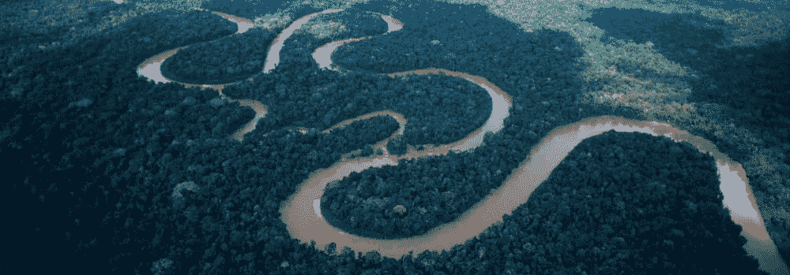
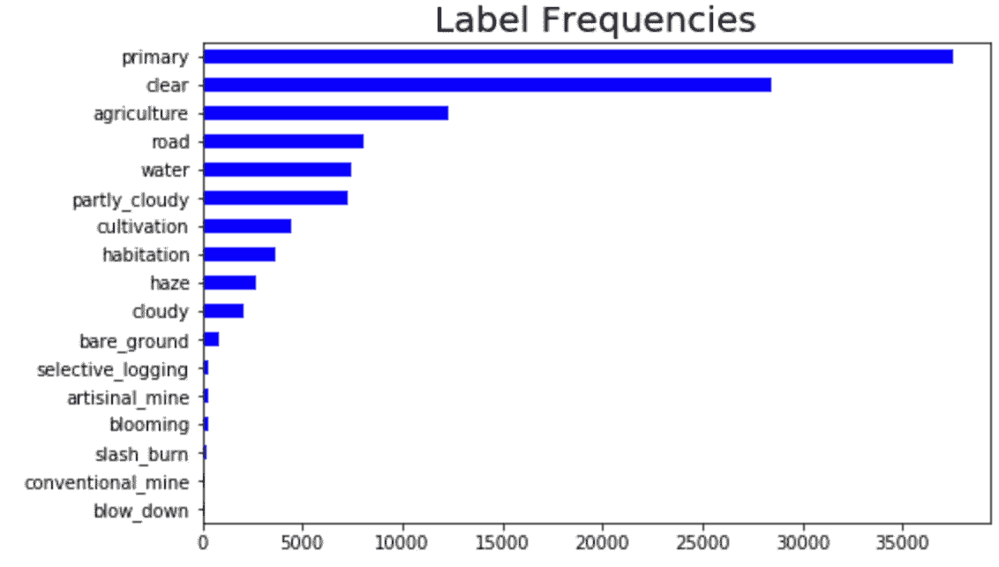
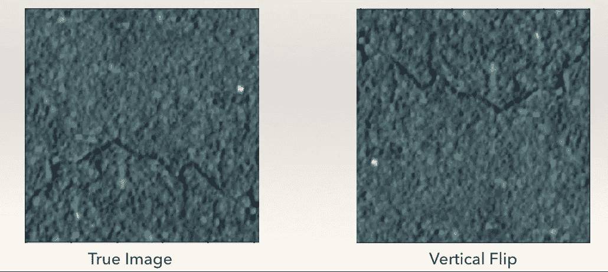
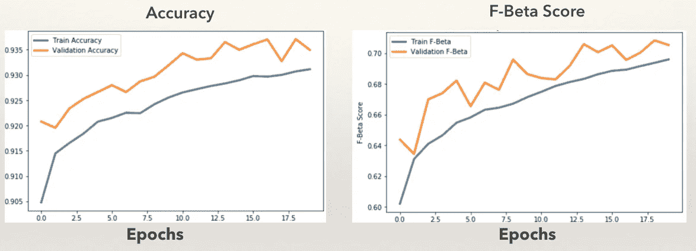
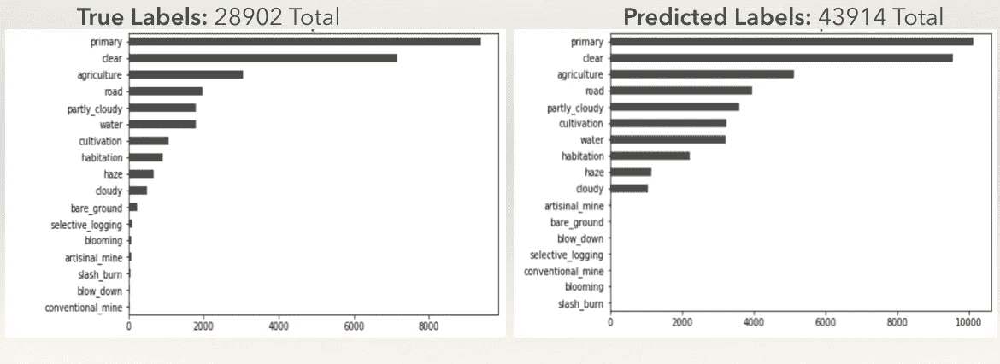

# 巴西亚马逊地区的土地利用和森林砍伐

> 原文：<https://towardsdatascience.com/land-use-and-deforestation-in-the-brazilian-amazon-5467e88933b?source=collection_archive---------8----------------------->

## 使用卫星图像和深度学习进行环境保护

## 简介和问题陈述

为什么是卫星图像？

去年 11 月，在大会上参加数据科学沉浸式课程时，我很兴奋，并确信我将要学习的工具将有许多应用。我几乎不了解 Python，没有接触过数据帧，也不能告诉你太多关于神经网络的知识。但我确信会有令人兴奋的事情发生。

从那以后，我完成了这个项目，最值得骄傲的是，我的顶点项目使用来自[星球](https://planet.com)的卫星图像，根据天气、土地利用和土地覆盖对巴西亚马逊地区的场景进行分类。

**这个项目令人兴奋的原因有很多:**

*   它给了我直接应用新技术解决生态保护问题的经验。
*   这项工作提供了一个机会，让我足不出户就可以研究地球上任何地方的任何生态系统。*(这并不是因为我懒。这并不是因为我不喜欢旅行。我在生态学领域的一个关注点是找到我们可以研究这个星球的方法，而不用年复一年地乘飞机去实地考察和参加会议。这种目前的做法令人感到讽刺和质疑——随着我职业生涯的进一步发展，我仍在试图解开这一点。也许这是我们无法避免的。或者我们可以用新技术来推进这个领域，以更可持续的方式发展。)*
*   它为未来的科学探索打开了新问题、新方法和新项目的潘多拉魔盒！

## 为什么是亚马逊？

许多生态学研究人员将注意力集中在热带和亚热带森林，因为地球上大部分的生物多样性和生物量都集中在这些地区。这些生态系统处于地球生态气候系统的中心，通过水、二氧化碳和氧气的循环影响区域和全球气候动态。

当然，这些森林是大量资源的家园，反过来又面临着来自森林砍伐和土地使用变化的巨大压力——以及全球气候变化。借助 Planet 等公司改进的卫星技术，我们可以找到远程监控这些珍贵生态系统的方法。通过机器学习模型，我们可以实时跟踪这些生态系统的变化，向当地政府和保护组织发出非法林业活动的警报，这些活动威胁着我们森林的生物多样性和生态气候功能。

## 收集数据

这个项目的数据来自这个 2017 [Kaggle](https://www.kaggle.com/c/planet-understanding-the-amazon-from-space/data) 比赛，由 Planet 收集和清理。

然而，为了演示用 Planet 的 [API](https://planetlabs.github.io/planet-client-python/api/index.html) 生成我自己的图像，我构建了脚本来过滤和下载给定感兴趣区域(AOI)的图像。这是该项目的一个令人兴奋的方面，因为我非常喜欢数据管道工程任务，并探索新 API 的功能。

为监督学习分类问题生成我自己的图像的一些挑战是标记和格式化。图像没有固有的标签，因此如果我要收集足够多的图像(可能有数千个)来训练一个健壮的模型，标记可能是一个机械而费力的过程。此外，图像必须是标准大小才能用作神经网络的输入——编写一个程序将图像裁剪和剪切成标准格式本身就是一个项目！

考虑到时间限制，我决定继续研究 Kaggle 数据集。然而，随着时间和权限的增加(即访问 Planet 免费开放的加州图像之外的数据)，Planet 的 API 对于未来的项目和应用来说是一个不可思议的资源。

## Kaggle 数据集

这是我第一次涉足更严肃的大数据项目。该数据集包括一个训练数据集(40，000 张带标签的图像)和一个测试数据集——在竞赛网站上提交和评分的无标签图像。总的来说，这代表了超过 50 GB 的数据—远远超过了我的计算机上的 RAM(稍后会详细介绍)。

这些图像来自 PlanetScope 卫星，分辨率为 3m。包括分析 Geotiff 和可视 JPEG 格式，裁剪为 256 x 256 像素。图像包含四个颜色波段(红、绿、蓝、近红外)，而 JPEGs 被校正为 EDA 的 3 波段视觉产品。

## 探索性数据分析

我的 EDA 的很大一部分包括更广泛地研究卫星图像数据。这是我第一次深入研究计算机视觉项目，所以这对我来说是一项相当大的任务。要了解更多这方面的内容，请查看我的另一篇媒体文章，主题是[理解卫星图像中的图像数据和颜色通道](https://medium.com/@cambostein/understanding-image-data-and-color-histograms-in-satellite-imagery-f5ffaaaca354)。

在建模之前，了解数据集中不同标注分类的分布也至关重要。标签分为两类——天气和土地覆盖。图像只包含一个天气标签，但可以包含多个土地覆盖标签(这是多标签分类)。标签按类别组织如下:

*   **天气标签:**晴，霾，多云，局部多云
*   **土地使用和土地覆盖标签:**原始森林、道路、水、农业、住宅、裸地、耕作、开花、手工采矿、选择性伐木、刀耕火种、常规采矿、排放

下面，我绘制了图像标签在数据集中的出现频率。

Frequency of labels in the train dataset. Images can contain multiple labels

重要的是要注意到我们标签的严重不平衡。这在模型训练中是很重要的——模型将很难识别预测它没有频繁看到的标签所需的模式。

## 图像预处理

由于数据集庞大，需要克服各种障碍。为了准备用于建模的图像，必须从目录中读入图像以供神经网络处理。一种方法是通过名为 [rasterio](https://github.com/mapbox/rasterio) 的库。Rasterio 是一个很棒的库，因为它将地理位置数据保存在 tiffs 中，以防您在项目中使用这些信息。

我编写了一个自定义函数来实现这一点，但是，我缺少在单台机器上实现这一点所需的 RAM，我不得不尝试其他工具。

## 使用 AWS 迁移到云

一旦我掌握了在笔记本电脑上工作的挑战，我就改变了方式，使用亚马逊网络服务的深度学习 GPU 将项目转移到了云上。这让我在使用云中提供的大数据工具方面有了新的体验，并且需要调整弹性块存储卷来适应我的大型数据集。

然而，在使用 AWS 服务器时，我仍然面临内存限制，所以我必须使用 KERAS 自带的图像预处理工具来准备我的数据集进行建模。

## 测试时间增加

神经网络通过识别图像特征中的模式来“学习”。对于每个图像，特征是一个像素。然而，如果某种天气或土地类型只出现在图像的某个区域，神经网络将不会识别出图像中不同位置的完全相同的特征。

在 Keras 图像预处理中，我接触到了 **ImageDataGenerator** 类。这允许我应用测试时增强(随机翻转、旋转、缩放训练图像)来获得更好的建模方法。

Example TTA technique

图像数据生成器成批地从它们的目录中提取图像，读入图像，应用 TTA，并通过网络运行它们。这极大地减少了内存负载，并允许我训练神经网络，并在我的远程服务器上仅使用 7.5 GB RAM 的情况下对超过 50 GB 的图像进行预测。GPU 是令人难以置信的深度学习工具——如此不可思议，以至于我为它们创造了一个迷因！

## 建模

我构建了一个建模管道，可以适应多种模型和交叉验证。我计划训练一个更深层次的神经网络，并设置了一些功能来简化这个过程。不幸的是，在我不得不结束我的项目时，代码中的错误阻止了我在多个交叉验证折叠上训练神经网络(参见下面的限制和未来步骤部分)。

我使用了一个中等大小的卷积神经网络，带有调整大小的训练图像——由于内存和时间限制，缩小到 3 波段，128 x 128 像素。网络架构如下:

*   输入的批量规范化
*   32 过滤卷积层+最大池层+漏失(0.5)
*   64 过滤卷积层+最大池层+下降(0.5)
*   展平输出-128 节点密集连接图层+下降(0.5)
*   17 节点输出层(代表 17 个目标标签类)。

我在 25 个时期内训练了我的模型(首先，20 个时期→权重重新初始化→ 5 个时期)。

## 结果

我跟踪了准确性和 F-Beta 分数(它们遵循相似的趋势)，但主要关注 F-Beta 分数。F-beta 是精确度和召回率(灵敏度)的平均值，包括对假阳性和假阴性的加权惩罚，因此与精确度相比分数较低。与准确度相比，它可以是更严格的分类度量，尤其是对于多标签分类。

验证数据的最终 F-Beta 分数为 **0.843** 。测试数据集上的预测被提交给 Kaggle，并具有相似的 F-Beta (0.834)，表明我的模型在大范围的未知数据上概括得很好。该模型稍有欠拟合，这可能是由于网络中过度激进的 TTA 或过度正则化(在多个层中的 0.5 的下降)，或者是由于对看不见的数据的标注的过度预测。

过度预测导致验证集上 F-beta 分数的相对不稳定性。对于验证数据(其中我们可以跟踪预测与真实标签)，该模型预测了 10，000 张图像的 43，000 多个标签，其中只有 28，000 个真实标签。这可能导致 F-Beta 分数的不稳定性和更高的准确度分数。例如，如果预测每个图像的所有 17 个标签，则预测的准确度为 1(因为每个正确的标签都被考虑在内)。但是，F-Beta 分数会低得多，因为对于实际上不在图像中的所有标签，会有许多假阳性。

Comparison of True and Predicted Label frequencies after model validation.

不平衡的类别也极大地影响了模型预测。模型预测很少包括训练数据中初始观察值少于 1，000 的标签(见上文)。虽然这些图像可能在测试数据集中的代表性较低，但我们的模型能够区分和预测这些特征对于模型的实时应用仍然很重要。

## 未来的步骤和限制

*   **限制每个图像或每个数据集的标签预测数量:**为了纠正过度预测的问题，我可以在转换模型输出(概率)时限制可能的标签总数，以更好地反映标签的可能数量。这会是什么样子？第一，只考虑排名前**T5【n的概率。在那些最高概率中，只接受那些高于阈值的概率。**
*   **使用多个阈值测试预测的 F-beta 分数:**模型输出 17 个*概率*，表示某个标签出现在每个图像中的*可能性*。然后，我们设置一个阈值，只接受高于阈值的概率。这些被转换为 1，意味着该特征在图像中。我对所有标签使用一个阈值。然而，改善模型结果的一种方法是更积极地为各个类别寻找最佳阈值。成功实现 k 重交叉验证和训练 k 个模型将允许 ***k*** 搜索最佳阈值。然后，我们可以选择每个折叠的平均阈值。
*   **引导以平衡标签类别:**我还将通过具有低采样标签的目标图像来引导(创建“复制”不频繁标签的样本)，增强那些图像并将增强的副本添加回数据集中。这可能会改进训练，而不管数据集中标签的初始频率(更多数据，由于扩充而不同的图像)。
*   **投资强大的计算资源:**我的项目中的主要限制是 RAM。虽然访问远程 GPU 对于减少训练时间至关重要，但在整个项目中，我遇到了 RAM 过载的相当大的障碍(尽管我采取了措施来减少批量)。这些内存挑战，以及使用基于云的服务器的自付费用，也使得实验更深层次的神经网络变得困难(我对使用具有“ImageNet”权重的 ResNet 50 的潜力特别兴奋)。
*   **用模型集成进行实验:**我通过在 Kaggle 讨论中的研究了解到集成对于神经网络的价值。在基本水平上，可以训练多个 CNN，并且可能对数据集中的某些标签做出更好的预测。然后可以组合来自每个神经网络的预测，并且对于每个输出(可能的标签)，可以使用线性回归模型来预测每个图像的标签的“真实值”。不同的 CNN 预测将是预测目标值(1 或 0，存在或不存在)的特征。这些新值将仍然受制于用于在每个图像中存在或不存在标签时最终着陆的相同阈值。
*   **考虑模型的有效性和资源的使用:**最有效的建模技术本质上需要无限的资源。虽然复杂的多模型集成方法可能会产生最佳的预测能力，但利益相关者必须考虑构建这样一个庞大的建模系统所需的成本(金钱和时间)，以及如果模型要实时使用，分类速度会降低。这是一个正在进行的，逐例权衡的过程，但必须在深度学习的背景下考虑。

感谢阅读！请随意查看我在 [GitHub](https://github.com/cameronbronstein/Capstone-Satellite-Imagery-and-Deep-Learning-) 上的完整项目库。请分享你对我如何改进这个项目的方法的想法——我很想听听你的想法！

卡梅隆