# 使用 RNNs 进行语言翻译

> 原文：<https://towardsdatascience.com/language-translation-with-rnns-d84d43b40571?source=collection_archive---------1----------------------->

## 建立一个将英语翻译成法语的递归神经网络

*2018 年 8 月 29 日由* [*托马斯·特雷西*](https://ttracey.com/) *，原载* [*发布于 Github*](https://github.com/tommytracey/AIND-Capstone/blob/master/README.md)

[*西班牙语版本*](https://www.ibidem-translations.com/edu/rnn-machine-translation/)*——此贴的西班牙语译文在此处***，由*[*Ibidem Group*](https://www.ibidem-translations.com/spanish.php)*提供。非常感谢***！***

****

**Image Credit: Peter Booth and Alexandra Booth / iStock**

**这篇文章探索了我在 [Udacity 人工智能纳米学位](https://www.udacity.com/course/ai-artificial-intelligence-nanodegree--nd898)项目的[最终项目](https://github.com/tommytracey/AIND-Capstone)中的工作。我的目标是帮助其他学生和专业人士在机器学习(ML)和人工智能(AI)方面建立直觉的早期阶段。**

**尽管如此，请记住，我的职业是产品经理(不是工程师或数据科学家)。因此，接下来的内容是对这个项目中的 ML 概念和算法的半技术性但可接近的解释。如果下面提到的任何事情不准确，或者如果你有*建设性的*反馈，我很乐意听到你的意见。**

**我对这个项目的 Github 回购可以在这里找到。本项目的原始 Udacity 源回购位于[此处](https://github.com/udacity/aind2-nlp-capstone)。**

# **项目目标**

**在这个项目中，我建立了一个深度神经网络，作为机器翻译管道的一部分。管道接受英语文本作为输入，并返回法语翻译。目标是尽可能实现最高的翻译准确性。**

# **为什么机器翻译很重要**

**相互交流的能力是人类的一个基本组成部分。全世界有将近 7000 种不同的语言。随着我们的世界变得越来越紧密，语言翻译为来自不同国家和种族的人们提供了重要的文化和经济桥梁。一些比较明显的用例包括:**

*   ****商业**:国际贸易、投资、合同、金融**
*   ****商业**:旅游、购买外国商品和服务、客户支持**
*   ****媒体**:通过搜索获取信息，通过社交网络分享信息，内容本地化和广告**
*   **教育:分享想法，合作，翻译研究论文**
*   **政府:外交关系，谈判**

**为了满足这些需求，技术公司正在大力投资机器翻译。这项投资和深度学习的最新进展极大地提高了翻译质量。根据谷歌的说法，[与之前在](https://www.washingtonpost.com/news/innovations/wp/2016/10/03/google-translate-is-getting-really-really-accurate)[谷歌翻译](https://translate.google.com/)中使用的基于短语的方法相比，切换到深度学习使翻译准确度提高了 60%。今天，谷歌和微软可以翻译 100 多种不同的语言，其中许多语言的准确度已经接近人类水平。**

**然而，尽管机器翻译已经取得了很大的进步，但它仍然不完美。😬**

****

**Bad translation or extreme carnivorism?**

# **本项目的方法**

**为了将英语文本的语料库翻译成法语，我们需要建立递归神经网络(RNN)。在深入实现之前，让我们先对 rnn 建立一些直觉，以及为什么它们对 NLP 任务有用。**

## **RNN 概述**

**rnn 被设计成接受文本序列作为输入，或者返回文本序列作为输出，或者两者都接受。之所以称之为递归，是因为网络的隐藏层有一个循环，其中每个时间步的输出和单元状态成为下一个时间步的输入。这种重现是一种记忆形式。它允许上下文信息在网络中流动，以便先前时间步的相关输出可以应用于当前时间步的网络操作。**

**这类似于我们阅读的方式。当你读这篇文章的时候，你正在储存以前的单词和句子中的重要信息，并用它作为理解每个新单词和句子的上下文。**

**其他类型的神经网络(还)做不到这一点。想象一下，您正在使用卷积神经网络(CNN)来执行电影中的对象检测。目前，没有办法从先前场景中检测到的对象信息通知模型在当前场景中检测到的对象。例如，如果在前一个场景中检测到法庭和法官，该信息可以帮助正确分类当前场景中法官的木槌，而不是将其错误分类为锤子或木槌。但是 CNN 不允许这种类型的时间序列上下文像 RNNs 一样在网络中流动。**

## **RNN 设置**

**根据不同的用例，您可能希望设置您的 RNN 来以不同的方式处理输入和输出。对于这个项目，我们将使用多对多流程，其中输入是一系列英语单词，输出是一系列法语单词(下图中左起第四个)。**

**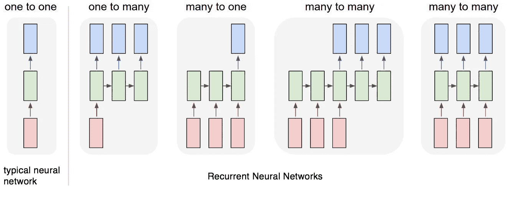**

**Diagram of different RNN sequence types. Credit: [Andrej Karpathy](http://karpathy.github.io/2015/05/21/rnn-effectiveness/)**

> **每个矩形是一个向量，箭头代表函数(如矩阵乘法)。输入向量是红色的，输出向量是蓝色的，绿色向量代表 RNN 状态(稍后会有更多介绍)。**
> 
> **从左到右:(1)没有 RNN 的普通处理模式，从固定大小的输入到固定大小的输出(例如图像分类)。(2)序列输出(例如图像字幕拍摄图像并输出一句话)。(3)序列输入(例如，情感分析，其中给定句子被分类为表达积极或消极情感)。(4)顺序输入和顺序输出(例如机器翻译:一个 RNN 读一句英语，然后输出一句法语)。(5)同步序列输入和输出(例如，视频分类，其中我们希望标记视频的每一帧)。请注意，在每种情况下，长度序列都没有预先指定的约束，因为递归转换(绿色)是固定的，可以应用任意多次。**
> 
> **— Andrej Karpathy，[递归神经网络的不合理有效性](http://karpathy.github.io/2015/05/21/rnn-effectiveness/)**

# **建设管道**

**下面是各种预处理和建模步骤的总结。高级步骤包括:**

1.  ****预处理**:加载和检查数据、清洗、分词、填充**
2.  ****建模**:构建、训练、测试模型**
3.  ****预测**:生成英语到法语的特定翻译，并将输出翻译与实际翻译进行比较**
4.  ****迭代**:迭代模型，试验不同的架构**

**要获得包括源代码在内的更详细的演练，请查看项目报告中的 [Jupyter 笔记本。](https://github.com/tommytracey/AIND-Capstone/blob/master/machine_translation.ipynb)**

## **结构**

**在这个项目中，我们使用 Keras 作为前端，TensorFlow 作为后端。我更喜欢在 TensorFlow 上使用 Keras，因为语法更简单，这使得构建模型层更直观。但是，Keras 有一个代价，因为您失去了进行细粒度定制的能力。但这不会影响我们在这个项目中构建的模型。**

# **预处理**

## ****加载&检查数据****

**这是一个数据样本。输入是英语句子；输出是法语的相应翻译。**

**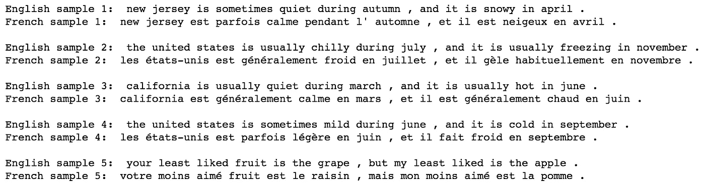**

**当我们进行字数统计时，我们可以看到数据集的词汇非常少。这是这个项目的设计。这允许我们在合理的时间内训练模型。**

**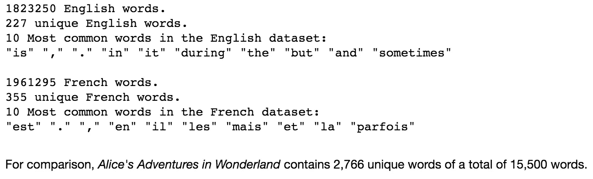**

## **清洁**

**此时不需要进行额外的清洁。数据已经被转换为小写并被拆分，因此所有单词和标点符号之间都有空格。**

****注意**:对于其他 NLP 项目，您可能需要执行额外的步骤，例如:移除 HTML 标签、移除停用字词、移除标点符号或转换为标签表示、标注词性或执行实体提取。**

## **标记化**

**接下来，我们需要对数据进行标记化——即，将文本转换成数值。这允许神经网络对输入数据执行操作。对于这个项目，每个单词和标点符号将被赋予一个唯一的 ID。(对于其他 NLP 项目，给每个字符分配一个唯一的 ID 可能是有意义的。)**

**当我们运行 tokenizer 时，它会创建一个单词索引，然后用来将每个句子转换成一个向量。**

**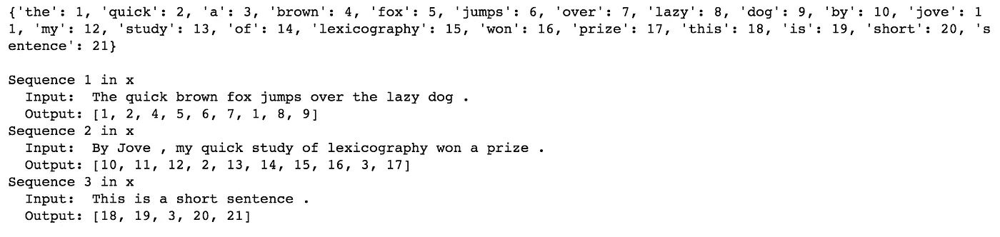**

## **填料**

**当我们将单词 id 序列输入到模型中时，每个序列都需要有相同的长度。为了实现这一点，填充被添加到任何比最大长度短的序列(即比最长的句子短)。**

**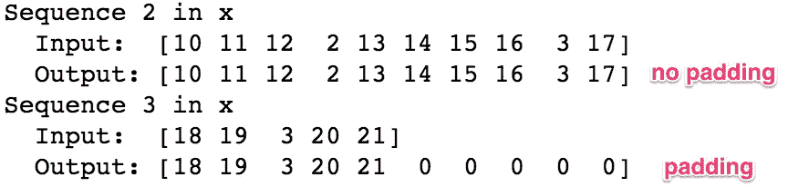**

## **一键编码(未使用)**

**在这个项目中，我们的输入序列将是一个包含一系列整数的向量。每个整数代表一个英文单词(如上图)。然而，在其他项目中，有时需要执行一个额外的步骤来将每个整数转换成一个独热编码向量。我们在这个项目中没有使用一键编码(OHE)，但是你会在某些图中看到它的引用(如下图所示)。我只是不想让你困惑。**

**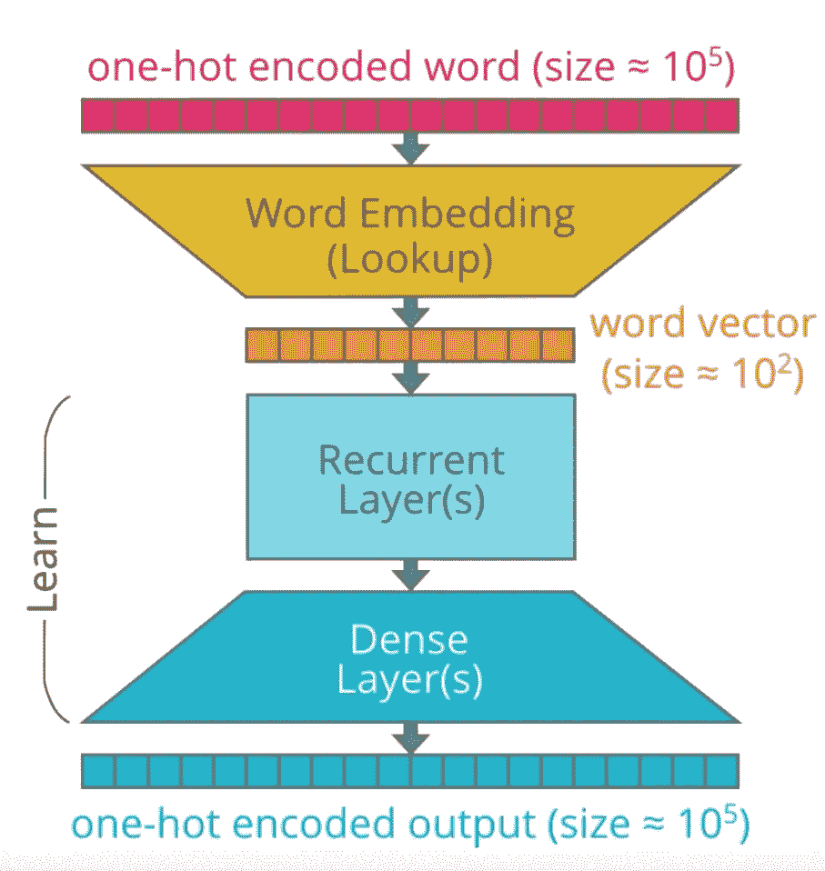**

**OHE 的优势之一是效率，因为它可以以比其他编码更快的时钟速率运行。另一个优点是，OHE 可以更好地表示不同值之间没有顺序关系的分类数据。例如，假设我们将动物分为哺乳动物、爬行动物、鱼类或鸟类。如果我们将它们分别编码为 1，2，3，4，我们的模型可能会假设它们之间有一个自然的排序，但实际上并没有。把我们的数据组织成哺乳动物在爬行动物之前是没有用的。这可能会误导我们的模型，导致糟糕的结果。然而，如果我们随后对这些整数应用一键编码，将它们更改为二进制表示形式(分别为 1000、0100、0010、0001 ),那么模型就无法推断出序数关系。**

**但是，OHE 的一个缺点是向量会变得很长很稀疏。向量的长度由词汇表决定，即文本语料库中唯一单词的数量。正如我们在上面的数据检查步骤中看到的，我们这个项目的词汇量非常小——只有 227 个英语单词和 355 个法语单词。相比之下，[牛津英语词典有 172000 个单词。但是，如果我们包括各种专有名词、单词时态和俚语，每种语言可能有数百万个单词。例如，](https://en.oxforddictionaries.com/explore/how-many-words-are-there-in-the-english-language/)[谷歌的 word2vec](http://mccormickml.com/2016/04/12/googles-pretrained-word2vec-model-in-python/) 是在 300 万个独特词汇的基础上训练出来的。如果我们在这个词汇表中使用 OHE，每个单词的向量将包括一个被 2，999，999 个零包围的正值(1 )!**

**而且，由于我们正在使用嵌入(在下一步中)来进一步编码单词表示，我们不需要为 OHE 费心。对于这么小的数据集，任何效率提升都是不值得的。**

# **建模**

**首先，让我们从高层次上分析一下 RNN 的架构。参考上图，我们需要了解模型的几个部分:**

1.  ****输入**。输入序列被输入到模型中，每个时间步长一个单词。每个单词都被编码为一个唯一的整数或独一无二的编码向量，映射到英语数据集词汇。**
2.  ****嵌入层**。嵌入用于将每个单词转换成一个向量。向量的大小取决于词汇的复杂程度。**
3.  ****递归层(编码器)**。这是将先前时间步骤中的单词向量的上下文应用于当前单词向量的地方。**
4.  ****密集层(解码器)**。这些是典型的全连接层，用于将编码输入解码成正确的翻译序列。**
5.  ****输出**。输出以整数序列或独热编码向量的形式返回，然后可以映射到法语数据集词汇表。**

## **嵌入**

**嵌入允许我们捕捉更精确的句法和语义单词关系。这是通过将每个单词投影到 n 维空间中来实现的。意义相似的词占据这个空间的相似区域；两个词越接近，就越相似。单词之间的向量通常代表有用的关系，如性别、动词时态，甚至地缘政治关系。**

****

**Photo credit: [Chris Bail](https://cbail.github.io/textasdata/word2vec/rmarkdown/word2vec.html)**

**从头开始在大型数据集上训练嵌入需要大量的数据和计算。因此，我们通常使用预先训练好的嵌入包，如[手套](https://nlp.stanford.edu/projects/glove/)或 [word2vec](https://mubaris.com/2017/12/14/word2vec/) ，而不是自己动手。以这种方式使用时，嵌入是一种迁移学习的形式。然而，由于我们这个项目的数据集只有很少的词汇和很低的语法变化，我们将使用 Keras 来训练我们自己的嵌入。**

## **编码器和解码器**

**我们的序列到序列模型链接了两个递归网络:编码器和解码器。编码器将输入汇总到一个上下文变量中，也称为状态。然后解码该上下文，并生成输出序列。**

**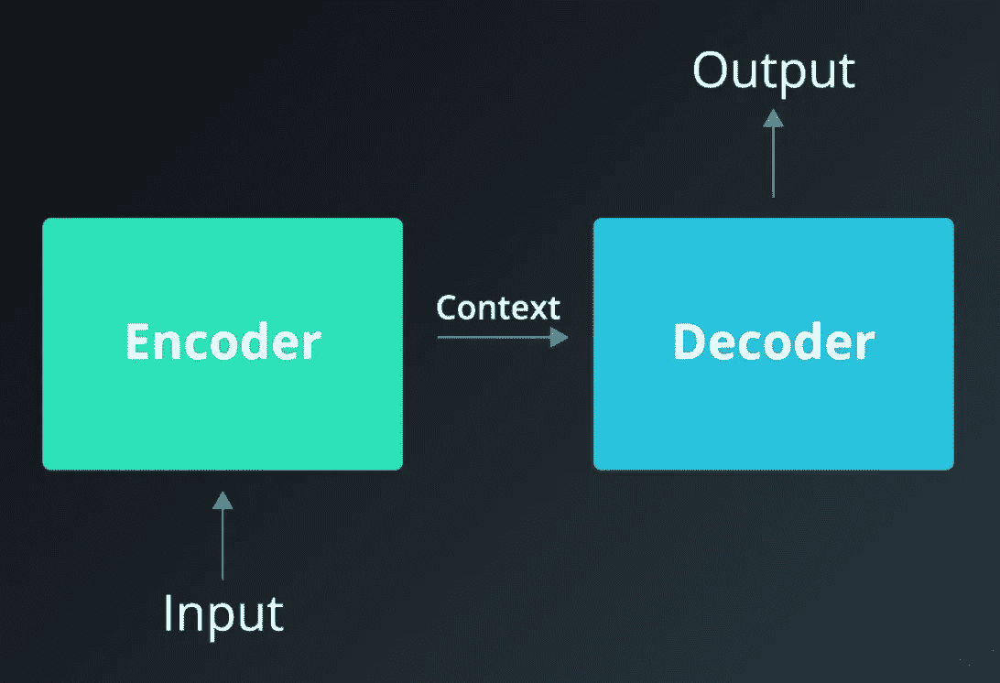**

**Image credit: [Udacity](https://classroom.udacity.com/nanodegrees/nd101/parts/4f636f4e-f9e8-4d52-931f-a49a0c26b710/modules/c1558ffb-9afd-48fa-bf12-b8f29dcb18b0/lessons/43ccf91e-7055-4833-8acc-0e2cf77696e8/concepts/be468484-4bd5-4fb0-82d6-5f5697af07da)**

**由于编码器和解码器都是递归的，它们有循环，在不同的时间步处理序列的每个部分。为了描述这一点，最好展开网络，这样我们就可以看到每个时间点发生了什么。**

**在下面的例子中，编码整个输入序列需要四个时间步长。在每个时间步，编码器“读取”输入单词，并对其隐藏状态进行转换。然后将隐藏状态传递给下一个时间步。请记住，隐藏状态表示流经网络的相关上下文。隐藏状态越大，模型的学习能力越大，但计算需求也越大。当我们讨论门控循环单元(GRU)时，我们将更多地讨论隐藏状态中的转换。**

**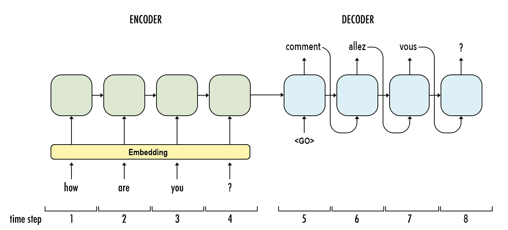**

**Image credit: modified version from [Udacity](https://classroom.udacity.com/nanodegrees/nd101/parts/4f636f4e-f9e8-4d52-931f-a49a0c26b710/modules/c1558ffb-9afd-48fa-bf12-b8f29dcb18b0/lessons/43ccf91e-7055-4833-8acc-0e2cf77696e8/concepts/f999d8f6-b4c1-4cd0-811e-4767b127ae50)**

**现在，请注意，对于序列中第一个单词之后的每个时间步长，有两个输入:隐藏状态和序列中的一个单词。对于编码器，它是输入序列中的下一个字*。对于解码器，它是输出序列中的*前一个*字。***

*此外，请记住，当我们提到“单词”时，我们实际上是指来自嵌入层的单词的*矢量表示*。*

*这是另一种可视化编码器和解码器的方法，除了普通话输入序列。*

**

*Image credit: [xiandong79.github.io](https://xiandong79.github.io/seq2seq-%E5%9F%BA%E7%A1%80%E7%9F%A5%E8%AF%86)*

## *双向层*

*现在我们已经了解了上下文是如何通过隐藏状态在网络中流动的，让我们更进一步，允许上下文双向流动。这就是双向层的作用。*

**

*在上面的例子中，编码器只有历史上下文。但是，提供未来的上下文可以获得更好的模型性能。这似乎与人类处理语言的方式相违背，因为我们只能单向阅读。然而，人类经常需要未来的上下文来解释正在说的话。换句话说，有时直到最后提供了一个重要的单词或短语，我们才理解一个句子。尤达一说话就会这样。😑 🙏*

*为了实现这个，我们同时训练两个 RNN 层。第一层按原样输入输入序列，第二层输入反向拷贝。*

*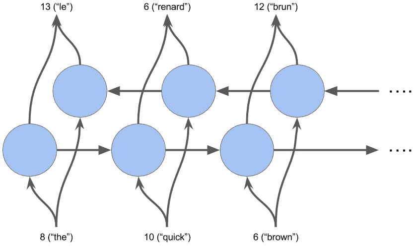*

*Image credit: Udacity*

## *具有门控递归单元的隐藏层(GRU)*

*现在让我们让我们的 RNN 更聪明一点。与其让*隐藏状态的所有*信息在网络中流动，不如我们更有选择性？也许一些信息更相关，而其他信息应该被丢弃。这基本上就是门控循环单元(GRU)所做的。*

*GRU 中有两个门:更新门和复位门。[西蒙·科斯塔迪诺夫的这篇文章](/understanding-gru-networks-2ef37df6c9be)详细解释了这些。总之，**更新门** (z)有助于模型确定有多少来自先前时间步骤的信息需要传递到未来。同时，**复位门** (r)决定要忘记多少过去的信息。*

*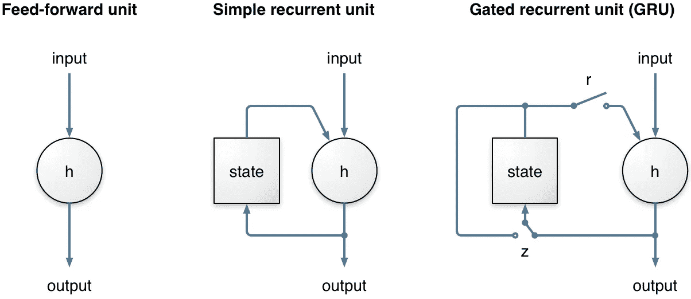*

*Image Credit: [analyticsvidhya.com](https://www.analyticsvidhya.com/blog/2017/12/introduction-to-recurrent-neural-networks/gru/)*

## *最终模型*

*既然我们已经讨论了模型的各个部分，让我们来看看代码。同样，所有的源代码都可以在笔记本 ( [)的](https://tommytracey.github.io/AIND-Capstone/machine_translation.html)[中找到。html 版本](https://github.com/tommytracey/AIND-Capstone/blob/master/machine_translation.ipynb))。*

# *结果*

*最终模型的结果可以在[笔记本](https://tommytracey.github.io/AIND-Capstone/machine_translation.html)的单元格 20 中找到。*

*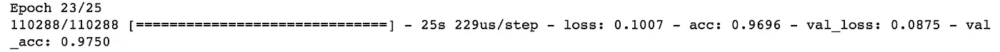*

*验证准确率:97.5%*

*训练时间:23 个时代*

# *未来的改进*

1.  ***进行适当的数据分割(培训、验证、测试)**。目前，没有测试集，只有训练和验证。显然，这不符合最佳实践。*
2.  ***LSTM +关注**。这是过去几年中 rnn 的事实架构，尽管有一些限制。我没有使用 LSTM，因为我已经在另一个项目中用 TensorFlow 实现了它，我想在这个项目中用 GRU + Keras 做实验。*
3.  *在更大更多样化的文本语料库上训练。这个项目的文本语料库和词汇非常小，语法变化很小。因此，模型非常脆弱。为了创建一个更好的概括模型，你需要在语法和句子结构上有更多可变性的更大的数据集上进行训练。*
4.  ***残留层**。你可以添加残余层到一个深 LSTM RNN，如本文[所述](https://arxiv.org/abs/1701.03360)。或者，使用剩余层作为 LSTM 和 GRU 的替代，如这里[所述](http://www.mdpi.com/2078-2489/9/3/56/pdf)。*
5.  ***嵌入**。如果你在一个更大的数据集上训练，你肯定应该使用一组预训练的嵌入，比如 [word2vec](https://mubaris.com/2017/12/14/word2vec/) 或者 [GloVe](https://nlp.stanford.edu/projects/glove/) 。更好的是，使用 ELMo 或 BERT。*

*   ***嵌入语言模型(ELMo)** 。2018 年[通用嵌入](https://medium.com/huggingface/universal-word-sentence-embeddings-ce48ddc8fc3a)最大的进步之一是 [ELMo](https://allennlp.org/elmo) ，由[艾伦人工智能研究所](https://allennlp.org)开发。ELMo 的主要优势之一是它解决了一词多义的问题，即一个单词有多个意思。ELMo 是基于上下文的(不是基于单词的)，因此一个单词的不同含义在嵌入空间中占据不同的向量。使用 GloVe 和 word2vec，每个单词在嵌入空间中只有一个表示。例如,“queen”这个词可以指皇室的女族长、蜜蜂、棋子或 20 世纪 70 年代的摇滚乐队。对于传统的嵌入，所有这些含义都与单词 *queen* 的一个向量联系在一起。对于 ELMO，这是四个不同的向量，每个向量都有一组独特的上下文单词，占据嵌入空间的相同区域。例如，我们期望在与国际象棋游戏相关的类似向量空间中看到像*皇后*、*车*和*卒*这样的词。我们期待看到*蜂后*、*蜂房*和*蜂蜜*出现在与蜜蜂相关的不同向量空间中。这极大地促进了语义编码。*
*   ***双向编码器表示来自** [**变压器**](https://ai.googleblog.com/2017/08/transformer-novel-neural-network.html) **(BERT)** 。2019 年到目前为止，双向嵌入最大的进步是 [BERT](https://ai.googleblog.com/2018/11/open-sourcing-bert-state-of-art-pre.html) ，由谷歌开源。伯特有什么不同？*

> *诸如 word2vec 或 GloVe 之类的上下文无关模型为词汇表中的每个单词生成单个单词嵌入表示。例如，单词“bank”在“bank account”和“bank of the river”中具有相同的上下文无关的表示相反，上下文模型根据句子中的其他单词生成每个单词的表示。例如，在句子“我访问了银行帐户”中，单向上下文模型将基于“我访问了”而不是“帐户”来表示“银行”然而，BERT 使用它的上一个和下一个上下文来表示“银行”——“我访问了……账户”——从深度神经网络的最底层开始，使其具有深度双向。
> —雅各布·德夫林和张明蔚，[谷歌人工智能博客](https://ai.googleblog.com/2018/11/open-sourcing-bert-state-of-art-pre.html)*

# *接触*

*我希望你觉得这很有用。同样，如果你有任何反馈，我很想听听。欢迎在评论中发表。*

*如果你想讨论其他合作或职业机会，你可以在 LinkedIn 这里找到我[，或者在这里查看我的作品集](https://linkedin.com/in/thomastracey)。*