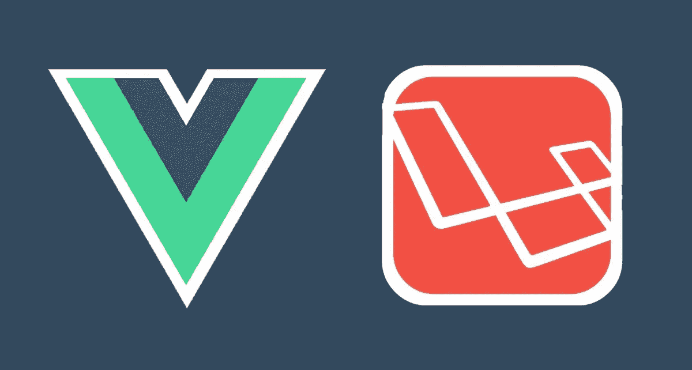

# Laravel 和 Vue.js:这对情侣为什么会红？

> 原文：<https://towardsdatascience.com/laravel-and-vue-c30770f1e88?source=collection_archive---------3----------------------->

[source](https://www.resourcifi.com/hire-python-developer/)

你可能想知道 VueJS 和 Laravel 怎么会有关系。VueJS 是一个 Javascript 框架，Laravel 是一个 PHP 框架，它们不可能互相服务于任何目的，不是吗？记住，如果在任何时候你觉得事情超出了你的能力范围，你可以随时[雇佣一个开发人员](https://www.resourcifi.com/hire-developers-in-india/)。

然而，要理解这一点，您首先需要用这么多的事实来启发自己，这是一个详尽的停止，在这里您将找到您需要了解的关于这两个框架的一切，更不用说它们如何对彼此有用了。再来说说 Vue。JS 第一。

# 简单介绍一下 Vue。射流研究…

如果你还不知道的话，Vue。JS 是一个非常高级的 Javascript 框架，是为设计用户界面和单页应用程序而构建的。VueJS 由尤雨溪开发，是一个开源的 javascript 框架，具有自适应的架构。它侧重于声明性呈现和组件组合。

目前 Vue.js 在 GitHub 上有超过 [148k 颗星，这说明了它在开发者中的受欢迎程度。如果你是一个前端框架爱好者，那么你会惊讶于它是如何无缝地集成到大型项目中并简化 web 开发过程的。](https://github.com/vuejs/vue)

## **好书** : [将统治 2020 年的顶级软件趋势](https://www.standardfirms.com/top-software-development-trends/)

## VueJS 的 5 大特点

到目前为止，我上面所说的一切都是空谈，但让我们深入了解它的具体特性，并向您展示为什么 Vue 应该是您的下一个框架

## 虚拟 Dom

您在 Vue 中引入的任何修改都不会直接反映在 DOM 中。相反，DOM 的副本是作为 Javascript 数据结构创建的。如果需要进行更改，那么它们会被引入到数据结构的 Javascript 中。然后将它与初始数据结构进行比较，这样可以节省大量时间。

## 数据绑定

数据绑定是一个过程，通过该过程，用户可以使用 web 浏览器操纵网页的元素。它利用动态 HTML，不需要任何复杂的脚本或编程。在这个函数的帮助下，您可以轻松地管理值或将它们分配给 HTML 属性。

## 成分

VueJS 的一个特征是它能够重用组件。这些组件帮助您扩展基本的 HTML 元素来封装可重用的代码。

## 动画/过渡

在 VueJS 中，当 HTML 元素被添加到 DOM 或从 DOM 中删除时，您会发现几种在 HTML 元素中应用转换的方法。它有一个内置的过渡组件，必须环绕元素才能获得过渡效果。我们也可以添加第三方动画库。

## 模板

Vue。JS 附带了基于 HTML 的模板，这些模板将 DOM 与 Vue 实例数据绑定在一起。Vuejs 将这些模板编译成虚拟 DOM 渲染函数。为了使用渲染函数模板，我们必须用渲染函数替换模板。

# 关于拉勒维尔的一点简介

Laravel 是一个基于 PHP 的免费开源 web 框架。Laravel 由 Taylor Otwell 创建，旨在提高生产率。他们每 6 个月推出一个新版本，最近他们在两周前的 9 月 3 日推出了最新版本，这个版本有长期支持(LTS)。Laravel 具有过多的功能。让我们来看看其中的一些。

***也读:*** *如何在预算内* [*雇佣 React 开发者*](https://www.resourcifi.com/hire-reactjs-developer/) *？*

## Laravel 的五大特点

## 雄辩的 ORM

ORM 或对象关系映射是活动记录模式的 PHP 实现。它允许我们做的是将数据库表表示为类。如果您感到困惑，这意味着您可以定义一个类，比如说“User”，它将绑定到数据库中的“users”表。现在“users”表中的每一行都将被表示为 Laravel 中 User 类的一个实例。

## 模板引擎

Laravel 因其轻量级模板而得到高度认可，该模板可以帮助您使用动态内容播种来创建令人惊叹的布局。最重要的是，它有多个包含 CSS 和 JS 代码的小部件，结构坚固。laravel 框架的模板是专门设计来创建具有独特部分的简单布局的。

## 技工

Laravel 提供了一个名为 Artisan 的内置命令行工具。它们用于创建数据库结构、框架代码，并构建它们的迁移，这使得管理数据库系统变得非常容易。不仅如此，它还可以通过命令行瞬间交错生成基本的 MVC 文件，并管理那些资产及其各自的配置。

## 自动包裹递送

过去，安装数据包并不容易，直到 Laravel 5.5 推出了一个方便的解决方案。顾名思义，Automatic Package Delivery 自动检测用户想要安装的软件包，而不需要设置任何别名或提供者来安装新的软件包。

## 数据库迁移

Laravel 的命令行界面(CLI)Artisan 使数据库迁移和播种变得极其容易。如果您将所有数据库工作都放在迁移和种子中，那么您可以轻松地将更改迁移到您拥有的任何其他开发机器上。

***好读:*** *现在你可以* [*以 60%的成本雇佣 laravel 开发者*](https://www.resourcifi.com/hire-laravel-developer/)

# *VueJS 是如何工作的？*

*如果您在事件驱动的前端 JavaScript 框架出现之前曾经为 web 编程，那么您可能会理解尝试更新文档对象模型(DOM)会带来相当大的困难和低效。*

*更新 DOM 仅仅意味着您必须获取页面，对其中的一小部分进行必要的更改，然后重新加载整个 DOM，这样更改才能生效。例如，如果你正在观看一个 YouTube 视频，并且添加了新的评论，那么整个页面都必须重新加载，这也意味着你的视频将从头开始。*

*Vue 通过整合虚拟 DOM 来管理用户将看到的内容，努力应对这些挑战。就像我上面说的，Vue 本质上做的是创建 DOM 的副本并存储它。如果对 DOM 的一部分做了任何更改，它只更新 DOM 的那个部分，而不重新加载整个 DOM。这意味着评论会在你没有注意到的情况下更新。*

*Vue 提供了可反应的和可组合的视图组件。它响应任何更新，并立即触发 DOM 中所需的更改。它的可组合组件可以选择和组装成各种组合，以满足任何需要。你可以为所有的事情准备组件，并根据你的需要重用它们。如果这很难理解，你可以雇佣一个 VueJS 开发者。*

****好读:*** *如何能在印度* [*雇佣安卓开发者*](https://www.resourcifi.com/hire-android-developer/) *以更少的成本**

# *为什么我们应该将 Vue 与 Laravel 一起使用？*

*尽管 Laravel 和 VueJS 来自不同的编程语言，而且 VueJS 如何支持 Laravel 似乎无关紧要，但令我惊讶的是，它支持的方式不止一种。以下是您应该将 VueJS 与 Laravel 一起使用的原因:-*

## *1.一切都发生在前端*

*当今的 Web 应用程序是事件驱动的。它们的构建是为了确保用户拥有无缝的体验，就像他们使用安装在他们计算机上的应用程序一样。所有的改变都发生在前端，用户再也不用重新加载页面了(感谢 JavaScript)。*

## *2.反应式组件构成了一个优秀的事件驱动应用程序*

*Vue 可以帮助您构建一个全面的事件驱动的 web 应用程序，处理前端的所有活动。它还提供了可以任意使用的可组合组件。鉴于它与 Laravel 配合得很好，您只需往返几次就可以从 Laravel 应用程序请求数据，并通过切换组件来更改 UI，而无需重新加载页面。*

*您可以简单地在您的 Vue(前端)中提示 UI 更改，这反过来为您的用户提供了一个惊人的体验。它可以简单到使页面上的文本可编辑，或者换出整个组件来加载用户请求的视频，而无需重新加载页面。*

*鉴于 Vue 的速度和性能，这发生得非常快和顺利，而不占用你的电脑资源这么多。*

## *3.构建最佳复杂前端页面*

*如果您考虑构建一个部分需要频繁更新的应用程序，除了让前端完全运行在 JavaScript 上，您没有其他选择。*

*没有虚拟 DOM 的普通 JavaScript 或 jQuery 或其他 JavaScript 库面临的挑战是，随着更新频率的增加或跟踪变化的数据量的显著增加，您很快就会遇到性能问题。对 DOM 的更改将逐渐不再是即时的，您将开始体验到明显的性能滞后。*

*当您使用 Vue 组件编写应用程序时，每个组件的依赖关系都会在呈现过程中被自动跟踪，因此当数据发生变化时，系统可以准确地知道哪个组件实际上需要更新。这使得对 DOM 的所有更新使用最少的资源，从而提高了整个应用程序的效率。*

*Vue 还与 Flux、Redux 和 Vuex 等状态管理器兼容，这些管理器在管理复杂应用程序中的数据流方面表现出色。Vue 对单向数据绑定模型的利用也使得复杂应用程序中的状态管理更加容易。*

## *4.单页应用程序*

*我想分享一个个人观点——单页应用程序是过去十年中互联网上发生的最伟大的事情。它向比以前更广泛的用户开放了应用程序。*

*当你考虑到美国和欧洲某些地区之外的许多互联网用户在上网方面有困难时，你开始意识到单页应用程序在向他们提供丰富的网络体验方面所起的作用。*

*您的整个应用程序资产被加载一次(其中大部分被缓存)，当用户使用它时，您的应用程序所做的只是请求数据，这通常需要很低的带宽来完成。*

## *5.易于学习和使用*

*Vue 很容易进入。作为开发人员，它为您提供的选项很少，而且抽象了很多。当你使用 Vue 时，你会觉得你在编写普通的 JavaScript，你可以用普通的 JavaScript 编写一个简单的应用程序，它在 Vue 中仍然有效。*

*Vue 的另一个优点是你的有效 HTML 也是一个有效的 Vue 模板。您可以将 CSS 保留在外部，也可以根据您的应用程序需求用 JavaScript 来处理它。您还可以利用作用域样式，在不影响其他组件的情况下，动态地将样式更改应用于单个组件。*

*如果您熟悉 JavaScript，只需花一天时间阅读文档，就可以用 Vue 构建一个不平凡的应用程序。*

# *结论*

*现在，您已经非常详细地了解了 Vue 和 Laravel，并且了解了如何将 Laravel 和 VueJS 集成在一起，将有助于您获得两者的最佳效果。这些框架分别为世界上一些主要的 web 应用程序做出了贡献，想象一下你可以用它们一起做什么。如果你想[雇佣一个 PHP 开发人员](https://www.resourcifi.com/hire-php-developer/)或者甚至[雇佣一个 VueJS 开发人员](https://www.resourcifi.com/hire-vuejs-developer/)，你可以很容易地找到他们，因为他们是市场上最受欢迎的一些框架。*