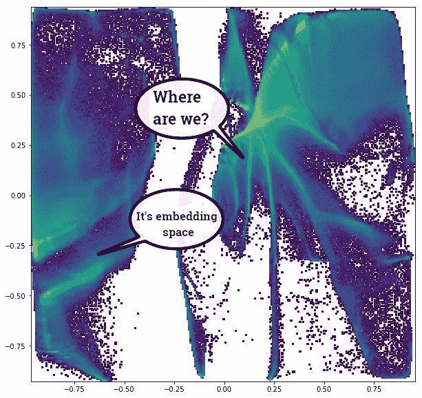
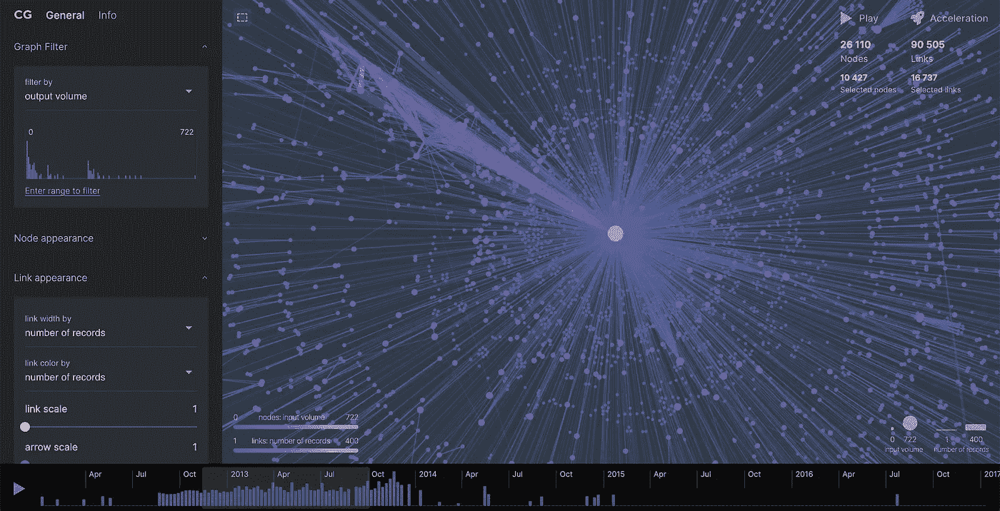

# 大型图形可视化工具和方法

> 原文：<https://towardsdatascience.com/large-graph-visualization-tools-and-approaches-2b8758a1cd59?source=collection_archive---------2----------------------->

怎么办，如果你需要可视化一个大型网络图但是你尝试的所有工具都只能画一个毛球或者吃掉你所有的 RAM 挂你的机？两年多来，我一直从事大型图形(上亿个节点和顶点)的工作，并且尝试了很多工具和方法。但是我仍然没有找到任何好的调查，所以现在我自己写这样一份调查。

(这是我在 habr 上的文章的翻译，原文是俄语)

# 为什么要可视化一个图表呢？

1.  **找什么找什么**
    通常，我们只是简单地有一组顶点和边作为输入。我们可以根据这样的数据计算一些统计数据或图形度量，但这还不足以了解结构。一个好的可视化可以清楚地显示图形中是否有一些集群或桥，或者可能是均匀的云，或者其他什么。
2.  为了给公众留下深刻印象，数据可视化显然是用来展示的。这是展示已完成工作的结论的好方法。例如，如果您解决了一个聚类问题，您可以通过标签为您的图着色，并显示它们是如何连接的。
3.  **获取特征**
    尽管大多数图形可视化工具只是为了制作一些图片而创建的，但它们也是很好的降维工具。表示为邻接矩阵的图是高维空间中的数据。当我们画它的时候，每个顶点有两个(通常)坐标。这些坐标也可以用作特征。这个空间中顶点之间的接近意味着相似。

## 大图表有什么问题？

我的意思是“大图”的大小大约从 10K 顶点和/或边。尺寸小一点的通常没有问题。通过几分钟的搜索，你能找到的所有工具很可能至少可以接受。大型网络有什么问题？主要有两个问题:可读性和速度。通常，大型图形的可视化看起来很混乱，因为在一个图中有太多的对象。此外，图形可视化算法大多有可怕的算法复杂性:边或顶点的数量的二次或三次依赖。就算等一次结果，找到更好的参数也太久了。

# 关于这个问题已经写了什么？

**[1] Helen Gibson，Joe Faith 和 Paul Vickers:“信息可视化二维图形布局技术综述”**

本文的作者讲述了现有的图形可视化方法以及它们是如何工作的。还有一个很好的表格，里面有关于算法、它们的特性和复杂性的信息。我在这篇文章中使用了那篇论文中的一些图片。

**[2]Oh-Hyun Kwon、Tarik Crnovrsanin 和 Kwan-刘妈“在这种布局下，图表看起来会是什么样？大型图形可视化的机器学习方法"**

作者做了大量的工作。他们尝试了所有可能的算法。然后他们画出来，人工评估相似度。之后，他们拟合模型来预测图表在这种布局下会是什么样子。我也使用了这幅作品中的一些图片。

# 理论部分

布局是一种将坐标映射到每个顶点的方法。通常，这是 2D 平面上的坐标。

## 什么是好的布局？

很容易判断某物看起来是好是坏。命名标准并不容易，机器怎么能评估它。为了做出所谓的“好”布局，可以使用美学度量。以下是其中的一些:

1.  最小边缘交点
    显而易见:过多的交点会使情节看起来混乱。
2.  相邻的顶点比不相邻的顶点彼此更靠近
    这是连接的节点应该彼此靠近的逻辑。根据定义，它代表了图表中的主要信息。
3.  社区被分组为簇
    如果有一组顶点相互之间的连接比图中的其他部分更频繁，它们应该看起来像一朵密集的云。
4.  最小重叠边和节点。
    同样显而易见的是:如果我们不能确定顶点是少还是多，那么绘图的可读性就很差。

# 存在哪种布局？

我认为提及这三种类型的布局很重要。然而，可以用许多其他方式对它们进行分类。但是这种分类足以浏览所有可能的类型。

*   力导向和基于能量
*   降维
*   基于节点特征

## 力导向和基于能量

Force-directed layouts examples. Source of the picture is [1]

这类方法基于物理系统模拟。顶点被表示为相互排斥的带电粒子，边被视为弹性弦。这些方法试图模拟这个系统的动态或找到最小能量。

这种方法通常给出非常好的结果。结果图很好地反映了图形的拓扑结构。但是它们也很难计算，并且有许多参数需要调整。

这个家族的重要成员有原力·阿特拉斯、弗吕赫特曼-莱因戈尔德、卡马达·卡哇伊和奥彭德。最后一个使用巧妙的优化来加快计算速度，例如，它切割长边。因为一个有用的副作用图表变得更加聚集。

## 降维

Dimension reduction layouts examples. Source of the picture is [1]

一个图可以定义为邻接矩阵 NxN，其中 N 是节点数。这个矩阵也可以被视为 N 维空间中的 N 个对象的表格。这种表示允许我们使用通用的降维方法，如 PCA、UMAP、tSNE 等。另一种方法是计算节点之间的理论距离，然后在移动到低维空间时尝试节省比例。

## 基于特征的布局

Hive Plot example. Source of the picture is [1]

通常，图形数据与现实世界中的一些对象相关。因此顶点和边可以有自己的特征。因此我们可以用这些特征在平面上表示它们。我们可以使用上述降维方法或通过直接绘制成对特征的散点图，像处理通常的表格数据一样处理节点特征。值得一提的是蜂巢图，因为它与所有其他方法都很不同。在蜂巢图中，节点与几个径向轴对齐，边是它们之间的曲线。

# 大型图形可视化工具

The joy of graph visualization.

尽管图形可视化问题相对古老和流行，但对于可以处理大型图形的工具来说，情况非常糟糕。大部分都被开发商抛弃了。几乎每一种都有它们的大缺点。我将只讲述那些值得一提并能处理大图的人。关于小图，没有问题。你可以很容易地找到一个工具来实现你的目的，而且很有可能它会工作得很好。

## GraphViz

Bitcoin transaction graph before 2011

Sometimes it’s hard to tune the parameters

这是一个老派的 CLI 工具，有自己的图形定义语言“dot”。这是一个有几种布局的包。对于大型图形，它有`sfdp`布局，来自 force-directed 系列。这个工具的优点和缺点是一样的:它从命令行运行。这对自动化很有用，但是没有交互性就很难调整参数。你甚至不知道你需要等待结果多久，也不知道你是否需要停止它，用其他参数重新运行。

## 格菲

Image from gephi.org

137K movies recommendation graph from iMDB

A few million is already too much for Gephi

我所知道的最强大的图形可视化工具。它有图形用户界面，它包含几个布局和大量的图形分析工具。还有很多社区写的插件。例如，我最喜欢的布局“Multigravity Force-Atlas 2”或 sigma.js 导出工具，它可以根据您的项目创建交互式网页模板。在 Gephi 中，用户可以根据它的特性给节点和边着色。

但是 Gephi 被开发者抛弃了。它也有一个有点过时的图形用户界面，缺乏一些简单的功能。

## igraph

Last.fm music recommendation graph. Source, description and interactive version are [here](http://sixdegrees.hu/last.fm/interactive_map.html)

我需要向这个通用图形分析包致敬。最令人印象深刻的图形可视化之一是由 igraph 的作者之一制作的。

igraph 的缺点是 python API 的文档很糟糕，但是源代码是可读的，并且有很好的注释。

## LargeViz

Several tens of million vertices (transactions and addresses) in one of the largest bitcoin clusters

当你需要画一张真正巨大的图表时，它是一个大救星。LargeViz 是一个降维工具，不仅可以用于图形，还可以用于任意表格数据。它从命令行运行，工作速度快，消耗一点内存。

## 制图

Addresses that could be hacked in one week and their transactions

Intuitive and pretty looking GUI, but very limited

它是本次调查中唯一的付费工具。Graphistry 是一项服务，它获取你的数据，并在其端进行所有的计算。客户只看他浏览器中的漂亮图片。其他特性并不比 Gephi 好多少，除了 Graphistry 有合理的默认参数，良好的配色方案和略好的交互性。它只提供一种强制布局。它也有 80 万个节点或边的限制。

## 图形嵌入

对于疯狂的尺寸也有一种方法。从大约一百万个顶点开始，只看顶点密度是合理的，根本不画边和特定的顶点。仅仅是因为没有人能够在这样的地块上辨认出单个的物体。此外，大多数为图形可视化设计的算法在这样的规模下需要工作很多小时，甚至几天。如果我们稍微改变一下方法，这个问题就可以解决。有许多方法可以获得反映图顶点特征的固定大小的表示。在得到这样的表示之后，你唯一需要做的就是把维数减少到两个，以便得到一幅图像。

## Node2Vec

Node2Vec + UMAP

这是 word2vec 对图形的改编。它使用图中的随机游走而不是单词序列。因此，该方法仅使用关于节点邻域的信息。在大多数情况下，这就足够了。

## 诗

VERSE + UMAP

通用图形表示的高级算法。我经历中最好的之一。

## 图形卷积

Graph Convolutions + Autoencoder. Bipartite graph.

有很多方法可以定义图上的卷积。但实际上，这是顶点的邻居对特征的简单“传播”。我们也可以把局部拓扑信息放在顶点特征中。

# 小奖励

我做了一个没有神经网络的简化图卷积的小教程。它位于[这里](https://github.com/iggisv9t/graph-stuff/blob/master/Universal Convolver Example.ipynb)。我还制作了一个[图形嵌入教程](https://github.com/iggisv9t/graph-stuff/blob/master/Graph Embeddings Tutorial.ipynb)，在那里我展示了如何使用上面提到的一些工具。

## 链接

【arxiv.org/pdf/1902.07153.pdf】简化图卷积网络
T4

**GraphViz**graphviz.org

**Gephi**gephi.org

igraph.org

**arxiv.org/abs/1602.00370
github.com/lferry007/LargeVis**

**www.graphistry.com**
[制图](http://www.graphistry.com)

**node 2 vec**snap.stanford.edu/node2vec
github.com/xgfs/node2vec-c

**第**节
tsitsul.in/publications/verse
github.com/xgfs/verse

**带简化图形卷积的笔记本示例**
github . com/iggisv 9t/graph-stuff/blob/master/Universal % 20 convolver % 20 example . ipynb

**图卷积**关于图卷积网络的论文列表:github.com/thunlp/GNNPapers

# TL；博士:

# graphia[2020 年 6 月 5 日更新]

This is the neuron connections of the part of the fly brain from [https://neuprint.janelia.org/](https://neuprint.janelia.org/)

这篇文章发表于大约一年前。现在有了一个新的非常有前途的图形可视化工具，特别是大型图形: [Graphia](http://graphia.app) 。它正在积极开发中，而不是早已废弃的 Gephi，而且运行速度也快得多。因为 Gephi 集成了很多工具，你可以在这里阅读:[https://graphia.app/userguide.html](https://graphia.app/userguide.html)

缺点是可以原谅的:

*   目前，它只有一个力导向的布局和非常有限的方法来调整它。
*   渲染选项不适用于大型图形。至少选择关闭边缘显示或增加不透明度将是非常有用的。
*   目前 Graphia 相对来说还不成熟。例如，我必须用 Gephi 转换图形格式，以便放入 Grapia，它在表示为 CSV 的相同图形上崩溃。但是我相信这些小事情很快都会得到改善的。

优点不胜枚举。想象一下，Gephi 拥有所有这些分析工具，但在 C++上从头开始重写，速度更快，并且正在积极开发中。做个对比:Gephi 布局 173K 节点图需要几个小时，Graphia 只需要几分钟。

我相信这个评论很快就会过时，所以最好自己检查一下这个 app 的当前状态。

# 【2022 年 7 月更新】

不得不说这篇文章有些观点有点过时了:

*   格菲不再被遗弃了
*   Graphia 看起来还很原始。它很快，但是可视化太混乱，而且不可能调整视图使其可用。
*   现在有几个很棒的在线工具

# 新工具

## 宇宙摄影仪

 [## Cosmograph:大图的可视化分析

### 在您的笔记本电脑上处理由成千上万个节点和边组成的网络图。

cosmograph.app](https://cosmograph.app/) 

在 webgl、开源核心和 sane 默认设置上使用强制布局的超快速工具。简单，漂亮，简约，但有许多有用的功能。可以处理成千上万的顶点和边。甚至比桌面工具还快。

Image from cosmograph’s site

## 视网膜

 [## 视网膜

### 共享网络可视化的 web 应用程序

ouestware.gitlab.io](https://ouestware.gitlab.io/retina/beta/) 

我能够使用视网膜约 10K 顶点，但这个工具的主要功能是出版。在网上的某个地方托管 gexf 或 graphml 文件(他们甚至提供指令)并获得可以共享的图形分析工具。许多最常见的场景不需要使用桌面工具，如节点搜索、节点邻居探索、按属性过滤等。

Graph hosted online loaded in Retina

例如，我在 Github 上找到了哈利·波特人物互动图，现在我可以分享[可视化效果](https://ouestware.gitlab.io/retina/beta/#/graph/?url=https%3A%2F%2Fraw.githubusercontent.com%2FAlexDuvalinho%2FDynamic-Graph-Networks%2Fmaster%2Fdata%2Fgraph%2Fhp1-dynamic-graph.gexf&s=r&sa=r&r.min=1&nr=0.809&ec=o&lt=1.085)