# pySpark 中使用隐式数据的大规模工作推荐引擎

> 原文：<https://towardsdatascience.com/large-scale-jobs-recommendation-engine-using-implicit-data-in-pyspark-ccf8df5d910e?source=collection_archive---------9----------------------->

> 为什么是隐式数据？因为我们作为懒惰的用户，几乎不会为我们在任何平台上做的任何事情提交评分(显性数据),无论是网飞、亚马逊、LinkedIn 等等。
> 我们所做的，只是看电影(隐含数据)，查看产品或点击 LinkedIn 上的工作项目，然后继续前进。

在几乎每一个面向消费者的企业中提供相关的推荐，对于将潜在客户转化为客户是非常重要的。个性化是建立推荐引擎(RE)的关键，我们在网飞、亚马逊、LinkedIn 上看到它，它甚至存在于在线黑市。
[这个项目的完整代码在我的 GitHub 档案。](https://github.com/Akxay/recommendation_engine)

Because you have not built a Recommendation Engine Bruh! :D [1]

激发我在 RE 上写这篇博客的是隐式数据的使用。我们已经看到了很多使用显式数据的 RE 案例研究，但是很少有使用隐式特征的例子。让我们先了解一下这两种数据的根本区别:

**显式数据**:用户明确给出的偏好，它可以是评级、喜欢或不喜欢方面的任何分数。
**隐式数据**:用户隐式给出的偏好，这些偏好不太明显，如查看、点击、在购物车中添加商品等。

所以，使用隐式数据，你实际上不知道，如果客户点击了一个项目，他们是否真的喜欢它？

让我们解决构建 RE 时处理隐式数据的问题。
我们将本博客主要分为三个部分:

1.  **构建 Rec 引擎的协同过滤算法**
2.  **了解协同过滤如何处理隐式数据**
3.  **让我们编码:使用 pySpark (MLlib)练习上面两个**

# **1。协同过滤(CF)**

如果你已经理解了协同过滤的概念，你可以跳过这一节。

CF 背后的基本思想非常简单。假设你有一个用户“X ”,你想推荐工作给“X ”, CF 将帮助你找到一组用户“N ”,他们的喜好和厌恶与用户“X”相似。一旦计算出这组 N 个用户，我们就可以向用户 x 推荐这组 N 喜欢的作业。

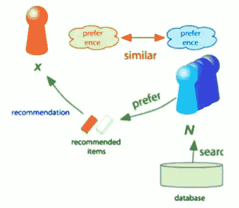

Source: [2]

现在，问题是 CF 如何帮助你找到一组与 X 相似的用户。主要有两种方法来找到“N”个相似用户的组:

1.  **基于记忆的方法**:使用余弦相似性的概念并找到 k 个最近的邻居来计算未被用户评级的项目的评级(假设用户‘X’)
2.  **基于模型的方法**:使用矩阵分解(SVD)、聚类或深度学习模型(受限波尔兹曼机器)的概念来预测用户评级。

在本帖中，我们将更多地讨论 CF 最常用的方法:

假设你有这种由不同用户给出的电影评级矩阵。在现实世界的例子中，这个矩阵非常稀疏。

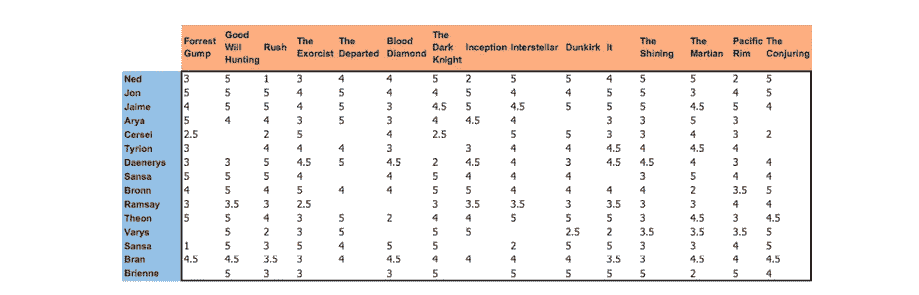

Original user-movies(items) ratings matrix [4]

**矩阵分解(MF):**

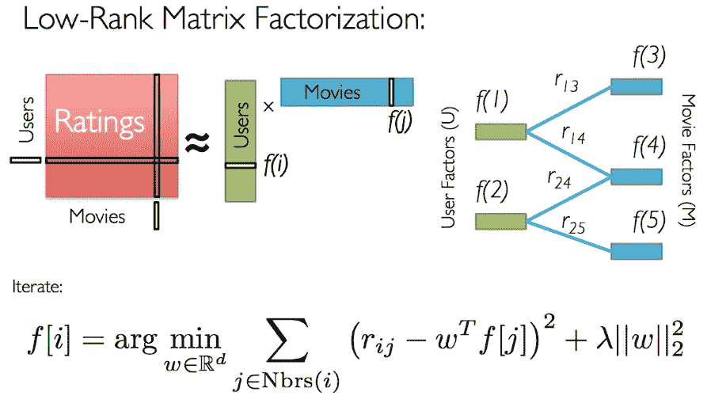

Source: [3]

上图中解释的 MF 背后的直觉是使用用户-电影(项目)矩阵的降维，该矩阵由具有 k 个潜在因子(嵌入)的两个小矩阵近似，这两个小矩阵是用户嵌入矩阵和电影嵌入矩阵。

奇异值分解(SVD)就是这样一种降维技术，它在内部执行矩阵分解。

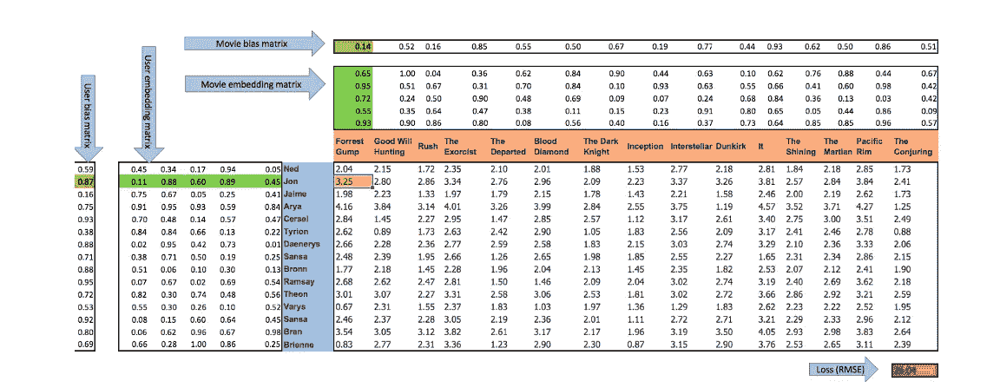

Factorized matrix [4]

现在，一旦生成了用户和电影嵌入矩阵，任何用户(假设为“X”)的用户嵌入向量(任何单行)就与电影嵌入向量相乘，以获得预测的评级值。

*评级模型预测(黄色单元格中的 3.25)= 2 个绿色向量(嵌入向量)的点积+ 0.14(电影偏差)+ 0.87(用户偏差)[4]*

我们可以对所有用户-电影组合执行此操作，以获得评级的预测值。我们将使用实际评级和相应的预测评级来计算 RMSE 损失。

**注**:在计算 RMSE 时，我们不会考虑实际收视率缺失的预测收视率。

最后，我们稍后将在 pySpark 中实现的最后一件事是交替最小二乘法，它使用梯度下降优化来计算用户和项目嵌入矩阵。

**可选**:为了了解更多关于 CF 算法的内容，你可以在 Coursera 上观看吴恩达的这个视频:[链接](https://www.coursera.org/lecture/machine-learning/collaborative-filtering-2WoBV)(基于模型的方法)，另一个视频解释了斯坦福大学数据挖掘课上的基于记忆的方法:[链接](https://www.youtube.com/watch?v=h9gpufJFF-0&t=23s)。对于 excel 中的动手练习:[链接](/collaborative-filtering-and-embeddings-part-1-63b00b9739ce)和不同类型的 CF: [链接](/various-implementations-of-collaborative-filtering-100385c6dfe0)

# 2.隐式数据协同过滤

以上是一些大剂量的算法，但当数据是等级形式(显式)时，理解 CF 是非常必要的。一旦您理解了 CF 的基本原理，就很容易用隐式数据功能来调整 CF。我们开始吧:

**本节中使用的大部分方法都来自本研究论文:** [**链接**](http://yifanhu.net/PUB/cf.pdf)

隐式反馈的数值描述了行动的频率，例如，你点击数据科学职位的次数，你看网飞电视连续剧的时间，你听一首歌的次数等。我们利用用户给出的这些隐含数字来获取用户偏好或不偏好的置信度。用户‘u’对项目‘I’的偏好( *pui* )由以下等式捕获:

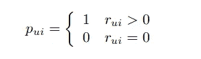

其中'*瑞'*是该项目的记录值(例如，你听一首歌的次数)。因此，如果记录的值大于 0，则首选项为 1，如果它等于 0，则首选项为 0。

现在，假设你只听了一首歌一次，这并不意味着你喜欢它，它可能在你的 YouTube 上处于自动播放模式。同样，如果记录值为零，并不意味着你不喜欢这首歌，这可能意味着你从来不知道这首歌的存在，或者你还没有发现它。因此，为了捕捉这种偏好关系，我们需要明确信心的概念:

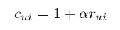

总的来说，随着“ *rui* ”的增长，我们有更强的迹象表明用户确实喜欢这个项目。*【Cui】*，衡量我们对观察*g【pui】的信心。*我们可以注意到，即使对于“rui”为 0 的用户项目对(表示对该项目没有偏好),我们也有相关的最小置信度 1。并且“pui”等于 1 的置信度随着积极偏好证据的增加而增加。

**增加速率由常量调谐参数α控制。**

**偏好被假设为内积:pui =(转置)U. X**

现在，我们将计算两个矩阵:用户嵌入矩阵(**U**’)和项目嵌入矩阵(**X**’)，就像我们在如上所述的协同过滤技术中所做的那样，与我们在显式数据的情况下所做的相比，只有两个区别:

1.  **我们需要考虑不同的置信水平**
2.  **优化应考虑所有可能的用户-项目对，而不仅仅是那些与观察数据相对应的用户-项目对**

嵌入/因子通过最小化以下成本函数来计算:

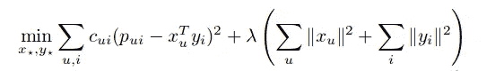

[5]

这可以通过使用 ALS 优化过程来近似我们的偏好矩阵并基于偏好向用户提供推荐来解决。

# **3。PySpark 代码构建大规模作业 Rec 引擎**

最后，是时候把我们到目前为止学到的关于协同过滤或推荐引擎的知识进行编码了。

让我们编造一些数据。

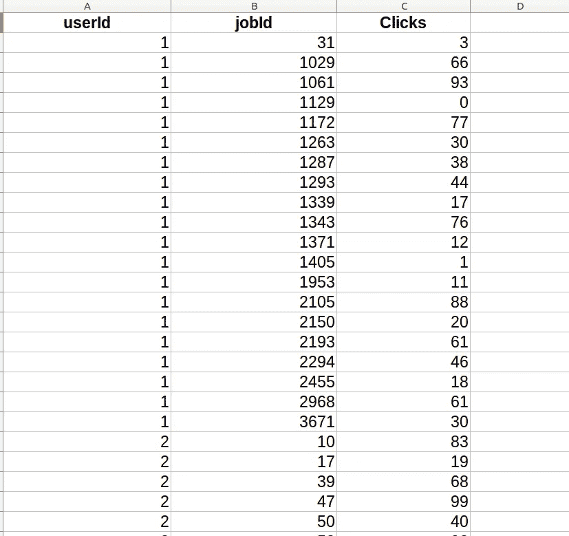

job posts clicks by different users (job_clicks.csv)

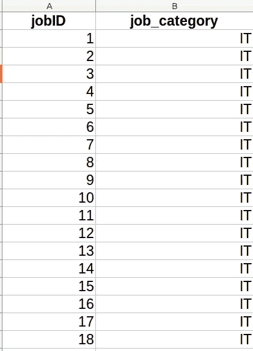

jobs category like IT, Finance, HR etc (jobs.csv)

因此，第一步是将上面显示的数据加载到 rdd 中并处理它。接下来，为了建模的目的，我们需要将它分成训练、验证和测试集。

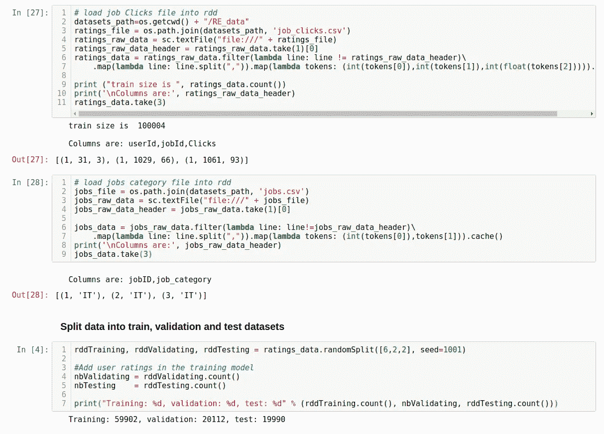

Data load and splitting

将数据分成三组后，使用训练和验证组来训练模型并调整超参数(或使用交叉值)。

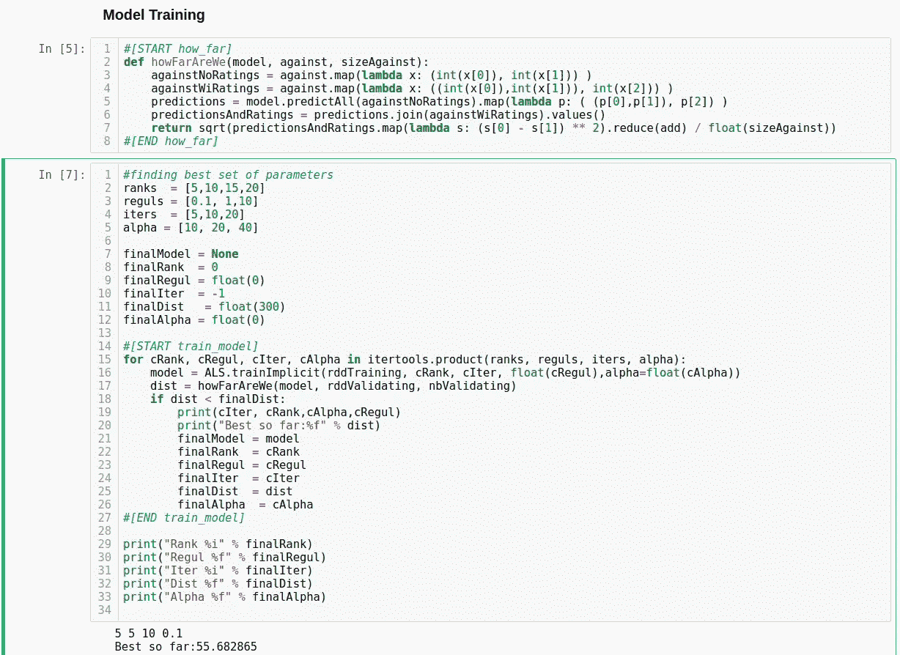

[7]

观察上面代码中用于交替最小二乘法(ALS.trainImplicit function)调整的 4 个超参数:

1.  秩:表示嵌入矩阵的宽度/列
2.  iters(迭代):表示我们在 ALS 过程中振荡多少次来生成嵌入矩阵
3.  alpha:与置信度等式中的记录规模(用户执行任何动作:观看电影的次数)相关
4.  reguls (lambda):是防止过度拟合的正则化参数

最后，您可以使用最佳超参数集来训练模型，并使用它来预测用户偏好的推荐或置信度，以显示前 N 个推荐。

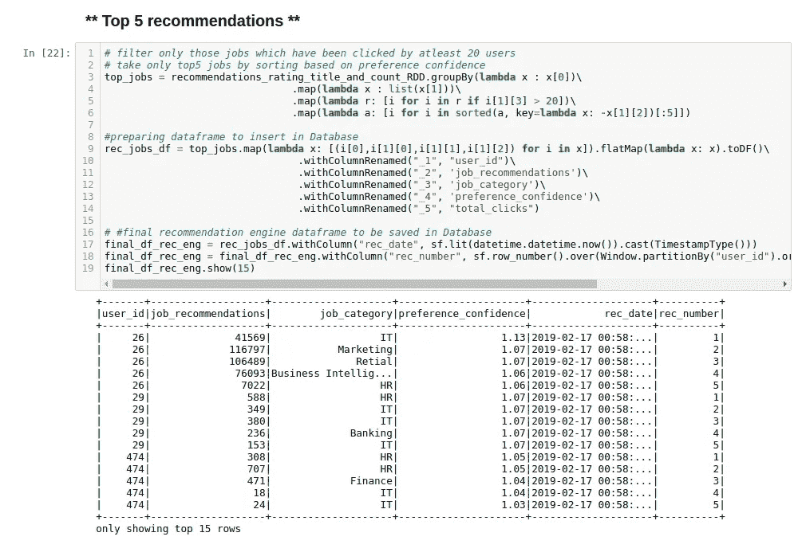

下面是加载和处理数据、建立模型以及为所有用户预测推荐的代码。

要获得本文中使用的数据集的完整项目演示，请查看 [GitHub 链接](https://github.com/Akxay/recommendation_engine)。

下一步可能是将该模型放入云中，并根据您的需求实时显示建议。此外，还有其他一些很酷的库，如用于构建 Rec 引擎的“implicit ”,但其基本概念与我们在前两节中讨论的相同。

此外，请分享您的宝贵意见或反馈，让它变得更好，更具可扩展性。我有另一个关于使用 Docker 容器构建和部署[模型的博客，所以如果你喜欢缩放你的模型，请查看一下。](https://medium.com/datadriveninvestor/from-model-inception-to-deployment-adce1f5ed9d6)

# **参考文献**

[[1] RE Image: link](https://www.google.com/search?q=why+don%27t+you+like+my+cocaine&client=ubuntu&channel=fs&source=lnms&tbm=isch&sa=X&ved=0ahUKEwiS0MvT4vPfAhVCMY8KHWleBIwQ_AUIDigB&biw=1546&bih=818#imgrc=38riqNkcpfxAgM:)

[【2】https://www.youtube.com/watch?v=h9gpufJFF-0&t = 23s](https://www.youtube.com/watch?v=h9gpufJFF-0&t=23s)

[3][https://www . EDX . org/course/big-data-analysis-Apache-spark-UC-berkeleyx-cs110 x](https://www.edx.org/course/big-data-analysis-apache-spark-uc-berkeleyx-cs110x)

[【4】https://towards data science . com/collaborative-filtering-and-embedding-part-1-63 b 00 b 9739 ce](/collaborative-filtering-and-embeddings-part-1-63b00b9739ce)

[http://yifanhu.net/PUB/cf.pdf](http://yifanhu.net/PUB/cf.pdf)

[6][https://databricks . com/session/building-a-implicit-recommendation-engine-with-spark](https://databricks.com/session/building-an-implicit-recommendation-engine-with-spark)

[【7】https://github . com/Google cloud platform/spark-re commendation-engine/blob/master/py spark/find _ model _ collaborative . py](https://github.com/GoogleCloudPlatform/spark-recommendation-engine/blob/master/pyspark/find_model_collaborative.py)