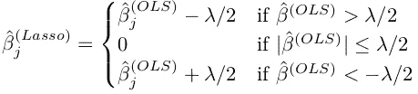

# 基于线性回归和深度学习的 Lasso 正则化

> 原文：<https://towardsdatascience.com/lasso-regularization-on-linear-regression-and-other-models-70f65efda40c?source=collection_archive---------28----------------------->

## 对套索惩罚的影响及其对线性回归的影响的数学分析，包括对深度学习的可能扩展

# 介绍

## 曲线拟合-欠拟合和过拟合

正如我在[上一篇文章](https://medium.com/@snaveenmathew/a-short-note-on-regularization-42ee07c65d90)中所讨论的，当问题不适当时，就会出现“曲线拟合”的问题。不足通常不是一个大问题，因为我们可以通过获取/设计新特性来扩展特性集。然而，过度拟合并不容易处理。

## 回归中的最佳子集选择

考虑一个有 p 个预测变量的线性回归。假设整个数据集用于训练。众所周知，训练集 R 不会随着特征的增加而减少。因此，R 不是一个很好的拟合优度的度量。调整后的-R，马洛的 Cₚ，AIC，BIC 等。是用来衡量拟合优度的。然而，在添加/移除预测变量时，不存在关于这些测量值的变化的先验知识。因此，可能需要所有 2ᵖ-1 独特模型来判断为结果变量建模所需的特征的“最佳子集”。然而，这在计算上非常昂贵。这就需要一种适当的方法来减少变量，而不需要建立指数级的大量模型。套索惩罚有助于部分实现这一目标。

# 制定

## 线性回归和正规方程

Regression equation

Linear regression estimated on sample

OLS solution — same as MLE under certain conditions

Normal equation

我们观察到，如果协方差矩阵是不可逆的，则 OLS 解不存在(可能不是唯一的)。

## 套索公式

Regression equation

Lasso solution estimated on sample

Lasso solution

对于这种最小化，不存在解析解。梯度下降也不能保证收敛于这个损失函数，即使它是凸的。需要另一个公式来计算解决这个问题。

# 解决办法

## 正交协方差的软阈值处理

Equations copied from my personal notes

Assumption to simplify the analysis

Separating out the dimensions

Soft thresholding

可以在每个维度上单独执行软阈值处理。这种更新将收敛到最佳β，因为它们是独立的。这种想法类似于[轮廓似然](https://en.wikipedia.org/wiki/Likelihood_function#Profile_likelihood) —关键参数的估计是通过描绘出(固定)噪声参数并最大化似然(假设为凸的)来完成的，然后通过将关键参数固定在其计算出的最佳值来估计噪声参数:这在参数独立时有效。

这种一次更新一个参数的方法称为坐标下降法。

## 坐标下降:一般情况

对于没有正交设计的一般情况，坐标下降可总结如下:

*   从猜测套索解开始，设置收敛参数ϵ
*   迭代 I，从 1 到 max_iter:
*   —从 1 到 p 迭代 j:
*   — —通过设置βⱼ = 0 来计算残差
*   — —回归第 j 个预测因子上的残差，得到第 j 个β的 OLS 解
*   — —对 OLS 解应用软阈值，获得第 j 个β的套索解
*   — —检查收敛:β < ϵ?
*   Return final β. Did β converge in max_iter iterations?

Coordinate descent is guaranteed to converge in one iteration for orthogonal design. It is not guaranteed to converge in 1 iteration if the design matrix is not orthogonal, but it will converge in finite number of iterations.

# Geometric interpretation

## Dual form of optimization

Lasso loss

Dual form of optimization

Contour plot for lasso. Image credits: [https://stats.stackexchange.com/questions/30456/geometric-interpretation-of-penalized-linear-regression](https://stats.stackexchange.com/questions/30456/geometric-interpretation-of-penalized-linear-regression)

The blue squares correspond to |β|₁ ≤ s for different s, where |β|₁ = constant along a square. Increasing λ decreases the size of the square. The red ellipses correspond to different distinct values of (y-xβ)₂² where (y-xβ)₂² = constant along an ellipse. For a fixed λ the value of s is fixed: this corresponds to one of the blue squares.

The minimum value of (y-xβ)₂² in unconstrained case occurs at the center of the ellipse. However, under the constrained case of |β|₁ ≤ s the solution will be displaced towards the origin.

The unique lasso solution is located at the point where these two ‘curves’ touch. Since the curve |β|₁ ≤ s is non-differentiable at few points the lasso solution for few βᵢs can be zero. On increasing λ (decreasing s) these βᵢs remain 0; other βᵢs tend to 0\. This causes sparsity in the coefficients of lasso.

# Extension to deep learning

Deep learning networks inevitably have fully-connected layers. These layers perform linear transformation on the input and apply an activation on the transformed variables. When the transformed outputs are small in magnitude (typically less than 1) the non-linearity can be ignored. With lasso penalty on the weights the estimation can be viewed in the same way as a linear regression with lasso penalty. The geometric interpretation suggests that for λ > λ₁中更新的 L1 范数(最小λ，其中只有一个β估计为 0)我们将至少有一个权重= 0。这造成了权重的稀疏性。这一论点也适用于具有较大转换输入值的非线性情况。

# 结论

套索惩罚通过将一些系数驱动到 0 来创建系数的稀疏性。这适用于线性回归和深度神经网络中的全连接层。因此，对于合适的λ值，lasso 惩罚可以降低深度学习模型的复杂性。然而，它不是所有问题的解决方案。

如果基础模型是线性的(Y = Xβ + ϵ)，非零λ会导致套索解(E(βˡᵃˢˢᵒ)中的偏差≠ β，但估计量的方差低于最大似然法)，因此，即使对于简单的情况，它也不能同时实现估计和选择的一致性。尽管有这个缺点，但它是对有限样本过度拟合的一个好的解决方案，特别是在具有大量参数的深度神经网络中，这些参数往往会过度拟合。