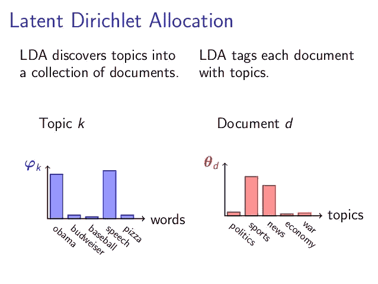
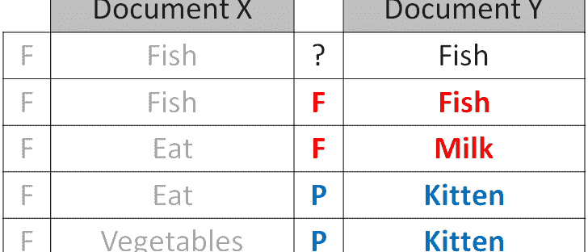
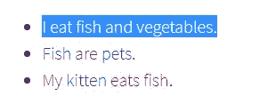
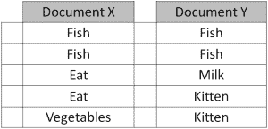
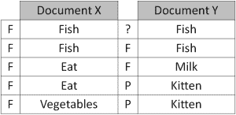
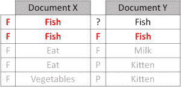
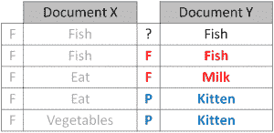

# 潜在狄利克雷分配

> 原文：<https://towardsdatascience.com/latent-dirichlet-allocation-15800c852699?source=collection_archive---------14----------------------->

**潜在狄利克雷分配** (LDA)是由零件组成的复合物集合的“生成概率模型”。就主题建模而言，组合是文档，部分是单词和/或短语(n 元语法)。但是你可以将 LDA 应用于 DNA 和核苷酸，比萨饼和配料，分子和原子，雇员和技能，或者键盘和面包屑。

[Source](http://nlpx.net/wp/wp-content/uploads/2016/01/LDA_image2.jpg)

潜在狄利克雷分配(LDA)是一种自动发现这些文档包含的主题的技术。

假设你有下面这组句子:

根据上面的句子，LDA 可能会将红色单词归类到主题 F 下，我们可以将其标记为“食物”。类似地，蓝色单词可能被归类到一个单独的主题 P 下，我们可以将其标记为“宠物”。LDA 将每个主题定义为一个单词包，你必须按照你认为合适的方式给主题贴上标签。

LDA 在单词级别定义主题有两个好处:

1)我们可以通过字数来推断每个句子的内容传播:

**第一句** : 100%话题 F
第二句 : 100%话题 P
第三句 : 33%话题 P 和 67%话题 F

2)我们可以推导出每个单词在给定主题中所占的比例。例如，主题 F 可能包含以下比例的单词:40%吃，40%鱼，20%蔬菜，…

LDA 分三步实现上述结果。

为了说明这些步骤，假设您现在正在文档中发现主题，而不是句子。假设您有两个包含以下单词的文档:

第一步
**你告诉算法你认为有多少个题目。**您可以使用可靠的估计(例如之前分析的结果)，也可以简单地试错。在尝试不同的估计时，你可以选择一个产生你想要的可解释性水平的话题，或者一个产生最高统计确定性(即对数可能性)的话题。在上面的例子中，主题的数量可以通过目测文档来推断。

步骤 2
**算法会将每个单词分配给一个临时主题**。主题分配是临时的，因为它们将在步骤 3 中更新。临时主题以半随机的方式(确切地说，根据狄利克雷分布)被分配给每个单词。这也意味着，如果一个词出现两次，每个词可能被分配到不同的主题。注意，在分析实际文档时，功能词(例如“the”、“and”、“my”)被移除，并且不被分配给任何主题。

步骤 3(迭代)
**该算法将检查并更新主题分配**，遍历每个文档中的每个单词。对于每个单词，其主题分配基于两个标准进行更新:

*   这个词在各种话题中有多普遍？
*   文档中的主题有多普遍？

为了理解这两个标准是如何工作的，假设我们现在正在检查文档 Y 中单词“fish”的主题分配:

*   这个词在各种话题中有多普遍？由于两个文档中的“鱼”字包括几乎一半的剩余主题 F 字，但是 0%的剩余主题 P 字，所以随机挑选的“鱼”字更可能是关于主题 F 的

*   文档中的主题有多普遍？因为文档 Y 中的单词以 50:50 的比例分配给主题 F 和主题 P，所以剩余的“鱼”单词似乎同样可能与任一主题有关。

权衡两个标准得出的结论，我们将把 Doc Y 的“鱼”字分配给 Topic f。Doc Y 可能是一个关于喂小猫什么的文档。

对每个文档中的每个单词重复检查主题分配的过程，在整个文档集合中循环多次。这种迭代更新是 LDA 的关键特征，它生成具有连贯主题的最终解决方案。