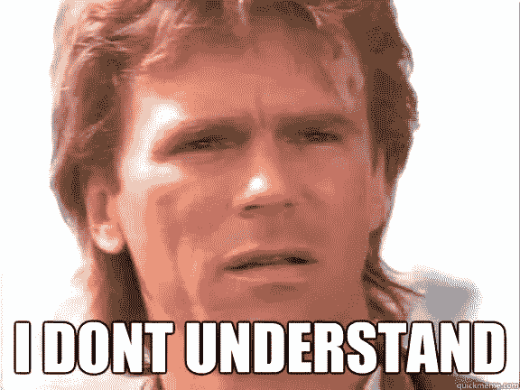
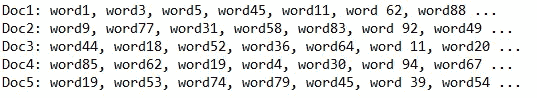
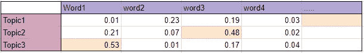
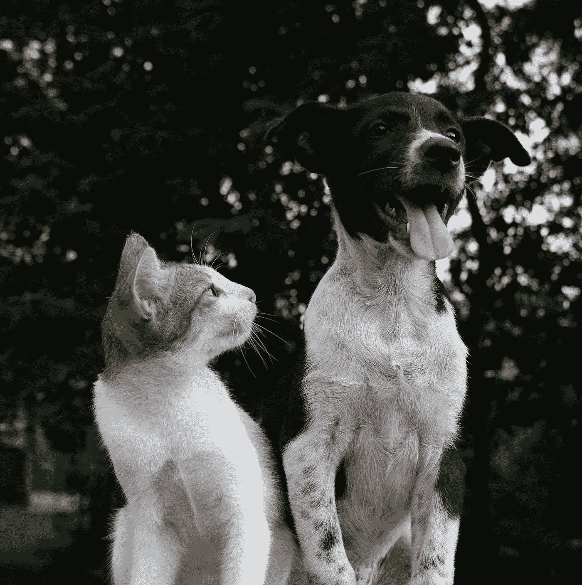

# 潜在狄利克雷分配(LDA)初学者指南

> 原文：<https://towardsdatascience.com/latent-dirichlet-allocation-lda-9d1cd064ffa2?source=collection_archive---------0----------------------->

## 发现抽象*话题*又名 ***话题建模*** 的统计模型。


Photo by [Giulia Bertelli](https://unsplash.com/@giulia_bertelli?utm_source=medium&utm_medium=referral) on [Unsplash](https://unsplash.com?utm_source=medium&utm_medium=referral)

# 什么是主题建模？

主题建模是一种对文档进行***无监督*** 分类的方法，类似于对数字数据进行聚类，即使我们不确定我们在寻找什么，它也会找到一些自然的项目(主题)组。

***一个文档可以是多个主题的一部分，有点像模糊聚类(软聚类)中每个数据点属于多个聚类。***

# 为什么要主题建模？

主题建模提供了自动组织、理解、搜索和总结大型电子档案的方法。
它可以在以下方面提供帮助:

*   发现收藏中隐藏的主题。
*   将文档分类到发现的主题中。
*   使用分类来组织/总结/搜索文档。

例如，假设一个文档属于主题*食品、狗*和*健康*。因此，如果用户查询“*狗粮*”，他们可能会发现上述文档相关，因为它涵盖了这些主题(以及其他主题)。我们能够计算出它与查询的相关性，甚至不需要浏览整个文档。

因此，通过注释文档，基于建模方法预测的主题，我们能够优化我们的搜索过程。

# 皱胃向左移

它是最流行的主题建模方法之一。每个文档由各种单词组成，每个主题也有属于它的各种单词。LDA 的目的是根据文档中的单词找到文档所属的主题。很困惑吗？这里有一个例子来引导你。



## 模型定义



Each document is a collection of words.

我们有 5 个文档，每个文档都包含前面列出的单词(按出现频率排序)。

我们要搞清楚的是不同题目中的单词，如下表所示。表格中的每一行代表一个不同的主题，每一列代表语料库中的一个不同的单词。每个单元格包含单词(列)属于主题(行)的概率。



Each topic contains a score for all the words in the corpus.

## 寻找主题的代表词

*   我们可以根据单词的概率得分对单词进行排序。
    从每一个题目中选出最上面的 *x* 个单词来代表题目。如果 *x* = 10，我们将根据得分对 topic1 中的所有单词进行排序，并取前 10 个单词来代表该主题。这一步可能并不总是必要的，因为如果语料库很小，我们可以按照分数来存储所有的单词。
*   或者，我们可以**在分数上设置一个阈值**。主题中分数高于阈值的所有单词可以按照它们的分数顺序存储为其代表。



Photo by [Anusha Barwa](https://unsplash.com/@anshaaleena?utm_source=medium&utm_medium=referral) on [Unsplash](https://unsplash.com?utm_source=medium&utm_medium=referral)

假设我们有两个主题，可以分类为*与猫相关的*和*与狗相关的。*一个话题对每个单词都有概率，所以像*牛奶*、*喵*和*小猫*这样的单词，在*猫 _ 相关*话题中的概率会比在*狗 _ 相关*话题中的概率高。同样地，与*狗相关的*话题中出现*小狗*、*吠叫*和*骨头等词语的概率也很高。*

如果我们有一个包含以下句子的文档:

*狗*喜欢*啃*骨头*上的*并捡棍子。
“*小狗*喝*奶*”
“都喜欢对*吠叫*。”

我们可以很容易地说它属于话题*狗 _ 相关*，因为它包含了诸如狗、*骨头、小狗*和*吠叫*等词语*。尽管它包含属于主题 *CAT_related* 的单词 *milk* ，但该文档属于 *DOG_related* ，因为更多的单词与之匹配。*

## 假设:

*   每个文档只是一个单词的集合或一个“单词包”。因此，单词的**顺序和单词(主语、宾语、动词……)的**语法角色**在模型中不被视为**。
*   像 am/is/are/of/a/the/but/…这样的词不携带任何关于“主题”的信息，因此可以作为预处理步骤从文档中删除。事实上，**我们可以** **消除至少在文档的%80 ~ %90 中出现的单词，**而不会丢失任何信息。例如，如果我们的语料库只包含医学文档，则像人类、身体、健康等词可能出现在大多数文档中，因此可以被移除，因为它们没有添加任何使文档突出的特定信息。
*   我们预先知道我们想要多少主题。***k***‘是预先决定的。
*   **除了正在讨论的当前单词之外的所有主题分配都是正确的**，然后使用我们的文档生成模型更新当前单词的分配

## LDA 是如何工作的？

LDA 有两个部分:

*   这个***字，属于一个文档*** ，这个我们已经知道了。
*   属于主题 的 ***个单词或者单词属于一个主题的概率，我们需要计算。***

## 找到后者的算法

*   浏览每个文档，并随机将文档中的每个单词分配到 ***k*** 主题中的一个(事先选择了 *k* )。
*   对于每个文档 ***d*** ，遍历每个单词 ***w*** 并计算:

1.  **p(主题 *t* |文档 *d* )** :文档 *d* 中分配给主题 *t* *的文字比例**。***试图捕捉给定文档 *d* 中有多少单词属于主题 *t* 。排除当前单词。
    如果来自 *d* 的很多字属于 *t* 的话，字 *w* 属于 *t* 的可能性更大。
    (*中的#字数 d* 带*t+alpha*/*中的#字数 d* 带任意话题+ *k* * *alpha* )
2.  **p(word*w*| topic*t*)**:分配给 topic *t* 的任务占所有来自 word *w* 的文档的比例。试图捕获多少文档在主题 *t* 中，因为单词 *w* 。LDA 将文档表示为主题的混合物。同样，一个题目也是单词的混合体。如果一个单词出现在主题中的概率很高，那么所有带有 *w* 的文档也将与 *t* 有更强的关联。类似地，如果 *w* 不太可能出现在 *t* 中，则包含 *w* 的文档出现在 *t、*中的概率很低，因为 *d* 中的其余单词将属于其他主题，因此 *d* 出现在这些主题中的概率更高。所以即使 *w* 被添加到 *t* 中，也不会给 *t* 带来很多这样的文档。

*   更新单词 *w* 属于主题 *t* 的概率，如下所示

```
p(word w with topic t) = p(topic t | document d) * p(word w | topic t)
```

## 外行的例子

假设你有各种各样的照片(*文档*)和标题(*文字*)。您希望在画廊中展示这些照片，因此您决定根据不同的主题(*主题*)对照片进行分类，并根据这些主题在画廊中创建不同的部分。


Photo by [Soragrit Wongsa](https://unsplash.com/@invictar1997?utm_source=medium&utm_medium=referral) on [Unsplash](https://unsplash.com?utm_source=medium&utm_medium=referral)

你决定在你的相册中创建 *k=2* 个部分——自然与城市。自然，分类不是很清楚，因为一些城市的照片有树和花，而自然的照片可能有一些建筑。首先，你决定将只有自然或城市元素的照片归入各自的类别，而你随机分配其余的。

你会注意到《自然》杂志上的许多照片标题中都有“T2 树”这个词。所以你断定*树*这个词和 topi *c 自然*一定是密切相关的。

接下来，你选择单词 *building* 并检查有多少张照片出现在 *nature* 中，因为它们的标题中有单词 *building* 。你不会发现很多人现在不太确定*建筑*属于主题*自然*并更强烈地将其与主题*城市*联系起来。

然后你选择一张标题为**“树在建筑物前，车后”**的照片，你会发现它现在属于自然类别。
然后你选择文字 ***树*** ，并计算第一概率 **p(题目 *t* |文件 *d* ):** 标题中的其他文字是*楼*和*车*，大多数带有标题的照片都是在*市*的*楼*或*车*
现在第二个概率 **p(单词 *w* |题目 *t* )** :我们知道自然界很多照片里面都有*树木*这个单词。所以你在这里得到高分。
你通过将两者相乘来更新*树*属于*自然*的概率。你在*主题*自然中得到的*树*的值比之前低，因为现在你已经看到在同一个标题中*树*和*建筑* / *汽车*等词，暗示着城市中也可以找到树。
出于同样的原因，当你更新主题*城市*中*树*归属的概率时，你会注意到它会比以前大。

在对所有照片和每个主题进行多次迭代后，你将获得每个主题的每个单词的准确分数。你的猜测会越来越好，因为你会从上下文中得出结论，建筑物、人行道、地铁等词一起出现，因此肯定属于同一个主题，我们可以很容易地猜到是*城市*。
像山、田野、海滩这样的词可能不会在很多标题中同时出现，但它们确实经常在没有城市词的情况下出现，因此自然的得分较高。
而像树、花、狗、天空这样的词在两个主题中出现的概率几乎相同。

至于照片，你看到它有 1 个词(平均概率)来自自然类别，2 个词(高概率)来自城市，你得出结论，它属于城市比属于自然更强烈，因此你决定将它添加到城市。

## 边注

LDA 的应用不需要局限于自然语言处理。我最近完成了一篇论文，其中我们使用 LDA(以及神经网络)来提取图像的特定场景上下文。如果你有兴趣了解更多，请留下评论或留言。

# 参考

*   如果你正在寻找 LDA 的实现，这里有一篇关于数据科学的惊人的[文章](/topic-modeling-and-latent-dirichlet-allocation-in-python-9bf156893c24)，它做得很好！
*   参见 Edwin Chen 博客中的“一个外行的例子”以获得更多关于 LDA 的直觉。

# 我认为你会喜欢的其他文章😄

*   [NLP 模型评估—最新基准](/evaluation-of-an-nlp-model-latest-benchmarks-90fd8ce6fae5)
*   [理解深度学习中的注意力](/attaining-attention-in-deep-learning-a712f93bdb1e)
*   [变形金刚](/transformers-89034557de14)——谷歌的 BERT 和 OpenAI 的 GPT 等模型的基本模块。

> 我很高兴你坚持到了这篇文章的结尾。*🎉我希望你的阅读体验和我写这篇文章时一样丰富。*💖**
> 
> 请点击这里查看我的其他文章[。](https://medium.com/@ria.kulshrestha16)
> 
> 如果你想联系我，我的选择是[推特](https://twitter.com/ree_____ree)。