# 2019 年 CVPR 最新计算机视觉趋势

> 原文：<https://towardsdatascience.com/latest-computer-vision-trends-from-cvpr-2019-c07806dd570b?source=collection_archive---------3----------------------->

*用数据做酷事！*

2019 年 IEEE 计算机视觉和模式识别大会(CVPR)于今年 6 月 16 日至 6 月 20 日举行。 [CVPR](http://cvpr2019.thecvf.com/) 是计算机视觉领域全球三大学术会议之一(与 ICCV 和 ECCV 并列)。今年共有 1300 篇论文从创纪录的 5165 篇提交中被接受(25.2%的接受率)。

CVPR 带来了计算机视觉领域的顶尖人才，每年都有许多令人印象深刻的论文。

我从 CVPR 拿了被接受的论文，并对它们做了分析，以了解论文标题中的主要研究领域和常见关键词。这可以显示出研究的进展方向。

底层数据和代码可以在我的 [Github](https://github.com/priya-dwivedi/Deep-Learning/blob/master/cvpr2019/CVPR2019_stats.ipynb) 上找到。随意拉这个，加入你自己的旋转。

CVPR 给每篇论文指定一个主要的主题领域。被接受的论文按学科领域分列如下:

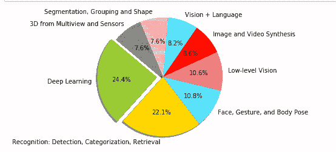

不奇怪，大部分研究都集中在深度学习上(现在不都是深度学习吗！)，检测和分类以及人脸/手势/姿势。这种分类非常笼统，并没有给出很好的见解。所以接下来我从接受的论文中提取了所有的单词，并用一个计数器来计算它们的频率。最常见的 25 个关键词如下:

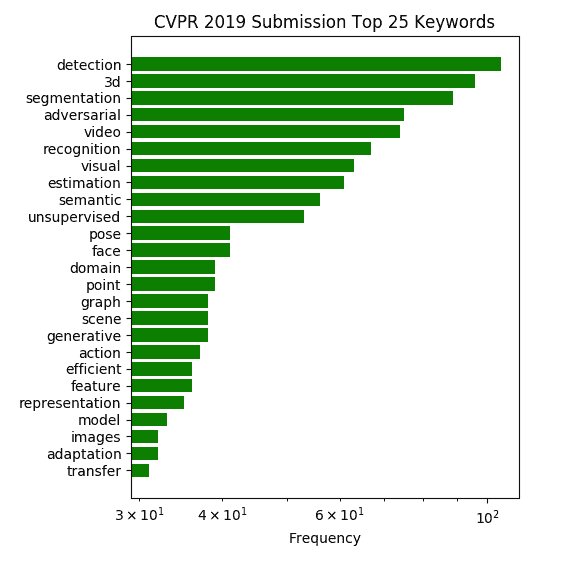

现在这个更有趣了。最受欢迎的研究领域是检测、分割、3D 和对抗训练。它也显示了无监督学习方法的研究日益增长。

最后我还画了云这个词。

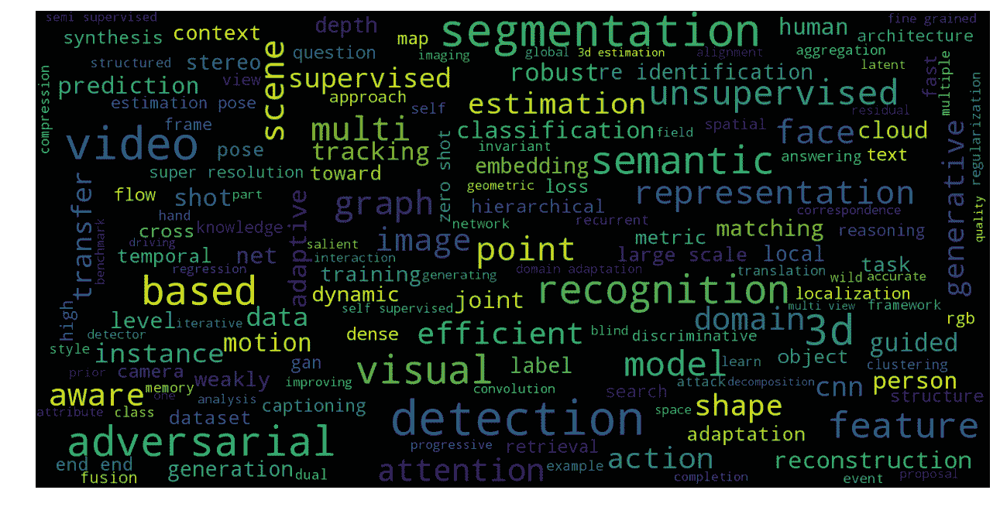

你可以使用我的 [Github](https://github.com/priya-dwivedi/Deep-Learning/blob/master/cvpr2019/CVPR2019_stats.ipynb) 按主题提取热门论文，如下所示

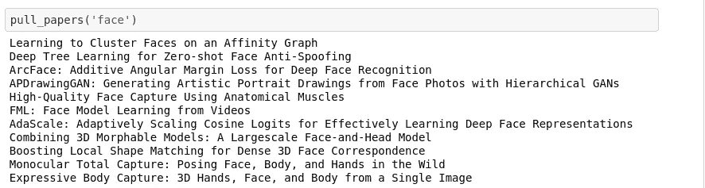

Papers with research on “face”

我经营一家机器学习咨询公司。点击查看我们的网站[。我喜欢从事计算机视觉项目。如果你有我们可以合作的想法，请随时通过网站或电子邮件联系 info@deeplearninganalytics.org。](https://deeplearninganalytics.org/)

接下来，我在博客中选择了 5 篇来自关键研究领域的有趣论文。请注意，我挑选了最吸引我的论文。

1.  [通过看冻人了解感动人的深度](https://arxiv.org/abs/1904.11111)

人类视觉系统有一种非凡的能力，可以从 2D 投影中理解我们的 3D 世界。即使在具有多个移动对象的复杂环境中，人们也能够保持对对象的几何形状和深度排序的可行解释。在过去的几年中，已经使用相机图像在深度估计方面做了大量的工作，但是在许多情况下，鲁棒的重建仍然是困难的。当相机和场景中的对象都自由移动时，会出现一个特别具有挑战性的情况。这混淆了基于三角测量的传统 3D 重建算法。

要了解更多关于深度图像和估计场景深度的信息，请查看[这个博客](/depth-estimation-on-camera-images-using-densenets-ac454caa893)。

本文通过在相机和主体都自由移动的场景上建立深度学习模型来解决这一问题。见下图 gif:

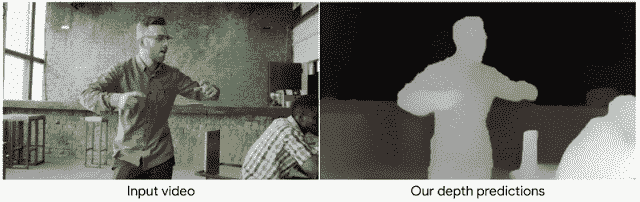

Depth estimation on moving people

为了创建这样一个模型，我们需要移动摄像机捕捉的自然场景的视频序列，以及每幅图像的精确深度图。创建这样一个数据集将是一个挑战。为了克服这一点，该论文非常创新地使用了现有的数据集——YouTube 视频，其中[人们模仿人体模特](https://en.wikipedia.org/wiki/Mannequin_Challenge)摆出各种各样的自然姿势，同时手持摄像机巡视现场。因为场景是静止的，只有相机在移动，所以可以使用三角测量技术来构建精确的深度图。这篇论文非常有趣。它解决了一个复杂的问题，并在为其创建数据集方面极具创造性。

经过训练的模型在移动摄像机和人的互联网视频剪辑上的性能比以前的任何研究都好得多。见下文:

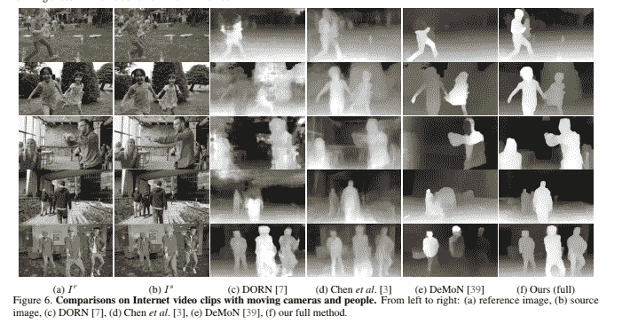

Model comparison through the paper

你可以在这里阅读全文[。](https://arxiv.org/abs/1904.11111)

[2。BubbleNets:通过深度排序帧学习选择视频对象分割中的引导帧](https://arxiv.org/abs/1903.11779)

我看过几篇关于视频对象分割的论文(VOS)。这是在第一帧提供单个注释的情况下分割视频中的对象的任务。这在视频理解中有应用，并且在过去的一年中有很多研究。

视频中对象的位置和外观可能会逐帧发生显著变化，并且该论文发现，使用不同的帧进行注释会显著改变性能，如下所示。

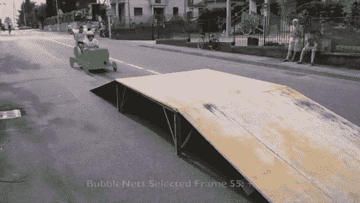

Bubblenets video demo

BubbleNets 迭代地比较和交换相邻的视频帧，直到具有最大预测性能的帧排名最高，此时，选择该帧供用户注释和用于视频对象分割。

BubbleNet first frame selection

该模型的视频描述在 [youtube](https://www.youtube.com/watch?v=0kNmm8SBnnU&feature=youtu.be) 上分享，源代码在 [Github](https://github.com/griffbr/BubbleNets) 上开源。

BubbleNets 模型用于预测两个帧之间的相对性能差异。相对性能通过区域相似性和轮廓准确度的组合来测量。

它将 2 个要比较的帧和 3 个参考帧作为输入。然后，它通过 ResNet50 和完全连接的层来输出表示 2 帧比较的单个数字 f。为了执行冒泡排序，我们从前 2 帧开始，并对它们进行比较。如果 BubbleNet 预测帧 1 比帧 2 具有更好的性能，则交换帧的顺序，并将下一帧与迄今为止最好的帧进行比较。在整个视频序列的处理结束时，最好的帧保留下来。下图显示了 BubbleNets 架构和冒泡排序过程。

总体而言，作者表明，在不改变底层分割算法的情况下，改变标注帧的选择方式，可以使 [DAVIS 基准数据集](https://davischallenge.org/)的性能提高 11%。

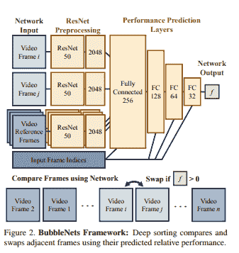

Bubblenets architecture

3.[单幅 RGB 图像的三维手形和姿态估计](https://arxiv.org/pdf/1903.00812.pdf)

三维手形和姿态估计是最近非常活跃的研究领域。这在虚拟现实和机器人技术中有应用。本文使用单目 RGB 图像来创建一个 3D 手姿态和手周围的 3D 网格，如下所示。

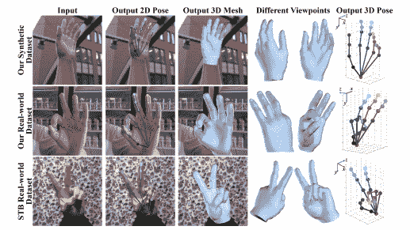

3D hand mesh from single image

本文使用图形细胞神经网络重建手的全三维网格。[这里](https://tkipf.github.io/graph-convolutional-networks/)很好的介绍了图形 CNN 这个话题。为了训练网络，作者创建了一个包含地面真实 3D 网格和 3D 姿态的大规模合成数据集。在真实世界的 RGB 图像上手动注释地面真实 3D 手网格是极其费力和耗时的。然而，在合成数据集上训练的模型通常在真实数据集上产生不令人满意的估计结果，因为它们之间存在领域差距。为了解决这个问题，作者提出了一种新的弱监督方法，通过利用深度图作为 3D 网格生成的弱监督，因为在收集真实世界训练数据时，深度图可以很容易地被 RGB-D 相机捕获。本文在数据集、训练过程等方面有丰富的细节。如果这是你感兴趣的领域，请通读。

对我来说，一个有趣的学习是 CNN 用于网格生成的图形架构。这个网络的输入是来自 RGB 图像的潜在向量。它经过 2 个完全连接的图层，在粗略的图形中输出 80x64 的要素。然后，它通过层层上采样和图形 CNN 来输出更丰富的细节，最终输出 1280 个顶点。

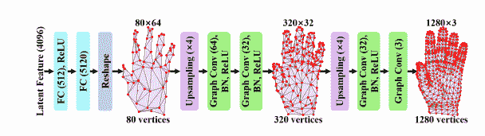

3D hand mesh model architecture

[4。推理-RCNN:将自适应全局推理统一到大规模目标检测中](http://openaccess.thecvf.com/content_CVPR_2019/papers/Xu_Reasoning-RCNN_Unifying_Adaptive_Global_Reasoning_Into_Large-Scale_Object_Detection_CVPR_2019_paper.pdf)

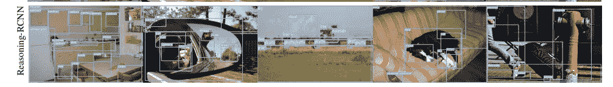

Reasoning RCNN output

随着许多常见的计算机视觉应用，对象检测已经获得了很大的普及。快速 RCNN 是一种常用的目标检测模型。要了解更多关于物体检测和更快的 RCNN 检查这个[博客](/is-google-tensorflow-object-detection-api-the-easiest-way-to-implement-image-recognition-a8bd1f500ea0)。然而，当检测类别的数量很少时(少于 100)，对象检测是最成功的。本文研究了具有数千个类别的大规模目标检测问题，该问题由于长尾数据分布、严重遮挡和类别歧义性而面临严峻挑战。

推理-RCNN 通过构建一个知识图来编码人类常识知识来实现这一点。什么是知识图？知识图对对象之间的信息进行编码，如空间关系(上，近)，主语-动词-宾语(例如。驾驶、跑步)关系以及属性相似性，如颜色、尺寸、材料。如下所示，彼此具有视觉关系的类别彼此更接近。

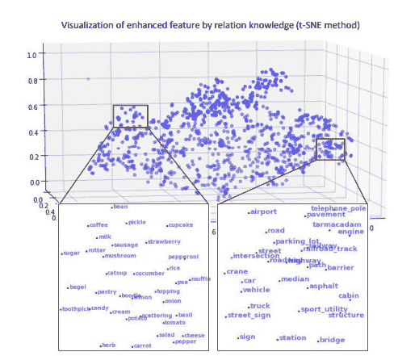

Knowledge Graph

就架构而言，它在标准对象检测器(如更快的 RCNN)之上堆叠了一个推理框架。收集先前分类器的权重以生成所有类别的全局语义池，该语义池被馈送到自适应全局推理模块。增强的类别上下文(即推理模块的输出)通过软映射机制被映射回区域提议。最后，每个区域的增强特征用于以端到端的方式提高分类和定位的性能。下图显示了模型架构。请参考[论文](http://openaccess.thecvf.com/content_CVPR_2019/papers/Xu_Reasoning-RCNN_Unifying_Adaptive_Global_Reasoning_Into_Large-Scale_Object_Detection_CVPR_2019_paper.pdf)更详细的了解他们的架构。

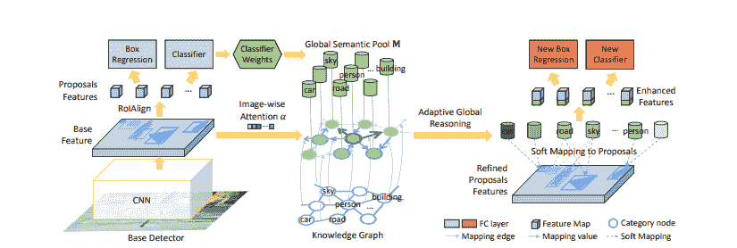

该模型在 3 个主要数据集上进行训练和评估——Visual Gnome(3000 个类别)、ADE (445 个类别)和 COCO (80 个类别)。该模型能够在地图得分上在[视觉侏儒](https://visualgenome.org/)上获得 16%的提升，在[阿德](https://groups.csail.mit.edu/vision/datasets/ADE20K/)上获得 37%的提升，在[可可](http://cocodataset.org/#home)上获得 15%的提升。

培训代码将在此[链接](https://github.com/chanyn/Reasoning-RCNN)处开源。尚不可用。

5.[深度学习零拍人脸反欺骗](http://arxiv.org/abs/1904.02860)

在过去的几年中，面部检测已经取得了很大的进步，现在面部检测和识别系统在许多应用中普遍使用。事实上，用 8 行代码就能建立一个检测人脸、识别人脸并理解其情绪的系统是可能的。见博客[这里](/face-detection-recognition-and-emotion-detection-in-8-lines-of-code-b2ce32d4d5de)。

然而，也存在人脸检测被欺骗以获得非法访问的持续风险。人脸反欺骗旨在防止人脸识别系统将伪造的人脸识别为真正的用户。虽然开发了先进的人脸反欺骗方法，但是新类型的欺骗攻击也正在被创建，并成为对所有现有系统的威胁。介绍了检测未知欺骗攻击的概念，即零枪击人脸反欺骗(ZSFA)。之前的 ZSFA 著作只研究了 1- 2 种类型的欺骗攻击，比如 print/replay，限制了对这个问题的洞察。这项工作调查了 ZSFA 问题的范围广泛的 13 种类型的欺骗攻击，包括打印，重放，三维面具，等等。下图显示了不同类型的欺骗攻击。

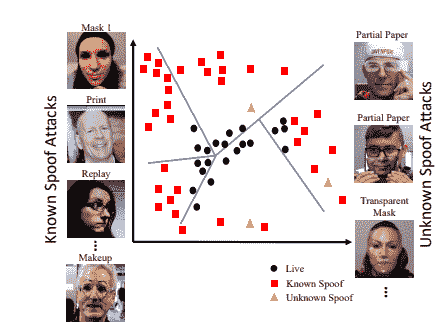

面部欺骗可以包括各种形式，如打印(打印面部照片)、重放视频、3D 面具、带有眼睛剪切的面部照片、化妆、透明面具等。该论文提出使用深度树网络以无监督的方式从欺骗图片中学习语义嵌入。这里的嵌入可以模拟像人类凝视这样的事情。它创建了一个欺骗图像的数据集来学习这些嵌入。在测试过程中，未知攻击被投射到嵌入中，以找到最接近欺骗检测的属性。

阅读[论文](https://arxiv.org/pdf/1904.02860.pdf)以获得关于深度树网络的模型架构和训练它的过程的更多细节。该论文能够创建嵌入，将具有各种类型的欺骗的真实面部(真实面部)分离出来。见下面的 t-SNE 图

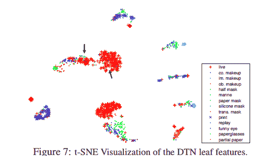

这篇论文太棒了。解决实际问题的有希望的研究。

# **结论**

看到计算机视觉的所有最新研究令人着迷。这里分享的 5 篇论文只是冰山一角。我希望你会用我的 [Github](https://github.com/priya-dwivedi/Deep-Learning/blob/master/cvpr2019/CVPR2019_stats.ipynb) 来整理文件，选出你感兴趣的。

我对计算机视觉和深度学习充满热情。我有自己的深度学习咨询公司，喜欢研究有趣的问题。我已经帮助许多初创公司部署了基于人工智能的创新解决方案。请到 http://deeplearninganalytics.org/.[来看看我们吧](http://deeplearninganalytics.org/)

你也可以在[https://medium.com/@priya.dwivedi](https://medium.com/@priya.dwivedi)看到我的其他作品

如果你有一个我们可以合作的项目，请通过我的网站或 info@deeplearninganalytics.org 联系我

**参考文献:**

*   [CVPR](http://cvpr2019.thecvf.com/)
*   博客中使用的图片是从报纸上借来的