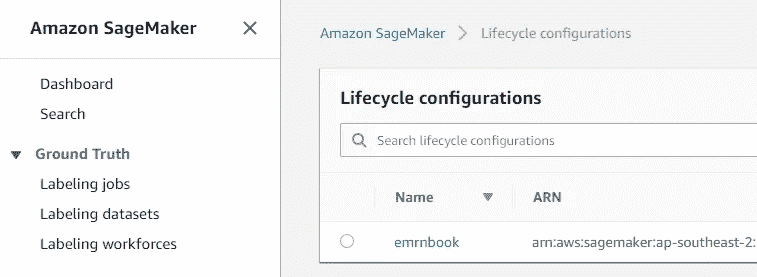
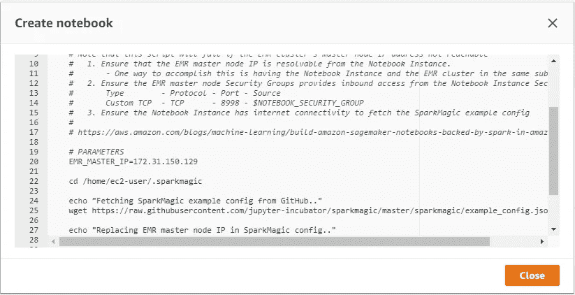
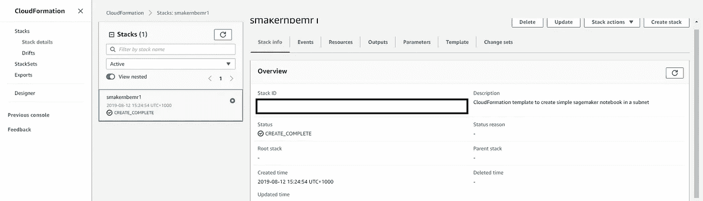
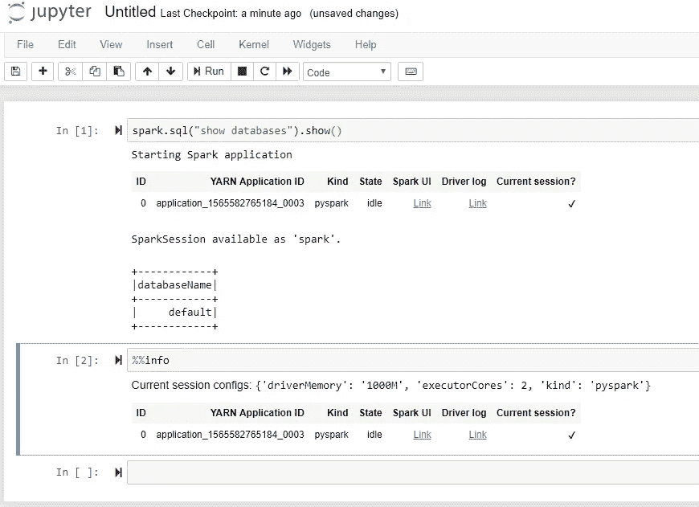

# 通过基础设施代码(Boto3、CloudFormation、Python)发布 AWS EMR 支持的 SageMaker 笔记本电脑

> 原文：<https://towardsdatascience.com/launching-emr-backed-sagemaker-notebook-via-infrastructure-as-code-boto3-cloudformation-4d2ced33c417?source=collection_archive---------21----------------------->

如今，云中的可扩展分析是游戏的名称。所有领先的云提供商都非常关注简化机器学习的端到端生命周期的供应服务。如今的趋势是在 data-lake 上获取数据(这需要自己的一套考虑因素)，并通过 Spark 这样的大数据处理框架对其进行处理。一旦数据在 Data Lake 中以相当标准的格式可用(这样做是为了减轻 it 成为数据沼泽的风险)，这些数据就被认为可供从数据分析师、数据科学家等多个类别的最终用户使用。由于数据湖中的数据量通常很大，如果想要将其用于分析目的，一个自然的选择是使用大数据原生工具集来执行探索性分析和随后的功能工程。此外，数据科学社区最喜欢的工具之一是 Jupyter notebook，它有助于提高工作效率和协作。因此，对于数据科学家来说，乌托邦或涅槃状态是能够使用 Jupyter(如云中的笔记本电脑)来消费数据湖中的数据，并且还能够无缝地使用 Spark 等大数据工具来进行功能工程。

如果您使用 AWS 堆栈来实现升级的结果，您可能最终会使用以下一组 AWS 本机服务:

1.  EMR(Elastic MapReduce)—AWS 中的托管 Hadoop 框架(特别是在 EMR(领先的内存和分布式计算引擎)中使用 Spark)
2.  SageMaker——AWS 中主要的机器学习服务之一
3.  简单存储服务(S3)—AWS 提供的大规模可扩展对象存储服务，是构建数据湖的基础

因此，如果你在 S3 有数据，通过电子病历处理，如果你想执行机器学习任务，如探索性分析，特征工程；您很可能会使用 SageMaker 的托管笔记本(Jupyter)实例。通常这些笔记本用于特别分析，一旦你对你的分析和特征工程方法感到满意，你通常会通过其他工具集(如 Glue 或 EMR，尽管有些人仍然可以出于上述目的使用笔记本)来操作它的执行。

这一切看起来都很好，但当您打算将 SageMaker 笔记本与 EMR 结合使用时，就会遇到挑战。默认情况下，这两个组件不是开箱即用的，例如，您不能在启动时使用 SageMaker notebook 实例来运行 pyspark 查询。如前所述，如果您想要使用 sweet 托管笔记本电脑来执行大规模分析，而处理是由 EMR (Spark)在后端执行的，您必须在 SageMaker 笔记本电脑中为此进行一些配置。AWS 的 [blogpost](https://aws.amazon.com/blogs/machine-learning/build-amazon-sagemaker-notebooks-backed-by-spark-in-amazon-emr/) 强调了这样做的步骤，包括访问笔记本的外壳，从互联网下载“config.json ”,然后修改它以实现 EMR 集成。如果您为自己(不同尺寸)或不同用户反复启动笔记本电脑，这些手动配置任务会增加操作开销，并且容易出错。这就是如今你可以利用这个游戏的另一个名字的地方:“作为代码的基础设施”。

作为代码的基础设施(或简称为 IaC)是指以编程方式在您的平台(无论是本地还是云)中提供资源的方法。有各种特定于云的方法来实现这一点，例如 Azure 使用 ARM 模板，AWS 支持云形成。类似地，还有配置管理工具，比如 Ansible/Chef/Puppet/Terraform。进一步说，所有领先的云提供商都提供 SDK，您可以使用它们来实现类似的 IaC 功能。无论您使用哪种方法，它都能让您运行代码/脚本，并为您提供资源。它增强了部署的可重复性和一致性，还节省了大量时间。这正是本文的价值主张:

> 为您提供 IaC 功能，在 AWS 中配置集成 EMR 的 SageMaker 笔记本电脑。

如上所述，IaC 可以通过多种方式实现，在本文中，我将重点介绍几种方法的组合:

1.  AWS Boto3 SDK
2.  云的形成

使用 Python。因此，没有进一步的到期，让我们开始编码，因为谈话是廉价的。

## 先决条件:

这篇文章假设:

1.  您有 AWS 帐户
2.  您已经在您的帐户中完成了基本的网络设置(VPC、子网等)
3.  您知道如何配置 EMR 集群，并且已经有一个 EMR 集群在运行(至少有 Spark 和 Livy 服务)
4.  您已经为 EMR 集群和 SageMaker 笔记本配置了安全组，并在 EMR 主节点的安全组中添加了 SageMaker 的安全组。参考 [AWS 博客](https://aws.amazon.com/blogs/machine-learning/build-amazon-sagemaker-notebooks-backed-by-spark-in-amazon-emr/)了解更多内容。
5.  您已经在您的环境中为 SageMaker 和 EMR 配置了 IAM 角色
6.  您已经在您的环境中为一个具有帐户管理员访问权限的用户配置了 IAM 配置文件(或者您可以让一个用户具有仅限于 SageMaker、EMR 和 CloudFormation 的权限)
7.  你对 Python 有基本的了解

(我很想深入了解上面的细节，但是上面的每一个话题都需要深刻的理解，我已经把它排除在这篇文章的范围之外了。)

## 设置:

要跟进，您必须具备:

1.  Python 安装在您的系统中。理想情况下还带有一个 IDE。我更喜欢皮查姆。
2.  您已经安装了 boto3(如果没有，在您的环境中运行:pip install boto3)

## 代码:

让我们从导入所需的库开始:

```
import boto3
import json
import sys
import base64
```

我更喜欢创建我将在程序中使用的参数的映射/字典。您可以选择不同的方法:

```
parameters = 
{"SecurityGroupIds":["sg-<>"],
"SubnetId":"subnet-<>",
 "VolumeSizeInGB":5,
"RoleArn":"arn:aws:iam::<>:role/service-role/<>",
"nb_instance_type":"<>",
"nb_instance_name":"<>"
"lifecycle_config_name":"<>"}
```

在上面的字典中，指定了以下参数:

1.  security group pids—您为 SageMaker 笔记本创建的安全组的 ID
2.  SubnetId —您将在其中置备笔记本的 subner 的 Id
3.  VolumeSizeInGB —您可以将 EBS 卷附加到笔记本上。您可以在这里指定以 GB 为单位的大小。我指定了 5GB。
4.  role arn—在 SageMaker 服务与您帐户中的其他 AWS 服务进行交互之前，您应该已经创建的 IAM 角色。在这篇文章中，这也被强调为一个先决条件。
5.  nb _ instance _ type—sage maker 笔记本的实例类型
6.  nb 实例名称 SageMaker 笔记本实例的名称
7.  生命周期配置名称—将作为此代码的一部分创建的 SageMaker 生命周期配置的名称

现在让我们定义几个助手函数，我们很快就会用到:

## 正在获取 EMR 主节点的私有 IP:

```
def get_emr_master_pvt_ip(boto_client_emr, cluster_id):
    emr_list_instance_rep = boto_client_emr.list_instances(
        ClusterId=cluster_id,
        InstanceGroupTypes=[
            **'MASTER'**,
        ],
        InstanceStates=[
            **'RUNNING'**,
        ]
    )
    return emr_list_instance_rep[**"Instances"**][0][**"PrivateIpAddress"**]
```

这个函数的目的是获取 EMR 主节点的私有 IP，我们稍后将在 SageMaker 生命周期配置中使用它。更多细节:

1.  这个函数需要一个 EMR boto 客户端(我们稍后将初始化)和一个 EMR 集群 ID(您可以从 AWS 控制台获得)
2.  然后，它使用 EMR boto 客户端，通过 list_instances 函数列出 EMR 集群实例，并传递参数(指定您想要检索其详细信息的集群 ID，指定您想要主节点的详细信息，还指定您只想查询正在运行的实例。它返回一个字典，您可以从中检索所需的值(EMR _ list _ instance _ rep[**" Instances "**][0][**" private IP address "**])并将其返回。它返回一个字符串，表示指定的运行 EMR 实例的私有 IP。

## 呈现 SageMaker 生命周期配置脚本:

```
def render_emr_script(emr_master_ip):
    emr_script = **'''** #!/bin/bash

    set -e

    # OVERVIEW
    # This script connects an EMR cluster to the Notebook Instance using SparkMagic.
    # 
    # Note that this script will fail if the EMR cluster's master node IP address not reachable
    #   1\. Ensure that the EMR master node IP is resolvable from the Notebook Instance.
    #       - One way to accomplish this is having the Notebook Instance and the EMR cluster in the same subnet
    #   2\. Ensure the EMR master node Security Groups provides inbound access from the Notebook Instance Security Group
    #       Type        - Protocol - Port - Source
    #       Custom TCP  - TCP      - 8998 - $NOTEBOOK_SECURITY_GROUP
    #   3\. Ensure the Notebook Instance has internet connectivity to fetch the SparkMagic example config  
    #
    # https://aws.amazon.com/blogs/machine-learning/build-amazon-sagemaker-notebooks-backed-by-spark-in-amazon-emr/

    # PARAMETERS
    EMR_MASTER_IP={0}

    cd /home/ec2-user/.sparkmagic

    echo "Fetching SparkMagic example config from GitHub.."
    wget https://raw.githubusercontent.com/jupyter-incubator/sparkmagic/master/sparkmagic/example_config.json

    echo "Replacing EMR master node IP in SparkMagic config.."
    sed -i -- "s/localhost/$EMR_MASTER_IP/g" example_config.json
    mv example_config.json config.json

    echo "Sending a sample request to Livy.."
    curl "$EMR_MASTER_IP:8998/sessions" **'''**.format(emr_master_ip)
    b64_encoded = base64.b64encode(emr_script.encode())
    return b64_encoded.decode(**'**ascii**'**)
```

上述功能的主要目的是修改 SageMaker 生命周期配置脚本，以便在启动时，它指向正确的 EMR 主节点。这个 shell 脚本将在创建 SageMaker notebook 时执行，它执行以下步骤:

1.  它导航到/home/ec2-user/。sparkmagic 目录
2.  然后从一个 URL(https://raw . githubusercontent . com/jupyter-incubator/spark magic/master/spark magic/example _ config . json)下载一个示例 JSON
3.  然后，Linux 的 sed 将“localhost”替换为 EMR 主节点的私有 IP，然后将 example_config.json 重命名为 config.json
4.  作为最后一步，它卷曲 EMR 主节点，一旦成功互连，就应该成功。

基本前提是您配置 SageMaker 与 EMR 中的 Livy 服务对话，该服务可以配置为在 EMR 集群中运行，并支持 REST 上的交互。该机制用于实现 SageMaker 笔记本和 EMR 之间的集成。

5.在这个函数中，shell 脚本(以多行字符串的形式)被修改为替换值 EMR private IP。稍后将使用该脚本来创建 SageMaker 生命周期配置，该调用要求该脚本是 base64 编码的。这就是为什么您可能已经注意到在函数体中使用 base64.b64encode 等函数，这样做是为了确保它符合要求。

## SageMaker 笔记本渲染云模板:

```
def render_cf_template():cf_template_dct = {
        "AWSTemplateFormatVersion": "2010-09-09",
        "Description": "CloudFormation template to create simple sagemaker notebook in a subnet",
        "Resources": {
            "sagemakernotebook": {
                "Type": "AWS::SageMaker::NotebookInstance",
                "Properties": {
                    "DirectInternetAccess": "Enabled",
                    "InstanceType": "ml.t2.medium",
                    "LifecycleConfigName": "configName",
                    "NotebookInstanceName": "nbname",
                    "RoleArn": "<>",
                    "RootAccess": "Enabled",
                    "SecurityGroupIds": ["sg-<>"],
                    "SubnetId": "subnet-<>",
                    "Tags": core_tags.resource_group_tags,
                    "VolumeSizeInGB": 5
                }
            }
        }
    }

    #user defined parameters:
    cf_template_dct["Resources"]["sagemakernotebook"]["Properties"]["InstanceType"] = parameters["nb_instance_type"]
cf_template_dct["Resources"]["sagemakernotebook"]["Properties"]["NotebookInstanceName"] = parameters["nb_instance_name"]
cf_template_dct["Resources"]["sagemakernotebook"]["Properties"]["LifecycleConfigName"] = parameters["lifecycle_config_name"]

    cf_template_dct["Resources"]["sagemakernotebook"]["Properties"]["RoleArn"] = parameters["RoleArn"]
    cf_template_dct["Resources"]["sagemakernotebook"]["Properties"]["SecurityGroupIds"] = parameters["SecurityGroupIds"]
    cf_template_dct["Resources"]["sagemakernotebook"]["Properties"]["SubnetId"] = parameters["SubnetId"]
    cf_template_dct["Resources"]["sagemakernotebook"]["Properties"]["VolumeSizeInGB"] = parameters["VolumeSizeInGB"]

    return json.dumps(cf_template_dct)
```

在上面的函数中:

1.  我们首先以字典的形式指定 SageMaker 笔记本的云信息模板。
2.  然后，我们根据参数字典中的值更新这个字典。具体来说，我们更新:

a.实例类型
b .实例名
c .生命周期配置名
d .角色 ARN
e .安全组
f .子网 Id
g .卷大小调整 b

SageMaker 笔记本的一部分，该部分将作为此代码的结果进行配置。

所有助手功能就绪后:

```
session = boto3.Session(profile_name="<>")
client_cf = session.client("cloudformation")
client_sm = session.client("sagemaker")
client_emr = session.client("emr")
```

我们使用您已经在系统中配置的 IAM 配置文件初始化 boto3 会话。确保与 IAM 配置文件对应的用户通过 IAM 策略(直接附加或附加到用户所属的组)拥有足够的权限来执行手头的任务。

然后，我们使用会话对象创建三个 boto3 客户端:

1.  云的形成
2.  SageMaker
3.  （同 electromagneticriveting）电磁铆

因为它们很快就会被使用。

```
emr_master_pvt_ip = get_emr_master_pvt_ip(client_emr,parameters[**"emr_cluster_id"**])
```

然后我们调用 get_emr_master_pvt_ip 函数来获取 emr 主节点的私有 ip。这将以字符串的形式返回其 IP。

有了 EMR master 的私有知识产权，我们就有能力制定 SageMaker 的生命周期政策:

```
print(**"creating SM lifecycle config"**)
lc_config_rep = client_sm.create_notebook_instance_lifecycle_config(
    NotebookInstanceLifecycleConfigName=parameters[**"lifecycle_config_name"**],
    OnCreate=[
        {
            **'Content'**: render_emr_script(emr_master_pvt_ip)
        },
    ]
)
```

我们使用 SageMaker boto 客户端(client_sm)及其函数(notebook _ instance _ life cycle _ config)来创建生命周期配置并传递所需的参数。特别是，对于 OnCreate 参数，我们调用 render_emr_script 函数，该函数将使用 base64 编码的 emr 主私有 IP 返回呈现的生命周期配置脚本。

运行该程序后，您应该能够验证已经在 SageMaker 中创建了一个生命周期:



您可以通过单击配置名称并单击“查看脚本”来进一步验证您的脚本是否已使用 EMR 主专用 IP 地址正确呈现(查找 EMR_MASTER_IP 变量的值):



现在创建了生命周期配置，让我们启动 SageMaker 笔记本。

```
rendered_cf_template = render_cf_template(parameters)
```

我们调用 render_cf_template 函数来根据需求渲染 CloudFormation 模板。这将给出一个字符串形式的 CloudFormation 模板，我们将在下一步中使用它:

```
create_stack_response = client_cf.create_stack(
    StackName=parameters[**"stack_name"**],
    TemplateBody=rendered_cf_template,
    ResourceTypes=[
        **'AWS::SageMaker::NotebookInstance'**,
    ],
    OnFailure=**'ROLLBACK'**,
    EnableTerminationProtection=False
)
```

因此，我们利用 CloudFormation boto3 客户端来创建一个堆栈(当您想要通过 CloudFormation 部署资源时，您可以创建一个堆栈)。在参数中，您可以注意到我们正在传递渲染的 CloudFormation 模板和一些其他方便的设置(例如，在失败时，我们希望回滚发生，并且终止保护设置为 false，以便可以通过编程直接终止)

执行后，需要一段时间才能完成，因为这将启动 SageMaker notebook 的启动过程。完成后，您会注意到 AWS 控制台中的 CloudFormation 部分将显示成功，如下所示:



关键时刻:您可以在 SageMaker 笔记本中验证它也成功地与 EMR 集成:



正如您所看到的，如果您推出一款采用 SparkMagic (PySpark)内核的笔记本电脑，您将能够成功使用 Spark API，并可以将这款笔记本电脑用于探索性分析和大规模特性工程，而 EMR (Spark)则在后端执行繁重的工作！

希望这篇文章有深刻的见解。如果你有兴趣了解更多关于 Spark 的知识，可以看看我在 Udemy 上最畅销的[课程](https://www.udemy.com/apache-spark-hands-on-course-big-data-analytics)和最近推出的[书籍](https://apress.com/gp/book/9781484248096)。