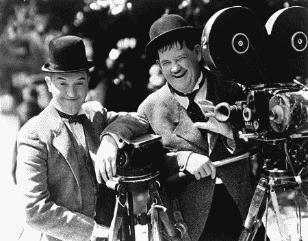
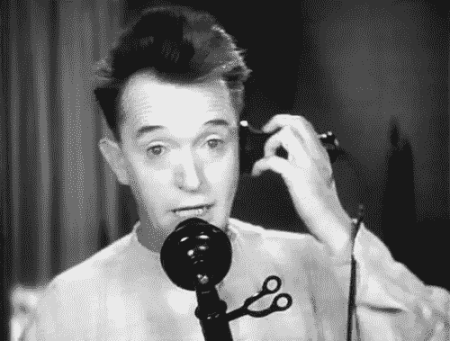
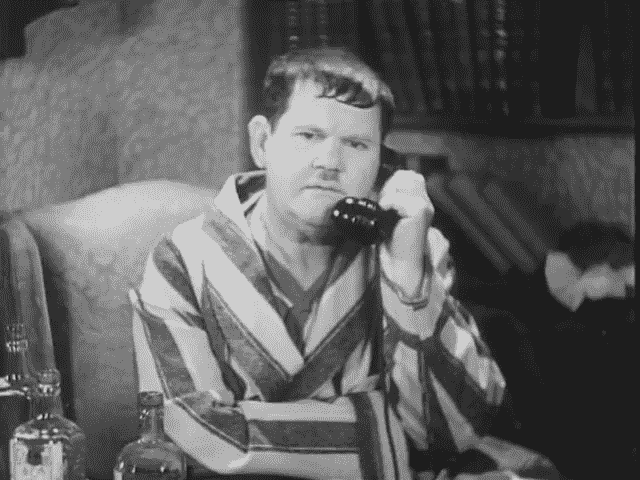
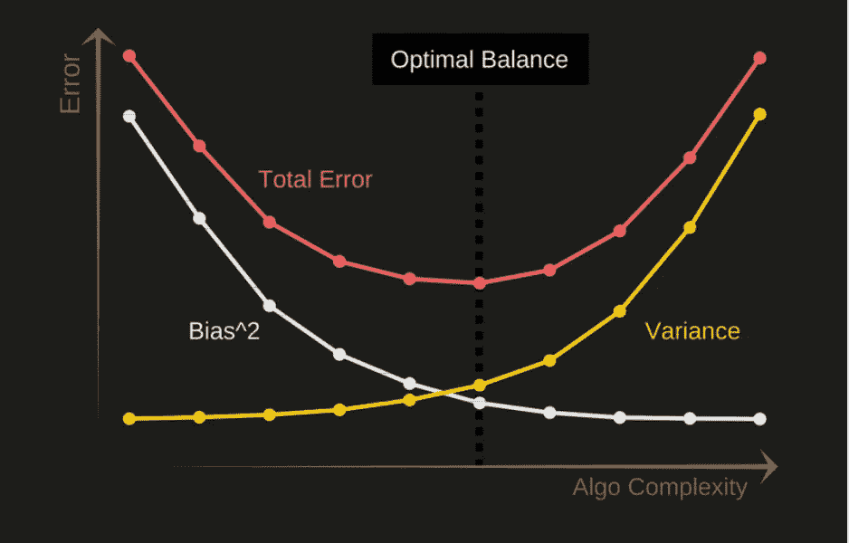

# 机器学习领域的劳雷尔和哈迪

> 原文：<https://towardsdatascience.com/laurel-hardy-in-machine-learning-a0e739b51225?source=collection_archive---------42----------------------->

Source: Flickr

"好吧，你又给我惹了一个大麻烦！"

本周，我引用了更早的资料，一直追溯到 20 世纪 30 年代。万一一些千禧一代的读者只是想“OK Boomer”，我想澄清一下，我自己也是千禧一代。只是有时候旧时代的参考比现代的更有意义。

所以，对于那些不知道劳雷尔&哈代的人，我建议你们在继续阅读之前，先去 Youtube 上看几个视频。对于那些有幸经历过这一对搭档的人来说，我希望你能看到我接下来要说的相似之处。

机器学习的 Laurel & Hardy 被称为偏差和方差。就像劳雷尔和哈代一样，偏见和差异交织在一起。虽然两者都可能导致你的模型出现重大错误，但与 Laurel 和 Hardy 不同，他们理解错误在让人发笑方面的力量，在机器学习中，错误可不是闹着玩的。如果你不注意偏见和差异，它们会让你丢掉工作。

为了帮助你避免陷入困境，让我们看看为什么机器学习的 Laurel & Hardy 值得你关注。

**差异**

Stan Laurel, Source:Flickr

> "你可以把马牵到水边，但必须牵着一支铅笔."—劳雷尔

这部剧的粉丝会记得劳雷尔有真正好的想法。他会想出一个有趣的做事方法，并与哈代分享，然后哈代会去“再告诉我一遍”。这些话一出口，劳雷尔就会犯错误，第二次给出他的想法的一个完全荒谬的版本。

劳雷尔举例说明了机器学习中的差异。方差是你的模型的错误，当它不能推广到它以前没有见过的数据。如果你稍微改变一下数据，模型的预测就会完全偏离。就像劳雷尔的“再告诉我一遍”的每次迭代都会导致不同的答案一样，如果你的机器学习模型具有非常高的方差，也会发生同样的情况。

换句话说，你的模型将随着信号学习噪音，所以如果有一个从铅丢失，它将不能简单地分离东西！

**偏向**

Oliver Hardy, Source:Flickr

> “你实际上在用你的大脑。这就是与我交往的结果。”—哈代

另一方面，当劳雷尔第一次分享他的想法时，他从来没有理解过劳雷尔，至少对观众来说，他的想法是清楚的。然而，哈代有一种不可思议的能力，能够理解劳雷尔第二次脱口而出的非荒谬的版本。

显然，哈迪很难将信号从噪音中分离出来，这就是偏见。简单来说，偏差可以定义为由于模型无法从训练数据中学习到任何东西而导致的错误。

换句话说，如果你只是简单地使用你的大脑，而不是使用一个有高度偏见的模型，你会看起来更聪明。

**那又怎样？**

老样子来了那又怎样？你为什么要关心这些可怕的强制类比呢？你必须关心它们，因为每个机器学习问题都是关于平衡两者之间的权衡。

Source: elitedatascience.com

如果你的模型有很高的偏差，那它就是学习得不够(或者根本没有学习)，所以这就打败了机器学习的意义。例如，这可能会发生，因为您正在对非线性问题使用线性回归。所以，一个从耐寒到耐寒的方法是使用更复杂的模型。

如果你让你的模型变得太复杂，比如用一个复杂的反推 SVM，Laurel 开始产生铅笔和马的幻觉，就像我刚刚产生了模型名字的幻觉一样，所以你也要避免这种情况。

基本上，你需要做的是在两者之间找到一个平衡点，一个劳雷尔&哈代和你和谐相处的快乐之地。

直到你让自己陷入另一个烂摊子！但这就是数据科学家的生活，不是吗？

现在，如果你们中的任何人已经遭受了这种痛苦，下面我提供了一个链接，可以更好地解释偏差和方差的权衡，这可能会帮助你的大脑从刚刚阅读的内容中恢复过来:

[https://elitedatascience.com/bias-variance-tradeoff](https://elitedatascience.com/bias-variance-tradeoff)