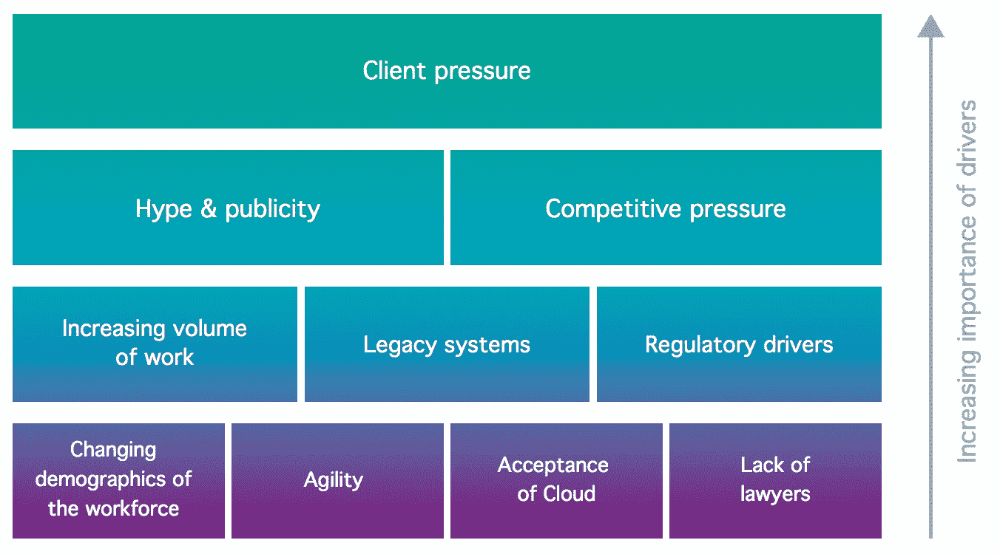
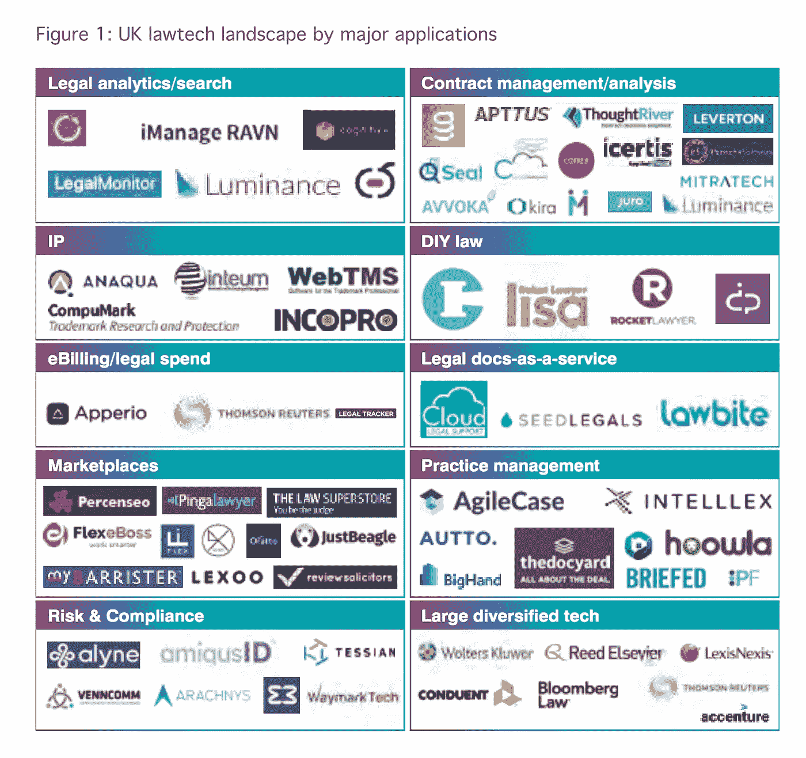

# 人工智能和法律技术的采用

> 原文：<https://towardsdatascience.com/lawtech-and-artificial-intelligence-fc5d7899c37b?source=collection_archive---------17----------------------->

Photo by [@chrisyangchrisfilm](https://unsplash.com/@chrisyangchrisfilm)

## 责任、不断增加的压力和量化律师

我们可以随心所欲地谈论道德，但在某一点上，政治中争论已久的对与错将会变成法律。微软等大型科技公司及其总裁辩称:“科技公司必须停止‘如果合法，那就是可以接受’的做法。”据《卫报》(Hern，2019)报道。微软现在是一家价值一万亿美元的公司。然而，不仅仅是科技公司必须三思而后行，在新法规出台前做到合法。适应得越快越好还是越差，法律职业在技术中会是什么样子？

***法律技术*** *又称法律技术，是指利用技术和软件提供法律服务。*

# 法律技术采用

英国法律协会于 2019 年 2 月发布了一份名为 LawTech 收养研究的报告。这份报告是由科技分析师 TechMarketView (TMV)撰写的。法律协会代表英格兰和威尔士 190，000 多名律师。

根据该报告:*“近年来，法律科技公司的数量有所增加，但法律从业者采用法律科技的比率并没有加快。”* (TechMarketView，2019)因此，技术创新似乎不会立即成为问题，但是，公司选择适应这种变化的方式可能是，而且确实是相关的。现在下结论可能太快了。

TechMarketView 发现并调查了 100 多家在英国运营的法律技术公司。许多是由律师或前律师提出的“单点解决方案”。其他法律技术供应商是技术提供商，最初服务于金融服务等其他行业，现在正转向法律市场。

“我发现初创企业很难打交道。我接触过的一些公司似乎是由一个心怀不满的律师建立的，他碰巧和一个 IT 人员一起去了大学。我只是觉得，他们中很少有人真正在做什么新的事情，他们往往分为三种主要类型:生成文档、审阅和分析文档或分析管理信息，如法律支出或工作流程。他们不一定是在重新发明轮子，而是希望提供一个更闪亮的新轮子”。

然而，尽管传统律师可能不同意或涉及现有的解决方案，但不同的行为者都有采用新技术的压力，这在同一份报告中有所概述。

Image by techMarketView in the report LawTech Adoption Research retrieved the 21st of September 2019.

我将列举这些不同报告中提出的几个要点:

*   ***客户*** *:应对客户收费压力的效率和生产力，以及律师展示他们如何为客户利益创新的需要。*
*   ***一般委员会*** *期望在相同的预算内看到更多的尽职调查或电子发现。*
*   ***对透明度的需求*** *。客户压力直接转化为法律技术采用的一个领域是法律成本透明度。计费有时很抽象和困难，这可能会改变。*
*   ***对新工作方式的需求*** *。客户对律师事务所施加越来越大的压力，要求他们以更低的成本办事，在某些情况下，客户甚至要求律师事务所在其服务中加入特定的技术解决方案。*
*   ***来自适应更快的会计服务提供商的竞争*** *。“英国所有的‘四大’会计服务提供商现在都有一个法律部门。2014 年初，普华永道的法律业务获得 ABS 资格，同年晚些时候，毕马威和 EY 获得 SRA 批准。2018 年 6 月，德勤英国被授予 ABS 资格。*
*   **炒作**。与 lawtech(特别是人工智能和机器学习技术)相关的炒作和宣传对提高整个法律部门的认识产生了积极影响。
*   ***调控驱动*** *。已经为金融服务和银行业提供解决方案的所谓“regtech”公司已经开始转向法律领域*
*   ***遗留 IT 系统*** *s .通过用机器人维护现有流程自动化，在某些情况下需要最终迁移到新系统上。*
*   ***【律师事务所开业】*** *对技术和 IT 提出了更高的要求，以提供移动工作环境。*
*   ***改变人口统计*** *。你可能会发现更多的人从大学选修了计算机科学模块和法律。越来越多的模块侧重于法律技术或法律技术。*
*   ***缺少律师*** *。在某些情况下，缺乏律师，或者有些人无法接触律师。这在家庭法等领域可以有所改变(这些领域一直缺乏律师)。*
*   ***云应用*** *。云计算降低了进入各种应用程序的成本和商业壁垒，随着传统案例管理系统或实践管理系统的生命周期结束，这些应用程序可以进入企业。*

***机器人流程自动化*** *(RPA)是用于部分或全部自动化人工、基于规则和重复的人类活动的软件工具的术语。*

***总法律顾问*** *，首席法律顾问，或首席法务官(CLO)是法律部门的首席律师，通常在公司或政府部门。*

# 定量律师

不久前，金融服务行业在其领域中创建了一个新的方向。他们被称为**‘quants’或*数量统计学家*** *，专门研究应用数学和统计方法解决金融和风险管理问题*。

Khandani 在一篇论文中指出，通过间接手段，2007 年 8 月 6 日至 10 日的事件可能是一个或多个大型多空股票投资组合快速平仓的结果，最有可能的是最初的量化股票市场中性投资组合。因此，这可能是 2007-2008 年大规模金融危机的部分原因(Khandani，2007)。

如果定量统计、情感分析等正在进入法律领域，这是一个警告。如果律师或法律行业的其他人认为自己比金融行业更擅长管理风险，这可能是一个滑坡——相对较小的第一步会导致一系列相关事件，最终导致一些重大(通常是负面)影响。或许我们可以希望，正是考虑到这一点，法律行业在适应技术方面经历了如此艰难的时期，但我怀疑事实是否如此。

无论如何，这是很重要的，因为法律职业可能会变得与技术更加融合，法律从业者习惯于超越眼前的利益，看到潜在的风险。让我举几个假设。

*   想象一下，一份符合当地法规的合同为 100，000 人提供简单的保险索赔，您可以自己拍摄并发送。
*   维护社交媒体平台上数十亿用户的条款和条件。通过从政府法律公告中“抓取”在线文本，并根据当地参与者的分析进行预测，不断监控改革，以适应世界上大多数国家的当地法规。
*   在一家大型国际公司中整理 40，000 份文档，以找到支持诉讼的历史数据，同时在线运行情绪分析，以找到受影响的受害者。

在所有这些情况下:什么会变得糟糕透顶？在法律失控的最坏情况下，我们能期待看到什么？

在最好的情况下，利用技术的伟大法律实践会是什么样的呢？

# 法律中的人工智能

有人说，法律的核心是语言，所以长期以来，基于自然语言运行的软件在法律职业的一些领域发挥了作用，这并不奇怪。

***自然语言处理:*** *通常简称为 NLP，是人工智能的一个分支，利用自然语言处理计算机与人类之间的交互。*

关于法律技术的许多争论和宣传焦点都集中在人工智能上。这可能是由于客户在展示创新方面的压力(通常通过新闻稿分享)。许多人可能高估了人工智能增强运营的潜力。这些技术似乎首先被英国的大公司采用，后来被小公司采用。因此，你最终只能在价格上竞争。

技术并不能解决一切。吸收一份文件并提取出标准的东西是很容易的，但理解合同语言却不容易。因此，在法律背景下，要确信已经提取了所有关键数据点并不那么容易。几乎没有标准的合同语言或带有标签的信息保密示例，因此这带来了一些困难。

人工智能可以帮助降低风险，通常是通过在诉讼过程中协助律师。这也是非常重要的，因为只审查十分之一的文件会有什么样的风险？该报告问道:“十分之一由人类审阅的文档比婴儿人工智能系统查看每一份文档的风险低吗？”我非常确定这个问题的答案并不简单。

## 法律技术的三个领域

《法律技术应用研究报告》将法律服务细分为三个具有不同需求的领域。

*   企业对企业(B2B)律师事务所
*   企业对消费者(B2C)律师事务所
*   内部法律部门(主要在大型商业或公共部门组织中)。

## 法律技术领域

在英国的法律技术领域，有更多的参与者，他们在上述报告中得到了相对简洁的总结。

Image by techMarketView in the report LawTech Adoption Research retrieved the 21st of September 2019.

在过去的四年里，一小群公司已经在法律市场上站稳了脚跟。像 Kira、Luminance 和 RAVN(现在的 iManage )这样的供应商已经在 B2B 领域获得了牵引力。

Apperio**正在帮助公司分析他们的法律支出，并在 2018 年年中在 A 轮融资中筹集了 1000 万美元(750 万英镑)。今年，Clarilis、Lexoo 和 Juro 等公司在 2000 万至 1000 万英镑之间进行了融资，这种情况在几年前还是闻所未闻的。**

除此之外，还列出了具体的应用程序，以便更好地理解技术和应用程序可以集成或包含在哪里。这些也构成了研究的重点。

## 结论

在处理新问题时，我们必须确保不要制造太多的新问题。从某种程度上来说，法律行业在改变其做法上如此缓慢是不可避免的，也许这是更好的。这仍有待观察，因为法律公司可能会尝试在更大程度上用数学和统计学以及计算机科学来量化信息。英国市场上有大量的解决方案，在这个重要的领域可能会有一大批新的竞争者。

如果你有兴趣阅读更多关于 LawTech 的内容，我以前写过另一篇关于这个主题的文章:

 [## 人工智能和法律技术

### 人工智能领域的不同法律应用

medium.com](https://medium.com/dataseries/artificial-intelligence-and-lawtech-4d7181a03202) 

## 一个响亮的旁注——存在气候危机

除了我们能与法律行业合作的令人兴奋的新技术方法之外，一个更相关的问题是这些创新者应该关注什么。一个可能的地点当然是当前的气候危机和这一领域的法律应用。超过 30 万人走上悉尼街头，但 9 月 20 日，数百万人走上街头抗议，要求我们更加严肃地对待气候危机，减少排放。哪个创新的律师会使用这些新技术来解决气候变化的问题？这是今天的一个深刻的旁注。

Sydney as shared by Greta Thunberg

## 参考

戴尔河(2019)。法律与词序:法律技术中的自然语言处理。*自然语言工程*， *25* (1)，211–217。

鲍勃·古德曼(2014 年 12 月 16 日)。[《聪明的创业公司颠覆法律的四个成熟领域》](http://www.lawtechnologytoday.org/2014/12/smart-startups/)。今日法律技术。检索时间 2019 年 9 月 20 日。

Hern，A. (2019 年 9 月 20 日)。微软老板:科技公司必须停止“如果合法，就可以接受”的做法。检索自[https://www . the guardian . com/technology/2019/sep/20/Microsoft-boss-tech-firms-must-stop-if-its-legal-its-acceptable-approach](https://www.theguardian.com/technology/2019/sep/20/microsoft-boss-tech-firms-must-stop-if-its-legal-its-acceptable-approach)

汉达尼和罗(2007 年)。2007 年 8 月，宽客发生了什么？。*可在 SSRN 1015987* 处获得。

TechMarketView。(2019 年 2 月)。法律技术采用研究报告。检索自[https://www . law society . org . uk/support-services/research-trends/law tech-adoption-report/](https://www.lawsociety.org.uk/support-services/research-trends/lawtech-adoption-report/)

这是第 500 天的第 109 天。我目前第 101-200 天的重点主要是 Python 编程，但是今天我决定进入 lawtech，因为明天我将在一个黑客马拉松中与一个团队就这个具体问题进行合作。如果你喜欢这篇文章，请给我一个答复，因为我确实想提高我的写作或发现新的研究，公司和项目。