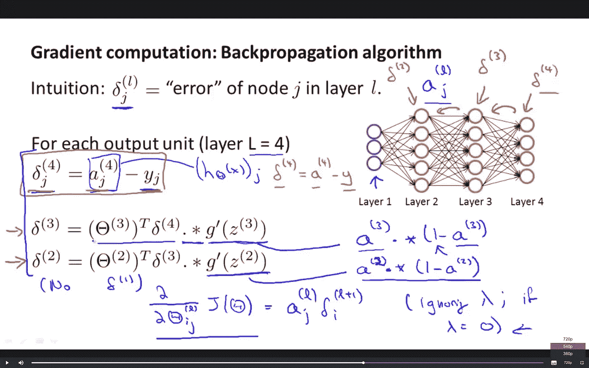
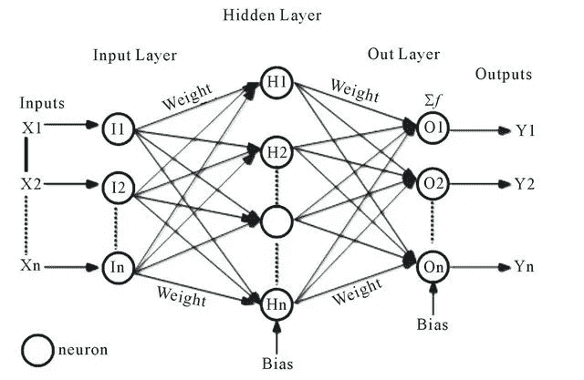
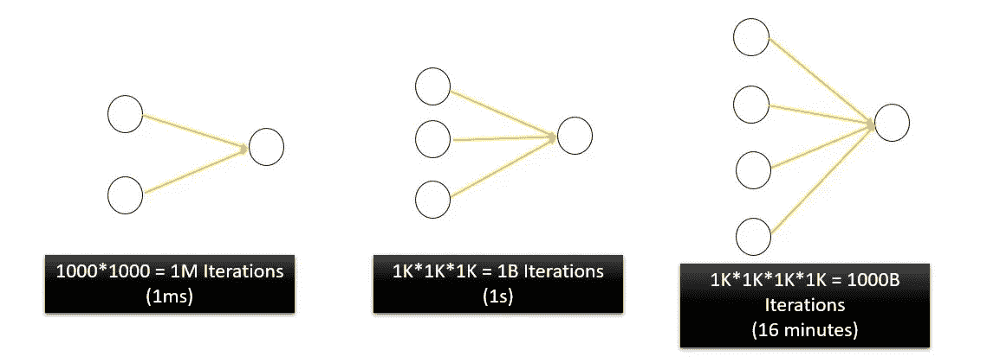
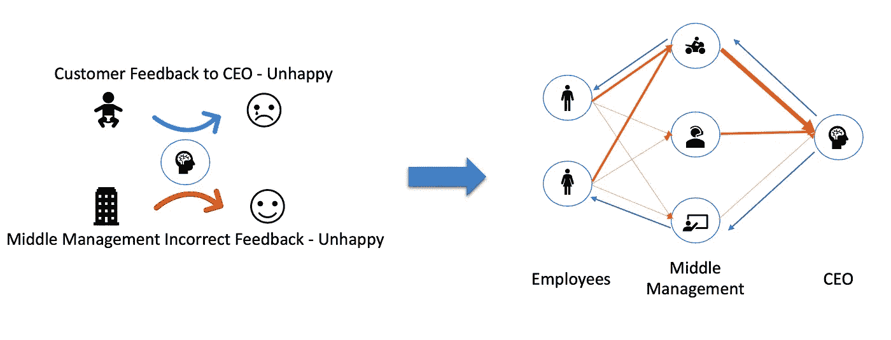
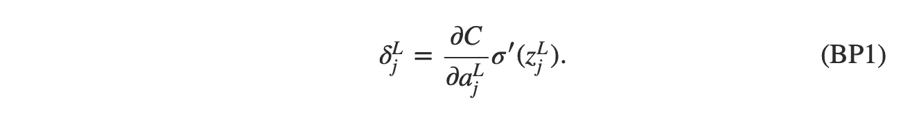
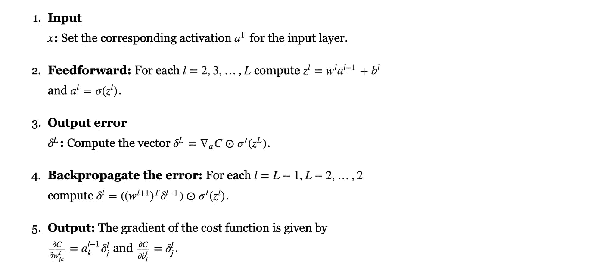

# 反向传播入门

> 原文：<https://towardsdatascience.com/laymans-introduction-to-backpropagation-efa2c64437db?source=collection_archive---------5----------------------->

## 训练一个神经网络不是一件容易的事，但理解它可能很简单

反向传播是调整[神经网络](https://medium.com/datadriveninvestor/neural-networks-an-intuition-640821d5bd83)的权重以提高预测精度的过程。神经网络中的信息流动有两个方向。

1.  **前向传播——也称为推理——**是指数据进入神经网络并弹出预测。
2.  **反向传播** —通过查看预测和实际结果之间的差异来调整权重的过程。

Photo by [Pankaj Patel](https://unsplash.com/@pankajpatel?utm_source=medium&utm_medium=referral) on [Unsplash](https://unsplash.com?utm_source=medium&utm_medium=referral)

反向传播是在神经网络准备部署到现场之前完成的。人们使用已知结果的训练数据来执行反向传播。一旦我们确信网络得到了充分的训练，我们就开始**推理过程。**

如今，反向传播就是使用无数工具中的一个命令。因为这些工具很容易训练神经网络，大多数人倾向于跳过理解反向传播背后的直觉。可以理解，当数学看起来像这样。

Andrew Ng’s Coursera course: [https://www.coursera.org/learn/machine-learning](https://www.coursera.org/learn/machine-learning)

但是，在如此多的机器智能的核心过程背后获得一种直觉是非常有意义的。

## 权重在神经网络中的作用

在试图理解反向传播之前，让我们看看权重实际上如何影响输出，即预测。第一层的信号输入通过控制相邻层神经元之间连接强度的权重向前传播到网络中。

Source: [http://tuxar.uk/brief-introduction-artificial-neural-networks/](http://tuxar.uk/brief-introduction-artificial-neural-networks/)

> 训练网络意味着微调其权重以提高预测精度

## 调整权重

一开始，神经网络的权重是随机的，因此预测都是错误的。那么，我们如何改变权重，以便当给一只猫看时，神经网络以很高的可信度预测它是一只猫呢？

*   一次一个权重:训练网络的一个非常基本的方法是改变一个权重，同时保持其他权重不变。
*   **权重组合:**另一种方法是在一个范围内(比如从 1 到 1000)随机设置所有权重。可以从全 1 开始，然后全 1 和一个 2 等等。组合看起来像这样— (1，1，1)，(1，1，2)，(1，2，1)，(1，2，2)，(2，2，2)，(2，2，3)

## 为什么这两种方法都不好？

这是因为如果我们尝试 N 个权重的所有可能组合，每个组合的权重范围从 1 到 1000，这将花费大量的时间来筛选解空间。对于运行在 1GHz 的处理器，2 个神经元的网络需要 1⁰⁶/1⁰⁹ = 1 毫秒。对于 4 个神经元的网络，相应的处理时间将是 16 分钟，并且对于更大的网络，处理时间将保持指数增长。

The Curse of Dimensionality

对于 5 个神经元网络来说，这将是 11.5 天。这就是维度的诅咒。一个真正的神经网络将有 1000 个权重，需要几个世纪才能完成。

## 这就是反向传播的用处

一旦你对反向传播有了直观的认识，数学就很容易理解了。假设一家公司有 2 名销售人员、3 名经理和 1 名首席执行官。反向传播是首席执行官向中层管理人员提供反馈，他们反过来又向销售人员提供反馈。

每一层的员工都向所有后续层的经理汇报，用箭头的宽度表示不同的“强度”。因此，一些员工比其他人更经常向一位经理汇报工作。此外，CEO 认为设计经理(第二层的底层神经元)的意见比销售经理(自行车骑手)的意见更重要。

每次销售完成后，首席执行官都会计算预测结果和预期结果之间的差异。这位首席执行官稍微调整了一下，他希望对哪位经理的话给予多大的“权重”。经理汇报结构也根据首席执行官的指导方针而改变。每位经理都试图以一种让他/她更了解情况的方式重新调整权重。

Top Down: Backpropagation happening after CEO receives wrong inputs from Middle Management

首席执行官重新调整对中层管理人员的信任。

> 这种将反馈传播回前几层的过程就是它被称为反向传播的原因。

首席执行官不断改变他的信任级别，直到客户的反馈开始符合预期的结果。

## 一点点数学知识

Source: [https://www.xkcd.com/435/](https://www.xkcd.com/435/)

**一撮数学** 一个神经网络的成功是用代价函数来衡量的。花费越少，训练越好。目标是以最小化成本函数的方式修改权重。

所以两个重要的术语—

*   **误差** =预期与现实之间的差异
*   **成本函数的梯度** =改变权重时成本的变化。

**反向传播包含单词“back”。这意味着我们从输出回到输入。我们看看错误是如何反向传播的。**

**看看δˡ是如何依赖δˡ⁺的**

****

**[http://neuralnetworksanddeeplearning.com/chap2.html](http://neuralnetworksanddeeplearning.com/chap2.html)**

**如果你仔细观察，方程的第二项有一个 z。我们在那里测量 z 变化的速度。这告诉我们误差会变化多快，因为δˡ也依赖于 z =神经元的输出。**

****

**[http://neuralnetworksanddeeplearning.com/chap2.html](http://neuralnetworksanddeeplearning.com/chap2.html)**

**右边的第一项只是衡量成本作为第 j 个输出激活的函数变化有多快。右边的第二项测量第 j 个神经元输出端的激活函数σ变化有多快。**

**结果向前流，错误向后流。由于我们反向传播误差，我们需要误差如何在两个相邻层之间流动的数值表示。成本相对于重量的变化率由下式给出**

****

**[http://neuralnetworksanddeeplearning.com/chap2.html](http://neuralnetworksanddeeplearning.com/chap2.html)**

**有了这些基础，反向传播算法可以总结如下**

****

**[http://neuralnetworksanddeeplearning.com/chap2.html](http://neuralnetworksanddeeplearning.com/chap2.html)**

## **从机器学习的角度考虑实际问题**

*   **即使反向传播也需要时间。最好把输入的数据分批次。(**随机梯度下降**)。**
*   **训练数据越多，权重调整越好。通常，神经网络需要数千个预先标记的训练样本。**

**反向传播虽然现在很流行，但在引入时也遭到了反对。许多著名的科学家和认知心理学家(包括著名的英国认知心理学家 Geoff Hinton)都不相信反向传播。反向传播由于很多原因而面临反对，包括它不能代表大脑如何学习。**

**Quora answer**

**尽管如此，它仍然是一个非常广泛使用的和非常有效的训练神经网络的方法。目前，专门的硬件正在开发，以更有效地执行反向传播。**

** [## 自我学习人工智能:这种新的受神经启发的计算机自我训练

### 来自比利时的一组研究人员认为他们已经接近扩展摩尔定律的预期终点，他们…

futurism.com](https://futurism.com/self-learning-ai-this-new-neuro-inspired-computer-trains-itself)**