# 外行人对 KNN 的介绍

> 原文：<https://towardsdatascience.com/laymans-introduction-to-knn-c793ed392bc2?source=collection_archive---------9----------------------->

## k-最近邻算法是大多数人在开始机器学习时的起点。


Photo by [timJ](https://unsplash.com/@the_roaming_platypus?utm_source=medium&utm_medium=referral) on [Unsplash](https://unsplash.com?utm_source=medium&utm_medium=referral)

kNN 代表 k-最近邻。它是一个**监督学习**算法。这意味着我们在监督下训练它。我们使用已有的标签数据来训练它。给定一个由观察值 ***(x，y)***组成的带标签的数据集，我们希望捕获 **x —数据**和 **y —标签**之间的关系。更正式地说，我们想要学习一个函数 ***g : X→Y*** 以便给定一个看不见的观察值 **X** ， ***g(x)*** 可以自信地预测相应的输出 **Y** 。

监督学习算法的其他例子包括[随机森林](https://link.medium.com/tJY9BkPMmW)、[线性回归](https://link.medium.com/3h3C1XczsU)和[逻辑回归](https://link.medium.com/bDfhu5lzsU)。

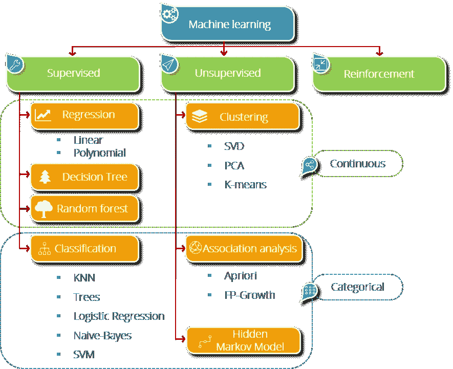

Source: [Edureka](https://www.edureka.co/blog/what-is-machine-learning/)

kNN 实现起来非常简单，在任何机器学习设置中被广泛用作第一步。它通常被用作更复杂分类器的基准，如人工神经网络(ANN)和支持向量机(SVM)。尽管简单，k-NN 可以胜过更强大的分类器，并用于各种应用，如经济预测，数据压缩和遗传学。

*   遗传学

[](https://bmcbioinformatics.biomedcentral.com/articles/10.1186/1471-2105-7-S1-S11) [## 一个基于回归的 K 最近邻算法用于基因功能预测。

### 随着各种功能基因组学和蛋白质组学技术的出现，越来越需要…

bmcbioinformatics.biomedcentral.com](https://bmcbioinformatics.biomedcentral.com/articles/10.1186/1471-2105-7-S1-S11) 

*   农业

 [## 用现场数据、航空数据估算火炬松人工林的林分高度和树木密度

### 准确的森林库存对于优化纸浆和造纸行业的整个供应链管理具有重要的经济意义

www.scielo.br](http://www.scielo.br/scielo.php?pid=S0001-37652018000100295&script=sci_arttext) 

*   航空— [空中交通流量预测](https://ieeexplore.ieee.org/abstract/document/8630470)

 [## 基于 k 近邻回归的空中交通流量预测

### 为了提高空中交通流量的预测精度，提出了将 k 近邻回归应用于空中交通流量预测的方法

ieeexplore.ieee.org](https://ieeexplore.ieee.org/abstract/document/8630470) 

正如 20 世纪初的大多数技术进步一样，KNN 算法也诞生于为军队所做的研究。美国空军航空医学院的两个办公室——**Fix 和 Hodges (1951)** 写了一份技术报告，介绍了一种用于模式分类的*非参数方法*，这种方法后来成为流行的 k-最近邻(kNN)算法。

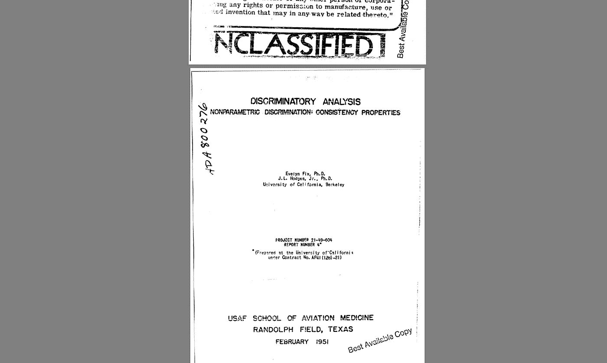

Source: [DTIC](https://apps.dtic.mil/dtic/tr/fulltext/u2/a800276.pdf) — The Declassified Paper in full.

# 它是如何工作的？

假设我们有一个包含两种点的数据集，即标签 1 和标签 2。现在给定这个数据集中的一个新点，我们想找出它的标签。kNN 的做法是通过其最近的 k 个邻居**的多数投票。k 可以取 1 到无穷大之间的任何值，但在大多数实际情况下，k 小于 30。**

## 蓝色圆圈 v/s 橙色三角形

假设我们有两组点——**蓝色圆圈**和**橙色三角形**。我们要将**测试点=** *带问号的黑色圆圈，*归类为蓝色圆圈或橙色三角形。

**目标:给黑圈贴标签。**

对于 K = 1，我们将着眼于第一个最近的邻居。因为我们采取多数投票，并且只有一个投票人，所以我们将其标签分配给我们的黑色测试点。我们可以看到，对于 k=1，测试点将被归类为蓝色圆圈。

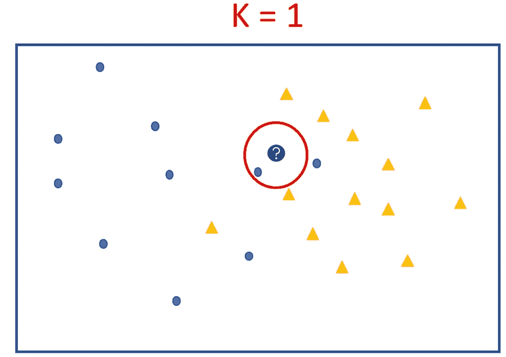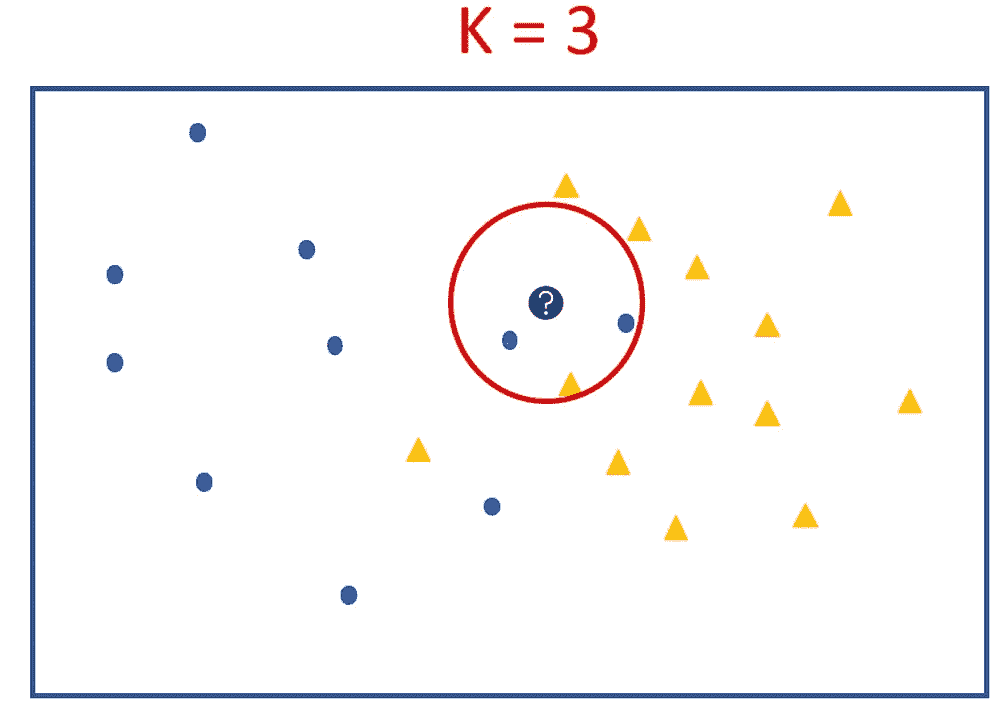

将我们的搜索半径扩大到 K=3 也保持了相同的结果，只是这次不是绝对多数，是 3 中的 2。仍然在 k=3 的情况下，测试点被预测为具有蓝圈类别→因为大多数点是蓝色的。

我们来看看 k=5 和 K =9 是怎么做的。为了查看最近的邻居，我们以测试点为中心画圆，当 5 个点落在圆内时停止。

当我们观察 5 以及随后的 K = 9 时，我们测试点的大多数最近邻都是橙色三角形。这表明测试点必须是一个橙色的三角形。

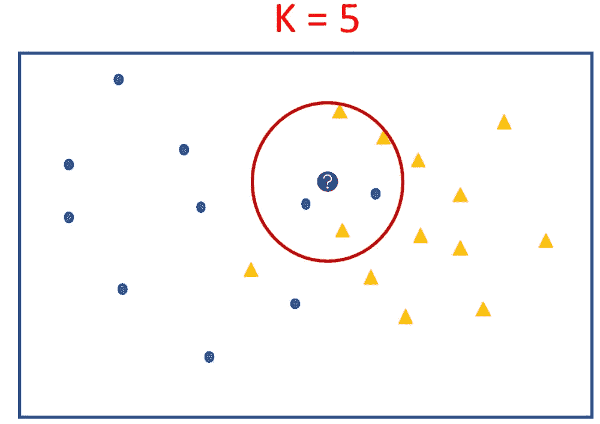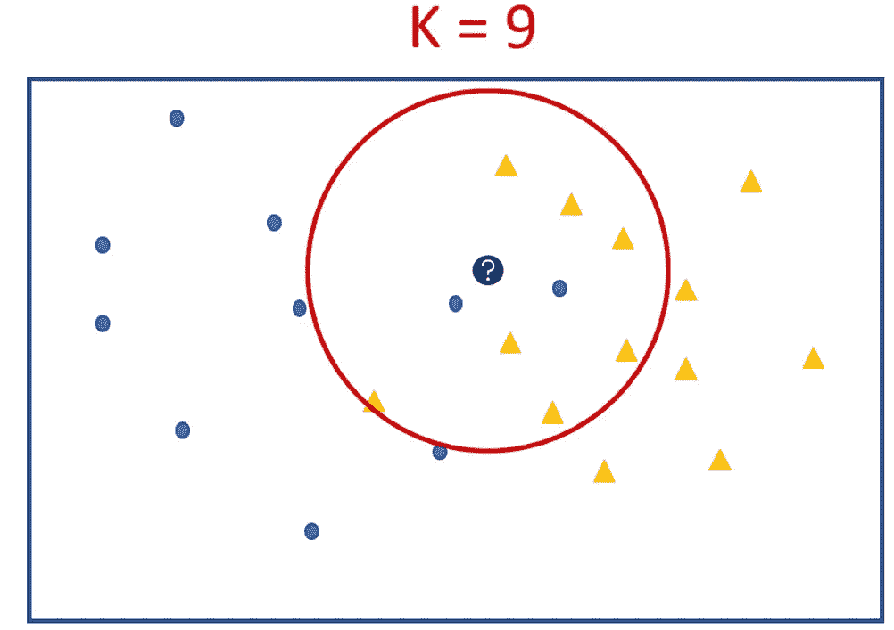

Left→K=5, Majority = Orange | Right→K =9, Majority = Orange

既然我们已经标记了这一个测试点，我们对所有未知点重复相同的过程(即**测试集)**。一旦使用 k-NN 标记了所有的测试点，我们尝试使用判定边界来分离它们。决策边界显示了训练集的分离程度。

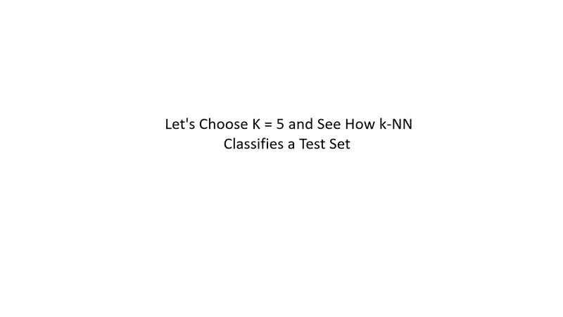

k-NN Live!

## 这就是 k-NN 如何发生的要点。让我们从一个机器学习工程师大脑的角度来看。

**首先**他们会选择**k。**我们在上面已经看到，k 越大 **k** 的票数就越多。这意味着正确的几率更高。但是你说，代价是什么？

获得 k 个最近邻意味着对距离进行排序。那是一个昂贵的手术。需要非常高的处理能力，这意味着更长的处理时间或更昂贵的处理器。K 值越高，整个过程的成本越高。但是过低的 k 会导致过度拟合。

> 非常低的 k 将不能概括。非常高的 k 值是昂贵的。

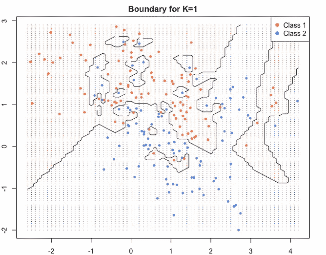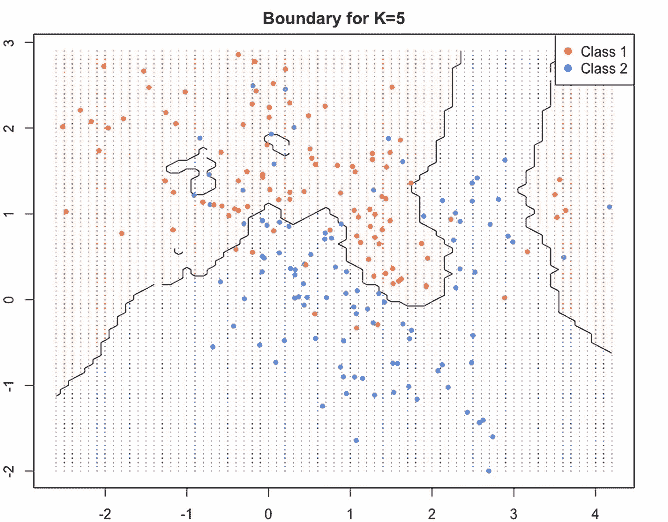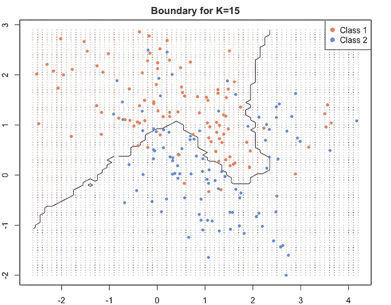

K = 1, 5, 15\. Source code below.

当我们达到更高的 K 值时，边界变得平滑。蓝色和红色区域大致分开。一些蓝红战士被留在了敌后。它们是附带损害。它们说明了训练准确性的损失，但是导致了更好的概括和高测试准确性，即**新点的正确标记的高准确性。**

相对于 K 绘制的验证误差图通常如下所示。我们可以看到，在 K = 8 左右，误差最小。它在任何一边上升。

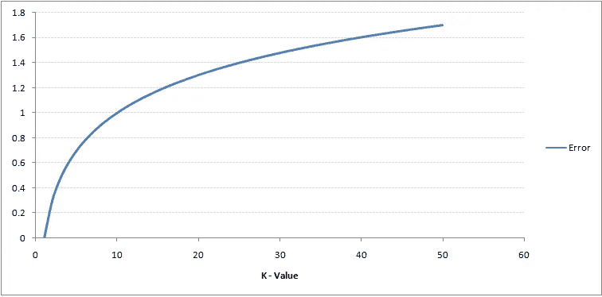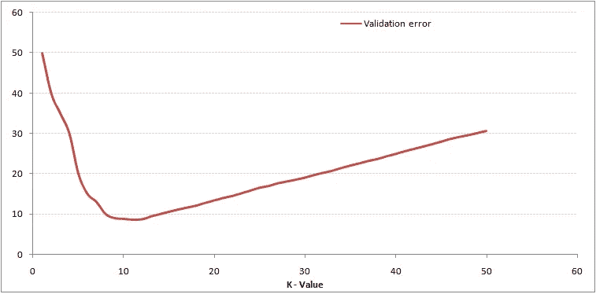

Left : Training error increases with K | Right : Validation error is best for K = 8 | Source: [AnalyticsVidhya](https://www.analyticsvidhya.com/blog/2018/03/introduction-k-neighbours-algorithm-clustering/)

**然后**他们会尝试找出点与点之间的距离。我们如何决定哪些邻居是附近的，哪些不是？

*   欧几里德距离—最常见的距离度量
*   切比雪夫距离— [L∞](https://en.wikipedia.org/wiki/Lp_space) 距离
*   曼哈顿距离-L1 距离:它们的坐标的(绝对)差之和。

> 在国际象棋中，棋盘上**车**的方格之间的距离用曼哈顿距离来度量；**国王和王后**使用切比雪夫距离——维基百科

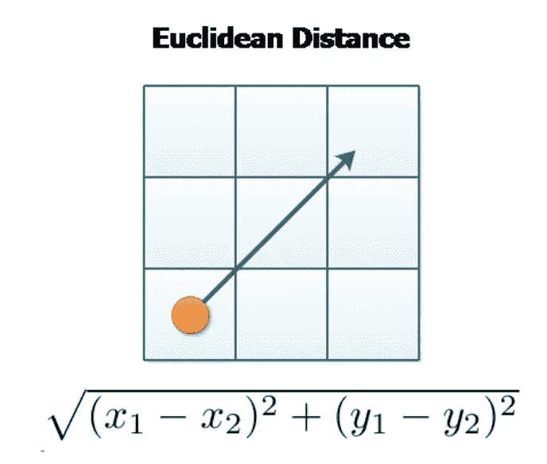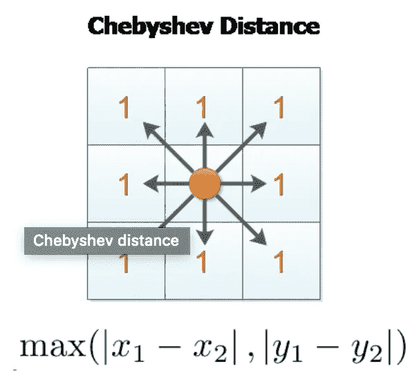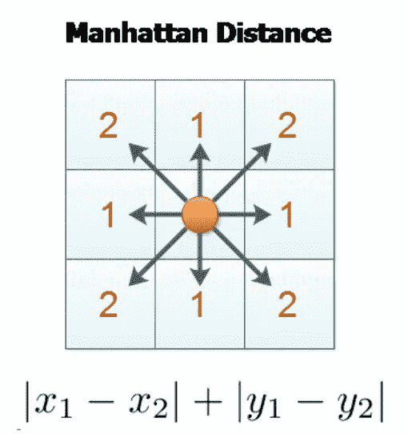

All 3 distance metrics with their mathematical formulae. Source: [Lyfat](https://lyfat.wordpress.com/2012/05/22/euclidean-vs-chebyshev-vs-manhattan-distance/)

**一旦**我们知道如何根据距离来比较点，我们就会训练我们的模型。**k-NN 最好的一点是没有明确的训练步骤。**我们已经知道了关于数据集的所有信息——它的标签。本质上，算法的训练阶段仅包括存储训练样本的 [*特征向量*](https://en.wikipedia.org/wiki/Feature_vector) 和类别标签。

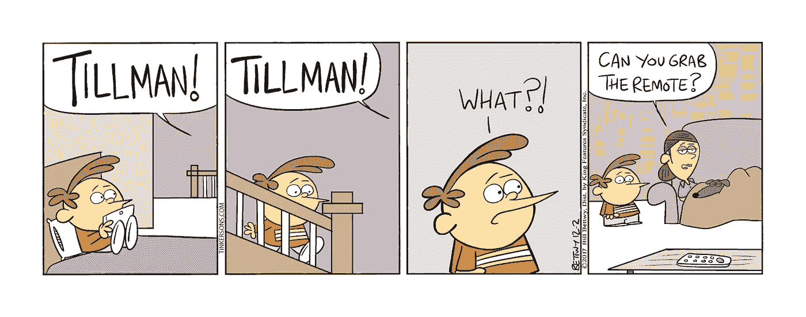

The Tinkersons, December 2, 2017

K-NN 是一个懒惰的学习器，因为它不从训练数据中学习判别函数，而是记忆训练数据集。

> 一个渴望学习的人有一个模型拟合或训练步骤。懒惰的学习者没有训练阶段。

## 最后，为什么是 k-NN？

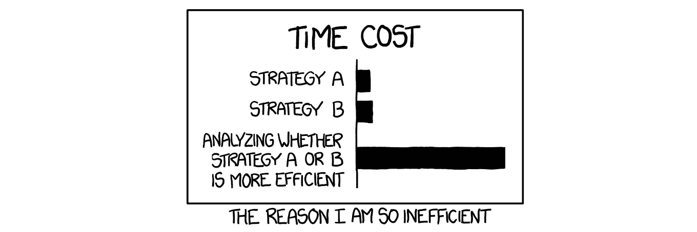

[xkcd](https://xkcd.com/1445/)

*   快速实现:这也是它作为基准算法受欢迎的原因。
*   较少的培训时间:更快的周转时间
*   可比较的准确性:正如许多研究论文中指出的，它的预测准确性对于许多应用来说是相当高的。

当一个人必须快速交付一个具有相当准确结果的解决方案时，k-NN 是一个救命稻草。在大多数工具中，如 MATLAB、python、R，它是作为一个单行命令给出的。尽管如此，这是非常容易实现和有趣的尝试。

R 图的源代码

```
library(ElemStatLearn)
require(class)**#Data Extraction**
KVAL <- 15
x <- mixture.example$x
g <- mixture.example$y
xnew <- mixture.example$xnew**#KNN and boundary extraction**
mod15 <- knn(x, xnew, g, k=KVAL, prob=TRUE)
prob <- attr(mod15, "prob")
prob <- ifelse(mod15=="1", prob, 1-prob)
px1 <- mixture.example$px1
px2 <- mixture.example$px2
prob15 <- matrix(mod15, length(px1), length(px2))**#Plotting Boundary**
par(mar=rep(2,4))
contour(px1, px2, prob15, levels=0.5, labels="", xlab="x", ylab="y", main="", axes=TRUE)**#Plotting red and blue points**
points(x, pch = 20, col=ifelse(g==1, "coral", "cornflowerblue"))gd <- expand.grid(x=px1, y=px2)
points(gd, pch=".", cex=0.001, col=ifelse(prob15>0.5, "coral", "cornflowerblue"))
legend("topright", pch = c(19, 19), col = c( "red","blue"), legend = c( "Class 1", "Class 2"))
title(main="Boundary for K=15", sub="ii", xlab="Feature 1", ylab="Feature 2")
box()
```