# 线性回归入门

> 原文：<https://towardsdatascience.com/laymans-introduction-to-linear-regression-8b334a3dab09?source=collection_archive---------8----------------------->

## 当你的数据遵循直线趋势时，线性回归是你的朋友

线性回归试图通过将线性方程(=直线)拟合到观察到的数据来模拟两个变量之间的关系。一个变量被认为是解释变量(如你的收入)，另一个被认为是因变量(如你的支出)。

Photo by [M. B. M.](https://unsplash.com/@m_b_m?utm_source=medium&utm_medium=referral) on [Unsplash](https://unsplash.com?utm_source=medium&utm_medium=referral)

线性回归所做的就是简单地告诉我们一个任意的**独立/解释变量的**因变量**的值。**例如，基于 Twitter 用户数量的 Twitter 收入。

从机器学习的角度来看，这是可以在你的数据上尝试的最简单的模型。如果您预感到数据遵循直线趋势，线性回归可以给你快速且相当准确的结果。

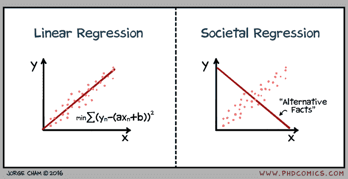

[Jorge Cham](http://phdcomics.com/comics.php?f=1921)

简单的预测都是线性回归的情况。我们首先观察**趋势**，然后**根据趋势预测**，例如，你必须刹车的力度取决于你前面汽车的距离。然而，并非所有情况都遵循线性趋势。例如，从 2015 年到 2016 年，比特币的上涨是线性的，但在 2017 年，它突然变成了指数级的。因此，线性回归无法很好地预测 2017 年后的比特币

因此，重要的是要理解，即使线性回归可以是理解数据的第一次尝试，它也不总是理想的。

这是我们做线性回归的方法

1.  我们将因变量(y 轴)与自变量(x 轴)相对照
2.  我们试图绘制一条直线，并测量相关性
3.  我们不断改变直线的方向，直到得到最佳相关性
4.  我们从这条线推断出 y 轴上的新值

> 外推是基于“一些信息”来“做出预测”

这对于区分作为统计技术的线性回归和作为机器学习算法的线性回归是至关重要的。ML 更关心*预测*，统计更关心*参数推断*

> 术语方面
> 
> 预测' **=因变量**和
> '一些信息' = **自变量。**

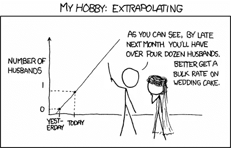

[Extrapolating](https://www.xkcd.com/605/)

> 线性回归为您提供了一条直线，让您推断因变量

# 示例—啤酒控制

线性回归的核心是一种寻找代表一条线的参数值的方法。

## 方程 Y=mX+C

> 根据坐标几何，如果因变量称为 **Y** ，自变量称为 **X** ，那么一条直线可以表示为 **Y = m*X+c** 。其中 m 和 c 是两个数字，线性回归试图计算出这两个数字来估计白线。

看下图。假设你决定意识到自己喝了多少酒。

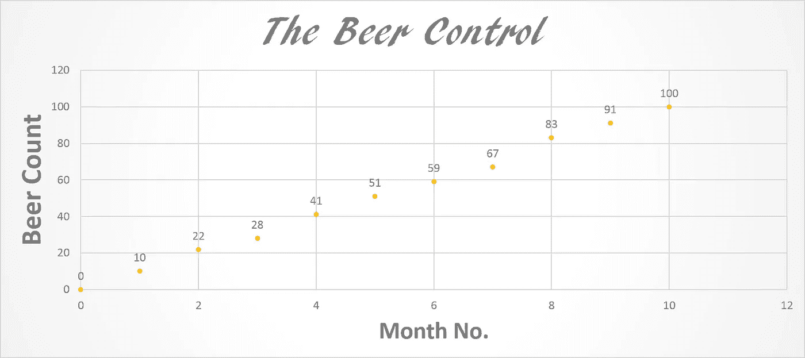

你看到了什么？你每月大约喝多少啤酒？一个简单的观察显示你每个月大概喝 9-10 品脱(不错！).

你认为趋势线会是什么样子？年底有多少啤酒？

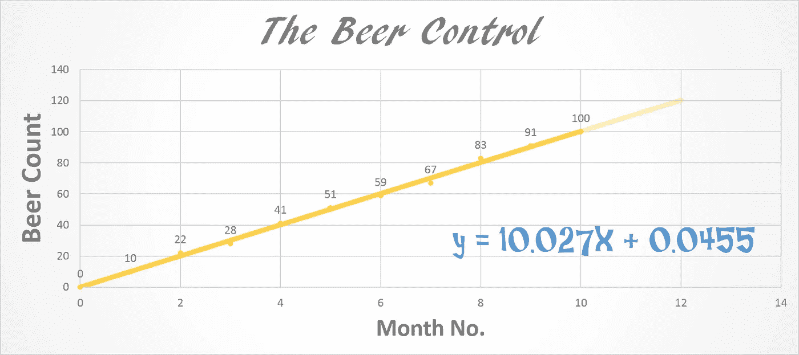

120 Beers in a year. Imagine that!

> 一个简单的线性回归显示了我们可以清楚地看到什么。Y = 10.027X + 0.0455 = > m=10.027，c = 0.0455

c 是一个很小的数，所以现在我们忽略它。看看这个直线方程告诉我们，每个月我们要喝 10.027 瓶啤酒。这就是趋势。我在 MS PowerPoint 中推导出了这个等式，但是我们如何用数学方法来推导呢？

机器学习工程师是如何做到这一点的？

## 线性回归的一般方程

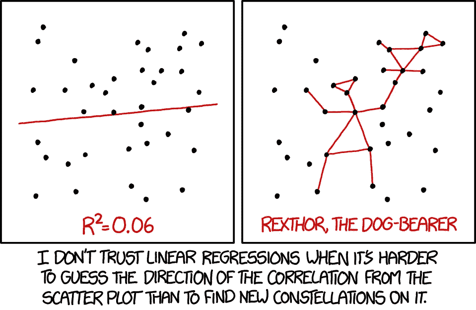

[https://xkcd.com/1725/](https://xkcd.com/1725/)

请原谅我。这一部分有一点数学，但我们将轻松地通过它。

线性回归是监督学习的一种形式。监督学习涉及那些我们使用现有数据来训练机器的问题集。在啤酒的例子中，我们已经知道了前 10 个月的数据。我们只需要预测第 11 个月和第 12 个月的数据。

线性回归可能涉及多个独立变量。例如，房价(**依赖**)取决于位置(**独立**)和土地面积(**独立**)，但其最简单的形式涉及一个独立变量。

在其通用形式中，它被写为

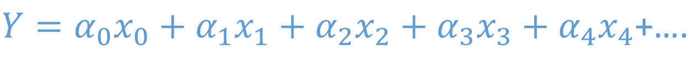

其中所有的阿尔法都是我们的机器学习算法需要计算的系数。x 是已知的，因为它们是独立的。我们可以给他们设定任何东西。我们需要找到的是 **Y** 。

对于单个独立变量，方程简化为

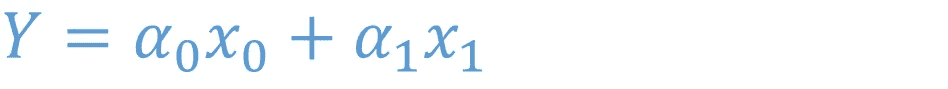

Simple Linear Regression

为简单起见，x0 设为等于 1，alpha0 命名为 c。x1 称为 x，alpha1 = m。它简化为:

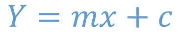

Simple Linear Regression written slightly differently

## 行话

> 为了算出 m**m**和 c**我们画了一条线，使用 m 和 c** 的**初始猜测通过我们已经有的一组点。我们计算这条线到这些点的距离。我们取这些距离 ( **成本函数)***平方和的*平方根*。我们不断地改变 m 和 c，看看这个**成本函数**是否减少。当**成本**停止下降时，我们确定 m 和 c 为最终结果。得到的线是我们对数据的最佳线性拟合。现在对于任何新的 x，我们可以用这条线算出 y。***

这个行话的意思是，我们不断地重画这条线，直到它看起来最符合数据。这就是所有需要的行话。

## 机器学习

下面我们有一个人口与利润的数据集。我们画一个散点图，并试图拟合一条穿过它的直线。仔细观察最初的猜测(蓝线)如何向数据所遵循的趋势转变。还要看看需要多少次迭代才能达到 5.87 的稳定成本

它以 32 英镑的价格开始，最初的猜测差得很远！

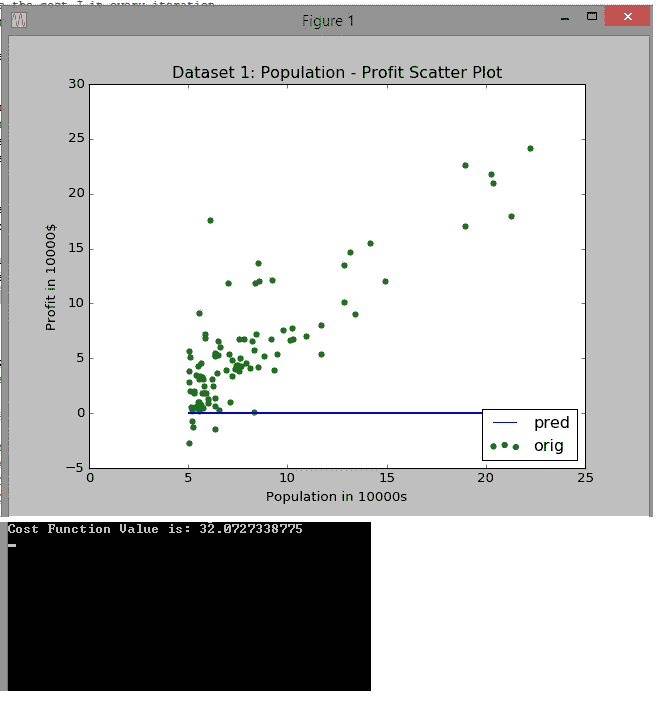

从那时起，情况稳步改善。经过 200 次迭代后，成本已经减半。

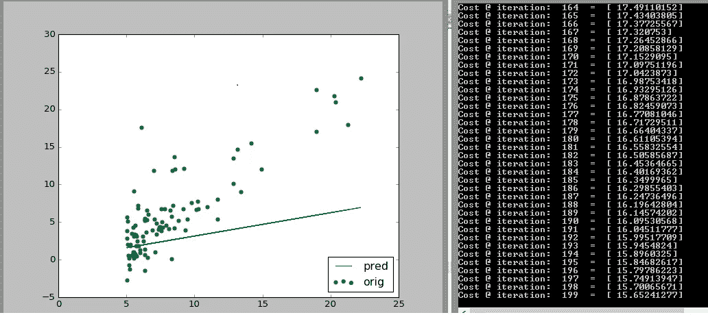

400 次迭代后，成本是 1/3

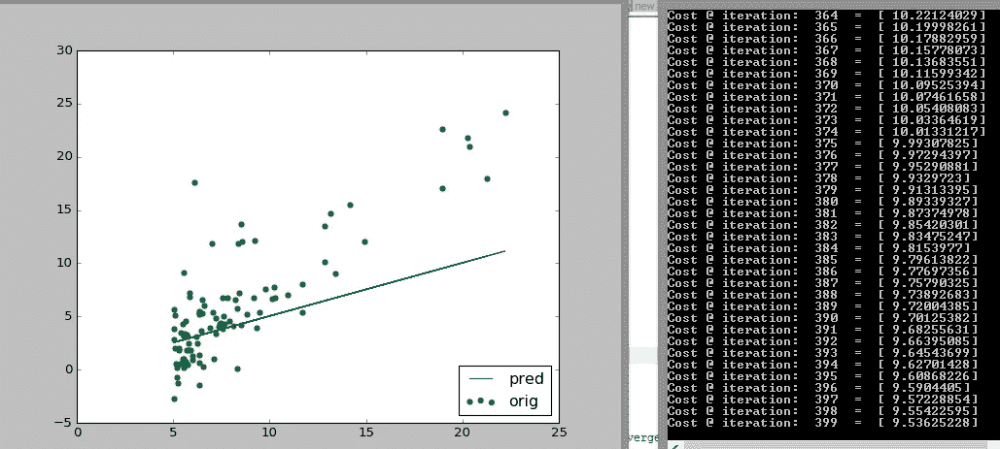

在 600 次迭代时，猜测进一步提高

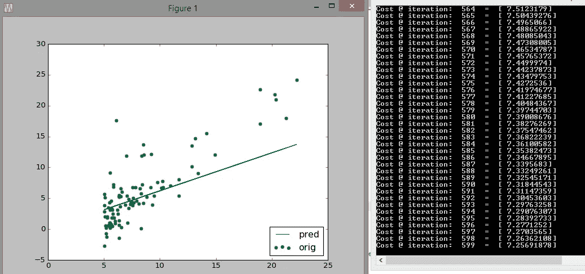

在 1000 次迭代之后，成本的降低已经减缓，并且拟合或多或少是稳定的

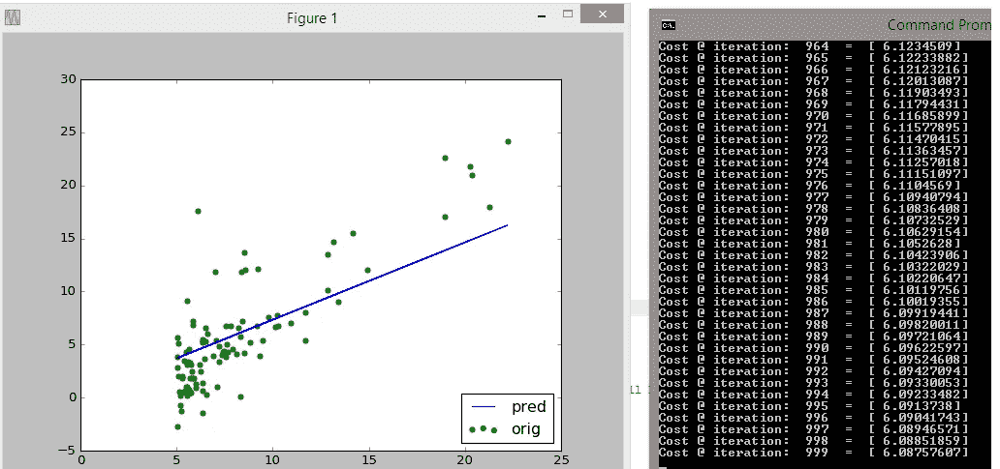

经过 3000 次迭代后，我们确信我们有一个很好的拟合

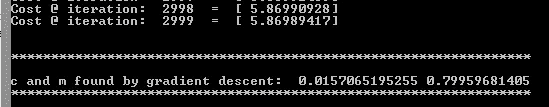

c = 0.02, m = 0.8

就这么简单！显而易见的是,**线性回归**是一种基于遵循线性趋势的数据进行预测的简单方法。因此，如果我们要拟合正弦曲线或圆形数据集，我们将会彻底失败。

最后，对于初学者来说，线性回归总是很好的第一步(如果数据在视觉上是线性的)。这绝对是一个很好的第一个学习目标！