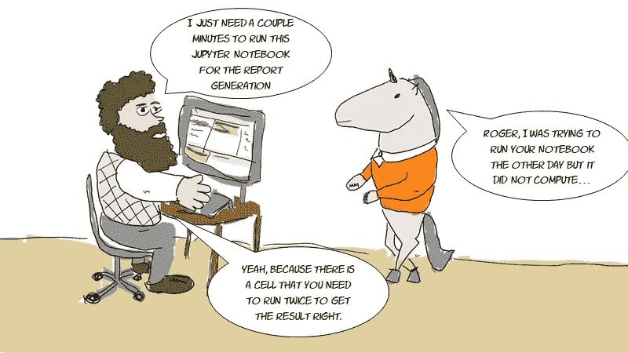

# 精益+数据科学

> 原文：<https://towardsdatascience.com/lean-data-science-8dda17663ca7?source=collection_archive---------24----------------------->

*TL；dr
1。数据科学实践充满了浪费
2。明确的假设检验有助于微调想法
3。沟通是将数据科学家融入软件开发生命周期的关键*

我加入这个领域是因为我们在发现新的数据模式时感到兴奋。然而，随着时间的推移，很明显，识别模式只是这个旅程的前半部分。还有一部分，是关于分享这个发现的。“分享”可以是展示的形式，可以是现有产品的改变，甚至是全新的产品。因此，这两个部分——从创意到产品的培育——是数据科学的完整堆栈。

在这篇文章中，我分享了我关于如何以有效的方式将机器学习模型构建到软件中的经验。在进入细节之前，让我们提出一些基本的假设:

*   产品开发需要钱。一些公司有更多，一些有更少，但是，他们都希望看到他们的投资回报。
*   产品开发需要时间。时间是普遍短缺的；因此，我们应该确保在我们突然用完的时候有一些投资回报。
*   产品开发天生具有不确定性。我不知道我们刚刚开始开发的产品的最终功能集会是什么，可能连客户都不知道。在这种情况下，我们可以做两件事:1)诚实，一起发现 2)假装我们知道市场想要什么(而且往往失败得很惨)。

# 数据科学中的精益产品开发

精益制造在多个行业都有良好的记录。尽管它最初是作为汽车工业的方法论而形成的，但是由于 Mary 和 Tom Poppendieck 的杰出工作，它已经扩展到软件开发中。精益的核心原则是减少过程中的浪费，以最大限度地提高生产率。Poppendiecks 指出了软件的七种浪费。他们在这里，锚定数据科学实践。

1.  **部分完成的工作**。我认为大多数 Jupyter 笔记本是最好的例子。它们是部分完成的工作，因为您通常既不添加文档也不添加测试。重要的是，这不是过去的浪费:而是未来的浪费。每次有人想知道那本笔记本的用途时都浪费时间？浪费每次有人想建立它，结果是你离开了一个非线性运行的细胞。
2.  **额外功能**。不久前，我们真的在推动一项功能的推出，因为我们想证明它是可行的。成功了。不幸的是，我们没有看到问题不是怀疑该功能从机器学习的角度来看是否可行，而是怀疑它在市场上是否可行。因为这个误会，我们浪费了两个星期的努力和时不时几个小时的维护。
3.  **重新学习**。一个简单的例子是，每个人每次都从头开始编写代码，但是这些代码非常复杂，需要花两个小时来重新实现。想想读取数据，建立交叉验证等。
4.  **交接**。这和重新学习有点不同，因为这是你无法避免的。不过，代码切换可以作为一个过程进行优化。我经常看到的一个重要的交接地点是在原型和产品数据团队之间。
5.  **任务切换**。您很匆忙，这是通常的情况，所以您决定同时处理两个功能。也许你这样做是因为，否则，你会觉得你会花太多时间在一件事上，而没有时间做第二件事。
6.  **延期**。预算、分配、等待 QA、等待模型训练、等待测试通过等等的批准时间。虽然在这种时候，如果人们能放松 10 分钟是最理想的，但通常这是不会发生的。相反，由于沮丧，他们开始解决它(例如，开始实现下一个特性)。
7.  **缺陷**。损失去南；概率是 1.2；模型在不同版本中序列化，生产中缺少数据…等等。编写覆盖良好的代码并不意味着你不会面临缺陷，但是修复这些缺陷会容易得多。

我们很容易同意，减少这些浪费肯定有助于提供更可靠的输出。通常的问题是，是否有一种既省时又经济的方法来克服这些浪费。我认为关键是从第一天起就接受不确定性并为此进行设计。

# 拥抱不确定性

拥抱不确定性意味着接受我们不知道一切的事实。我们不知道 GAN 是否会比一些简单的仿射变换更好地用于数据生成，我们不知道我们现在的产品想法是否会引起真实客户的兴趣，我们不知道许多事情。然而，我们可以有好的实践来帮助我们在正确的时间以正确的方式回答这些问题。

Harry called everyone for a brainstorming meeting to do some market research. The aim of the meeting is to finetune the scope of the company’s next breakthrough product. Image from [The Data Department](https://www.instagram.com/the_data_department/)

这些良好实践的基础是沟通和假设。在本系列的前一篇文章中，我已经谈到了假设的重要性。那一次是单位和系统层面的假设，在这里，我要谈谈业务单位层面假设的重要性。[产品失败](https://www.cbinsights.com/research/startup-failure-reasons-top/)的最重要原因是不符合市场需求。数据科学产品经常发生的情况是，团队延迟发布，例如，模型在所有情况下都表现不佳。然后，当发布最终突然发生时，似乎没有人在乎。

这些故事背后的原因是一个错误的产品开发理念。在实现一个特性一年之前，我们首先要确定这个特性是需要的。让我们[以 x.ai](https://x.ai/blog/the-x-ai-story-chapter-1/) 是人工智能驱动的会议安排者为例。他们有关于如何用机器学习解决问题的想法，但他们没有首先从头开始实施，而是开始在人类会议安排者的帮助下测试这个概念。他们对市场需求了如指掌，正因为如此，现在他们的业务在不断增长。只有做出正确的选择，接受不确定性并减少浪费，在明确功能是否能为客户带来价值之前，不实施这些功能，这才是可能的。

# 数据科学的全部内容

我的一位资深同事在阅读了 TDD 帖子后问我，数据科学家的工资是多少，与他们互动的软件工程师的工资是多少，数据工程师的工资是多少。这个问题让我想到我是如何看待数据科学实践的。我认为数据科学团队是软件开发过程中的一个特殊部分。由于机器学习需要深入的数学知识(尤其是统计学)，人们经常从各种非软件开发领域加入到团队中。这很好，因为这些技能传统上是软件工程研究中所缺少的。

Sometimes waste is hard to distinguish from the expertise. Image from [The Data Department](https://www.instagram.com/the_data_department/)

然而，机器学习模型是软件的一部分，因此，它必须无缝集成。假设您已经构建了一个优秀的图像分类器，但是它不适合目标设备内存；流中的数据点没有按时间顺序到达；为了提供实时反馈，我们必须快速读取数据；模型的输出应该以一种有效且易于理解的方式显示。这意味着一名优秀的数据科学家还应该了解端到端流程。

如今，市场称这样的专业人士为全栈数据科学家(我们通常称之为独角兽)。我还可以在这里补充一点，一个人成为全栈数据科学家的最快方式是通过交流。你去软件开发人员的办公桌前问一问(同一件事连问两遍都没问题)。当 DevOps 同事解释他如何有效地解决模型部署时，您可以从他那里学到东西。你告诉数据工程师你对模型访问的新想法，也许她已经实现了那个特性或者知道它。幸运的是，我有几个同事通过这个简单的方法成为数据科学独角兽的例子。

最后，我相信在就业市场寻找独角兽之前，所有的公司都应该审视一下自己，看看是否能够培育它。答案可能是“是的，但我们没有时间做这些”，然而只有培养这种人才的文化才能发挥他们的全部潜力。