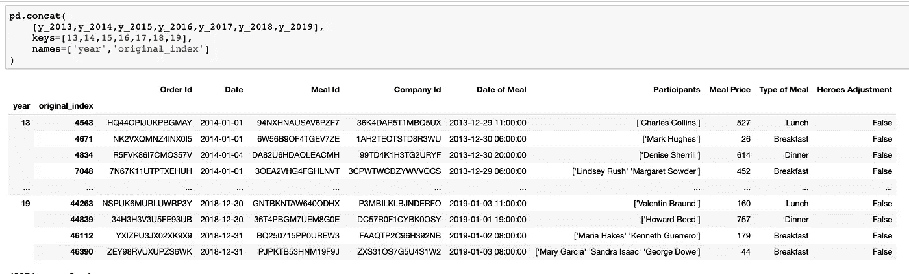
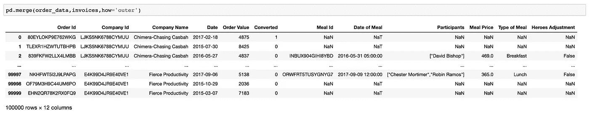
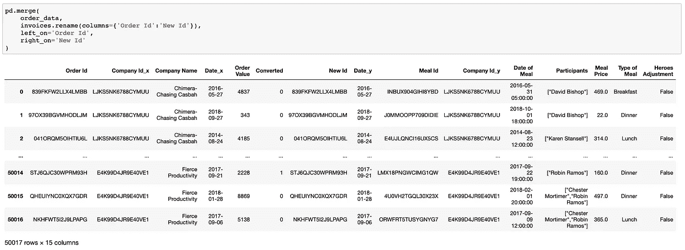
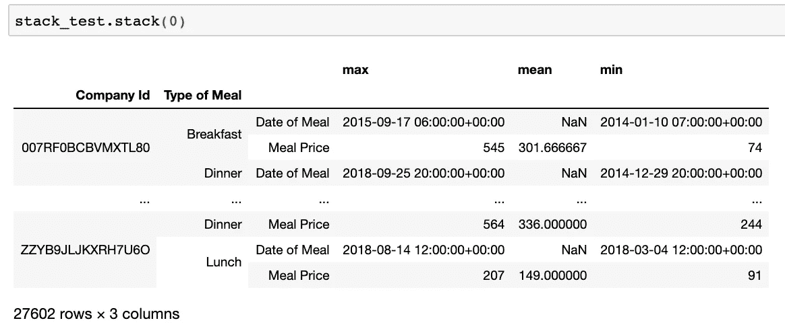

# 20 分钟熊猫高级功能综合指南

> 原文：<https://towardsdatascience.com/learn-advanced-features-for-pythons-main-data-analysis-library-in-20-minutes-d0eedd90d086?source=collection_archive---------2----------------------->

## 熊猫终极指南——第二部分

## 熊猫高级功能代码指南。


Red Panda — Photo by [Linnea Herner](https://unsplash.com/@linneaherner?utm_source=medium&utm_medium=referral) on [Unsplash](https://unsplash.com?utm_source=medium&utm_medium=referral)

我大胆假设小熊猫比它们的黑白同胞更聪明，也更高级。因此，封面图片。

在这个**熊猫系列的**第一部**中，**我们探索了熊猫的**基础，**包括 **:**

*   如何加载数据；
*   如何检查、分类和过滤数据；
*   如何使用 and groupby/transform 分析数据

如果这些概念对你来说是新的，回到**第一部分**，快速复习一下。

[](/how-to-master-pandas-8514f33f00f6) [## 如何在 20 分钟内掌握 Python 的主要数据分析库

### 熊猫基本功能的代码指南。

towardsdatascience.com](/how-to-master-pandas-8514f33f00f6) 

# 在今天的文章中，我们将讨论以下主题:

1.  数据类型和转换
2.  对某些数据类型有用的访问器方法
3.  组合数据帧
4.  重塑数据帧

# 先决条件

一个 Python 环境(建议 Jupyter 笔记本)。如果你还没有设置这个，不要担心。这是毫不费力的，不到 10 分钟。

[](/get-started-with-python-e50dc8c96589) [## 所以你想成为一名数据科学家？

### 到底是什么阻止了你？下面是如何开始！

towardsdatascience.com](/get-started-with-python-e50dc8c96589) 

# 设置


Photo by [dylan nolte](https://unsplash.com/@dylan_nolte?utm_source=medium&utm_medium=referral) on [Unsplash](https://unsplash.com?utm_source=medium&utm_medium=referral)

T21:在进行任何数据操作之前，让我们先获取一些数据。我们将使用一些虚构的销售数据。这个 [GitHub Repo](https://github.com/FBosler/you-datascientist) 保存了本文的数据和代码。

新建一个笔记本，导入熊猫(`import pandas as pd`)。我倾向于这样调整我的笔记本设置:

```
from IPython.core.display import display, HTML
display(HTML("<style>.container {width:90% !important;}</style>"))
```

这些命令使笔记本变得更宽，从而利用更多的屏幕空间(通常笔记本的宽度是固定的，这与宽屏很不一样)。

## 加载数据

```
invoices = pd.read_csv('[https://raw.githubusercontent.com/FBosler/you-datascientist/master/invoices.csv'](https://raw.githubusercontent.com/FBosler/you-datascientist/master/invoices.csv'))
```

# ①数据类型和转换


Photo by [Guillaume Bolduc](https://unsplash.com/@guibolduc?utm_source=medium&utm_medium=referral) on [Unsplash](https://unsplash.com?utm_source=medium&utm_medium=referral)

## 可用的数据类型

在开始研究数据之前，让我们快速总结一下所有可用的 Pandas 数据类型。**总共有七种:**

*   `**object**`:该数据类型用于字符串(即字符序列)
*   `**int64**`:用于整数(整数，无小数)
*   `**float64**`:用于浮点数(即带小数/分数的数字)
*   `**bool**`:用于只能为真/假的值
*   `**datetime64**`:用于日期和时间值
*   `**timedelta**`:用来表示日期时间的差异
*   `**category**`:用于从有限数量的可用选项中选择一个选项的值(类别不是必须的，但可以有明确的排序)

## 显示数据类型

答在读取数据并运行快速`invoices.sample(5)`后，我们观察到数据集似乎相当大，但结构良好。


为了对数据有所了解，我通常会先从`sample`开始，然后是`info`和`describe`，但是我们在这里是为了学习数据类型，现在将跳过典型的探索步骤。毫不奇怪，有一个命令可以打印出数据帧的数据类型。

```
**IN:** invoices.dtypes**OUT:** Order Id               object
Date                   object
Meal Id                object
Company Id             object
Date of Meal           object
Participants           object
Meal Price            float64
Type of Meal           object
Super Hero Present       bool
dtype: object
```

我们在没有任何类型转换的情况下加载数据，所以 Pandas 在分配类型时做出了最好的猜测。我们可以看到，除了`Meal Price`和`Super Hero Present`之外，所有的列都是类型`object`(即字符串)。根据我们之前的快速检查，似乎有些列可以被分配一个更明确的数据类型。所以让我们改变这一点。

## 转换数据类型

有两种转换 pandas 数据类型的标准方法:

*   `<column>.astype(<desired type>)`
*   转换辅助函数，如`pd.to_numeric`或`pd.to_datetime`

## ⓐ原型

astype 速度很快，适用于干净的数据和直接转换，例如从 int64 转换到 float64(反之亦然)。
必须在要转换的列上直接调用 astype。像这样:

```
invoices['Type of Meal'] = invoices['Type of Meal'].astype('category')invoices['Date'] = invoices['Date'].astype('datetime64')invoices['Meal Price'] = invoices['Meal Price'].astype('int')
```

为了验证我们的类型转换的效果，我们再次运行`invoices.dtypes`:

```
**OUT:** Order Id                      object
Date                  datetime64[ns]
Meal Id                       object
Company Id                    object
Date of Meal                  object
Participants                  object
Meal Price                     int64
Type of Meal                category
Super Hero Present              bool
dtype: object
```

**注:**熊猫版本有点差别。对于 Pandas 版本`0.23.x`，可以使用`.astype('datetime64')`转换`Date of Meal`列，Pandas 将自动转换为 [UTC](https://en.wikipedia.org/wiki/Coordinated_Universal_Time) 。UTC 格式很有用，因为它是一种标准化的时间格式，允许我们从其他日期中减去或加上日期。

然而，这对于 Pandas 版本`0.25.x`不再有效，我们将得到一个 ValueError，让我们知道 Tz-aware(time zone-aware)datetime 在没有进一步调整的情况下不能被转换。

## ⓑ转换辅助函数

有三个`pd.to_<some_type>`函数，但对我来说，其中只有两个经常出现:

*   `pd.to_numeric()`
*   `pd.to_datetime()`
*   `pd.to_timedelta()`(老实说，我不记得我是否用过这个)

**与** `**astype**` **相比，它们的主要优势在于，可以指定遇到无法转换的值时的行为。**
两个函数都接受一个额外的参数`errors`，该参数定义了应该如何处理错误。我们可以选择通过传递`errors='ignore'`来忽略错误，或者通过传递`errors='coerce'`将有问题的值转化为`np.nan`值。默认行为是引发错误。

我发现没有 cutty cutter 解决方案，我通常会在做出决定之前进行调查。与你观察到的数量相比，不合适的值越少，我就越有可能强迫它们。

`**pd.to_numeric()**` 为了便于讨论，让我们把数据稍微弄乱一点:

```
invoices.loc[45612,'Meal Price'] = 'I am causing trouble'
invoices.loc[35612,'Meal Price'] = 'Me too'
```

`invoices['Meal Price'].astype(int)`现在将失败，并返回一个*值错误:以 10 为基数的 int()的文本无效:“我也是。”*因为没有明显的方法把字符串转换成整数。每当我遇到意外的转换错误时，我通常会显式地检查列的值，以便更好地理解奇怪值的大小。

```
**IN:**
invoices['Meal Price'].apply(lambda x: type(x)).value_counts()**OUT:** <class 'int'>    49972
<class 'str'>        2
Name: Meal Price
```

然后，您可以通过执行以下操作来识别违规的行:

```
**IN:** invoices['Meal Price'][invoices['Meal Price'].apply(
  lambda x: isinstance(x,str)
)]**OUT:** 35612                  Me too
45612    I am causing trouble
Name: Meal Price, dtype: object
```

从这里开始，可以快速修复这些值，或者做出明智的决定，决定如何处理失败的转换。

上面的例子是一个很好的例子，通过像这样将`errors='coerce'`传递给`pd.to_numeric()`来将值转换成`np.nan`是非常合理的:

```
pd.to_numeric(invoices['Meal Price'], errors='coerce')
```

现在应该注意的是，您的数据中构造有两个`np.nan`值，所以就地处理它们可能是个好主意。`np.nan`s`的问题是整数列不知道如何处理它们。因此，该列将是一个浮动列。

```
**# convert the offending values into np.nan**
invoices['Meal Price'] = pd.to_numeric(invoices['Meal Price'],errors='coerce')**# fill np.nan with the median of the data**
invoices['Meal Price'] = invoices['Meal Price'].fillna(invoices['Meal Price'].median())**# convert the column into integer**
invoices['Meal Price'].astype(int)
```

`**pd.to_datetime()**`顾名思义，该方法将**字符串**转换为日期时间格式。要在一个列上调用`to_datetime`，你可以做:`pd.to_datetime(invoices['Date of Meal'])`。Pandas 将猜测格式，并尝试从输入中解析日期。它做得非常好:

```
**IN:**
print(pd.to_datetime('2019-8-1'))
print(pd.to_datetime('2019/8/1'))
print(pd.to_datetime('8/1/2019'))
print(pd.to_datetime('Aug, 1 2019'))
print(pd.to_datetime('Aug - 1 2019'))
print(pd.to_datetime('August - 1 2019'))
print(pd.to_datetime('2019, August - 1'))
print(pd.to_datetime('20190108'))**OUT:**
2019-08-01 00:00:00
2019-08-01 00:00:00
2019-08-01 00:00:00
2019-08-01 00:00:00
2019-08-01 00:00:00
2019-08-01 00:00:00
2019-08-01 00:00:00
2019-01-08 00:00:00
```

然而，有时您可能会遇到一些非典型的格式，就像上面列表中的最后一个例子。在这种情况下，您可能希望提供一个自定义格式，您可以这样做:`pd.to_datetime('20190108',format='%Y%d%m')`。可以把格式字符串看作一个掩码，用来检查日期字符串，如果这个掩码合适，转换就会发生。查看[链接](https://www.programiz.com/python-programming/datetime/strftime#format-code)获取所有可能的日期格式组件列表。使用定制格式时，另一个值得注意的参数是`exact=False`。`print(pd.to_datetime('yolo 20190108', format='%Y%d%m', exact=False))`将会工作，但是如果没有确切的参数，它将会失败。Pandas 试图匹配日期字符串中任何位置的模式。

在继续之前，让我们转换我们的`Date of Meal`列，像这样`invoices['Date of Meal'] = pd.to_datetime(invoices['Date of Meal'], utc=True)`

# ②对某些数据类型有用的访问器方法


Photo by [Todd Quackenbush](https://unsplash.com/@toddquackenbush?utm_source=medium&utm_medium=referral) on [Unsplash](https://unsplash.com?utm_source=medium&utm_medium=referral)

> 如果你唯一的工具是锤子，那么每个问题看起来都像钉子。

把 Pandas 访问器看作是一个属性，它充当特定于你试图访问的类型的方法的接口。那些方法是高度专业化的。他们只为一项工作服务。然而，对于特定的工作来说，它们非常优秀而且非常简洁。

有三种不同的访问器:

*   `dt`
*   `str`
*   `cat`

通过在选择的列上调用`.<accessor>.method`可以访问所有的方法，就像这样:`invoices['Date of Meal'].dt.date`

## 存取器— dt

我认为他的方法是最有用和最直接的访问器方法:

*   `**date**` (返回日期时间的日期值)，或者

```
**IN:** invoices['Date of Meal'].dt.date**OUT:** 0        2015-01-29
1        2017-10-30
            ...    
49972    2017-09-06
49973    2015-08-20
Name: Date of Meal, Length: 49974, dtype: object
```

*   `**weekday_name**` (返回当天的名称)、`**month_name()**` (这种实现方式有些不一致，因为 weekday_name 是一个属性，而 month_name 是一个方法，需要用括号调用)

```
**IN:** invoices['Date of Meal'].dt.weekday_name**OUT:** 0         Thursday
1           Monday
           ...    
49972    Wednesday
49973     Thursday
Name: Date of Meal, Length: 49974, dtype: object**IN:** invoices['Date of Meal'].dt.month_name()**OUT:** 0          January
1          October
           ...    
49972    September
49973       August
Name: Date of Meal, Length: 49974, dtype: object
```

*   `**days_in_month**`

```
**IN:** invoices['Date of Meal'].dt.days_in_month**OUT:** 0        31
1        31
         ..
49972    30
49973    31
Name: Date of Meal, Length: 49974, dtype: int64
```

*   `**nanosecond**`、`**microsecond**`、`**second**`、`**minute**`、`**hour**`、`**day**`、`**week**`、`**month**`、`**quarter**`、`**year**`得到对应频率的整数。

```
**EXAMPLES: (same logic applies for** **nanosecond**, **microsecond**, **second**, **minute**, **hour)****IN:** invoices['Date of Meal'].dt.day**OUT:** 0        29
1        30
         ..
49972     6
49973    20
Name: Date of Meal, Length: 49974, dtype: int64**IN:** invoices['Date of Meal'].dt.week**OUT:** 0         5
1        44
         ..
49972    36
49973    34
Name: Date of Meal, Length: 49974, dtype: int64**IN:** invoices['Date of Meal'].dt.month**OUT:** 0         1
1        10
         ..
49972     9
49973     8
Name: Date of Meal, Length: 49974, dtype: int64**IN:** invoices['Date of Meal'].dt.quarter**OUT:** 0        1
1        4
        ..
49972    3
49973    3
Name: Date of Meal, Length: 49974, dtype: int64**IN:** invoices['Date of Meal'].dt.year**OUT:** 0        2015
1        2017
         ... 
49972    2017
49973    2015
Name: Date of Meal, Length: 49974, dtype: int64
```

*   `**is_leap_year**`、`**is_month_start**`、`**is_month_end**`、`**is_quarter_start**`、`**is_quarter_end**`、`**is_year_start**`、`**is_year_end**`分别为每个值返回 True 或 False。`is_month_end`见下例

```
**IN:** invoices['Date of Meal'].dt.is_month_end**OUT:** 0        False
1        False
         ...  
49972    False
49973    False
Name: Date of Meal, Length: 49974, dtype: bool
```

我们可以使用结果过滤我们的数据，只保留行，其中`Date of Meal`在月末。


Invoices filtered for Date of Meal is_month_end

*   `**to_pydatetime()**`，它将 Pandas datetime 转换成常规的 Python datetime 格式(有时您可能会用到)，以及`**to_period(<PERIOD>)**` 【可用的周期有 W、M、Q 和 Y】，它将日期转换成周期。

```
**IN:** invoices['Date of Meal'].dt.to_pydatetime()**OUT:** array([datetime.datetime(2015, 1, 29, 8, 0),
       datetime.datetime(2017, 10, 30, 20, 0),
       datetime.datetime(2015, 2, 10, 11, 0), ...,
       datetime.datetime(2017, 3, 7, 19, 0),
       datetime.datetime(2017, 9, 6, 6, 0),
       datetime.datetime(2015, 8, 20, 18, 0)], dtype=object)**IN:** invoices['Date of Meal'].dt.to_period('W')**OUT:** 0       2015-01-26/2015-02-01
1       2017-10-30/2017-11-05
                 ...         
49972   2017-09-04/2017-09-10
49973   2015-08-17/2015-08-23
Name: Date of Meal, Length: 49974, dtype: object
```

## 存取器—字符串

str 访问器也非常有用，不是因为它支持额外功能，而是因为它使代码更加可读。

*   `**lower()**` **/** `**upper()**` 管理字符串的大小写

```
**IN:** invoices['Type of Meal'].str.lower()**OUT:** 0        breakfast
1           dinner
           ...    
49972    breakfast
49973       dinner
Name: Type of Meal, Length: 49974, dtype: object**IN:** invoices['Type of Meal'].str.upper()**OUT:** 0        BREAKFAST
1           DINNER
           ...    
49972    BREAKFAST
49973       DINNER
Name: Type of Meal, Length: 49974, dtype: object
```

*   `**ljust(width)**`**`**rjust(width)**`**`**center(width)**`**`**zfill(width)**`**来控制琴弦的定位。它们都将所需结果字符串的总宽度作为输入。`ljust`、`rjust`和`center`用空格将差值填充至所需长度。添加许多前导零。`ljust`是向左的，`rjust`是向右的。********

```
******IN:** invoices['Type of Meal'].str.ljust(width=15)**OUT:** 0        Breakfast      
1        Dinner         
              ...       
49972    Breakfast      
49973    Dinner         
Name: Type of Meal, Length: 49974, dtype: object**IN:** invoices['Type of Meal'].str.rjust(width=15)**OUT:** 0              Breakfast
1                 Dinner
              ...       
49972          Breakfast
49973             Dinner
Name: Type of Meal, Length: 49974, dtype: object**IN:** invoices['Type of Meal'].str.center(width=15)**OUT:** 0           Breakfast   
1             Dinner    
              ...       
49972       Breakfast   
49973         Dinner    
Name: Type of Meal, Length: 49974, dtype: object**IN:** invoices['Type of Meal'].str.zfill(width=15)**OUT:** 0        000000Breakfast
1        000000000Dinner
              ...       
49972    000000Breakfast
49973    000000000Dinner
Name: Type of Meal, Length: 49974, dtype: object****
```

*   ******`**startswith(<substring>)**` **、**、`**endswith(<substring>)**`、、`**contains(<substring>)**`、**、**检查子串的存在******

```
****IN:** invoices['Type of Meal'].str.endswith('ast')**OUT:** 0         True
1        False
         ...  
49972     True
49973    False
Name: Type of Meal, Length: 49974, dtype: bool**
```

********

****using str.contains to filter for rows that include ‘Bruce.’****

*   ****`**swapcase()**` **、**、**、**为**、**的拳打脚踢****

```
****IN:** invoices['Type of Meal'].str.swapcase()**OUT:** 0        bREAKFAST
1           dINNER
           ...    
49972    bREAKFAST
49973       dINNER
Name: Type of Meal, Length: 49974, dtype: object**IN:** invoices['Type of Meal'].str.repeat(2)**OUT:** 0        BreakfastBreakfast
1              DinnerDinner
                ...        
49972    BreakfastBreakfast
49973          DinnerDinner
Name: Type of Meal, Length: 49974, dtype: object**
```

## ****访问者— cat****

****在我看来是三个中最不强大的，或者至少是我最不常用的。`cat`提供对几个类别操作的访问，如:****

*   ****`**ordered**` 让您知道列是否有序****

```
****IN:** invoices['Type of Meal'].cat.ordered**OUT:**
False**
```

*   ****`**categories**` 返回类别****

```
****IN:** invoices['Type of Meal'].cat.categories**OUT:** Index(['Breakfast', 'Dinner', 'Lunch'], dtype='object')**
```

*   ****`**codes**` 用于将类别快速转换成其数值表示****

```
****IN:**
invoices['Type of Meal'].cat.codes**OUT:** 0        0
1        1
2        2
3        2
4        2
        ..
49969    1
49970    2
49971    1
49972    0
49973    1
Length: 49974, dtype: int8**
```

*   ****`**reorder_categories**` 改变现有类别的顺序****

```
****IN:**
invoices['Type of Meal'].cat.reorder_categories(
    ['Lunch','Breakfast','Dinner']
)**OUT:** 0        Breakfast
1           Dinner
2            Lunch
3            Lunch
4            Lunch
           ...    
49969       Dinner
49970        Lunch
49971       Dinner
49972    Breakfast
49973       Dinner
Name: Type of Meal, Length: 49974, dtype: category
Categories (3, object): [Lunch, Breakfast, Dinner]**
```

# ****③组合数据帧****

********

****Image by [Pexels](https://pixabay.com/users/Pexels-2286921/?utm_source=link-attribution&utm_medium=referral&utm_campaign=image&utm_content=2178625) from [Pixabay](https://pixabay.com/?utm_source=link-attribution&utm_medium=referral&utm_campaign=image&utm_content=2178625)****

## ****连结****

****当你有相似的数据(结构上和内容上)分布在多个文件中时，oncatenating 就很方便了。您可以垂直连接数据(即，将数据堆叠在一起)或水平连接数据(即，将数据堆叠在一起)。****

## ****ⓐ串联—垂直堆叠****

****作为一个例子，假设一个客户每月或每年向你提供一个文件的数据(例如，因为他们的报告在月末运行)。这些文件在概念上是相同的，因此是垂直堆叠的主要例子。****

********

****A simplified example of vertical stacking****

****让我们看看如何用 Python 的熊猫来做这件事。让我们人为地把发票文件按年份分开。****

```
****# Use dt accessor to count all the years
IN:** invoices['Date of Meal'].dt.year.value_counts().sort_index()**OUT:** 2013       38
2014     9988
2015    10060
2016     9961
2017     9964
2018     9931
2019       32
Name: Date of Meal, dtype: int64**# Split the data** y_2013 = invoices[invoices['Date of Meal'].dt.year == 2013].copy()
y_2014 = invoices[invoices['Date of Meal'].dt.year == 2014].copy()
y_2015 = invoices[invoices['Date of Meal'].dt.year == 2015].copy()
y_2016 = invoices[invoices['Date of Meal'].dt.year == 2016].copy()
y_2017 = invoices[invoices['Date of Meal'].dt.year == 2017].copy()
y_2018 = invoices[invoices['Date of Meal'].dt.year == 2018].copy()
y_2019 = invoices[invoices['Date of Meal'].dt.year == 2019].copy()**
```

****我们使用`.copy()`来确保生成的数据帧是数据的副本，而不仅仅是对原始数据帧的引用。****

****让我们验证一下拆分是否有效。****

********

****All Invoices where the date of the meal was in 2017****

****现在，为了将数据连接成一个统一的数据帧，我们将像这样调用`pd.concat(<LIST OF DATAFRAMES>)`:****

********

****Stacking multiple DataFrames on top of each other****

****`pd.concat`在您调用`concat`的数据帧列表旁边，接受几个**可选**参数:****

*   ****`**axis**` : `0`为垂直，`1`为水平。`**axis**` 默认为`**0**`****
*   ****`**join**` : `'inner'`为交集，`'outer'`为非连接轴索引的并集。当我们使用`axis=0`和`join='inner'`时，我们将只考虑重叠的列。当使用`axis=1`和`join='inner'`时，我们只考虑重叠指数。在`outer`的情况下，非重叠列/索引将用`nan`值填充。`**join**` 默认为`**outer**`****
*   ****`**ignore_index**` **:** `True`忽略预先存在的索引，而使用从 0 到 n-1 的标签作为结果数据帧。`**ignore_index**` 默认为`**False**`****
*   ****`**keys**` **:** 如果我们提供一个列表(必须与数据帧的数量相同的长度)，一个层次索引将被构建。`keys`默认为`None` **。**以`keys`为例，添加数据的来源。最好与名字连用。****
*   ****`**names**` **:** 假设您提供了键，那么这些名称将用于标记生成的层次索引。`**names**` 默认为`**None**` **。******

********

****Stacking multiple DataFrames on top of each other with keys****

## ****ⓑ串联—水平堆叠****

****水平堆叠**的一个**用例是指多个时间序列具有重叠但不相同的索引。在这种情况下，您不会希望最终得到一个可能有数千列的数据帧，而是一个有数千行的数据帧。****

********

****A simplified example of horizontal stacking****

****在 Python 中运行下面的代码片段将得到下面的屏幕截图:****

```
**range_a = pd.date_range(
    datetime.datetime(2019,1,2),
    datetime.datetime(2019,1,8)
)
df_a = pd.DataFrame(
    index=range_a, 
    data=np.random.randint(2,10,size=len(range_a)),
    columns=['observations_A']
)range_b = pd.date_range(
    datetime.datetime(2019,1,5),
    datetime.datetime(2019,1,12)
)df_b = pd.DataFrame(
    index=range_b, 
    data=np.random.randint(2,10,size=len(range_b)),
    columns=['observations_B']
)pd.concat([df_a,df_b],axis=1)**
```

********

****Horizontally stacked DataFrames****

****关于`**Append**` **:** 你可能已经看到`append`的用法和`concat`一样的结尾。**我建议不要使用** `**append**`，因为它只是`concat`的一个特例，并没有提供比串联更好的优势。****

## ****合并****

****与将数据帧连接在一起相反，合并允许我们以一种更传统的 SQL 查询方式将两个数据帧组合在一起。当合并数据帧时，大多数情况下，您希望一些信息来自一个源，另一些信息来自另一个源。而当连接数据帧时，它们在结构上和内容上非常相似，您希望将它们组合成一个统一的数据帧。****

****我喜欢在面试中使用的一个简单例子是这样的:****

> ****假设你有两张桌子。一个表包含员工姓名和位置 id，另一个表包含位置 id 和城市名称。你怎么能得到每个雇员的名单和他们工作的城市？****

****在 Pandas 中合并两个数据帧是用`pd.merge`完成的。让我们来看看函数的签名(签名是指函数所有可能参数的列表，通常还包括输出)。我加粗了最相关的参数。****

```
**pd.merge(
 **left, 
 right,** 
 **how='inner', 
 on=None,** 
 **left_on=None,** 
 **right_on=None,** 
 **left_index=False,**
 **right_index=False,** 
 sort=True,
 **suffixes=('_x', '_y'),** 
 copy=True, 
 indicator=False,
 validate=None
) -> pd.DataFrame**
```

****让我们一个一个地检查参数:****

*   ****`**left/right**`:要合并的左、右数据帧****
*   ****`**how**` : `'left'`，`'right'`，`'outer'`，`'inner'`。`**how**` 默认为`**'inner'**` **。下面是它们各自功能的示意图。稍后我们将讨论具体的例子。******

********

****Image from [DataScienceMadeSimple](http://www.datasciencemadesimple.com/join-merge-data-frames-pandas-python/)****

*   ****`**left_index/right_index**` **:** 如果`True`，使用左/右数据帧的索引合并。`**left_index/right_index**` 默认为`False`****
*   ****`**on**` **:** 要合并的列名。列名必须同时存在于左侧和右侧数据框架中。如果未通过且`left_index`和`right_index`为`False`，**两个数据帧中的列的交集将被推断为连接。******
*   ****`**left_on/right_on**` **:** 左/右数据框中要连接的列名。**典型用例:**您正在连接的键在您的数据帧中有不同的标签。例如，您左侧数据帧中的`location_id`可能是您右侧数据帧中的`_id`。在这种情况下，你会做`**left_on='**location_id', **right_on**='_id'`。****
*   ****`**suffixes**`:应用于重叠列的字符串后缀元组。`**suffixes**`默认为`('_x', '_y')`。我喜欢用`('_base', '_joined')`。****

## ****合并—加载和检查新数据****

****理论够了，我们来看一些例子。为此，我们需要一些额外的数据来合并。****

******加载数据:******

```
****# Load some additional Data**
order_data = pd.read_csv('[https://raw.githubusercontent.com/FBosler/you-datascientist/master/order_leads.csv', parse_dates=[3](https://raw.githubusercontent.com/FBosler/you-datascientist/master/order_leads.csv',parse_dates=[3)])**# Note the parse_dates? We need this to have consistent types with invoices, otherwise the subsequent merges would throw errors**sales_team = pd.read_csv('[https://raw.githubusercontent.com/FBosler/you-datascientist/master/sales_team.csv'](https://raw.githubusercontent.com/FBosler/you-datascientist/master/sales_team.csv'))**
```

******检查数据:******

********

****Some overlapping (keys), some unique columns (features) spread out across three DataFrames****

****我们马上就能看到，`**Order ID**`、`**Company ID**`、**、**和`**Date**` 出现在多个数据帧中，因此是很好的合并对象。****

## ****合并—如何进行****

****让我们将`**invoices**`与`**order_data**` 合并，并对参数进行一点试验。****

*   ******未提供参数:**所有参数将使用其默认值。
    合并将是一个内部合并(相当于`**how='inner'**`)。
    将对所有公共列进行合并，即`**Date**`、`**Order Id**`和`**Company Id**`(相当于`**on=['Date','Order Id','Company Id]**`)。
    后缀是不相关的，因为所有公共列都将用于合并，所以不会剩下重复的列。
    运行`**pd.merge(order_data,invoices)**` **:******

********

****Merge with no parameters. Defaults to inner, i.e., only rows where there is data in both tables. **Note how this results in ~50k rows.******

*   ****`**how='left'**`:同样，合并基于所有公共列。后缀是不相关的，因为所有公共列都将用于合并，所以不会留下重复的列。
    然而，这一次，我们与`**how='left'**`合并，这意味着我们将从左侧帧中取出所有行，并且只添加右侧帧中我们找到的一些数据。运行`**pd.merge(order_data,invoices,how='left')**` **:******

********

****“left-sided” merge, i.e., we take all rows from the left DataFrame and combine data from the right DataFrame, where we find some. **Note how this results in 100k rows.******

*   ****`**how='right'**`:同样，合并基于所有公共列。后缀是不相关的，因为所有公共列都将用于合并，所以不会留下重复的列。
    然而，这一次，我们与`**how='right'**`合并，这意味着我们将从右帧中取出所有行，并且只添加我们在左帧中找到的一些数据。这种情况相当于我们示例中的`**'inner'**`,因为左侧数据帧中的每一行在右侧数据帧中都有相应的行。
    运行`**pd.merge(order_data,invoices,how='right')**` **:******

********

****“right-sided” merge, i.e., we take all rows from the right DataFrame and add data from the left DataFrame, where we find some. **Note how this results in ~50k rows******

*   ****`**how='outer'**`:同样，合并是基于所有公共列的。后缀是不相关的，因为所有公共列都将用于合并，所以不会留下重复的列。
    然而，这一次，我们与`**how='outer'.**`合并，我们从左侧或右侧数据帧中取出所有行，并在其他数据帧中找到的位置添加相应的数据。这种情况相当于我们示例中的`**'left'**`,因为左侧数据帧中的每一行在右侧数据帧中都有相应的行。运行`**pd.merge(order_data,invoices,how='outer')**` **:******

********

****“outer” merge, i.e., we take all rows from both DataFrames and add data from the corresponding other DataFrame, where we find some. **Note how this results in 100k rows.******

## ****合并—开/后缀****

****如果我们确实显式提供了一个`**on**`参数，这将覆盖默认行为，并尝试在两个数据帧中找到所提供的列。未用于合并的剩余重复列将被加上后缀。****

****在下面的例子中，我们只在`**Order Id**`进行合并。然而，由于`**Date**` 和`**Company Id**` 列同时出现在两个数据帧中。这些列足以表明它们来自哪个源数据帧，如下例所示。****

****运行:`**pd.merge(order_data,invoices,on='Order Id')**`****

********

****Merge on one common column, default suffixes****

****我们也可以像这样指定自定义后缀:
`**pd.merge(order_data,invoices,on='Order Id',suffixes=('_base','_join'))**`****

********

****Merge on one common column, custom suffixes (_base and _join)****

## ****合并—左开/右开****

****当两个数据帧中的列名称不同时，通常会使用`**left_on**`和`**right_on**` 参数。****

********

****Contrived example, where we first rename “Order Id” to “New Id” to then use it as our right_on target column****

****`**Join**` **注:** 你可能见过`join`的用法跟`merge`一个下场。`join`默认情况下，合并两个数据帧的索引。**我建议不要使用** `**join**`，因为它只是`merge`的一个特例，并不能提供比合并更好的好处。****

## ****地图****

****到结束关于组合数据帧的章节，我们应该快速讨论一下`map`。`map`可以在 DataFrame 列或其索引上调用，如下所示:****

********

****We create a new column based on the Sales Rep for the associated company by mapping the company column against a previously created lookup****

****`map`的参数(在我们的例子中是`lookup`)必须是一个序列或一个字典。虽然不完全相同，但熊猫系列和普通字典有很多共同的功能，并且经常可以互换使用。就像通过字典一样，你可以通过调用`for k,v in series.items():`来循环遍历一个系列。****

## ****组合数据帧的摘要:****

*   ******使用** `**pd.concat**`将多个数据帧“堆叠”在一起。默认情况下，堆叠是垂直的。要覆盖默认设置，使用`axis=1`。默认情况下，堆栈将覆盖所有列/索引。使用`join='inner'`限制公共列/索引。****
*   ******不要使用** `**pd.DataFrame.append**`，因为它只是`pd.concat`的一种特殊的、有限的情况，只会让你的代码不那么标准化，不那么连贯。而是使用`pd.concat`。****
*   ******使用** `**pd.merge**`合并两个数据帧的信息。Merge 默认为内部连接，并将从数据帧中最大的公共列子集推断要合并的列。****
*   ******不要使用** `**pd.DataFrame.join**`，因为它只是`pd.merge`的一种特殊的、有限的情况，只会让你的代码不那么标准化，不那么连贯。相反，使用`pd.merge`。****
*   ******使用** `**pd.Series.map**` 作为类似查找的功能，从序列/字典中获取特定索引/键的值。****

# ****④重塑数据帧(融合、旋转、转置、堆叠、拆分)****

********

****Photo by [Chris Lawton](https://unsplash.com/@chrislawton?utm_source=medium&utm_medium=referral) on [Unsplash](https://unsplash.com?utm_source=medium&utm_medium=referral)****

## ****移项****

****T 转换数据帧意味着交换索引和列。换句话说，你是在围绕原点旋转数据帧。转置不会改变数据帧的内容。数据帧仅改变方向。让我们用一个例子来形象地说明这一点:****

********

****The first seven rows of invoices DataFrame and first seven rows of invoices DataFrame transposed****

****通过简单地调用数据帧上的`.T`来转置数据帧，例如`invoices.T`。****

## ****熔化****

****M elt 将数据帧从宽格式转换成长格式。Melt 为如何进行转换提供了灵活性。换句话说，melt 允许抓取列并将其转换为行，同时保持其他列不变。融化最好用一个例子来解释。让我们创建一些样本数据:****

```
**melt_experiment = pd.merge(
    invoices,
    pd.get_dummies(invoices['Type of Meal']).mul(invoices['Meal Price'].values,axis=0),
    left_index=True,
    right_index=True
)
del melt_experiment['Type of Meal']
del melt_experiment['Meal Price']
melt_experiment**
```

********

****melt_experiment (unpacked Type of Meal into columns)****

****诚然，这个例子有点做作，但说明了这一点。我们将`Type of Meal`转换成列，并将价格分配到相应的行中。现在把它转换回一个版本，其中食物类型是一个列，值是价格，我们可以像这样使用`pd.melt`:****

```
**pd.melt(
    frame=melt_experiment,
    id_vars=['Order Id', 'Date', 'Meal Id', 'Company Id', 'Date of Meal','Participants', 'Heroes Adjustment'],
    value_vars=['Breakfast', 'Dinner', 'Lunch'],
    var_name='Type of Meal',
    value_name='Expenses'
)**
```

****导致:****

********

****“melted” DataFrame****

****Melt 有助于将数据帧转换成一种格式，其中一列或多列是标识符变量(`id_vars`)，而所有其他列，即测量变量(`value_vars`)，被移动到行轴，只留下两个非标识符列。对于我们融合的每一列(`value_vars`)，对应的现有行被复制，以适应将数据融合到一列中，并且我们的数据框架扩展。熔化后，我们的行数是之前的三倍(因为我们使用了三个`value_vars`，因此每行三倍)。****

## ****分组依据****

****我们在上一篇文章中讨论过，但是在这里快速回顾一下是有意义的，特别是在堆叠和拆堆方面，我们将在后面讨论。其中转置和熔化保持数据帧的内容不变，并且“仅”重新排列外观分组，并且以下方法以一种或另一种形式聚集数据。Groupby 将产生一个具有新索引(分组所依据的列的值)的聚合数据帧。如果按多个值进行分组，得到的数据帧将具有多重索引。****

```
**invoices.groupby(['Company Id','Type of Meal']).agg(
    {'Meal Price':np.mean}
)**
```

********

****groupby result with multi-index****

****从 pandas 版本 0.25.1 开始，也有了命名聚合，这使得 groupby 可读性更好一些。****

```
**invoices.groupby(['Company Id','Type of Meal']).agg(
    Avg_Price = pd.NamedAgg(column='Meal Price', aggfunc=np.mean)
)**
```

****结果实际上与前面的计算相同。但是，该列在此过程中会被重命名。****

********

****groupby result with multi-index and renamed output column****

## ****在枢轴上转动****

****和 Excel 的数据透视表一样，andas 也包含了一个`pivot_table`功能。但是我必须承认，我从来没有使用过`pivot`，因为我看不出它比 groupby 操作有什么优势。总的来说，我认为使用你感到舒适的东西并坚持这样做是有意义的。我建议不要在没有必要的时候混合使用不同的方法。不过，`pivot_table`有一个优势就是`margin=True`****

```
**pd.pivot_table(
    invoices,
    index=['Company Id','Type of Meal'],
    values='Meal Price',
    aggfunc=np.mean,
    margins=True
)**
```

********

****result of pivot_table operation with margins=True****

****结果应该看起来有些熟悉，因为我们基本上重新创建了 groupby 功能。然而，除了单个组的结果之外，我们还获得了跨所有组的计算值的额外好处(如最后一行所示)。****

****我们还可以为数据透视表指定列:****

```
**pd.pivot_table(
    invoices,
    index=['Company Id'],
    columns=['Type of Meal'],
    values='Meal Price',
    aggfunc=np.mean,
    margins=True
)**
```

********

****Pivot table with index and columns specified****

## ****堆叠/拆分****

****重新排列列和索引时,Sstack 和 unstack 非常方便。默认情况下，将在索引的最外层调用 Unstack，正如在下面的示例中可以很好地看到的那样，调用`unstack()`会将`Heroes Adjustment`索引变成两列。****

********

****calling unstack() on three-level index DataFrame rotates the outmost index into columns****

****我们还可以拆分特定级别的索引，如下例所示，其中我们拆分了`Type of Meal`列****

********

****另一方面，堆叠的作用正好相反。堆叠将列转化为行，但是也在这个过程中扩展了索引(与`melt`相反)。让我们看一个例子。****

****我们必须首先构建一些数据，在这些数据中，堆叠会派上用场。执行下面的代码片段会产生一个多索引、多级别列的数据框架。****

```
**stack_test = invoices.groupby(['Company Id','Type of Meal']).agg({
    'Meal Price':[max,min,np.mean],
    'Date of Meal':[max,min],
})
stack_test**
```

********

****如果我们想要堆叠这个数据帧，我们将调用`stack_test.stack()`并得到:****

********

****stacked groupby result****

****在这里，stack 使用了我们的多级列的最外层，并将其转换为一个索引。我们现在只有单层列。或者，我们也可以用`level=0`调用 stack，得到如下结果:****

********

****stacked (on level=0) groupby result****

# ****摘要****

****在这篇文章中，你学会了如何成为一个真正的熊猫忍者。您了解了如何将数据转换成所需的类型以及在类型之间进行转换。您了解了如何为这些类型使用独特的方法来访问功能，否则需要一行又一行的代码。您学习了如何组合不同的数据帧，方法是将它们堆叠在一起，或者从数据帧中逻辑地提取信息，并将它们组合成更有意义的内容。你学会了如何翻转你的数据框，就像翻转煎饼一样。您学习了在其原点旋转、将列移入行、通过 pivot 或 groupby 聚合数据，然后堆叠和拆分结果。****

****干得好，感谢您的阅读！****