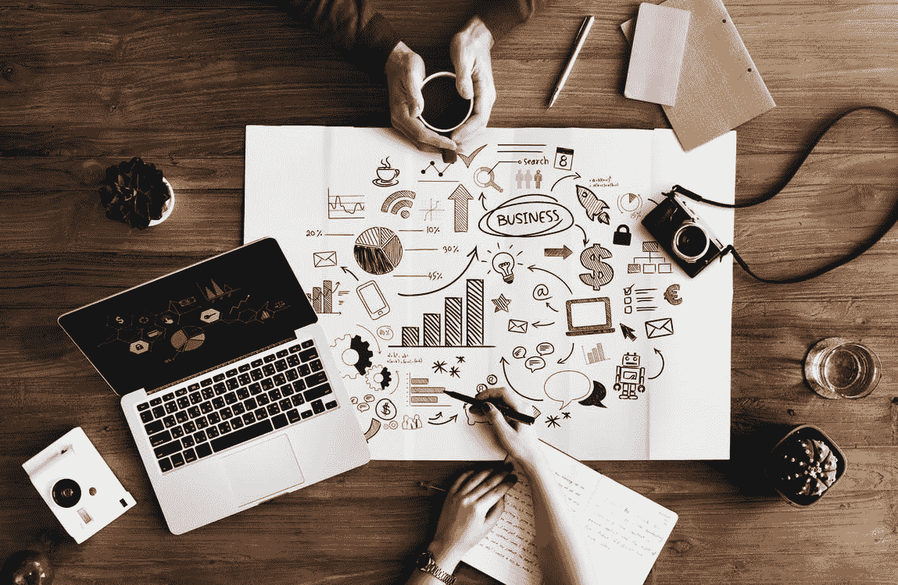

# 通过拯救地球来合作学习人工智能

> 原文：<https://towardsdatascience.com/learn-ai-collaboratively-by-saving-the-planet-9590efd4370e?source=collection_archive---------14----------------------->

## Omdena 和 Ciencia y Datos 合作举办了一场新的人工智能挑战赛，如果你想成为 50 名人工智能爱好者之一，通过解决一个有意义的全球性问题来获得实践技能，你需要阅读这篇文章。

Learn more here: [https://www.cienciaydatos.org/educacion](https://www.cienciaydatos.org/educacion)

和所有人争着解决一个问题不累吗？不要误解我的意思，竞争是重要的，并且推动创新，但是如果你想学习，也许这不是最好的方法。

这就是为什么当 omdena.com 大学的人联系我们 T2 科学与技术大学的人，与他们一起合作挑战人工智能学习时，我们说是的！！

在详细讨论挑战和如何应用之前，让我简单地谈谈协作学习。

# 协作学习

[http://blog.fusemachines.com/ai-human-collaboration/](http://blog.fusemachines.com/ai-human-collaboration/)

学习一个新的话题总是具有挑战性，但是有一些方法可以让它变得简单。不久前，在我关于人们在学习数据科学时犯的最大错误[的文章](https://www.kdnuggets.com/2019/05/biggest-mistakes-learning-data-science.html)中，我提到如果你想真正学到一些你需要实践的东西，要认真学习，而且**最好与对同一领域感兴趣的其他人一起学习。**

我不是说你需要和你的闺蜜们一起开始一门课程，但是你应该利用今天在线平台给我们的东西。

一个社区的形成是因为它的成员有共同的价值观、兴趣和目标。现在有很多人在学习人工智能。很多！有一个很好的理由:

> AI 就是新电！

这是伟大的吴恩达 2 年前说的，现在比以往任何时候都更正确。

许多人以这样或那样的方式使用人工智能，称自己为数据科学家、机器学习工程师、人工智能工程师或类似的人。正如我在之前提出的[:](https://www.business-science.io/business/2018/08/21/agile-business-science-problem-framework.html)

> 数据科学家不是单独存在的，他们需要一个团队，这个团队将使开发智能解决方案成为可能。协作是科学的一大部分，数据科学也不应该例外。

协作学习是一个[已被证实的事实](https://teaching.cornell.edu/teaching-resources/engaging-students/collaborative-learning)，积极的、社交的、有背景的、吸引人的、学生拥有的教育体验会带来更深层次的学习。

学习是一个积极的、建设性的过程。为了学习新的信息、想法或技能，协作学习方法规定学生必须有目的地与他人积极合作。他们需要把这些新材料与他们已经知道的东西结合起来——或者用它来重新组织他们认为他们知道的东西。

此外，因为现实生活项目中的人有不同的背景、学习风格、经验和抱负，所以当我们一起工作时，我们可以直接了解我们和其他人是如何学习的，以及他们给工作带来了什么经验和想法。我们需要在学习时利用多样性。

人工智能可能非常复杂，但汇集更多的智慧，利用我们的差异和相似之处，将有助于以更有效的方式解决困难的问题。**但是我们需要结构和指导**。让我解释一下这个挑战是关于什么的。

# 人工智能挑战:在卫星图像上识别树木

[https://jesserosenstein.com/](https://jesserosenstein.com/)

如果你想阅读 Omdena 的完整故事以及他们在做什么，请看这篇文章:

 [## 为什么社区和协作是构建道德人工智能的关键

### 一种新的建立人工智能解决方案的方式，通过形成组织、专家和学生的社区来合作…

medium.com](https://medium.com/omdena/why-community-and-collaboration-is-the-key-for-building-ethical-ai-e3389157b691) 

## 你会怎么做？

你将参与一个全球范围的社会影响项目。最少的产出是有一个概念证明。根据你的技能，你将参与不同的角色，如定义项目范围，准备数据，建立人工智能模型。

该项目的目标是建立一个在卫星图像上识别树木的模型。该解决方案将防止因倒下的树木和风暴引发的停电和火灾。**这将拯救生命，减少二氧化碳排放，并改善基础设施检查。**

## 申请的要求是什么？

欢迎所有人申请挑战，但我们在这里寻找的是至少完成了一门机器学习或数据科学在线课程的人工智能爱好者。

以下是实际需求:

*   英语良好，能使用电脑上网
*   对计算机科学和/或数学有很好/非常好的理解
*   学生、初级开发人员或正在改变工作领域的开发人员
*   具有 C/C++、C#、Java、Python、R、Javascript 或类似语言的编程经验
*   (基础)了解 ML 和深度学习算法。
*   通过或开始了机器学习/深度学习的在线课程。
*   每周约 7-15 小时的工作时间。

## 对我有什么好处？

您将与**真实图像**和**一起工作，应用深度学习算法**，同时**与领先的导师合作**，获得项目认证，并与世界各地志同道合的人一起提升您的技能。

但如果这还不够，我们还有一件事…

WAAAIIITTT FOR IIITTTTTT!!!!!

除了独特的学习经历，**成功完成挑战后，项目社区将获得 3000 美元的集体奖金。**这笔钱将由所有参与的社区成员平分，通过协作、社区和共享学习来解决问题。

## 如何申请？

超级简单，**在这里申请就行:**

【http://omdena.com/trees/ 

之后，我们将选择一组人工智能爱好者进行挑战。在项目结束时，成果将会呈现在世人面前。

重要提示:

> 挑战的空间有限，所以最多只能接受 50 人。不要犹豫，现在就申请吧！挑战下周开始！

## 项目伙伴关系

我们在[sciencia y Datos](https://www.cienciaydatos.org/)很高兴能在这个项目中与 [Omdena](http://omdena.com/) 合作，同时我们帮助建立世界上最大的平台，用于在人工智能、数据科学等领域学习和获得经验。

希望我们将在这个伟大的项目中一起工作，在那里你将学习，享受乐趣并帮助拯救地球，你还能要求什么呢？

如果您有任何问题，请在 Twitter 上添加我，我很乐意帮助您:

 [## 法维奥·巴斯克斯(@法维奥·巴斯克斯)|推特

### Favio Vázquez 的最新推文(@FavioVaz)。数据科学家。物理学家和计算工程师。我有一个…

twitter.com](https://twitter.com/faviovaz)