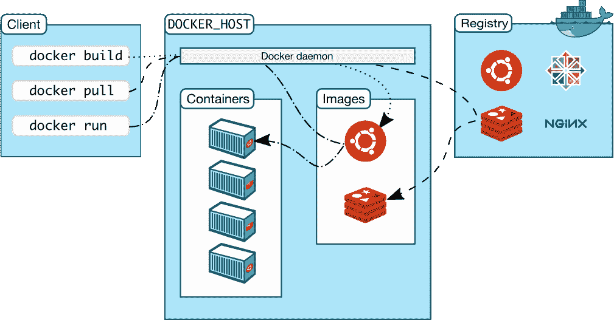
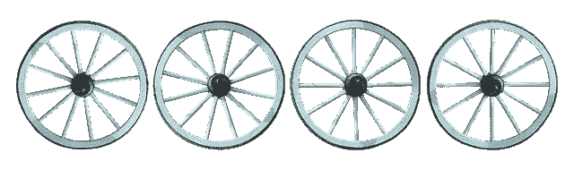
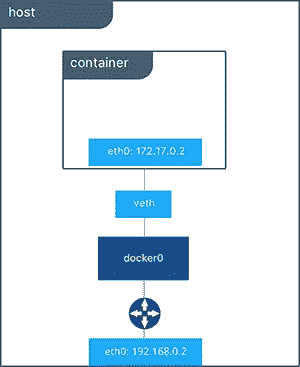

# 学习足够的码头工人是有用的

> 原文：<https://towardsdatascience.com/learn-enough-docker-to-be-useful-1c40ea269fa8?source=collection_archive---------0----------------------->

## 第 2 部分:你需要知道的十几个码头术语

在本系列的第 1 部分中，我们探索了 Docker 容器的概念景观。我们讨论了 Docker 容器重要的原因以及思考它们的几种方式。我们把其中一个做成披萨🍕。在本文中，我将分享你需要知道的来自 Docker 生态系统的十几个附加术语。

Keeping with the food theme from the [first article in the series](/learn-enough-docker-to-be-useful-b7ba70caeb4b). Here’s a dozen delicious Docker donuts. Think of each donut as a Docker container. 😄

# Docker 生态系统术语

为了更容易地创建心智模型，我将 Docker 术语分为两类:*要点*和*缩放*。先打八个要领。

## 码头工人必备

[**Docker 平台**](https://docs.docker.com/engine/docker-overview/#the-docker-platform) 是Docker 的软件，提供在任何 Linux 服务器上的容器中打包和运行应用程序的能力。Docker 平台捆绑了代码文件和依赖项。它通过实现便携性和再现性来促进容易的缩放。

[**Docker 引擎**](https://www.docker.com/products/docker-engine) 是客户端-服务器应用程序。Docker 公司将 Docker 引擎分为两个产品。 [*Docker 社区版(CE)*](https://docs.docker.com/install/) 是免费的，很大程度上基于[开源工具](https://opensource.stackexchange.com/questions/5436/is-docker-still-free-and-open-source)。可能就是你要用的。[*Docker Enterprise*](https://www.docker.com/products/docker-enterprise)附带了额外的支持、管理和安全功能。企业是码头公司保持运转的方式。

Engine makes things run

[**Docker 客户端**](https://docs.docker.com/engine/docker-overview/) 是你与 Docker 互动的主要方式。当您使用 [Docker 命令行界面(CLI)](https://docs.docker.com/engine/reference/commandline/cli/) 时，您可以在终端中键入以`docker`开头的命令。Docker 客户机然后使用 Docker API 将命令发送到 Docker 守护进程。

Diagram from [the Docker docs](https://docs.docker.com/engine/docker-overview/)

[**Docker 守护进程**](https://docs.docker.com/engine/docker-overview/) 是监听 Docker API 请求的 Docker 服务器。Docker 守护进程管理映像、容器、网络和卷。

[**Docker Volumes**](https://docs.docker.com/storage/volumes/) 是存储应用消耗和创建的持久数据的最佳方式。在本系列的第 5 部分中，我们将对 Docker 卷有更多的了解。跟着我，确保你不会错过。

Volumes

A [**Docker 注册表**](https://hub.docker.com/) 是储存 Docker 图像的远程位置。你把图像推送到一个注册表，又从一个注册表中拉出图像。您可以托管自己的注册表或使用提供商的注册表。比如 [AWS](https://aws.amazon.com/ecr/) 和 [Google Cloud](https://cloud.google.com/container-registry/) 都有注册表。

[**Docker Hub**](https://hub.docker.com/) 是 Docker 图片最大的注册表。这也是默认的注册表。你可以在 Docker Hub 上免费查找图片并存储自己的图片。

Hubs and spokes

一个[**Docker 储存库**](https://docs.docker.com/docker-hub/repos/) 是一个名称相同，标签不同的 Docker 图片的集合。*标签*是图像的标识符。

通常，一个存储库有相同图像的不同版本。比如[*Python*](https://hub.docker.com/_/python)*就是 Docker Hub 上最流行的官方 Docker 图片库的名字。 *Python:3.7-slim* 是指 Python 库中带有 *3.7-slim* 标签的镜像版本。您可以将存储库或单个映像推送到注册表。*

*现在让我们看看与扩展多个 Docker 容器相关的 Docker 术语。*

## *缩放 Docker*

*以下四个概念与一次使用多个容器有关。*

*[**Docker 联网**](https://docs.docker.com/engine/tutorials/networkingcontainers/) 让你把 Docker 的容器连接在一起。连接的 Docker 容器可以在同一台主机上，也可以在多台主机上。关于 Docker 网络的更多信息，请看[这篇文章](https://www.oreilly.com/learning/what-is-docker-networking)。*

**

*[Docker Bridge Network](https://docs.docker.com/engine/tutorials/networkingcontainers/)*

*[**Docker Compose**](https://docs.docker.com/compose/)**是一款工具，可以让运行需要多个 Docker 容器的应用变得更加容易。Docker Compose 允许您将命令移动到一个`docker-compose.yml`文件中以便重用。Docker Compose 命令行界面(cli)使得与多容器应用程序的交互更加容易。Docker Compose 随 Docker 的安装免费提供。***

***[**Docker Swarm**](https://docs.docker.com/engine/swarm/) 是一款编排容器部署的产品。官方 Docker 教程的第四部分让你使用 Docker Swarm。我建议你不要花时间在 Docker Swarm 上，除非你有令人信服的理由。***

******

***Bee swarm***

***[**Docker 服务**](https://docs.docker.com/get-started/part3/#introduction) 是分布式 app 的不同部分。来自[文档](https://docs.docker.com/get-started/part3/#introduction):***

> ***服务实际上只是“生产中的容器”一个服务只运行一个映像，但是它规定了该映像运行的方式——它应该使用什么端口，应该运行多少个容器副本，以便服务具有它需要的容量，等等。扩展服务会改变运行该软件的容器实例的数量，在这个过程中为服务分配更多的计算资源。***

***Docker 服务允许您跨多个 Docker 守护进程扩展容器，并使 Docker 集群成为可能。***

***这就是你应该知道的十几个美味的码头术语。***

# ***概述***

***这里有一行解释可以帮助你把这十几个术语搞清楚。***

## ***基础***

****平台* —使 Docker 容器成为可能的软件
*引擎* —客户端-服务器应用程序(CE 或企业)
*客户端* —处理 Docker CLI 以便您可以与守护程序
*守护程序* —管理关键事物的 Docker 服务器
*卷* —持久数据存储
*注册表* —远程映像存储
*Docker Hub* —默认且最大***

## ***缩放比例***

****联网* —将容器连接在一起
*组合* —为多容器应用节省时间
*群集* —协调容器部署
*服务* —生产中的容器***

***因为我们一直在用食物做比喻，而且每个人都喜欢一打面包，所以我们为你多了一个相关的术语: *Kubernetes* 。***

******

***One more donut with extra icing and sprinkles***

***[**Kubernetes**](https://kubernetes.io/)**自动化容器化应用的部署、扩展和管理。它显然是容器编排市场的赢家。不要使用 Docker Swarm，而是使用 Kubernetes 来扩展具有多个 Docker 容器的项目。Kubernetes 不是 Docker 的官方部分；更像是 Docker 的 BFF。*****

**********

*****我有一系列关于 Kubernetes 的作品。Kubernetes 很棒。*****

*****既然你已经知道了概念和常用术语，我建议你试试 Docker。*****

# *****用 Docker 烘烤*****

*****如果你以前没有和 Docker 合作过，现在是时候进入厨房做点东西了！*****

*****Docker 在 Linux、Mac 和 Windows 上本地运行。如果你在 Mac 或 Windows 机器上，安装最新稳定版本的 Docker 桌面[这里](https://www.docker.com/products/docker-desktop)。作为奖励，它带有 Kubernetes。如果你在其他地方安装 Docker，到这里[找到你需要的版本。](https://docs.docker.com/install/)*****

*****安装 Docker 后，做 Docker 教程[的前两部分。然后在这里见面，享受更多码头的乐趣。在本系列接下来的四个部分中，我们将深入探讨 Docker 文件、Docker 映像、Docker CLI 和数据处理。跟着我，确保你不会错过这次冒险。](https://docs.docker.com/get-started/)*****

*****关于 Dockerfiles 的第 3 部分现可在此处获得:*****

***** [## 学习足够的码头工人是有用的

### 第 3 部分:一打漂亮的 Dozen 文件指令

towardsdatascience.com](/learn-enough-docker-to-be-useful-b0b44222eef5) 

如果你觉得这篇文章有帮助，请在 Twitter、脸书、LinkedIn 和你喜欢的论坛上分享。感谢阅读！*****