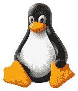
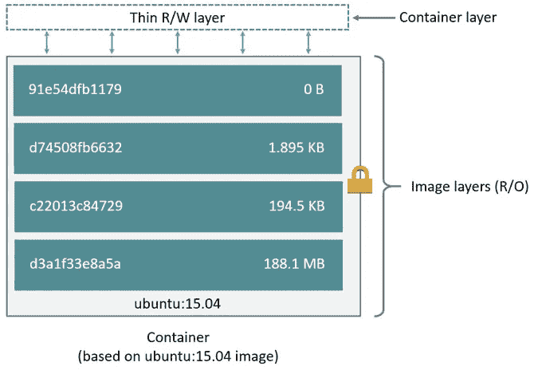

# 学习足够的码头工人是有用的

> 原文：<https://towardsdatascience.com/learn-enough-docker-to-be-useful-b0b44222eef5?source=collection_archive---------1----------------------->

## 第 3 部分:一打漂亮的 Dozen 文件指令


Keeping with our carb-rich food metaphors, we’ll explore a dozen tasty Dockerfile instructions.

这篇文章是关于 Dockerfiles 的。这是 Docker 六集系列的第三部分。如果你还没有阅读过[第 1 部分](/learn-enough-docker-to-be-useful-b7ba70caeb4b)，请先阅读一下，以全新的视角来看待 Docker 容器概念。💡[第 2 部分](/learn-enough-docker-to-be-useful-1c40ea269fa8)是 Docker 生态系统的快速演练。在[未来的文章](/slimming-down-your-docker-images-275f0ca9337e)中，我将着眼于精简 Docker 映像、Docker CLI 命令以及使用 Docker 数据。

让我们跳进十几个 Dockerfile 指令就知道了！


Jump in. True picture ;)

# Docker 图像

回想一下，Docker 容器是一个栩栩如生的 Docker 图像。这是一个包含应用程序代码的独立的最小操作系统。

Docker 映像是在构建时创建的，Docker 容器是在运行时创建的。

Docker 文件是 Docker 的核心。Docker 文件告诉 Docker 如何构建将用于制作容器的图像。

每个 Docker 图像包含一个名为 *Dockerfile* 的文件，没有扩展名。当调用`docker build`创建图像时，Dockerfile 被假定在当前工作目录中。可以用文件标志(`-f`)指定不同的位置。

回想一下，容器是由一系列层构成的。每个层都是只读的，除了位于其他层之上的最后一个容器层。Docker 文件告诉 Docker 要添加哪些层以及添加的顺序。

每一层实际上只是一个文件，其中包含了自上一层以来的更改。在 Unix 中，几乎所有东西都是一个[文件](https://en.wikipedia.org/wiki/Everything_is_a_file)。

基础图像提供初始层。基础映像也称为父映像。

将图像从远程存储库提取到本地计算机时，只会下载本地计算机上没有的图层。Docker 通过重用现有层来节省空间和时间。


A base (jumping) image

Dockerfile 指令是行首的一个大写单词，后跟它的参数。Dockerfile 文件中的每一行都可以包含一条指令。构建映像时，指令是从上到下处理的。说明是这样的:

```
FROM ubuntu:18.04
COPY . /app
```

只有来自、运行、复制和添加的指令才能在最终图像中创建层。其他指令配置东西，添加元数据，或者告诉 Docker 在运行时做一些事情，比如公开端口或者运行命令。

在本文中，我假设您使用的是基于 Unix 的 Docker 映像。您也可以使用基于 Windows 的图像，但这是一个较慢、不太愉快、不太常见的过程。所以可以的话就用 Unix 吧。

让我们快速浏览一下将要研究的十几条 Dockerfile 指令。

# 一打 Dozen 文件说明

`FROM` —指定基础(父)图像。
`LABEL`—提供元数据。包含维护者信息的好地方。
`ENV` —设置持久的环境变量。
`RUN`—运行命令并创建一个图像层。用于将包安装到容器中。
`COPY` —将文件和目录复制到容器中。
`ADD` —将文件和目录复制到容器。可以备份本地。焦油文件。
`CMD` —为正在执行的容器提供命令和参数。参数可以被覆盖。只能有一个 CMD。
`WORKDIR` —设置后续指令的工作目录。
`ARG` —定义在构建时传递给 Docker 的变量。
`ENTRYPOINT` —为正在执行的容器提供命令和参数。争论一直存在。
`EXPOSE` —暴露一个端口。
`VOLUME` —创建目录挂载点以访问和存储持久数据。

我们开始吧！

# 说明和示例

Dockerfile 文件可以简单到只有这一行:

```
FROM ubuntu:18.04
```

## [从到](https://docs.docker.com/engine/reference/builder/#from)

Dockerfile 必须以 FROM 指令或 ARG 指令开头，后跟 FROM 指令。

FROM 关键字告诉 Docker 使用与提供的存储库和标签相匹配的基本图像。基础图像也被称为[父图像](https://docs.docker.com/develop/develop-images/baseimages/)。

在本例中， *ubuntu* 是图像库。Ubuntu 是一个官方 Docker 库的名字，它提供了流行的 Linux 操作系统 Ubuntu 版本的基础版本。



Linux mascot Tux

注意，这个 docker 文件包含了一个基本图像的标签: *18.04* 。这个标签告诉 Docker 要从 *ubuntu* 库中提取哪个版本的图像。如果没有包含标签，那么 Docker 默认采用*最新的*标签*、*。为了使您的意图清晰，指定一个基本图像标签是一个好的做法。

当上面的 Docker 文件首次用于在本地构建映像时，Docker 会下载在 *ubuntu* 映像中指定的层。这些层可以被认为是相互堆叠的。每一层都是一个文件，其中包含了与前一层的一系列差异。

创建容器时，在只读层之上添加一个可写层。



From the [Docker Docs](https://docs.docker.com/v17.09/engine/userguide/storagedriver/imagesandcontainers/#images-and-layers)

Docker 使用写入时复制策略来提高效率。如果一个层存在于映像中的前一层，而另一个层需要对它进行读取访问，Docker 将使用现有的文件。什么都不需要下载。

当映像运行时，如果某个层需要被容器修改，则该文件会被复制到顶部的可写层中。查看 Docker 文档[这里](https://docs.docker.com/v17.09/engine/userguide/storagedriver/imagesandcontainers/)了解更多关于写时复制的信息。

## 更实质性的文档

虽然我们的单行图像很简洁，但它也很慢，提供的信息很少，并且在容器运行时什么也不做。让我们看一个更长的 Dockerfile，它构建一个更小的映像，并在容器运行时执行一个脚本。

```
FROM python:3.7.2-alpine3.8
LABEL maintainer="[jeffmshale@gmail.com](mailto:jeffmshale@gmail.com)"
ENV ADMIN="jeff"RUN apk update && apk upgrade && apk add bashCOPY . ./appADD [https://raw.githubusercontent.com/discdiver/pachy-vid/master/sample_vids/vid1.mp4](https://raw.githubusercontent.com/discdiver/pachy-vid/master/sample_vids/vid1.mp4) \
/my_app_directoryRUN ["mkdir", "/a_directory"]CMD ["python", "./my_script.py"]
```

哇，这是怎么回事？让我们一步一步来揭开它的神秘面纱。

基础图片是官方的 Python 图片，标签为 *3.7.2-alpine3.8* 。正如你可以从它的[源代码](https://github.com/docker-library/python/blob/ab8b829cfefdb460ebc17e570332f0479039e918/3.7/alpine3.8/Dockerfile)中看到的，图像包括 Linux、Python，没有太多其他的。阿尔卑斯山的图像很受欢迎，因为它们小，快，安全。然而，Alpine 图像并不具备操作系统的许多优点。如果需要，您必须自己安装这些软件包。

## [**标签**](https://docs.docker.com/engine/reference/builder/#label)

下一条指令被标记。标签向图像添加元数据。在这种情况下，它提供了映像维护者的联系信息。标签不会降低构建速度或占用空间，它们确实提供了关于 Docker 图像的有用信息，所以一定要使用它们。关于标签元数据的更多信息可以在[这里](https://docs.docker.com/config/labels-custom-metadata/)找到。


## [环境](https://docs.docker.com/engine/reference/builder/#env)

ENV 设置一个在容器运行时可用的持久环境变量。在上面的例子中，您可以在创建 Docker 容器时使用 ADMIN 变量。

ENV 很适合设置常量。如果您在 docker 文件中的几个位置使用了一个常量，并希望在以后更改它的值，那么您可以在一个位置这样做。


ENVironment

使用 Dockerfiles，通常有多种方法来完成同一件事情。对你的情况来说，最好的方法是平衡 Docker 惯例、透明度和速度。例如，RUN、CMD 和 ENTRYPOINT 有不同的用途，都可以用来执行命令。

## [运行](https://docs.docker.com/engine/reference/builder/#run)

运行在构建时创建一个层。Docker 在每次运行后提交映像的状态。

RUN 通常用于将软件包安装到镜像中*。*在上面的例子中，`RUN apk update && apk upgrade`告诉 Docker 从基础映像*更新包。* `&& apk add bash`告诉 Docker 将 *bash* 安装到镜像中。

*apk* 代表 [Alpine Linux 包管理器](https://www.cyberciti.biz/faq/10-alpine-linux-apk-command-examples/)。如果您使用的是除 Alpine 之外的 Linux 基础映像，那么您应该安装带有 RUN *apt-get* 而不是 *apk* 的包。 *apt* 代表*高级包装工具*。我将在后面的例子中讨论安装包的其他方法。


RUN

RUN——以及它的表亲 CMD 和 entry point——可以在 exec 形式或 shell 形式中使用。Exec 格式使用 JSON 数组语法如下:`RUN ["my_executable", "my_first_param1", "my_second_param2"]`。

在上面的例子中，我们使用了格式为`RUN apk update && apk upgrade && apk add bash`的 shell 表单。

稍后在 docker 文件中，我们使用首选的 exec 格式和`RUN ["mkdir", "/a_directory"]`来创建一个目录。不要忘记在 exec 表单的 JSON 语法中对字符串使用双引号！

## [复制](https://docs.docker.com/engine/reference/builder/#copy)

`COPY . ./app` 指令告诉 Docker 获取本地构建上下文中的文件和文件夹，并将它们添加到 Docker 映像的当前工作目录中。如果目标目录不存在，复制将创建它。


COPY

## [**添加**](https://docs.docker.com/engine/reference/builder/#add)

ADD 做的事情和 COPY 一样，但是多了两个用例。ADD 可用于将文件从远程 URL 移动到容器，ADD 可提取本地 TAR 文件。

在上面的例子中，我使用 ADD 将一个文件从远程 url 复制到容器的 *my_app_directory* 中。Docker 文档不推荐以这种方式使用远程 URL，因为你不能删除文件。额外的文件会增加最终图像的大小。

Docker 文档还建议尽可能使用 COPY 而不是 ADD 来提高清晰度。Docker 没有将 ADD 和 COPY 合并成一个命令来减少 Dockerfile 指令的数量以保持直线，这太糟糕了😃。

注意，ADD 指令包含了`\`行继续符。通过将一个长指令分成几行来提高可读性。

## [CMD](https://docs.docker.com/engine/reference/builder/#cmd)

CMD 为 Docker 提供了一个在容器启动时运行的命令。它不会在构建时将命令的结果提交给映像。在上面的例子中，CMD 将让 Docker 容器在运行时运行 my_ *script.py* 文件。


That’s a CMD!

关于 CMD 需要知道的其他一些事情:

*   每个 docker 文件只有一条 CMD 指令。否则，除了最后一个，其他的都将被忽略。
*   CMD 可以包含一个可执行文件。如果 CMD 没有可执行文件，那么入口点指令必须存在。在这种情况下，CMD 和 ENTRYPOINT 指令都应该是 JSON 格式。
*   `docker run`的命令行参数覆盖 Dockerfile 文件中提供给 CMD 的参数。

## 准备好了吗？

让我们在另一个示例 Dockerfile 中再介绍一些指令。

```
FROM python:3.7.2-alpine3.8
LABEL maintainer="[jeffmshale@gmail.com](mailto:jeffmshale@gmail.com)"# Install dependencies
RUN apk add --update git# Set current working directory
WORKDIR /usr/src/my_app_directory# Copy code from your local context to the image working directory
COPY . .# Set default value for a variable
ARG my_var=my_default_value# Set code to run at container run time
ENTRYPOINT ["python", "./app/my_script.py", "my_var"]# Expose our port to the world
EXPOSE 8000# Create a volume for data storage
VOLUME /my_volume
```

请注意，您可以在 docker 文件中使用注释。评论从`#`开始。

软件包安装是 Dockerfiles 的主要工作。如前所述，用 RUN 安装软件包有几种方法。

您可以使用 *apk 在 Alpine Docker 映像中安装一个包。apk* 就像普通 Linux 版本中的 *apt-get* 。例如，Dockerfile 中带有基本 Ubuntu 映像的包可以像这样更新和安装:`RUN apt-get update && apt-get install my_package`。

除了 *apk* 和 *apt-get* 之外，Python 包还可以通过 [*pip*](https://pypi.org/project/pip/) 、 [*wheel*](https://pythonwheels.com/) 、 [*conda*](https://medium.com/@chadlagore/conda-environments-with-docker-82cdc9d25754) 进行安装。其他语言可以使用各种安装程序。

底层需要为安装层提供相关的包管理器。如果您在安装软件包时遇到问题，请确保在尝试使用软件包管理器之前安装了它们。😃

您可以使用 RUN with pip 并在 docker 文件中直接列出您想要安装的软件包。如果这样做，将软件包安装连接成一条指令，并用行继续符(\)将其分隔开。这种方法比多重运行指令更清晰，层次更少。

或者，您可以在一个文件中列出您的包需求，并在该文件上运行包管理器。民间通常将文件命名为 *requirements.txt* 。在下一篇文章中，我将分享一个推荐的模式来利用构建时缓存和 *requirements.txt* 。

## [工作方向](https://docs.docker.com/v17.09/engine/reference/builder/#workdir)

WORKDIR 为其后的 COPY、ADD、RUN、CMD 和 ENTRYPOINT 指令更改容器中的工作目录。一些注意事项:

*   最好用 WORKDIR 设置一个绝对路径，而不是用 Dockerfile 中的`cd`命令在文件系统中导航。
*   如果该目录不存在，WORKDIR 会自动创建它。
*   您可以使用多个 WORKDIR 指令。如果提供了相对路径，那么每个 WORKDIR 指令都会改变当前的工作目录。


WORKDIRs of some sort

## [ARG](https://docs.docker.com/engine/reference/builder/#arg)

ARG 定义了一个在构建时从命令行传递到映像的变量。可以为 docker 文件中的 ARG 提供一个默认值，如示例中所示:`ARG my_var=my_default_value`。

与 ENV 变量不同，ARG 变量不可用于正在运行的容器。但是，您可以在构建映像时使用 ARG 值从命令行为 ENV 变量设置默认值。然后，ENV 变量在容器运行时保持不变。点击了解更多关于这项技术的信息。

## [入口点](https://docs.docker.com/engine/reference/builder/#entrypoint)

ENTRYPOINT 指令还允许您在容器启动时提供默认命令和参数。它看起来类似于 CMD，但是如果使用命令行参数运行容器，入口点参数不会被覆盖。

相反，传递给`docker run my_image_name`的命令行参数被附加到 ENTRYPOINT 指令的参数中。例如，`docker run my_image bash`将参数 *bash* 添加到 ENTRYPOINT 指令现有参数的末尾。


ENTRYPOINT to somewhere

Dockerfile 应该至少有一个 CMD 或 ENTRYPOINT 指令。

[Docker 文档](https://docs.docker.com/v17.09/engine/reference/builder/#understand-how-cmd-and-entrypoint-interact)有一些关于在 CMD 和 ENTRYPOINT 之间选择初始容器命令的建议:

*   当您需要每次都运行相同的命令时，请选择 ENTRYPOINT。
*   当一个容器将被用作一个可执行程序时，选择 ENTRYPOINT。
*   当您需要提供可以从命令行覆盖的额外默认参数时，请选择 CMD。

在上面的例子中，当容器开始运行*时，`ENTRYPOINT ["python", "my_script.py", "my_var"]`让容器运行带有参数 *my_var* 的 python 脚本 *my_script.py* 。my_var* 然后可以通过 [argparse](https://docs.python.org/3/library/argparse.html) 被 *my_script* 使用。请注意， *my_var* 有一个默认值，由前面 docker 文件中的 ARG 提供。因此，如果没有从命令行传递参数，那么将使用默认参数。

Docker 建议你一般使用 exec 形式的 ENTRYPOINT: `ENTRYPOINT ["executable", "param1", "param2"]`。这种形式是带有 JSON 数组语法的形式。

[曝光](https://docs.docker.com/engine/reference/builder/#expose)

EXPOSE 指令显示了打算发布哪个端口来提供对正在运行的容器的访问。EXPOSE 实际上并不发布端口。相反，它充当构建映像的人和运行容器的人之间的文档。


EXPOSEd

在运行时使用带有`-p`标志的`docker run`来发布和映射一个或多个端口。大写的`-P`标志将公布所有暴露的端口。

## [**卷**](https://docs.docker.com/engine/reference/builder/#volume)

VOLUME 指定容器存储和/或访问持久数据的位置。卷是本系列即将发表的一篇文章的主题，因此我们将在那时研究它们。


VOLUME

让我们回顾一下我们研究过的十几个 Dockerfile 指令。

# 重要的文档说明

`FROM` —指定基础(父)图像。
`LABEL`—提供元数据。包含维护者信息的好地方。
`ENV` —设置持久的环境变量。
`RUN`—运行命令并创建一个图像层。用于将包安装到容器中。
`COPY` —将文件和目录复制到容器中。
`ADD` —将文件和目录复制到容器。可以备份本地。焦油文件。
`CMD` —为正在执行的容器提供命令和参数。参数可以被覆盖。只能有一个 CMD。
`WORKDIR` —设置后续指令的工作目录。
`ARG` —定义在构建时传递给 Docker 的变量。
`ENTRYPOINT` —为正在执行的容器提供命令和参数。争论一直存在。
`EXPOSE` —暴露一个端口。
`VOLUME` —创建目录挂载点以访问和存储持久数据。

现在你知道一打 Dockerfile 指令让自己有用！这里有一个额外的百吉饼:一个有所有文档说明的小抄。我们没有涉及的五个命令是 USER、ONBUILD、STOPSIGNAL、SHELL 和 HEALTHCHECK。如果你遇到他们，你会看到他们的名字。😃


Bonus bagel

# 包装

Docker 文件可能是 Docker to master 的关键组成部分。我希望这篇文章能帮助你获得对他们的信心。我们将在本系列关于减肥图片的下一篇文章中再次讨论它们。跟着 [me](https://medium.com/@jeffhale) 确保不要错过！

如果你觉得这篇文章有帮助，请分享到你最喜欢的社交媒体上，帮助其他人找到它。👍

我写关于数据科学、云计算和其他技术的东西。关注我，在这里阅读更多。

[](https://dataawesome.com)

码头快乐！