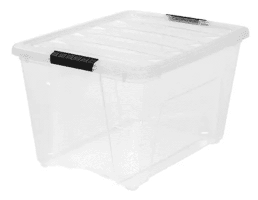

# 学习足够的码头工人是有用的

> 原文：<https://towardsdatascience.com/learn-enough-docker-to-be-useful-b7ba70caeb4b?source=collection_archive---------1----------------------->

## 第 1 部分:概念景观

容器对于提高软件开发和数据科学中的安全性、可再现性和可伸缩性非常有帮助。它们的崛起是当今科技领域最重要的趋势之一。

Docker 是一个在容器内部开发、部署和运行应用程序的平台。码头工人本质上是集装箱化的同义词。如果你是一个当前的或有抱负的软件开发人员或数据科学家，Docker 是你的未来。

如果你还没有跟上速度，不要担心——这篇文章将帮助你理解概念上的前景——并且你将在途中做一些比萨饼。

在本系列接下来的五篇文章中，我们将讨论 Docker 术语、Docker 文件、Docker 图像、Docker 命令和数据存储。第 2 部分现已上线:

 [## 学习足够的码头工人是有用的

### 第 2 部分:你需要知道的十几个码头术语

towardsdatascience.com](/learn-enough-docker-to-be-useful-1c40ea269fa8) 

到本系列结束时(经过一点实践)，你应该知道足够有用的 Docker😃！

# 码头隐喻

首先，我要解释一下 Docker 隐喻。

[They’re everywhere! Just check out this book.](https://www.goodreads.com/book/show/34459.Metaphors_We_Live_By)

谷歌对隐喻的第二个定义是我们想要的:

> 被认为是其他事物的代表或象征的事物，尤指抽象的事物。

隐喻帮助我们理解新事物。比如实体容器的比喻，帮助我们快速抓住虚拟容器的本质。

A physical container

## 容器

像物理塑料容器一样，码头集装箱:

1.  **拿东西** —东西要么在容器里面，要么在容器外面。
2.  **是可移植的**——它可以在你的本地机器、你同事的机器或者云提供商的服务器(例如 AWS)上使用。有点像你从一个家搬到另一个家随身携带的那盒童年小摆设。
3.  **有清晰的访问接口** —我们的物理容器有一个盖子，用于打开、放入和取出东西。类似地，Docker 容器有几种与外界接口的机制。它有可以通过浏览器打开进行交互的端口。您可以将其配置为通过命令行与数据交互。
4.  **可以从遥远的地方获得** —当你需要的时候，你可以从 Amazon.com 得到另一个空的塑料容器。亚马逊从制造商那里获得塑料容器，这些制造商从一个模具中冲压出数千个塑料容器。在 Docker 容器的情况下，一个异地注册中心为您的容器保存一个映像，就像一个模子。然后，当你需要一个容器时，你可以根据图片制作一个。

与虚拟 Docker 容器不同，亚马逊的新塑料容器会让你花钱，而且里面不会有你商品的副本。遗憾的💸。

## 活生生的例子

你可以认为 Docker 容器的第二种方式是作为一个有生命的东西的实例。实例是以某种形式存在的东西。不仅仅是代码。是代码给生活带来了一些东西。像其他生物一样，实例最终会死亡——这意味着容器会关闭。

An instance of a monster

Docker 容器是一个栩栩如生的 Docker 图像。

## 软件

除了容器隐喻和活生生的实例隐喻之外，您可以将 Docker 容器想象成**一个软件程序**。毕竟是软件。在最基本的层面上，容器是一组操作其他位的指令。

Containers are code

当 Docker 容器运行时，它通常有程序在里面运行。容器中的程序执行动作，所以你的应用程序会做一些事情。

例如，Docker 容器中的代码可能已经向您发送了您正在该网页上阅读的内容。或者，它可能会将您的语音命令发送到 Amazon Alexa，并将其解码为不同容器中的另一个程序将使用的指令。

使用 Docker，您可以在一台主机上同时运行多个容器。和其他软件程序一样，Docker 容器可以运行、检查、停止和删除。

# 概念

## 虚拟机

虚拟机是 Docker 容器的前身。虚拟机还隔离应用程序及其依赖关系。然而，Docker 容器优于虚拟机，因为它们占用更少的资源，非常便携，并且启动更快。查看[这篇文章](https://medium.freecodecamp.org/a-beginner-friendly-introduction-to-containers-vms-and-docker-79a9e3e119b)中关于相似性和差异性的精彩讨论。

## Docker 图像

我在上面提到了图像。什么是图像？很高兴你问了！Docker 上下文中的术语 *image* 的含义并不能很好地映射到物理图像。

Images

Docker 图像更像是蓝图、饼干切割器或模具。图像是不可变的主模板，用于抽取完全相同的容器。

Cookie cutters

映像包含应用程序运行所需的 docker 文件、库和代码，所有这些都捆绑在一起。

## Dockerfile 文件

Dockerfile 是一个说明 Docker 应该如何构建您的图像的文件。

Dockerfile 指的是用于构建初始图像层的基础图像。热门官方基图有 [python](https://hub.docker.com/_/python/) 、 [ubuntu](https://hub.docker.com/_/ubuntu) 、 [alpine](https://hub.docker.com/_/alpine) 。

然后，根据 docker 文件中的说明，可以在基本图像层的顶部堆叠附加层。例如，机器学习应用程序的 Docker 文件可以告诉 Docker 在中间层添加 NumPy、Pandas 和 Scikit-learn。

最后，根据 Dockerfile 代码，将一个薄的可写层堆叠在其他层的顶部。(你理解薄层体积小是因为你直观地理解了*薄*的比喻，对吗😃？)

我将在本系列的后续文章中更深入地探讨 Dockerfiles。

## 码头集装箱

Docker 图像加上命令`docker run image_name`从图像创建并启动一个容器。

## 集装箱登记处

如果您希望其他人能够根据您的图像制作容器，您可以将图像发送到容器注册表。 [Docker Hub](https://hub.docker.com/) 是最大的注册表和默认注册表。

唷！那是很多块。让我们把这一切放在一起，做一个比萨饼。

# 用 Docker 做饭

Landscape Metaphor

*   菜谱就像 *Dockerfile* 。它告诉你该怎么做才能达到你的最终目标。
*   配料是*层*。你有比萨饼的外壳、调味汁和奶酪。

把食谱和配料组合在一起，就像一个完整的比萨饼制作工具包。是 *Docker 形象*。

菜谱(Dockerfile)告诉我们要做什么。计划是这样的:

*   外壳是预先形成的，不可改变的，它就像一个基本的 ubuntu 父图像。这是最底层*和最先建造的*。
*   然后你会加一些奶酪。将第二层添加到比萨饼中就像*安装一个外部库*——例如 NumPy。
*   然后你会撒上一些罗勒。罗勒就像是你为运行你的应用程序而编写的文件中的*代码。*

好吧，我们开始做饭吧。

Oven

*   烤披萨的烤箱就像 Docker 平台。你搬进来的时候把烤箱装在了家里，这样你就可以用它做东西了。类似地，你在你的电脑上安装了 Docker，这样你就可以制作容器了。
*   你转动旋钮来启动烤箱。`docker run image_name`命令就像您的旋钮——它创建并启动您的容器。
*   煮熟的比萨饼就像一个码头集装箱。
*   吃披萨就像使用你的应用程序。

就像做比萨饼一样，在 Docker 容器中制作一个应用程序需要一些工作，但最终你会得到一些很棒的东西。享受🍕！

# 包装

这就是概念框架。在本系列的第 2 部分中，我澄清了你将在 Docker 生态系统中看到的一些术语。跟着我，保证你不会错过！

希望这个概述能帮助你更好地理解 Docker 的前景。我也希望它能让你看到隐喻在理解新技术中的价值。

如果你觉得这很有帮助，请在你最喜欢的社交媒体上分享，这样其他人也可以找到它。👏

我写关于 Python、Docker、数据科学等等的文章。如果你对此感兴趣，请阅读更多[此处](https://medium.com/@jeffhale)并关注我的 Medium。😄

感谢阅读！