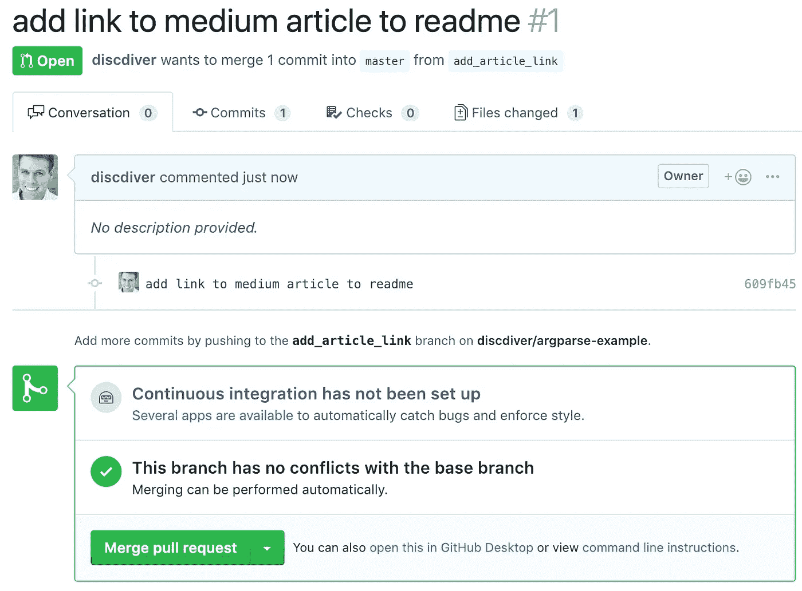

# 学会足够有用的东西

> 原文：<https://towardsdatascience.com/learn-enough-git-to-be-useful-281561eef959?source=collection_archive---------2----------------------->

## GitHub 项目的 4 个基本工作流程


在这篇文章中，我们将在四种常见的场景中探讨如何使用 Git 和 GitHub。

1.  独自带着自己的原创项目推送到*主*分支。
2.  独自处理自己的原始项目和拉取请求。
3.  独自进行一个克隆项目。
4.  共同参与一个项目。

[Git](https://git-scm.com/) 对于开发人员、数据科学家和产品经理来说是必不可少的版本控制技术。


[GitHub](https://github.com/about) 是最流行的远程 Git 存储库注册中心。它托管了超过 1 亿个存储库，并且是许多开源软件构建的地方。


如果你是一名开发人员，你应该有一个 GitHub 帐户，显示你可以用代码做事情。虽然 [GitLab](https://about.gitlab.com/) 和 [BitBucket](https://www.atlassian.com/software/bitbucket) 是流行的注册表选项，但最近被微软收购的 GitHub 显然是市场领导者。

# 先决条件

如果您有一个 GitHub 帐户，并且已经在您的计算机上安装并配置了 Git，请直接跳到前面。

如果你没有 GitHub 账户，请点击这里[注册一个免费账户。点击](https://github.com/join)查看如何安装和配置 Git [。你需要命令行工具。按照链接下载、安装它，设置您的用户名，并设置您的提交电子邮件地址。](https://help.github.com/articles/set-up-git/)

一旦解决了这个问题，您就可以从我们的基本示例开始了。如此微不足道！😆

# 场景 1:单飞推主工作流

1.  在 [GitHub](https://github.com/) 上创建一个回购。


输入存储库名称。然后输入描述——如果您切换*用自述文件初始化此存储库，此描述将成为初始化时的自述文件*。您可以稍后更改自述文件的内容。

在这里，我正在为我的关于 Python OS 命令的[文章](/10-python-file-system-methods-you-should-know-799f90ef13c2)制作一个 repo。


如果你想让其他人能够找到你的作品，保持 *Public* 单选按钮高亮显示。私人回购过去是要花钱的，但用户现在有无限量的免费回购。

从下拉列表中添加一个. *gitignore* 。我选择了 *Python* 作为我的 *os-examples* 项目，因为我正在做一个 Python 项目。的。gitignore file 将匹配您不想在 Git repo 中使用的常见文件夹和文件类型。你可以改变你的。gitignore 稍后排除其他不必要的或敏感的文件。

我建议您从*添加许可证*下拉列表*中选择一个许可证。*许可证定义了存储库内容的用户可以做什么。有些许可证比其他的更宽松。如果没有选择许可证，则默认版权法适用。点击了解更多关于执照的信息。

现在你在 GitHub 上有回购了，亲爱的！是时候把它复制到你的本地机器上了。

2.从 GitHub 抓取网址进行克隆。


3.启动一个终端会话，并导航到您希望存储 repo 的本地目录。考虑一下这个位置——您可能想要创建一个新目录来保持整洁。

然后运行:

`git clone [https://github.com/your_repo_name/your_repo](https://github.com/your_repo_name/your_repo)`

`ls`查看您的新目录

`cd`进入你的目录

`ls`查看您的新目录和文件

现在是时候投入到您的*推动工作流程*中了。

# 推送至主工作流

1.当您克隆一个回购时，默认情况下，您从本地回购的主分支开始。创建一个临时分支并在其中工作是很好的实践。

创建一个新的分支并用`git checkout -b my_feature_branch`切换到它。

你可以给你的分公司起任何你喜欢的名字。然而，与编程中的大多数名称一样，简明扼要是个好主意。😄

2.在代码编辑器中编写一些代码并保存。我是 [Atom](https://atom.io/) 的粉丝。它是免费的、开源的、受欢迎的，并且运行良好。


3.使用`git status`检查本地文件更改的状态。您应该会看到一个红色的新文件列表。这些是未被追踪的文件。Git 知道这些文件，所以 Git 对它们进行了索引。这些文件与中的文件不匹配。gitignore，所以它们不会被 Git 忽略。

例如，这是我的未跟踪文件。


4.要暂存所有更改，请输入`git add -A`。

您可能会看到一个您不想添加到 GitHub repo 的文件被列出。在这种情况下，您可以使用`git add my_filename`单独添加想要暂存的文件。

此外，你应该改变你的。gitignore file 排除不想添加到 repo 中的文件类型和文件夹。保存您的。gitignore file，它应该以红色显示为一个包含未分级更改的文件。

再次确保您要提交的文件是暂存的。文件更改必须暂存才能提交。

打个棒球或垒球的比方，我认为阶段性变化就像甲板上的击球手。他们正在为接下来的事情做准备:真正的事情。


Batter in on deck circle.Credit: Tdorante10 [CC BY-SA 4.0 ([https://creativecommons.org/licenses/by-sa/4.0](https://creativecommons.org/licenses/by-sa/4.0))]

要提交的文件将以绿色显示。


5.用`git commit -m "my commit message"`提交更改。使用现在时态，例如“更新参考文献的链接”。

6.用`git checkout master`切换到当地总支。

你可以用`git branch -v`看到你所有的分支。

7.用`git merge my_feature_branch`将你当地的特色分支合并到你当地的主分支。

8.用`git push origin master`将更新的 master 分支推送到 GitHub。

9.用`git branch -d my_feature_branch`删除你的旧的，本地的，非主分支。

**重复🔁**

如果你是单干的话就这样。现在您的工作已经备份，更改可以回滚，其他人可以使用和查看您的代码。😄

接下来，我们将看一个稍微复杂一点的带有拉请求的工作流。

# 场景 2:单独拉式请求工作流

我将通过对[我的 GitHub repo](https://github.com/discdiver/argparse-example/) 进行修改来演示这个工作流，我的 GitHub repo 曾经为一篇关于如何使用 argparse 的[文章做了一个例子。](/learn-enough-python-to-be-useful-argparse-e482e1764e05)

在到达[步骤 6](#f760) 之前，一切都与场景 1 的设置和工作流程相同。不要转到你当地的主分支，而是留在你当地的特色分支。这是新的第六步:

6.用`git push origin my_feature_branch`将您的特性分支推送到您的远程存储库。

7.在浏览器中导航到您的 GitHub repo，您应该会看到一个警告，提示您可以*比较&拉取请求*。


单击绿色按钮，您将能够创建拉取请求。


8.点击*创建拉动请求*。我在这里没有设置持续集成，但是我将在以后关于创建开源项目的文章中深入探讨这个主题。跟着我，确保你不会错过它。😄



9.确认您要合并提取请求。

10.您可以选择删除远程分支。删除它。

11.回到你的终端，用`git checkout master`切换回你当地的主分支。

12.用`git pull origin master`从您的远程存储库中下载主分支。或者，您可以从要素分支中合并本地更改。然而，最好养成从您的远程存储库中下载变更的习惯，以防您的合作者的变更被合并到 master 中。此外，您可能已经通过浏览器快速修复了一个降价文档，但却忘记了。所以安全总比后悔好。😄

13.用`git branch -d my_feature_branch`删除不再需要的局部特征分支。

通过选择下一个要处理的 bug 或特性，并创建和检查一个新的分支，重新开始这个循环。🔁

注意，您可以从命令行创建和管理拉请求流程，但是我发现从浏览器管理流程更容易。

# 场景 3:单独克隆的项目

场景是这样的:你想玩别人写的放在 GitHub 上的代码。您可能会发现自己在教程中这样做。让我们假设你没有把你的作品发送到 GitHub。

例如，您可以从穆勒和圭多的[Python 机器学习入门](https://www.oreilly.com/library/view/introduction-to-machine/9781449369880/)(我强烈推荐给数据科学家的一本书)下载带有示例代码的存储库。


用`git clone [https://github.com/amueller/introduction_to_ml_with_python.git](https://github.com/amueller/introduction_to_ml_with_python.git)`从 GitHub 抓取网址进行复制。

在你的克隆回购中启动 [Jupyter Lab](https://jupyterlab.readthedocs.io/en/stable/getting_started/overview.html) 并开始玩例子。如果你只是在本地玩，那就这样吧。又短又甜！

# 场景 4:合作参与项目

你想为一个现有的开源项目做贡献。欺负你！👏


Now we’re flying together

让我们使用[首次投稿/首次投稿](https://github.com/firstcontributions/first-contributions)。这个 GitHub repo 旨在帮助你为一个开源项目做出第一份贡献。这非常简单:你发出一个 pull 请求，将你的名字添加到一个列表中。

在这种情况下，您从派生回购开始。

1.  点击 GitHub repo 右上角的*叉*。


GitHub 会为你分叉回购，带你分叉。

2.现在像以前一样在本地克隆您的 repo，替换您的 GithHub 用户名。

`git clone [https://github.com/your_username/first-contributions.git](https://github.com/discdiver/first-contributions.git)`

`cd`放入你的项目文件夹。

3.设置您的本地存储库来跟踪原始存储库中的更改。

`git remote -v`在 GitHub 上展示你的远程仓库。您应该会看到类似这样的内容:

```
origin https://github.com/discdiver/first-contributions.git (fetch)
origin https://github.com/discdiver/first-contributions.git (push)
```

为了跟踪原始的 [firstcontributions](https://github.com/firstcontributions/first-contributions) 存储库，我们需要将其添加为远程上游存储库。要使用的命令是`git remote add upstream [https://github.com/firstcontributions/first-contributions.git](https://github.com/firstcontributions/first-contributions.git)`

`git remote -v` 现在应该给你看这样的东西:

```
origin https://github.com/discdiver/first-contributions.git (fetch)
origin https://github.com/discdiver/first-contributions.git (push)
upstream https://github.com/firstcontributions/first-contributions.git (fetch)
upstream https://github.com/firstcontributions/first-contributions.git (push)
```

你准备好了！

4.现在用`git checkout -b “add_my_name”`做一个新的本地分支。

只要你需要，`git branch`就会显示你当地的分支机构，以及你在哪个分支机构。😄

5.在代码编辑器中打开 *Contributors.md* 文件。将您的名字添加到第一行或最后一行以外的行中。保存文件。

6.使用`git status`检查一切是否正常。

7.用`git add -A`改变阶段。

8.用`git commit -m “my commit message”`提交您的更改。

9.用`git checkout master`切换到主分支。

10.用`git merge add_my_name`将您的更改从本地特征分支合并到本地主分支。

11.从远程*first contributions*repo 获取最新的更改，以确保您的更改不会干扰自您克隆 repo 以来所做的其他更改。使用`git fetch upstream`将更改放入您的本地 Git 存储库。

12.如果原回购发生变更，您可以通过`git merge upstream/master`将变更合并到您当地的主分行。

除了合并变更之外，您还可以集成变更并使用`git rebase`创建一个线性提交历史。重置基础会带来问题，所以除非你确定你在做什么，否则不建议这么做。[这里是](https://dev.to/maxwell_dev/the-git-rebase-introduction-i-wish-id-had)一个关于这个话题的讨论和一个强有力的反 rebase 论点是[这里是](https://medium.com/@fredrikmorken/why-you-should-stop-using-git-rebase-5552bee4fed1)。

13.当集成您的提交时，您的更改有时会与已经合并到远程存储库中的其他人的更改相冲突。例如，您可能已经更改了另一个人也更改了的一行代码。

Atom 通过向您显示您或他们更改了文件的哪些部分，使解决这些合并冲突变得很容易。


Wilma wants to add her name

选择每个冲突要使用谁的更改。解决所有更改后，您可以提交您的更改。

在更高级的项目中，您可能需要运行测试和/或构建文档，以确保您的更改不会破坏东西。对于这个基本示例，这两个步骤都不是必需的。

14.用`git push origin master`将您的本地更改推送到原始存储库的分支中。

15.在浏览器中转至您的回购，并创建一个拉取请求。


在更复杂的项目中，可能会自动运行持续集成(CI)测试。如果是这样，您将能够看到您的更改是否使回购通过或未通过 CI 测试。如果失败了，你可能不得不做出改变。😦

您可以将额外的提交推送到同一个分支，CI 测试将自动重新运行。

对于这个小例子，您不必担心 CI 测试。只是坐以待毙，让项目维护人员审核你的 PR，合并到主分支。恭喜你为一个开源项目做公关！👍

**重复🔁**

# 概述

让我们回顾一下我们的工作流程。

# 场景 1:单飞推主工作流

首先创建一个 repo 并在本地克隆它。然后:

1.  `git checkout -b my_feature_branch`
2.  编写并保存代码。
3.  `git status`
4.  `git add -A`
5.  `git commit -m "my commit message"`
6.  `git checkout master`
7.  `git merge my_feature_branch`
8.  `git push origin master`
9.  `git branch -d my_feature_branch`

# 场景 2:单独拉式请求工作流

1.  `git checkout -b my_feature_branch`
2.  写代码。
3.  `git status`
4.  `git add -A`
5.  `git commit -m "my commit message"`
6.  `git push origin my_feature_branch`
7.  在浏览器中打开 PR。
8.  确认公关。
9.  合并公关。
10.  删除远程要素分支。
11.  `git checkout master`
12.  `git pull origin master`
13.  `git branch -d my_feature_branch`

# 场景 3:单独克隆的项目

1.  `git clone repo_to_be_cloned`

# 场景 4:合作参与项目

1.  在浏览器中派生原始回购。
2.  `git clone repo_to_be_cloned`
3.  `git remote add upstream original_repo`
4.  `git checkout -b my_feature_branch`
5.  写代码。
6.  `git status`
7.  `git add -A`
8.  `git commit -m "my commit message"`
9.  `git checkout master`
10.  `git merge my_feature_branch`
11.  `git fetch upstream`
12.  `git merge upstream/master`
13.  解决任何合并冲突。如果有冲突，提交您的更改。
14.  `git push origin master`
15.  在浏览器中，发出一个“拉”请求，将您的分支合并到远程上游主分支中。

# 包装

知道如何使用 Git 和 GitHub 是强大的、必不可少的，有时也会令人困惑。希望本指南为您提供了一些可行的工作流程，您可以在需要时参考。如果有，请在你最喜欢的社交媒体渠道上分享，这样其他人也能找到它！👏

在以后的文章中，我们将了解其他重要的 Git 命令。跟着 [me](https://medium.com/@jeffhale) 确保不要错过。😄

我撰写关于数据科学、Python、Docker 和其他技术主题的文章。如果你对这些感兴趣，请点击这里查看。

[](https://dataawesome.com)

祝你快乐！😀