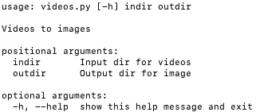

# 学习足够有用的 Python:arg parse

> 原文：<https://towardsdatascience.com/learn-enough-python-to-be-useful-argparse-e482e1764e05?source=collection_archive---------2----------------------->

## 如何在脚本中加入命令行参数

如果你计划成为一名 Python 软件开发人员，你会希望能够使用`argparse`来满足你的脚本需求。如果您是一名数据科学家，您可能会发现自己需要将 Jupyter 笔记本中的代码移植到可复制的脚本中。对于许多新的数据科学家来说，这可能是从一个舒适、快乐的地方向可怕的土地迈出的一步。本指南旨在让跳跃不那么可怕。


Like a mountain through the clouds, argparse brings arguments from the command line. 😏

`[argparse](https://docs.python.org/3/howto/argparse.html#id1)`是“Python 标准库中推荐的命令行解析模块”它是你用来把命令行参数放进你的程序的。

当我需要的时候，我找不到一个好的`argparse`介绍指南，所以我写了这篇文章。尽情享受吧！


Jupyter is great

## 超越朱庇特笔记本

我第一次在一个业余项目的 Python 脚本中看到`argparse`时，我想，“这是什么巫术？”并迅速将代码转移到 Jupyter 笔记本上。这一举措被证明是次优的。😦

我希望能够运行脚本，而不是一步一步地翻阅笔记本。带有`argparse`的脚本使用起来会简单得多，工作量也会少得多。不幸的是，我赶时间，没有找到容易掌握的文件。

从那以后，我开始理解并享受`argparse`。不可或缺。

以下是你需要知道的。

# 为什么要使用 argparse？

`*argparse*` *—* 解析参数。

使用`argparse`可以让程序的用户在运行时为变量提供值。它是程序作者和用户之间的一种交流方式。那个用户可能就是你未来的自己。😃

使用`argparse`意味着不需要进入代码并修改脚本。让用户能够输入命令行参数提供了灵活性。


Python is great, too!

# 例子

假设您有一个包含视频的目录，并希望使用 [OpenCV](https://opencv.org/) 库将这些视频转换成图像。您可以使用`argparse`让用户输入输入和输出目录。下面是你的 *videos.py* 文件的`argparse`部分的样子:

```
# videos.py
import argparseparser = argparse.ArgumentParser(description='Videos to images')
parser.add_argument('indir', type=str, help='Input dir for videos')
parser.add_argument('outdir', type=str, help='Output dir for image')args = parser.parse_args()print(args.indir)
```

这个文件导入了`argparse`库。然后，它创建一个带有描述的解析器对象。然后使用`parser.add_argument()`创建变量*间接*。变量的类型设置为 string，并提供一条帮助消息。然后对*输出*进行同样的操作。接下来 *args* 变量被设置为解析后的参数值。

现在，可以从命令行运行以下命令:

`python videos.py /videos /images`

注意，当您传递值`/videos`和`/images`时，不需要用引号将它们括起来。

`"/videos"`成为`args.indir`的值，`"/images"`成为`args.outdir`的值。

打印到终端的输出是`/videos`。

我们刚刚展示了您可以在程序中的任何地方使用`args.indir`变量。多酷啊。

您现在已经看到了 argparse 的魔力！


How do they do that?

# 关于 argparse 还应该知道什么？

## 位置参数

`parser.add_argument('indir', type=str, help='Input dir for videos')`创建了一个*位置自变量*。对于 Python 函数的位置参数，顺序很重要。从命令行传递的第一个值成为第一个位置参数。传递的第二个值成为第二个位置参数。

如果您排除这些位置参数并尝试运行`python videos.py`会发生什么？

您将得到一个错误:`videos.py: error: the following arguments are required: indir, outdir`。运行脚本的命令中总是需要传递位置参数。

## 可选参数

如果运行`python videos.py --help`会怎么样？

我们把有用的信息放进我们的脚本，告诉你需要做什么。



Output of `python videos.py --help`

太棒了。`help`是一个*可选参数*的例子。注意`--help`是你唯一免费得到的可选参数，但是你可以做更多。

可选参数的创建类似于位置参数，只是它们的名称开头有一个`'--'`双破折号(或者一个`'-'`单破折号和一个额外的字符用于短版本)。例如，您可以使用`parser.add_argument('-m', '--my_optional')`创建一个可选参数。

以下较大的示例显示了如何创建和引用可选参数。注意，在这个例子中，我们为整数指定了类型`int`。您还可以指定其他有效的 Python 变量类型。

```
# my_example.py
import argparseparser = argparse.ArgumentParser(description='My example explanation')parser.add_argument(
    '--my_optional',
    default=2,
    help='provide an integer (default: 2)'
)my_namespace = parser.parse_args()print(my_namespace.my_optional)
```

注意，用`'--my_optional'`指定的参数变成了这个不带破折号的命名空间变量:`'my_namespace.my_optional'`。

另请注意，可选参数可以有默认值。这里我们指定默认值为 2。运行`python my_example.py`输出 *2* 。

可选参数值可以在运行时从命令行设置，如下所示:`python my_example.py--my_optional=3`。然后程序输出 *3* 。


Integers

使用`argparse`，您可以做更多事情。例如，您可以使用`nargs='*’`将参数收集到列表中。您也可以使用`choices`检查数值范围。请参见`[argparse](https://docs.python.org/3/library/argparse.html)` [文档](https://docs.python.org/3/library/argparse.html)了解您能做的一切。

## 我还可以在什么时候使用 argparse？

您也可以将`argparse`用于 Docker 容器中运行的程序。如果您想在构建映像时向脚本传递命令行参数，可以使用 RUN。如果想在运行时向脚本传递参数，可以使用 CMD 或 ENTRYPOINT。在我的 Docker 系列中了解更多关于 Dockerfiles 的信息:

[](/learn-enough-docker-to-be-useful-b0b44222eef5) [## 学习足够的码头工人是有用的

### 第 3 部分:一打漂亮的 Dozen 文件指令

towardsdatascience.com](/learn-enough-docker-to-be-useful-b0b44222eef5) 

# 包装

现在你已经看到了`argparse`的基础。您已经看到了如何从命令行将位置参数和可选参数输入到程序中。您还看到了如何设置默认的可选参数。如果你想深入了解，请查阅[官方文件](https://docs.python.org/3/library/argparse.html)。

**更新 2019 年 3 月 6 日**我应该提一下，有很多包可以用来给你的程序添加命令行参数。读者在评论中提出了几个建议，其中最受欢迎的我在这里做了链接:

*   [点击](https://click.palletsprojects.com/en/7.x/)
*   [火](https://github.com/google/python-fire)
*   [docopt](https://github.com/docopt/docopt)


More mountains through the mist

这里还有一些建议可以帮助你走出 Jupyter 笔记本。

环境变量是在程序外部设置的有用变量。[这里有一个很好的，清晰的介绍](https://medium.com/chingu/an-introduction-to-environment-variables-and-how-to-use-them-f602f66d15fa)。[这篇来自 DataCamp 博客的文章](https://www.datacamp.com/community/blog/environment-variable-data-science)关注的是路径变量。

您可以使用 Jupyter 笔记本将 repos 转换为 Docker 图像，使用 [Repo2Docker](https://repo2docker.readthedocs.io/en/latest/) 。 [Will Koehrsen](https://medium.com/u/e2f299e30cb9?source=post_page-----e482e1764e05--------------------------------) 在这里写了一篇关于工具[的很好的指南。](/docker-without-the-hassle-b98447caedd8)

我计划写更多关于与文件系统和脚本交互的文章。跟着我，确保你不会错过他们！😃

我希望这篇介绍对你有用。如果你有，分享到你最喜欢的论坛和社交媒体上。不知道`argparse`的数据科学家和程序员会感谢你的！

我写关于数据科学、云计算和其他技术的东西。关注我，在这里阅读更多。

[](https://dataawesome.com)

感谢阅读！👏