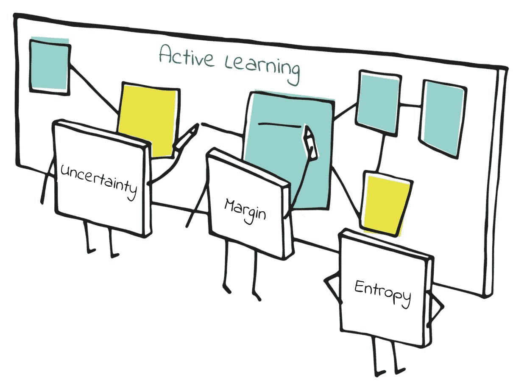
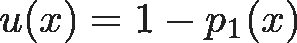
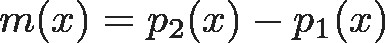
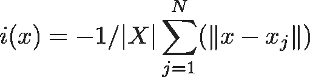
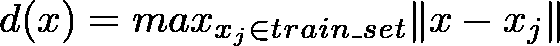
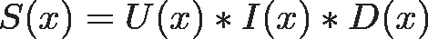
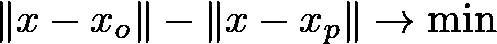
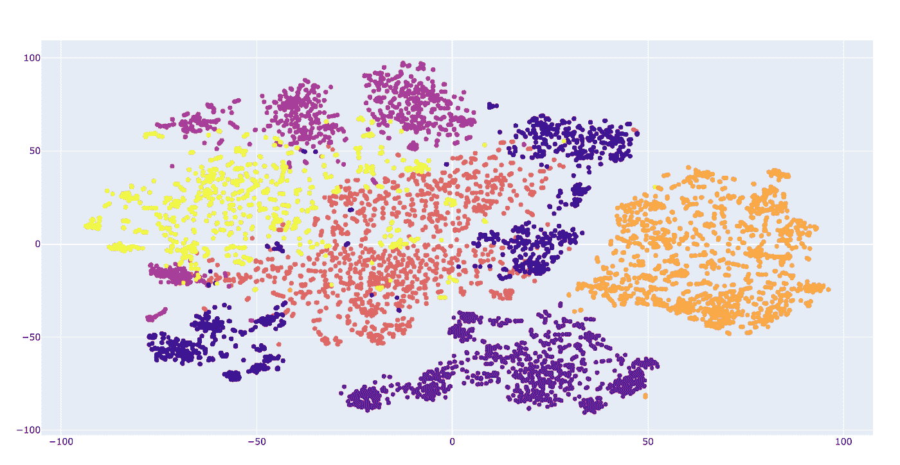
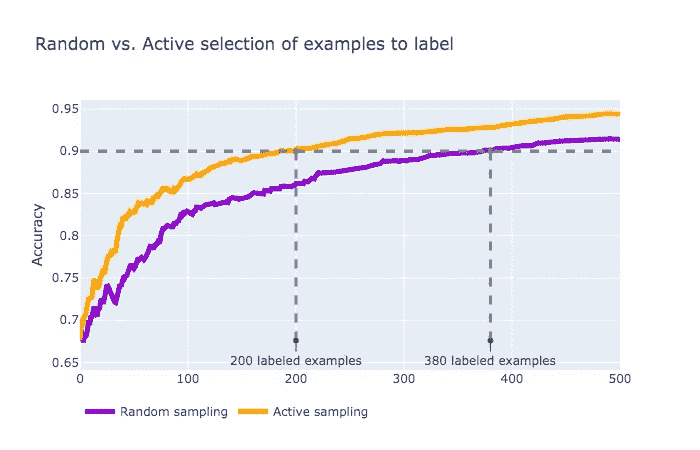
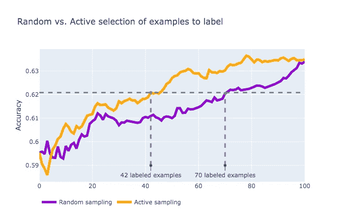

# 通过更智能的数据标签更快地学习

> 原文：<https://towardsdatascience.com/learn-faster-with-smarter-data-labeling-15d0272614c4?source=collection_archive---------8----------------------->

## 用不同的主动学习技术优化标记过程的发现

# **简介**

大量的深度学习工具使我们能够以令人难以置信的性能快速构建新的应用程序，从计算机视觉对照片上的复杂对象进行分类，到通过从文本中提取语义来理解自然语言。然而，所有这些方法的主要瓶颈是训练所有这些模型所需的大量数据，通常有数十万个训练示例。

如果您从零开始构建图像分类器，比方说，为了检测车道上的陈旧产品，您将需要几周或几个月的时间来收集和手动注释所有这些照片。幸运的是，有许多深度神经网络，已经在具有许多类的大型图像数据集上进行了预训练，并准备好用于缓解冷启动问题。*迁移学习*的核心思想是利用这些模型的输出，捕捉高级图像语义，作为解决目标任务的新分类器的输入。它大大减少了需要人工标注的数据量，从几十万到几千张图像。

然而，即使注释成千上万的例子也可能是昂贵的，尤其是如果每个注释任务都依赖于主题专家的知识。理想情况下，它将非常适合只标记几百个任务，并让深度学习机器在没有任何监督的情况下进行自我学习。这个问题也被称为*预算学习*:我们节约了花费在获取训练数据集上的钱，以建立所需性能的模型。另一个问题与概念漂移有关——当目标任务随时间变化(新产品进入检测机生产线)并且预测性能在没有人为干预的情况下下降。

# 更聪明地学习

那么，除了迁移学习所提供的，我们能进一步减少标记工作量吗？事实上，答案是肯定的，有一些技术是存在的。其中研究得最好的就是 [*主动学习*](http://burrsettles.com/pub/settles.activelearning.pdf) 。原则很简单:只标注对你当前模型有用的东西。形式上，主动学习算法可以概括为以下步骤:

1.  训练初始模型
2.  选择一个最有用的样本(一个模型不确定的样本，基于它的预测分类概率)
3.  标记此样本并将其添加到训练集中
4.  基于新训练集的再训练模型
5.  从步骤 2 开始重复

这种启发式方法对老派的机器学习模型(例如线性分类器，如逻辑回归、SVM 等)非常有效。)，但实证研究表明，它在深度学习环境中变得无效。另一个很少提到的缺点是，经典的主动学习需要在每个新的标记样本后重新训练模型，这是一个耗时的过程。

因此，总的来说，为了能够在没有任何标记数据的情况下，以最少的人力快速训练新的分类器，我们必须处理以下问题:

1.  利用由一些高质量的预训练模型产生的特征空间
2.  仅选择信息最丰富的样本，由人工注释者进行标记
3.  快速更新我们当前的机器学习状态

第一步在许多研究论文和评论中得到了很好的研究，甚至大型企业公司现在也分享他们预先训练的神经网络，可以非常容易地以 ***的方式插入到特征提取管道中。理想的起点是看[tensorflohub](https://tfhub.dev/)***

下一步是机器学习的微妙艺术。尽管样本的信息量背后的直觉是清楚的，但不清楚如何准确地计算它。因此，存在许多基于类别概率的不同度量***【p₁(x】******【p₂(x】***，…***【pᵢ(x】，*** …，按降序排序:

Uncertainty

Margin

Entropy

一旦我们发现了这种不明确的例子 ***x*** ，我们就有希望看到模型在经过重新训练后，在 ***x*** 的邻域内变得更加自信。但是如果 ***x*** 的邻域内没有项目呢？实际上，尽管这个例子具有模型不确定性，但它没有为我们提供足够的信息来加快模型收敛，所以我们必须从我们的搜索空间中排除这样的*异常值*。这可以通过最大化:

Informational Density

也叫*一个例子的信息密度*。通过最大化***【x】***，我们只挑选那些在我们的特征空间中被其他点密集包围的点。

不确定性测量与信息密度相结合，使我们能够挑选出优秀的代表点，并为模型提供新的知识。但是如果有两个模型不自信的代表点，你怎么选择一个呢？一种方法是选择与已经选择的例子最不相似的例子。最后一个成分信息指标是*多样性*:

这促进了尽可能多的选择不同的点。

要在一个评分函数中结合这三个指标，可以使用它们相应的累积分布函数(CDF)的乘积(否则，您应该处理不同标度的数字，甚至负数):

Scoring Function

其中每个大写字母函数表示 CDF，例如***U(x)= P(U<U(x))***

# **更快获得结果**

最后，我们选择了示例，并可以对其进行标记(有许多数据标记工具[可用。最后一步是训练模型。可能要等几个小时，直到模型完成重新训练过程，我们才能继续下一个样本。](https://github.com/heartexlabs/awesome-data-labeling)

那么如果我们根本不训练呢？听起来很疯狂，但是，如果您的特征空间存在，没有任何额外的参数需要学习，那么您可以依赖它产生的嵌入，并使用简单的度量标准，如欧几里德距离和余弦距离。这种技术被称为 k-最近邻分类器:对于任何样本，从最近邻的类(或从 k 个最近邻)中指定未知类。

尽管它很简单，但它是一种非常强大的方法，因为:

*   它支持立即“学习”新模型——实际上不执行任何学习，标记的示例只是存储在一些有效的数据结构中(除非您使用强力搜索)
*   它产生一个非线性模型
*   它可以很容易地扩展和部署，无需模型再培训——只需在运行模型中添加新的向量
*   如果像欧几里德这样简单的距离还不够，新的度量空间可以离线学习(参见[一些度量学习方法的概述](https://pdfs.semanticscholar.org/b1f7/9d796776839aa6ca15b8c552bae1de1029af.pdf)以及[少量学习](https://msiam.github.io/Few-Shot-Learning/)
*   它还提供了一些可解释性:当对一些未知的例子进行分类时，总是有可能调查是什么影响了这种预测(因为我们可以访问所有的训练集，这在只有学习参数的情况下是不可行的)

下面是它在实践中的样子:

有两类，紫色( *p* )和橙色( *o* )。在每一步，我们的选择方法试图尽最大努力获得最丰富的例子，并将其标记出来。正如你所看到的，模型总是试图在第一和第二类点之间挑选下一个样本，主要是因为最大化不确定性度量***【x】***导致最小化

T 什么导致边界探索(大约 ***X=0*** )在~30 的前几步。然后我们的主动选择方法试图潜入密集的点群，感谢信息密度。此外，由于多样性度量，它总是旨在探索不同的点，这是更好的方式:传统的主动学习只停留在一个边界上，可能会忽略不同的点群。

# **验证和结果**

为了验证这种主动采样方法，让我们在新鲜/腐烂水果图像的真实数据集[上运行一个实验。](https://www.kaggle.com/sriramr/fruits-fresh-and-rotten-for-classification)

水果有 3 类(苹果、香蕉、橘子)，每类都有新鲜和腐烂的图片曝光，所以一共 6 类。数据集的 90%被保留用于训练目的，其余的用于测试。为了减少统计误差，使用 K=16 的 K 倍交叉验证，然后对测试误差进行平均。

我们将[*MobileNet-v2*](https://tfhub.dev/google/imagenet/mobilenet_v2_035_128/feature_vector/3)*神经网络的 1280 维输出作为特征空间的嵌入，度量空间采用余弦距离。以下是关于嵌入式数据集外观的一些见解*

**

*您可以看到有一些云团，因此除了不确定性之外，我们还可以通过使用额外的信息含量指标来获益。*

**

*此处描述了平均模型性能与标记示例数量的关系。正如我们所看到的，与随机选择点进行标记的策略相比，主动采样策略达到 90%的准确率所需的标记任务几乎减少了两倍。*

*另一个实验是在文本数据上进行的，这些数据取自 sensition 140[数据集](http://help.sentiment140.com/for-students)。这项任务包括将推文分为积极/消极情绪。出于实验目的，我们随机采样 20k 个点，并对上面的新鲜/腐烂水果图像进行相同的实验。作为特征提取器，[通用语句编码器](https://tfhub.dev/google/universal-sentence-encoder/2)为每条推文生成 512 维嵌入。*

**

*类似地，这里是模型如何执行标记步骤，比较主动和随机选择策略。同样，主动选择应该收敛得更快，尽管绝对性能较低(只有 62%的精度，当使用完整数据集时，70%是最佳精度)。*

# ***总结***

*   *当标记过程是构建下一个机器学习项目的瓶颈时，使用主动学习来最小化标记任务的数量*
*   *使用预先训练的深度神经网络的输出，将您的任务从原始数据(图像、文本)转换为矢量(嵌入)*
*   *应用信息性度量的组合来挑选下一个训练样本，以减少模型的不确定性，促进代表性和多样性*
*   *当您想要进行即时训练和快速透明的预测时，请选择 k-NN 作为您的分类器*
*   *将您在每个步骤中的主动学习结果与维持数据集上的统一采样策略进行比较，以了解性能如何随挑选步骤而变化，以及如何节省您的标注预算*