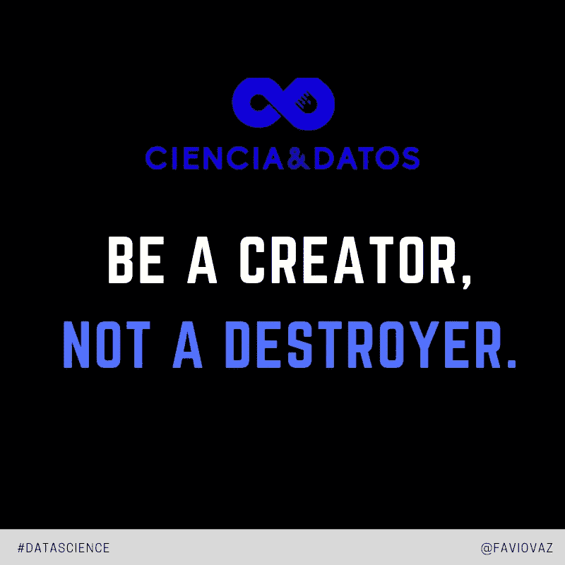

# 学会如何倾听

> 原文：<https://towardsdatascience.com/learn-how-to-listen-edaea38fb276?source=collection_archive---------15----------------------->

## 作为一名数据科学家最难的部分之一。

当你开始学习数据科学(DS)课程和 MOOCs 时，他们没有告诉你的一件事是，你的大量时间(一千多)将花在会议上。

这些会议很重要。非常重要。在那里你可以了解业务，该领域的目标，他们的 KPI，以及他们希望你做的工作的要求。

# 倾听。最难的部分。

有时候倾听很难。你可能会听到一些你不想听到的事情，或者你所有的信念都动摇了。

因此，学会倾听是一项需要日积月累的技能。通常在工作会议中，会有许多不同的观点，与其总是试图将你的观点强加于人，不如努力达成一致，并找到解决问题的更通用的解决方案。

这里要小心，这并不意味着如果你是对的，并且你有办法证明它，你就应该呆在那里，同意任何事情。思想精英的概念在这里很重要。每个人都有自己的观点，一个比另一个更好，能够辨别并找到问题的最佳解决方案是可能的。在这里，您可以看到一个很棒的视频，它以一种更加图形化的方式解释了这一点:

如果你想在 DS 中增加价值和改进流程，倾听和理解是至关重要的。因此，我在这里提到了我在这些会议中如何倾听和表现的一些经验教训:

# 谦虚一点

Observe and understand

> 是的，你可能认为你知道很多，或者人们以前创建的一些模型，因为没有使用“深度学习”，是不够的。但那不是办法。
> 
> 倾听他们所说的，理解他们创造模型和解决方案的心理过程。不要低估，或者说“是的，你们做的事情又老又奇怪，等我的吧”。

[https://twitter.com/faviovaz](https://twitter.com/faviovaz)

# 认真听，像真的一样。

Stone cold listening

> 不要只是盯着演示文稿，或人们的脸，你的手机或其他任何东西。利用这 30-45 分钟来开一个富有成效的会议，集中注意力。需要就做笔记，但是要注意，这是他们应得的。

# **到场**

Be active.

> 这意味着，问问题，对他们说的和做的事情感兴趣。建设，不要破坏。

# 将想法转化为恰当的问题

> 一名优秀的数据科学家需要将问题和想法转化为适定的问题，我指的是在数据科学过程中有解决方案的问题。

 [## 创建 ROI 驱动的数据科学实践的敏捷框架

### 数据科学是一个令人惊叹的研究领域，学术界和工业界都在积极发展…

www .商业科学. io](https://www.business-science.io/business/2018/08/21/agile-business-science-problem-framework.html) 

> 如果找不到一个可行的路径来解决这个问题，最终将解决这个问题，那么有两个选择，回去继续问问题，或者这个问题不能用数据科学来解决。

你可以问一些有助于澄清某些会议气氛的问题:

1.  这个模型是什么时候创建的，你用什么数据建立的？
2.  模型的限制是什么，你创建模型的假设是什么？
3.  您使用了哪些语言或框架来构建模型？
4.  您是否有创建模型的完整过程文档？
5.  模特表现如何？你对数据科学团队有什么需求？
6.  有多少人参与了这个项目？
7.  你为什么走这条路？你考虑的还多吗？
8.  这个变量从何而来？
9.  你能和我们分享一下这个项目的技术细节吗？
10.  项目的范围是什么？
11.  你提议的项目时间表是什么？
12.  你对项目的目标有多灵活？
13.  你为什么认为这是一个数据科学项目？
14.  项目的优先级是什么？

# 玩得开心！

> 这是你闪光和帮助的时候了！

感谢阅读。如果您有任何建议或其他推荐，请分享:)