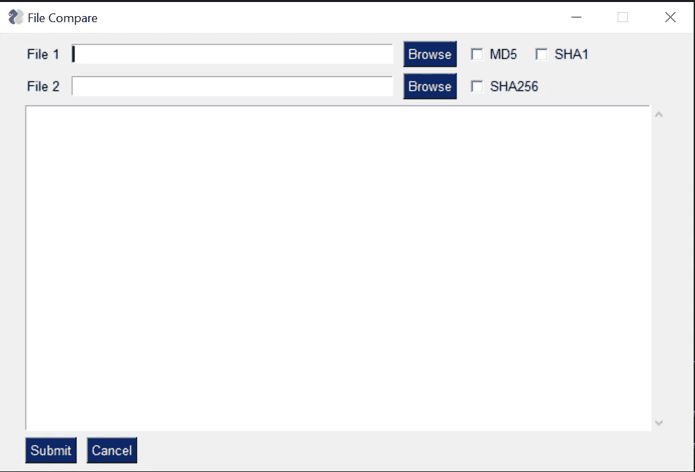
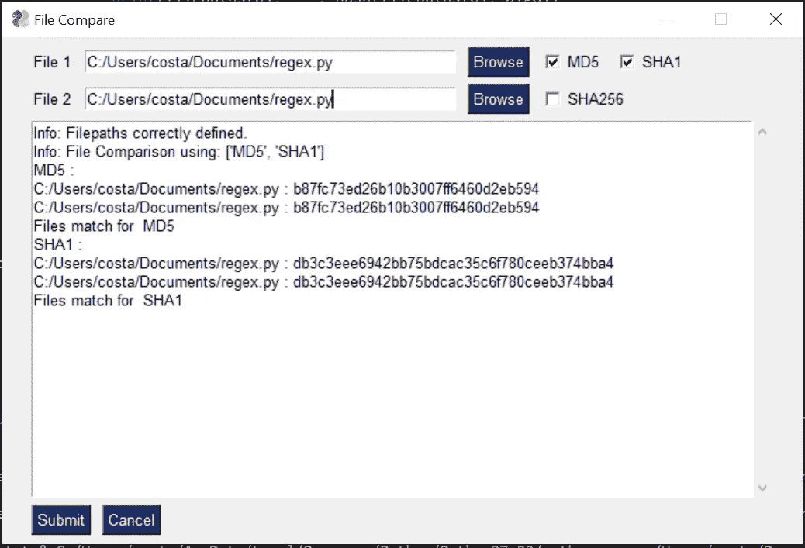

# 了解如何用 Python 快速创建 ui

> 原文：<https://towardsdatascience.com/learn-how-to-quickly-create-uis-in-python-a97ae1394d5?source=collection_archive---------2----------------------->

## 最后，你可以在 5 分钟内找到一个图书馆


Photo by [Eftakher Alam](https://unsplash.com/@easiblu?utm_source=medium&utm_medium=referral) on [Unsplash](https://unsplash.com?utm_source=medium&utm_medium=referral)

python 的最大优势是易用性和丰富的库。通过几行代码，没有什么是你做不到的。只要您的 python 脚本是供个人使用的，或者您的目标受众具有足够的技术水平，您就永远不必考虑用户界面(UI)。

然而，有时候你的目标受众不够专业。他们很乐意使用你的 python 脚本，但前提是他们不用看任何一行代码。在这种情况下，提供命令行脚本是不够的。理想情况下，你需要为他们提供一个用户界面。虽然如果你有典型的*桌面客户端*对*基于网络的* UI 的争论，我不会感到惊讶，但是在这篇博文中，我们的目标是专门使用 Python。

# 可供用户界面使用的 Python 库

本质上有 3 个大的 Python UI 库；Tkinter，wxPython 和 PyQT。在回顾这三个库的时候，我意识到我喜欢的 Python 的所有东西在使用这些库的时候都找不到。总的来说，Python 库在抽象掉超级技术*方面做得非常好。如果我需要使用面向对象编程，我还不如加载 Java 或. Net。*

然而，令我非常高兴的是，我遇到了第四个选项，似乎迎合了我的喜好。我开始审查并最终选择从中创建 Python UIs 的库叫做 PySimpleGUI。有趣的是，这个库使用了所有 3 个流行的库，但是抽象掉了超级技术。

事不宜迟，让我们通过同时解决一个实际问题来深入研究这个库。

# 检查两个文件是否相同

使用我以前的文章 ***3 种在 Python 中比较数据的快速方法，*** 我们可以使用第一部分，*检查数据的完整性*来尝试构建一个 UI。

[](https://medium.com/financeexplained/3-quick-ways-to-compare-data-in-python-65201be10b6) [## 在 Python 中比较数据的 3 种快速方法

### 对于任何从事分析工作的人来说，收到比较数据的请求都太熟悉了。不管那是…

medium.com](https://medium.com/financeexplained/3-quick-ways-to-compare-data-in-python-65201be10b6) 

我们本质上需要一种方法来加载两个文件，然后选择我们想要使用的加密来进行文件比较。

## 编写用户界面代码

要构建该 UI，我们可以使用以下代码:

```
import PySimpleGUI as sg
layout = [
    [sg.Text('File 1'), sg.InputText(), sg.FileBrowse(),
     sg.Checkbox('MD5'), sg.Checkbox('SHA1')
     ],
    [sg.Text('File 2'), sg.InputText(), sg.FileBrowse(),
     sg.Checkbox('SHA256')
     ],
    [sg.Output(size=(88, 20))],
    [sg.Submit(), sg.Cancel()]
]
window = sg.Window('File Compare', layout)
while True:                             # The Event Loop
    event, values = window.read()
    # print(event, values) #debug
    if event in (None, 'Exit', 'Cancel'):
        break
```

这导致:



Simply Python UI, generated by the above code

## 插入逻辑

有了 UI，就很容易看到如何插入其余的代码。我们只需要监视用户输入的内容，然后采取相应的行动。我们可以很容易地做到这一点，用下面的代码。

```
import PySimpleGUI as sg
import re
import hashlibdef hash(fname, algo):
    if algo == 'MD5':
        hash = hashlib.md5()
    elif algo == 'SHA1':
        hash = hashlib.sha1()
    elif algo == 'SHA256':
        hash = hashlib.sha256()
    with open(fname) as handle: #opening the file one line at a time for memory considerations
        for line in handle:
            hash.update(line.encode(encoding = 'utf-8'))
    return(hash.hexdigest())layout = [
    [sg.Text('File 1'), sg.InputText(), sg.FileBrowse(),
     sg.Checkbox('MD5'), sg.Checkbox('SHA1')
     ],
    [sg.Text('File 2'), sg.InputText(), sg.FileBrowse(),
     sg.Checkbox('SHA256')
     ],
    [sg.Output(size=(88, 20))],
    [sg.Submit(), sg.Cancel()]
]window = sg.Window('File Compare', layout)while True:                             # The Event Loop
    event, values = window.read()
    # print(event, values) #debug
    if event in (None, 'Exit', 'Cancel'):
        break
    if event == 'Submit':
        file1 = file2 = isitago = None
        # print(values[0],values[3])
        if values[0] and values[3]:
            file1 = re.findall('.+:\/.+\.+.', values[0])
            file2 = re.findall('.+:\/.+\.+.', values[3])
            isitago = 1
            if not file1 and file1 is not None:
                print('Error: File 1 path not valid.')
                isitago = 0
            elif not file2 and file2 is not None:
                print('Error: File 2 path not valid.')
                isitago = 0
            elif values[1] is not True and values[2] is not True and values[4] is not True:
                print('Error: Choose at least one type of Encryption Algorithm')
            elif isitago == 1:
                print('Info: Filepaths correctly defined.')
                algos = [] #algos to compare
                if values[1] == True: algos.append('MD5')
                if values[2] == True: algos.append('SHA1')
                if values[4] == True: algos.append('SHA256')
                filepaths = [] #files
                filepaths.append(values[0])
                filepaths.append(values[3])
                print('Info: File Comparison using:', algos)
                for algo in algos:
                    print(algo, ':')
                    print(filepaths[0], ':', hash(filepaths[0], algo))
                    print(filepaths[1], ':', hash(filepaths[1], algo))
                    if hash(filepaths[0],algo) == hash(filepaths[1],algo):
                        print('Files match for ', algo)
                    else:
                        print('Files do NOT match for ', algo)
        else:
            print('Please choose 2 files.')window.close()
```

运行上述代码将会产生以下结果:



# 结束语

虽然这个库不是最好看的 ui，但是它允许你快速地创建简单的 python UIs，并与你需要的任何人分享。更重要的是，这样做所需的代码非常简单，可读性很强。您仍然会有必须运行代码来获得 UI 的问题，这可能会使共享有点困难，但是您可以考虑使用 PyInstaller 之类的东西，它会将您的 python 脚本转换为人们只需双击即可的. exe。

在你离开之前，如果你喜欢这篇博客，并且想看看如何构建更复杂的用户界面，请查看:

[](https://link.medium.com/qEZnbhQQc6) [## 构建 Python UI 以保持库的最新状态

### 就在几天前，我试图通过使用最近引入的功能来解决我的一个问题

link.medium.com](https://link.medium.com/qEZnbhQQc6) [](/building-a-python-ui-for-comparing-data-13c10693d9e4) [## 构建用于比较数据的 Python UI

### 如何快速让您的非技术团队能够比较数据

towardsdatascience.com](/building-a-python-ui-for-comparing-data-13c10693d9e4)