# 用鸡饭学习机器学习和计算机视觉

> 原文：<https://towardsdatascience.com/learn-machine-learning-and-computer-vision-using-chicken-rice-9416bf61efad?source=collection_archive---------17----------------------->

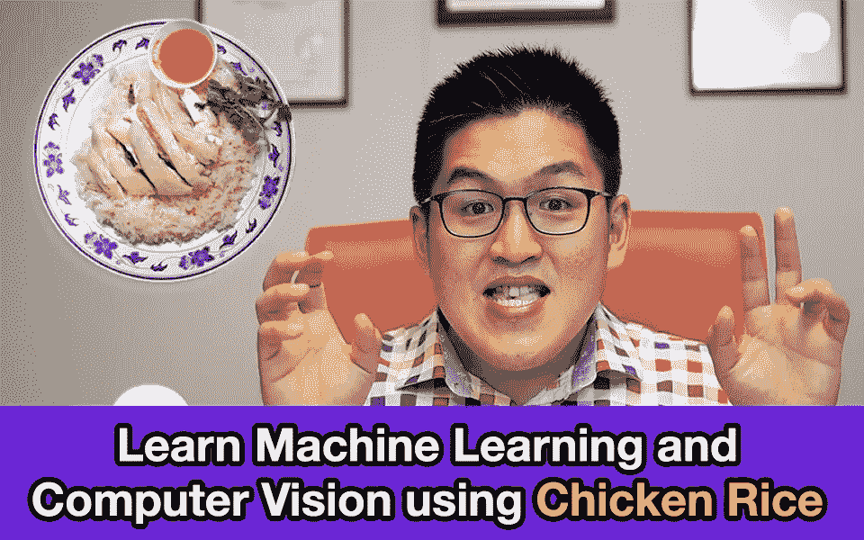

我在最近的 PechaKucha 上就“如何在人工智能取代你之前取代它”发表了演讲。为了展示我们今天拥有的机器学习算法有多智能，我举了一个例子，我们可以很容易地训练一个机器学习模型来区分不同类型的鸡饭(一种典型的马来西亚/新加坡人最喜欢的美食)。

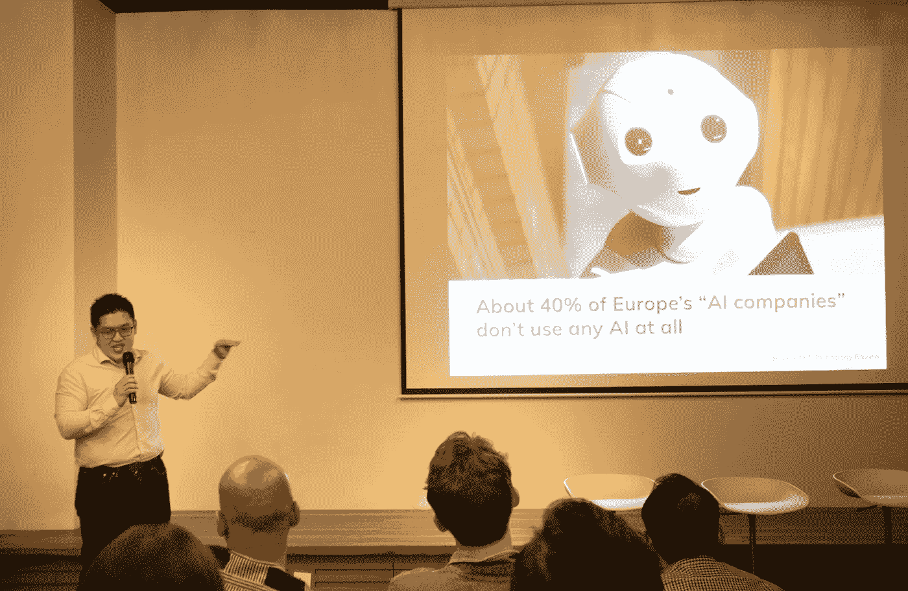

许多参与者在活动结束后立即联系我，并问了类似这样的问题:

*   *那是真的吗？真的可以训练机器模型识别鸡饭吗？*
*   *除了鸡饭，我还能把它用于其他用例吗？*
*   *图像的机器学习是如何工作的？*

这就是本教程的背景。我将一步一步地向你展示如何训练一个机器学习模型，使用计算机视觉来识别鸡饭。在此之前，我们需要以下物品:

*   一组鸡饭图像
*   地面实况(标注*烤*和*蒸*类)
*   一个谷歌云平台，GCP 帐户(为我们使用谷歌汽车视觉云服务。)

最初的想法来自[这篇博文](https://blog.usejournal.com/i-made-a-machine-learning-chicken-rice-classifier-in-4-hours-to-tell-me-what-type-of-chicken-rice-e9b1af4aa069)。

我将尽可能地遵循他的方法，并添加额外的提示，让你更容易理解。我包括了一些细节，比如 scrapper 和带标签的训练数据，以使工作具有可重复性，这样你就可以自己尝试了。

我相信由于 Instagram 的限制，我不能将标记的训练数据与图片分享。但是您可以从这里的[文件](https://docs.google.com/spreadsheets/d/1HVwugy5UrU5X9M3eNbJ7c2ZZordNymaKUHjts8bon30/edit?usp=sharing)中获得文件名及其相应的类。

观看上面的整个教程。更喜欢看书？下面继续就好。

# O.S.E.M.N 框架

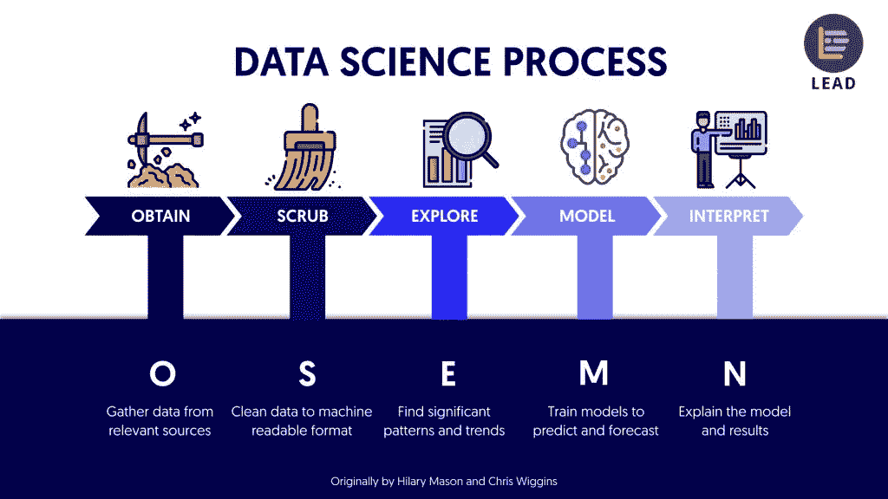

让我们遵循 5 步 [OSEMN 框架](https://www.thelead.io/data-science/5-steps-to-a-data-science-project-lifecycle)来指导我们完成这个过程。

OSEMN 框架旨在帮助我们在不同阶段关注并优先考虑正确的数据科学任务。

## 步骤 1:获取数据

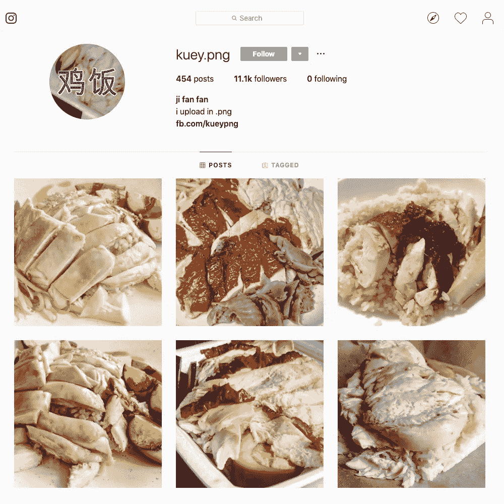

我们将需要找到*鸡饭*图像作为我们的训练数据集。

对我们来说幸运的是，有一个新加坡人每天都吃鸡饭*(在写作时连续 454 天)*，并把它的照片发布到他的 Instagram 账户 [@kuey.png](https://www.instagram.com/kuey.png/?hl=en) 。

Kuey Png 在闽南语中的字面意思是鸡饭。

然后你可以使用[刮刀](https://github.com/rarcega/instagram-scraper)将所有图像下载到你的本地电脑。我用的是 https://github.com/rarcega/instagram-scraper 的 Python 版本。不要忘记在最后加上`-u <username> and -p <password>`(我已经镶嵌的部分)。

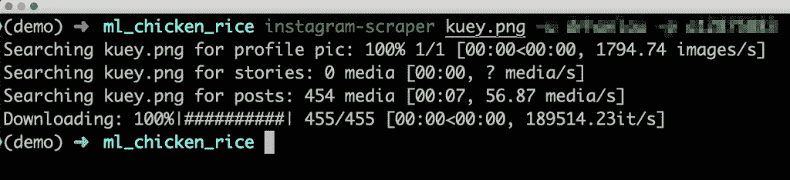

## 步骤 2:擦除数据

数据永远不会变得清晰，即使是在这样一个有这么多精心拍摄的照片的集中数据集中。虽然大多数照片都不错，但你会遇到像下面这样的照片——事实上，不难看出这是一包蒸鸡饭。

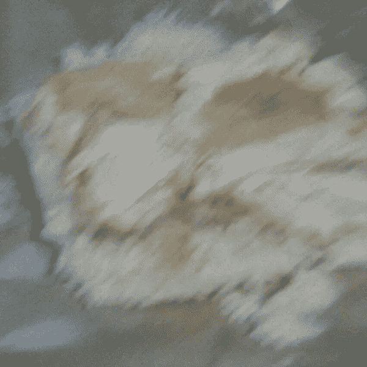

He was probably too hungry to take a good picture

真正的挑战来自特殊情况，我们不得不从训练集中排除以下图像，因为我们的专家无法得出结论。

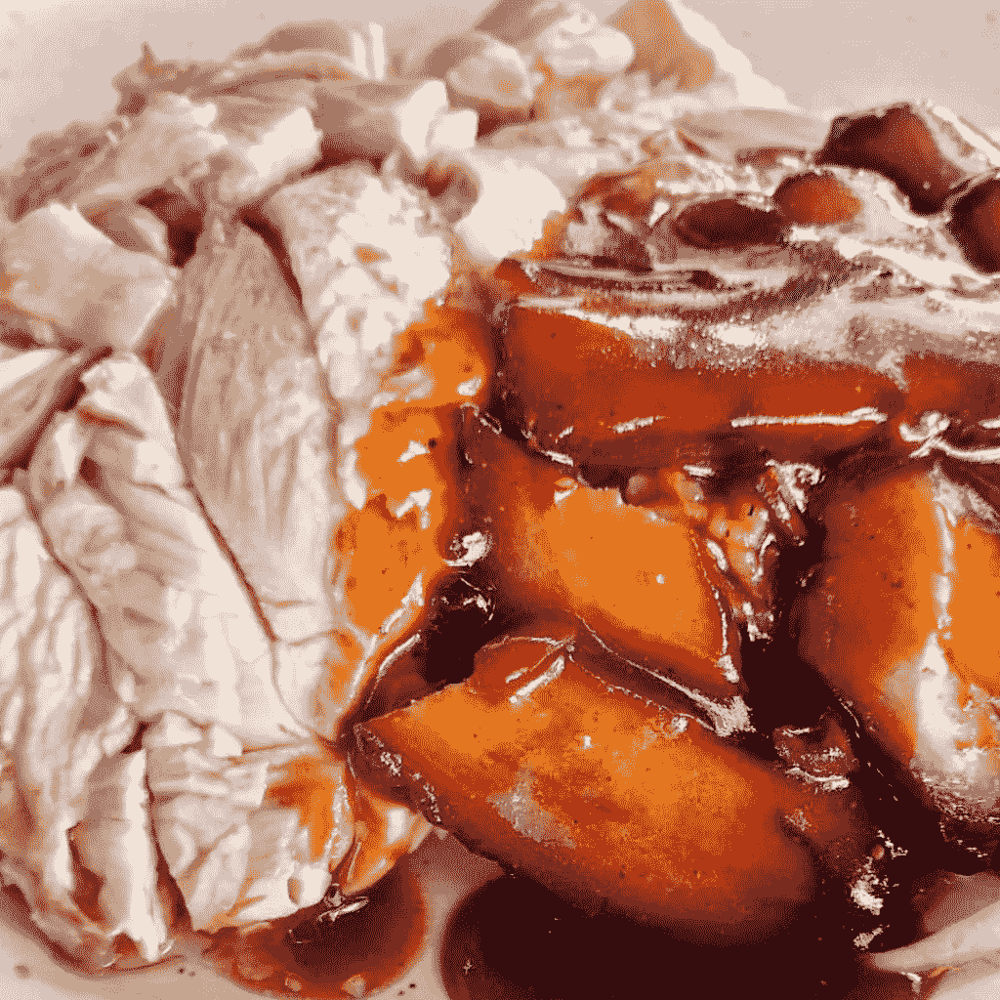

steamed chicken rice mixed with char siew (bbq pork)

我们也排除 7 张*扒鸡*(另一种烧鸡方式)的照片。因为它们既不是蒸鸡也不是烤鸡。此外，我们没有足够的训练图像来将其分类为单独的类别。

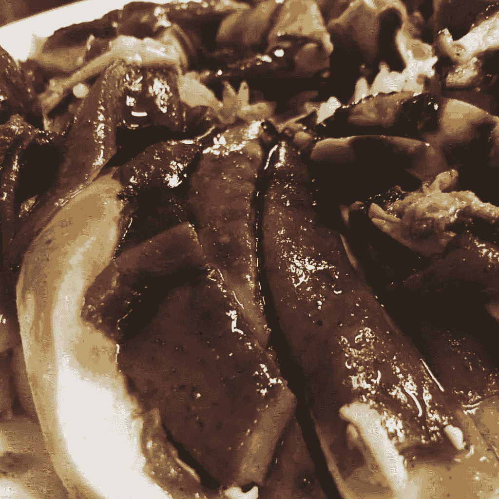

## 步骤 3:浏览数据

在我们探索我们的数据之前，我们将需要标记图像并创建**地面真相**。在数据科学项目中，术语“基础事实”指的是收集适当的客观数据的过程。

在图像分类任务中，地面真实指的是我们手动标记的训练分类，用于监督学习。

根据基准，我们从我们的团队中聘请了 3 个人作为专家，他们对鸡饭类型有足够的了解来标记这些图像。只有当三位专家一致同意标签时，我们才会使用图片。

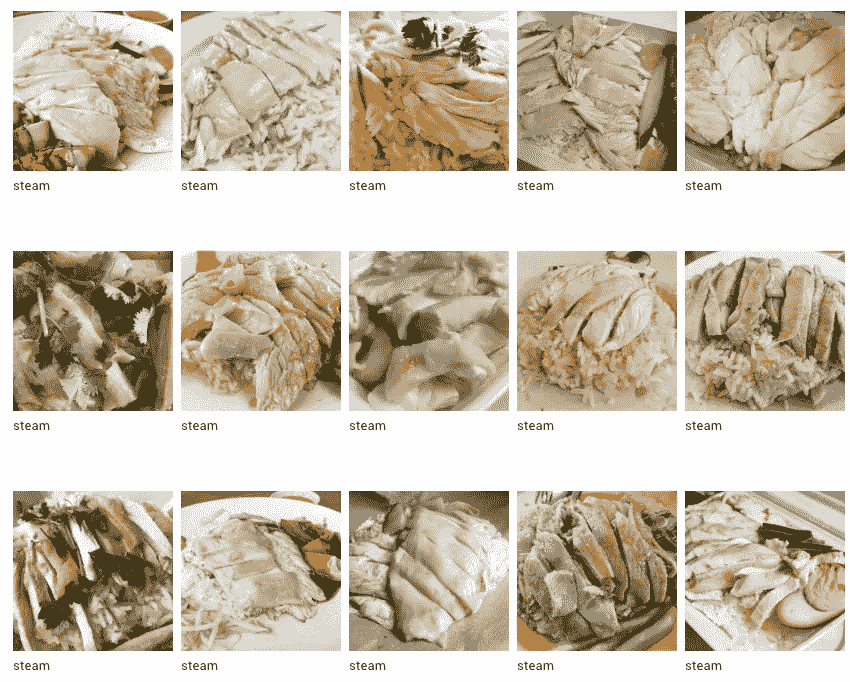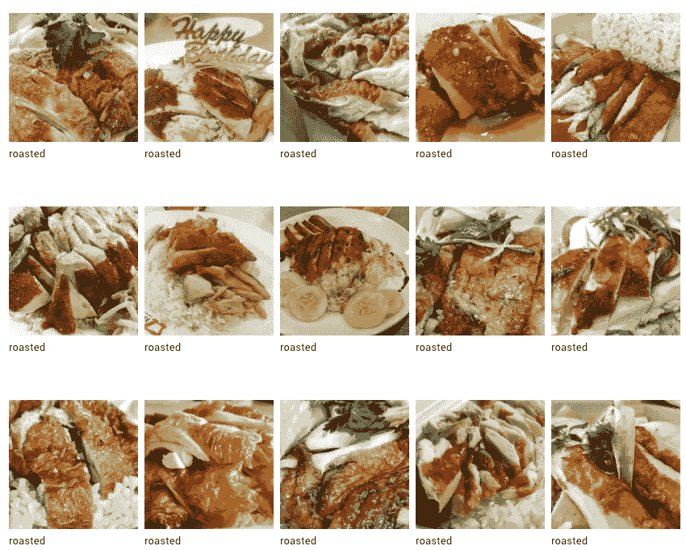

He obviously preferred roasted chicken (but I don’t judge).

在标记过程之后，我们的训练数据包含 447 个训练图像。我们将 285 张图片标注为*烤鸡* (63%)，162 张图片标注为*蒸鸡* (37%)。

贴标签的人无法达成共识的图片被丢弃，同时被丢弃的还有焖鸡的图片。以后训练图像多了，我们可能会把*【扒鸡】*作为另一类加入。

## 步骤 4:模型数据

如果你读到这里，这是你一直在等待的部分。建模阶段。

我将向你展示我是如何使用谷歌自动视觉的具体步骤。首先，你需要建立一个谷歌云账户。

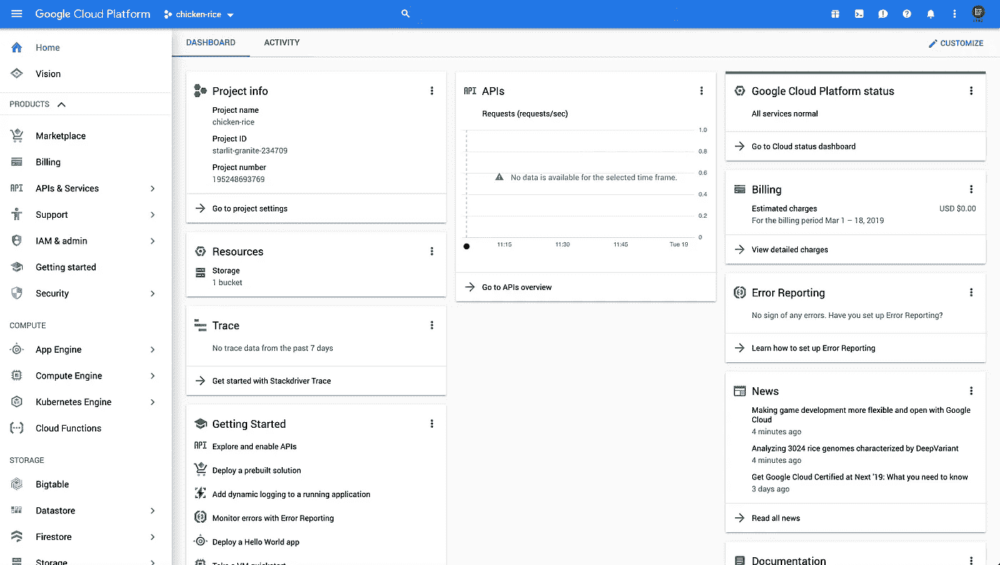

Google Cloud Dashboard

创建一个新项目，从左侧菜单栏中选择 *Vision* at，点击*getting started with AutoML*创建一个自定义模型。相应地设置*计费信息*。

不要担心被收取你的信用卡资料，谷歌承诺，他们会在收取你的信用卡费用前征求你的许可。然后，点击“*立即设置*，等待该过程完成。

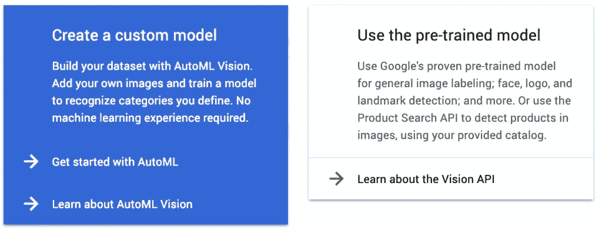

然后，单击“*创建数据集*创建一个新的数据集来存储我们的鸡饭图像。选择“*稍后导入图片*，因为我们会自己上传两批鸡饭图片，选择“*启用多标签分类”。*

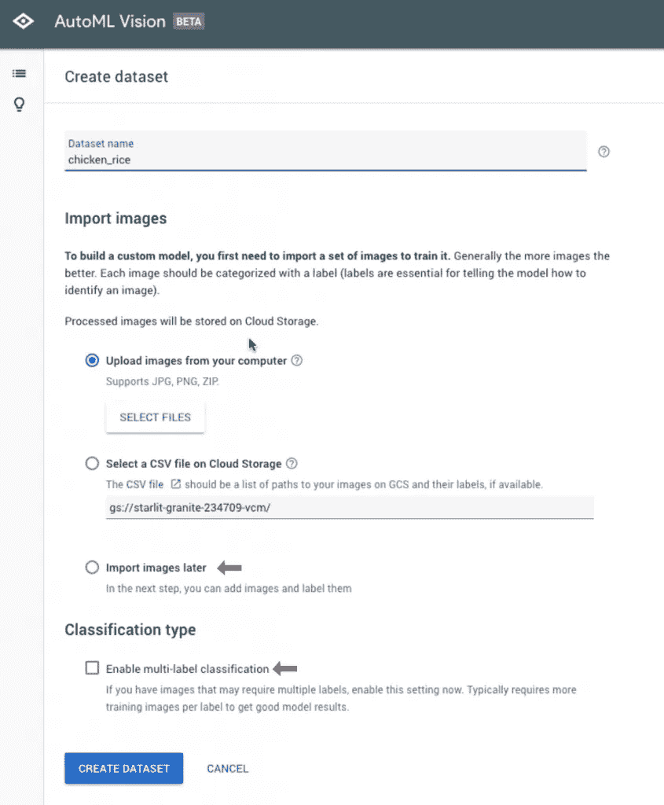

在上传图片之前，我们先创建两个标签，分别是:*和 ***烤*** *。*点击*添加图像*，将我们的训练图像上传至 AutoML Vision。*

*之后上传烤鸡的图片。确保为图像标记“*烘焙”*，如下图所示。对蒸鸡图像也重复同样的过程。*

*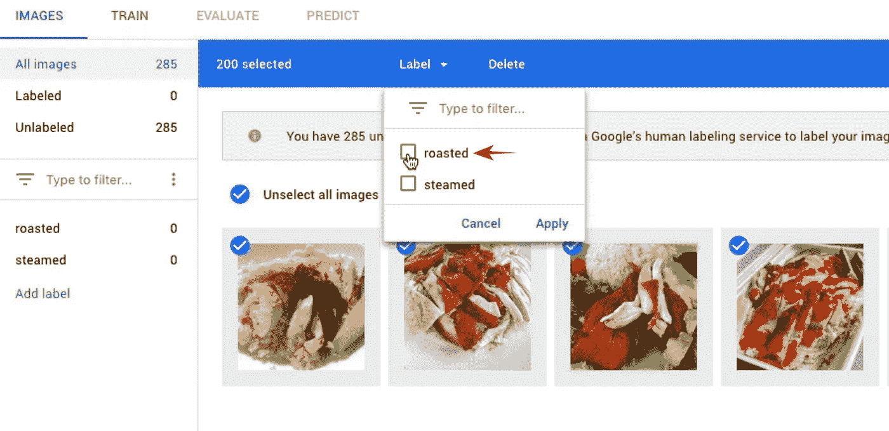*

*一旦我们上传并标记了训练数据，我们就可以开始训练模型了。AutoML vision 要求每个标签至少有 100 张图像。*

*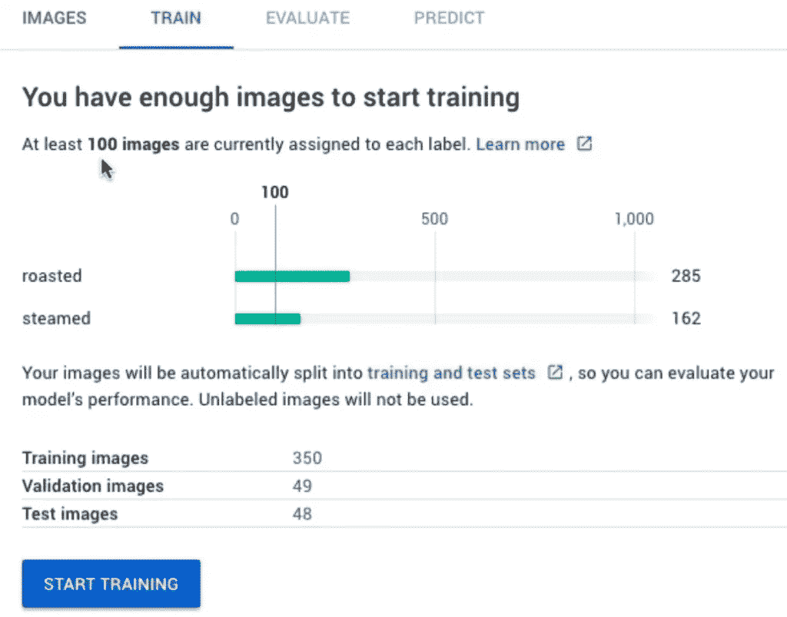*

*因此，当我们有更多的训练数据时，我们只能包括扒鸡图像(保持良好的工作，先生)。点击“*开始训练*，等待大约 15-20 分钟来建立我们的模型。培训过程完成后，您将收到一封电子邮件通知。*

## *步骤 5:解释模型*

*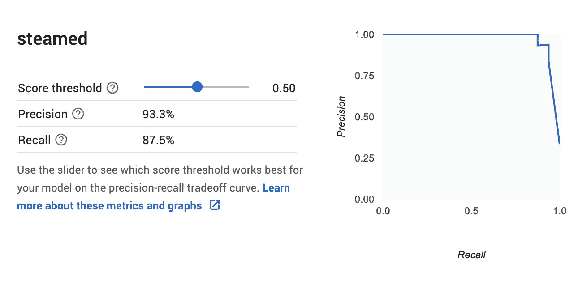*

*Precision recall evaluation for “*steamed*” class*

*AutoML 简化了许多建模任务，甚至简化了数据科学家需要几个小时才能完成的评估。点击“*查看完整评测*”来看看我们这款车型的性能吧。(请注意，在构建模型时，您的结果可能会有所不同)。*

*我们通常在分类任务中使用的指标是**精度**和**召回**。*

*例如，如果我们查看蒸鸡类，Precision 测量预测能力，即我们的模型检测到多少蒸鸡图像是正确的。回忆然后测量检索所有蒸鸡图像的能力。*

*有一个滑块，我们可以调整分数阈值。换句话说，如果我们将阈值设置为 0.00，我们的召回率将是 100%(因为我们可以说每个图像都是“蒸过的”，我们不会错过任何图像)，但精度将非常差。*

*一旦你完成了性能评估，我们就可以进入有趣的部分，使用我们的模型来预测未知的鸡饭图像。*

*你可以自己拍一张鸡饭的照片或者只去 Google images 找一些图片。这些是我在预测测试中使用的图片。*

*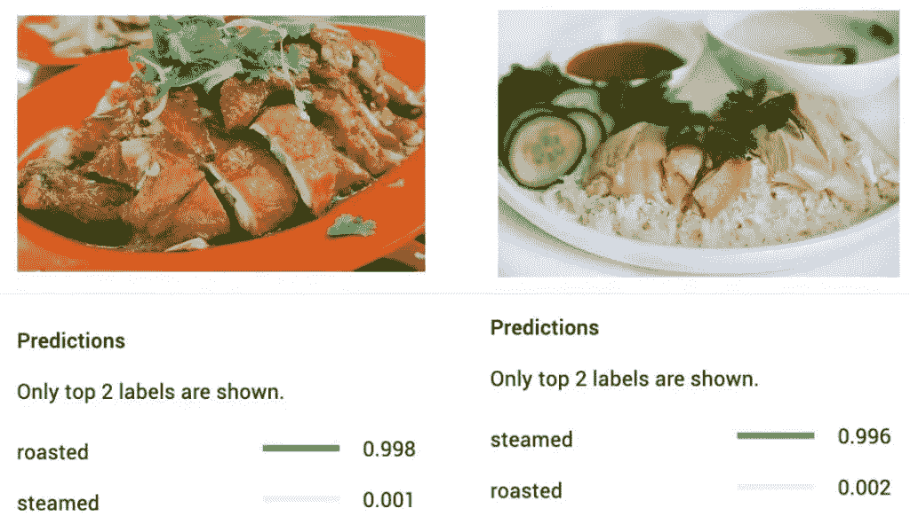*

*结果是相当惊人的*和准确的，*对吗？*

# *结论——接下来是什么？*

*虽然这是一个简单的例子，但它是一个每个人都能很容易联系起来的例子。我已经向你展示了我们建立一个基于计算机视觉的机器学习模型是多么简单。*

*实际上，我们需要更好地了解特征本身，以及如何根据纹理、颜色分布、线条和边缘特征选择好的图像用作训练集。对于没有技术背景并且希望通过构建机器学习模型来学习的人来说，AutoML vision 绝对是一个很好的起点。*

*自己尝试一下，如果你能做到，请在下面的评论区告诉我！此外，如果你觉得这个教程有用，一定要和一个正在学习机器学习和计算机视觉的朋友分享。*

**最初发表于*[*www . the lead . io*](https://www.thelead.io/data-science/learn-machine-learning-and-computer-vision-using-chicken-rice)*。**