# 10 分钟学会元流——网飞的数据科学 Python/R 框架

> 原文：<https://towardsdatascience.com/learn-metaflow-in-10-mins-netflixs-python-r-framework-for-data-scientists-2ef124c716e4?source=collection_archive---------2----------------------->

## 花更多时间建模，花更少时间管理基础架构。实践教程。

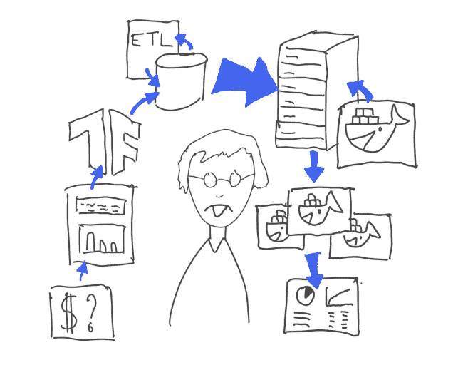

> 上周在 AWS re:Invent 上，网飞开源了一个用于构建和管理数据科学项目的本土框架——Metaflow。在过去的两年中，它在内部数据科学团队中得到了快速采用，使许多项目加快了生产时间。

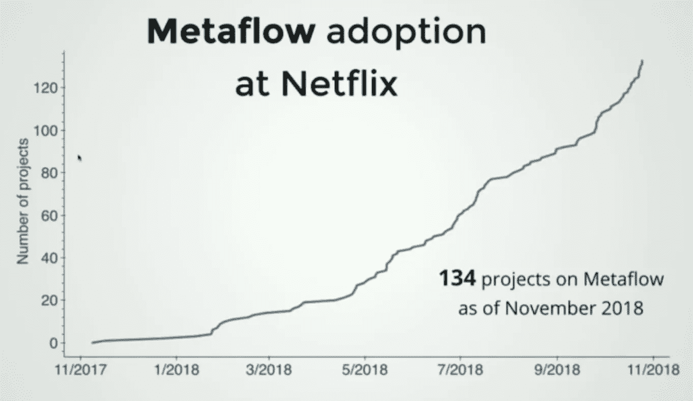

Metaflow adoption at Netflix

# 什么是元流？

Metaflow 是一个用于创建和执行数据科学工作流的框架，配备了内置功能来:

*   管理计算资源，
*   执行集装箱化运行，
*   管理外部依赖关系，
*   版本、重放和恢复工作流运行，
*   用于检查过去运行情况的客户端 API 适用于笔记本电脑，
*   在本地(例如在笔记本电脑上)和远程(在云上)执行模式之间来回切换

> 元流在内容寻址的数据存储中自动对代码、数据和依赖项进行快照，虽然本地文件系统也受支持，但通常由 S3 提供支持。这使您可以恢复工作流程，重现过去的结果，并检查有关工作流程的任何内容，例如在笔记本中。
> 
> — [在 Ycombinator 上的虚拟世界](https://news.ycombinator.com/user?id=vtuulos)

基本上，它旨在通过让数据科学家专注于实际的数据科学工作，并通过促进他们的可交付成果的更快生产，来提高他们的生产力。

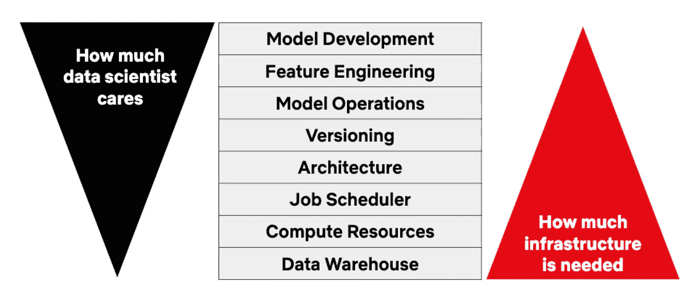

Actual Data Science vs Infrastructure Concerns

# 元流使日常场景成为可能

*   **协作:**你想帮助另一位数据科学家调试一个错误。你希望你能在你的笔记本电脑上调出他的失败运行状态。
*   **恢复运行:**运行失败(或被故意停止)。您修复了代码中的错误。您希望可以从失败/停止的地方重新启动工作流。
*   **混合运行:**您想要在本地运行工作流的一个步骤*(可能是数据加载步骤，因为数据集在您的下载文件夹中)*但是想要在云上运行另一个计算密集型步骤(*模型训练*)。
*   **检查运行元数据:**三位数据科学家一直在调整超参数，以便在同一模型上获得更好的准确性。现在，您希望分析他们的所有训练运行，并选择性能最佳的超参数集。
*   **同一个包的多个版本:**您希望在您的项目中使用多个版本的`sklearn`库——0.20 用于预处理步骤，0.22 用于建模。

# 那么，一个典型的元(工作)流是什么样子的呢？

## 概念地

> 元流工作流在本质上是**[**Dag(有向无环图)**](https://en.wikipedia.org/wiki/Directed_acyclic_graph)—简单来说就是下面的图片。图中的每个节点代表工作流中的一个处理步骤。**

****

**A linear acyclic graph**

**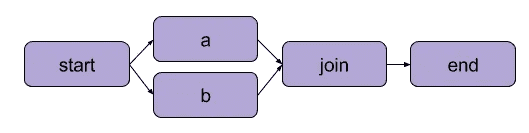**

**A branched acyclic graph**

> **Metaflow 在工作流**的每个步骤中执行惯用的 python 代码，这些代码在单独的容器中与相应的依赖项打包在一起。****

**Metaflow 架构中的这个关键方面使您能够在 Metaflow 中注入几乎任何来自 conda 生态系统的外部库，而不需要插件。这也是 Metaflow 与其他通用解决方案(如气流)的不同之处。**

## **程序化**

**每个流都可以写成一个标准的 python 类，只要它满足以下最低条件:**

*   **从 Metaflow 的`FlowSpec`类继承。**
*   **代表一个步骤的每个函数都用一个`@step`装饰器标记。**
*   **每个步骤函数都应该以指向它的后继步骤函数结束。你可以用`self.next(self.function_name_here)`做到这一点**
*   **实现了`start`和`end`功能。**

**以下是一个最小三节点流的示例:**

**`start → process_message → end`**

**A minimal three-node flow: `start → a → end`**

# **安装说明**

## **安装和基本运行**

*   **安装元流(Python3 推荐):`pip3 install metaflow`**
*   **将上面`Snippet 1`中的示例代码放在`linear_flow.py`文件中。**
*   **要看这个流程的设计:`python3 linear_flow.py show`**
*   **运行流程:`python3 linear_flow.py run`**

**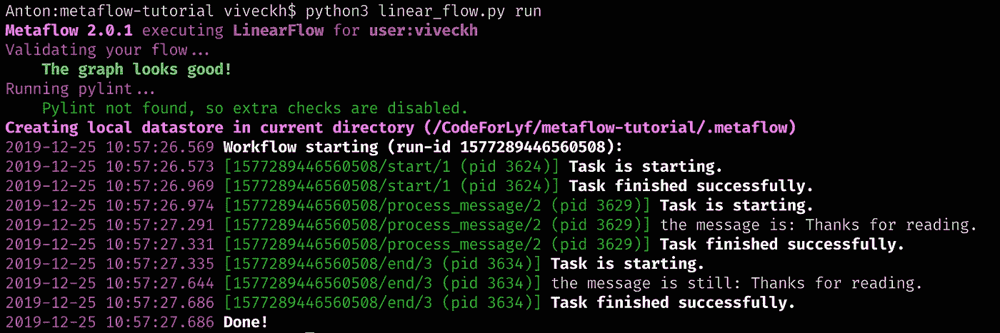**

**A sample flow run**

> **这里需要注意一些事情。 **Metaflow 创建一个本地数据存储** `***.metaflow***` ，在此存储所有运行元数据和与运行相关的数据快照。**如果您配置了云设置，数据快照将存在于 AWS S3 存储桶中，运行元数据将加载到由 RDS(关系数据存储)支持的元数据服务中**。我们将在后面看到如何使用客户端 API 轻松检查这个运行元数据。另一个值得注意的微妙但重要的事情是，每个步骤附带的`*pid (process ID*`是不同的。这让我想起了以前的一点，即 **Metaflow 将流的每一步分别封装起来，并在它们自己的环境中运行(只来回传输数据)****

## **Conda 设置(如果您计划注入依赖项)**

*   **[下载并安装 Miniconda](https://docs.conda.io/en/latest/miniconda.html) (如果您还没有安装的话)**
*   **加一个[康达频道](https://docs.conda.io/projects/conda/en/latest/user-guide/concepts/channels.html) : `conda config --add channels conda-forge`**
*   **现在，您可以在工作流程中注入 conda 依赖项了。我将在下面展示具体细节。**

# **实施更现实的工作流程**

**随着您逐步完成这项任务，元流的新概念将在适当的地方介绍和解释。**

## **任务**

**在这个流程中，我们将实现一个工作流，它**

1.  **将 CSV 接收到熊猫数据帧中**
2.  **并行计算各种流派的四分位数统计数据**
3.  **保存特定类型的统计数据字典。**

**—**

## **流动**

**下面是一个框架类，它可以帮助你看到事情的一般流程。**

**上面的框架类中介绍的一些概念**

*   **在`start`步骤的第 24 行，注意到`foreach`参数了吗？`**foreach**` **对** `**genres**` **列表**中的每一个条目的每一个循环内的 `**compute_statistics**` **步骤执行并行复制。****
*   **在第 26 行，**`**@catch(var='compute_failed')**`**装饰器将捕捉在** `**compute_statistics**` **步骤**中发生的任何异常，并将其赋给一个`compute_failed`变量(它的后继者可以读取该变量)****
*   ****在第 27 行，**`**@retry(times=1)**`**装饰器做它所暗示的事情**——在出现任何错误时重试该步骤。******
*   ******在`compute_statistics`的第 31 行，`self.input`神奇地出现在哪里？`**input**` **是 Metaflow 提供的一个类变量，包含了适用于** `**compute_statistics**` **这个实例的数据(当这个函数有多个副本并行运行时？**)只有当一个节点分支到多个并行进程时，或者当多个节点合并为一个时，才由元流添加。******
*   ******这个示例任务只显示了同一个`compute_statistics`函数的多次并行运行。但是对于那些好奇的人来说，完全不同和不相关的功能并行启动是可能的。为此，你可以将第 24 行改为第 9 行。当然，您必须相应地更新`join`步骤来处理这种情况。******

******这是骨架类的可视化表示。******

******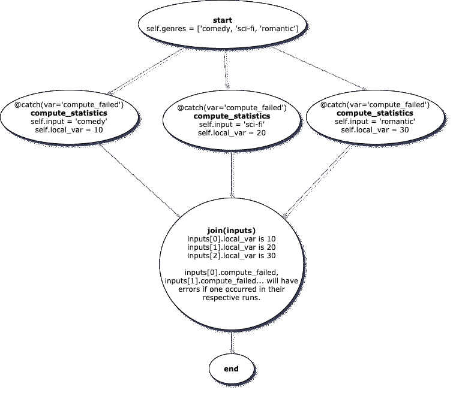******

******Visual Flow******

******—******

## ******读入数据文件和自定义参数******

*   ******[下载此 csv 文件，其中包含由 Metaflow](https://www.mediafire.com/file/g9vfu4xxqbs4h2o/movies.csv/file) 准备的电影数据。******
*   ******现在我们希望支持动态地将文件路径`movie_data`和一个`max_genres`值作为外部参数传递给我们的工作流。**元流允许您通过在运行命令中附加附加标志来传递参数。**例如`python3 tutorial_flow.py run --movie_data=path/to/movies.csv --max_genres=5`******
*   ******为了在工作流中读入这样的定制输入，Metaflow 提供了`IncludeFile`和`Parameter`对象。**我们通过将一个** `**IncludeFile**` **或** `**Parameter**` **对象赋给一个类变量**来访问传入的参数，这取决于我们是在读取文件还是常规值。******

******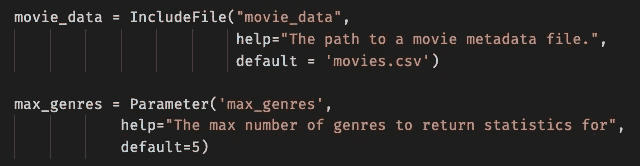******

******Reading in custom parameters passed through CLI******

******—******

## ******向流体中注入康达******

*   ******完成上面 **Conda 设置**部分概述的步骤。******
*   ********将 Metaflow 提供的** `**@conda_base**` **装饰器添加到你的 flow 的类**。它期望传入一个`python`版本，这个版本可以是硬编码的，也可以通过下面这样的函数提供。******

******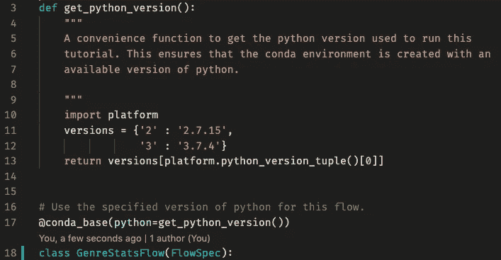******

******Injecting Conda to the Flow******

*   ********现在，您可以将** `**@conda**` **装饰器添加到流程中的任何步骤。它期望通过** `**libraries**` **参数**传递一个具有依赖关系的对象。在执行该步骤之前，元流将负责准备具有这些依赖关系的容器。**可以在不同的步骤中使用不同版本的包，因为元流在不同的容器中运行每个步骤。********

******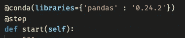******

*   ********新运行命令** : `python3 tutorial_flow.py --environment=conda run`******

******—******

## ******执行'`start’`步骤******

******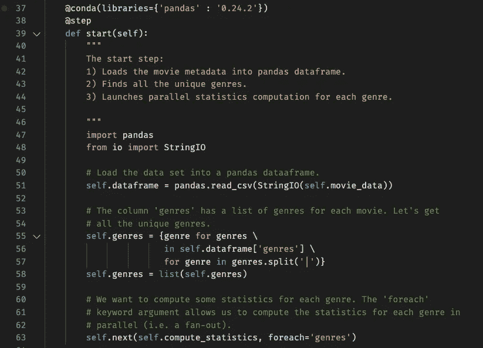******

******Implementation of `start` step******

******这里需要注意一些事情:******

*   ********注意** `**pandas**` **导入语句是如何存在于 step 函数中的？**那是因为康达只在这一步的范围内注射。******
*   ********然而，这里定义的变量(**`**dataframe**`**&**`**genres**`**)甚至可以通过在此之后运行的步骤来访问。**这是因为元流的工作原理是隔离运行环境，但允许数据自然流动。******

******—******

## ******实施'`compute_statistics’`步骤******

******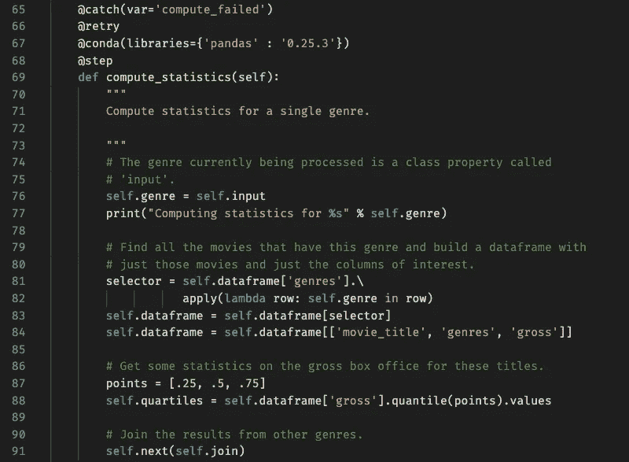******

******Implementation of `compute_statistics` step******

******注意，这一步是访问和修改在前面的`start`步骤中定义的`dataframe`变量。前进到下一个步骤，这个新改装的`dataframe`将会生效。******

******—******

## ******实施“加入”步骤******

******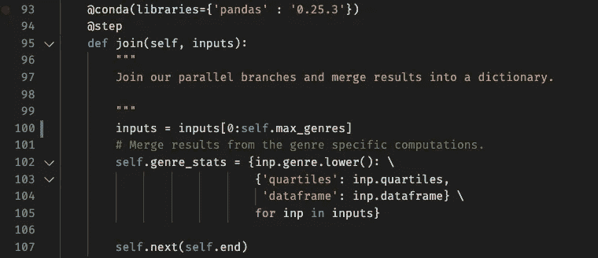******

******Implementation of `join` step******

******这里要注意两件事:******

*   ******在这一步，我们使用了一个完全不同版本的`pandas`库。******
*   ********`**inputs**`**数组中的每个索引代表在此之前运行的** `**compute_statistics**` **的一个副本。**它包含该运行的状态，即各种变量的值。因此，`input[0].quartiles`可以包含喜剧类型的四分位数，而`input[1].quartiles`可以包含科幻类型的四分位数。********

******—******

## ******最终代码工件******

******[本演示中开发的流程可在我的教程报告中找到。](https://github.com/Viveckh/New-ML-Data-Science-Framework-Tutorials-By-EJ)******

******为了看到它的流程设计:******

******`python3 tutorial_flow.py --environment=conda show`******

******要运行它:******

******`python3 tutorial_flow.py --environment=conda run --movie_data=path/to/movies.csv --max_genres=7`******

******—******

## ******通过客户端 API 检查运行******

********您可以利用 Metaflow 提供的** [**客户端 API**](https://docs.metaflow.org/metaflow/client) **来检查您过去运行的数据和状态快照。它非常适合在笔记本上探索您的历史跑步记录。********

******下面是一个简单的代码片段，我打印了上次成功运行`GenreStatsFlow`时的`genre_stats`变量。******

******Metaflow Client API Demo******

# ******在云上运行******

******在本地系统上做了一些原型之后，您可能希望利用云资源来加快速度。******

> ******目前 Metaflow 只支持与 AWS 的集成，下面是 AWS 服务 Metaflow 使用的并排比较。******

******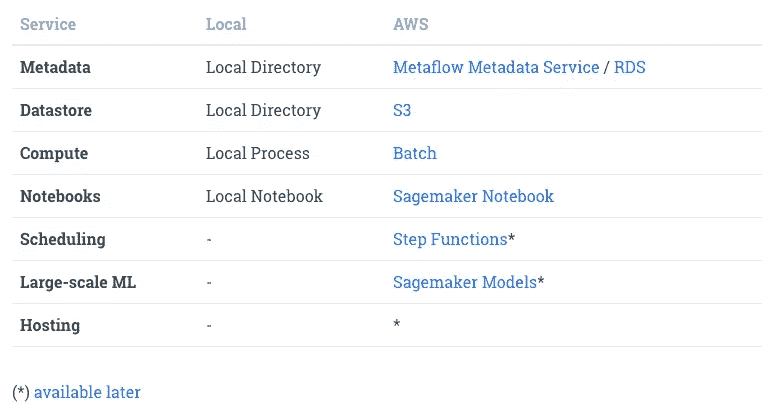******

******Integration between Metaflow and AWS******

*   ********首先，您需要在 AWS 上进行一次性设置，为 Metaflow 的运行创建资源。如果你想分享和访问彼此的跑步记录，你的团队可以利用相同的资源。请按照本页的说明进行操作。由于 Metaflow 为设置提供了一个 Cloudformation 模板，所以应该很快。********
*   ******然后，**在本地系统上运行** `**metaflow configure aws**` **，并提供提示的详细信息。**这是必要的，以便 Metaflow 可以使用您刚刚在 AWS 上设置的数据存储和 metastore。******
*   ******现在**要在云上运行您本地系统上的任何工作流，您所要做的就是将** `**--with batch**` **添加到您的运行命令中。**举个例子`python3 sample_flow.py run --with batch`。轻松微风！******
*   ********对于混合运行，即在本地运行几个步骤，在云上运行几个步骤** —将`@batch`装饰器添加到您想要在云上运行的工作流中的步骤。例如`@batch(cpu=1, memory=500)`******

# ******元流目前的局限性(或优势)******

*   ******与 AWS 紧密集成，尽管路线图中有支持更多云提供商的计划。******
*   ******Metaflow 完全基于 CLI，不附带 GUI。(不同于其他通用工作流框架，如 Airflow)******

# ******问题和反馈？******

******如果你在评论区有任何进一步的问题/反馈，或者有任何你想让我介绍的新技术，请告诉我。******

******感谢你的阅读！******

************

********是时尚科技创业公司* [***的联合创始人之一，也是开源电子商务的创造者他还为多家美国财富 500 强公司担任顾问，这些公司都是技术负责人、高级全栈工程师和数据科学家，负责从应用程序开发到大数据分析和机器学习的项目。***](https://www.qarece.com/)*******

## *******加入 EJ 的邮件列表，这样就能收到新故事的通知！❤*******

## *******你可能会喜欢 EJ 的其他文章*******

******* [## 6 分钟学会 hip lot——脸书用于机器学习可视化的 Python 库

### 高维互动情节变得简单。实践教程。

medium.com](https://medium.com/@viveckh/learn-hiplot-in-6-mins-facebooks-python-library-for-machine-learning-visualizations-330129d558ac)  [## 在 10 分钟内建立一个量子电路。Qiskit，IBM 用于量子编程的 Python SDK

### 学习量子力学的基本概念，在真实的量子上使用 Python 构建和执行量子电路…

medium.com](https://medium.com/@viveckh/build-a-quantum-circuit-in-10-mins-ft-qiskit-ibms-sdk-for-quantum-programming-75435b99ee9e)  [## 适用于您的机器学习解决方案的 AWS 架构

### 利用 AWS 支持的销售智能 ML 渠道推动数百万收入的真实使用案例

towardsdatascience.com](/aws-architecture-for-your-machine-learning-solutions-a208ece806de)  [## 为什么我的创业公司从未上线，尽管它已经有了可以投入生产的技术

### 技术型联合创始人的 6 个关键咒语。

medium.com](https://medium.com/swlh/why-my-startup-never-went-live-despite-a-production-ready-tech-55d344c0c057)*******