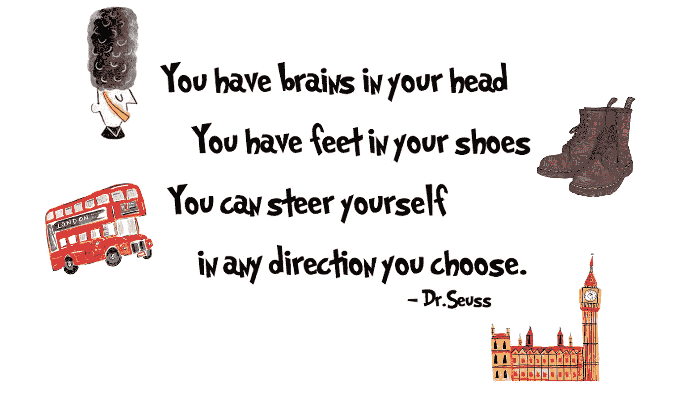

# 学习自然语言处理的实用方法

> 原文：<https://towardsdatascience.com/learn-nlp-the-practical-way-b854ce1035c4?source=collection_archive---------18----------------------->

## 从无到有。

与十五年前相比，今天的写作有了很大的不同。

出版曾经意味着印刷，这限制了空间，但不那么仓促。守门人越来越多，争夺读者注意力的内容越来越少。虽然只花了几年时间，但科技已经彻底改变了书面文字的经济状况。

我还以为过程没有结束。

我喜欢写作，至少到目前为止，这是我职业生涯的核心。但是，在未来几十年的工作中，我觉得忽视自然语言处理(NLP)的进展是危险的。2017 年末，我决定是时候提升技能了。

在这样做的过程中，我遇到了许多“学习指南”，它们本质上是免费课程和书籍的汇编。问题是，仅仅一门课就要占用你数周的时间。同样，消化一本技术书籍也是极其困难的——更不用说一大堆了。

作为一个想学习如何应用 NLP 工具和技术的人，这似乎不太实际。这篇文章追溯了我最终铺设的实际学习路径。

我是为那些想从文本中提取价值的人写的。如果你只带走一样东西，那就让它成为你能得到的东西。不是立刻，也许不是很快，但这是可行的。

我这样说是因为冒险进入一个新的领域总是会挫伤自我:首先，从基本原则建立一个知识库比扩展一个现有的要难得多。第二，在寻求向那些知道得更多的人学习的过程中，你闷闷不乐地接受了这意味着几乎任何人*。*

*我常常想，哇，我这么努力真是个失败者。我不得不主动提醒自己，学习既是一种选择，也是一种巨大的特权。*

*所以重要的是不要失去那种冒险的感觉。回顾过去，我突然意识到这就像是一个游客，欣赏被你所拥有的东西过滤的风景和经历。那我们就当游客吧。*

*欢迎来到伦敦。*

**

# ***1。绝对必须有***

*大多数游客首先去哪里？*

*当人们开始使用 NLP 时，许多人会直接使用现成的数据:电影评论、新闻组、Twitter 情绪。*

*主流观点认为，最好从常见的例子和技巧开始，最终将这些知识应用到“真实”的文本中。这意味着你正在引导你的学习走上一条把问题硬塞进你已经学会做的事情的道路。*

*不要。*

**

*相反，我建议你先搜集一些文本。这将使您能够处理与您的特定需求相关的文本内容，并让您亲身体验将这些类型的文本分开会产生什么效果。*

*同样重要的是，它会让你思考哪些标签可以很容易地从数据中提取出来，哪些是你可能想要计算的。*

*首先学习如何使用 [**请求**](https://realpython.com/python-requests/)[**urllib**](https://pythonprogramming.net/urllib-tutorial-python-3/)库，以及一个解析器(比如 [**美汤**](https://pythonspot.com/tag/beautifulsoup/) )。抓取文本通常只是短短的三行代码。努力的方向是查看解析后的 HTML 并提取出您需要的部分。任何搜索都会发现大量的分步指南。*

*现在，您可能希望将数据转换成某种可行的格式:一种易于加载和处理的格式，而且您可以打开 Excel 轻松查看数据。为此，您应该熟悉数据帧。除了如何初始化、添加内容和访问数据，一开始不要浪费任何时间。(这里，试试 [**这个**](/be-a-more-efficient-data-scientist-today-master-pandas-with-this-guide-ea362d27386) 指南。)其他的，你走着走着就学会了。

另一个绝对必备的就是正则表达式。语言感觉*几乎*有章可循。只有通过实际写下一些规则，你才能体验到异常的膨胀负担。也就是说，有时轻松提取 70%的相关信息就足够了。*

*这里有一个 [**教程**](https://regexone.com/) 让你入门，一个 [**在线测试器**](https://regex101.com/) 测试思路，还有一个 regex [**小抄**](https://www.cheatography.com/davechild/cheat-sheets/regular-expressions/) **。***

# ***2。玩弄文本***

*这很奇怪，但在完全忽略语言的同时处理语言已经成为惯例。许多 NLP 都是从将单词和单词组合转换成数字对象开始的，然后对这些对象进行数学处理。人们很容易忘记，你所操作的是语言的一种表示，而不是事物本身。*

*这种情况正在发生，因为操纵事情本身是 NLP 从业者多年来一直在做的事情——但成功有限。你被告知使用的工具是 NLTK，一个庞大的教育 NLP 图书馆。*

*嗯，我试过用 NLTK，不喜欢。我试着阅读附带的手册，这只会让事情变得更糟。然后，我转向 spaCy，再也没有回头。*

*空间干净高效。其清晰、视觉愉悦的 [**文档**](https://spacy.io/usage/spacy-101) 使其具有高度的可访问性，因此完成工作非常简单。它甚至还有一门 [**在线课程**](https://course.spacy.io/) 。*

*入口点是它的管道:默认情况下，当你处理一个段落时，你得到的是一个已经被分割成句子和单词对象的对象(称为令牌)；对句子进行解析，并根据它们的词性对标记进行标记；有些标记甚至被识别为命名实体(例如，“德国”是一个国家)。以后，如果需要，您可以删除其中的一些步骤，或者在上面添加其他步骤。但是这个默认设置很好地衬托了你。*

**

*学习语言学句子解析就像获得牡蛎卡一样:开始有点不方便，但很容易使用。当我试图抓住它时，我需要帮助。为了更进一步，我写了这篇 [**简短的讲解文章**](/getting-to-grips-with-parse-trees-6e19e7cd3c3c) 。*

*开始和课文玩小游戏:你会数动词吗？你能把文字分开吗？你能把一些文字放在一起吗？*

*随着你越来越熟悉 spaCy，这些游戏可以变得更加丰富。在你意识到之前，你已经在那里了，不是用键盘或笔来操作文本，而是好像它是乐高积木的一部分。*

# ***3。大量浅阅读***

*浅阅读是一种被大大低估的学习工具。*

*我们通过将新思想与熟悉的概念联系起来学习得最好。当一切都是新的——没有任何诱惑。通过略读大量关于某个主题的文章，即使你积极地理解得很少，你的寻找模式的大脑也会注意到某些术语是如何经常一起出现的。你会在完全理解概念和想法之前很久就开始认识它们。*

*很快，你就有了自己的衣架。*

**

*我建议避开关于他们的学术论文或博客文章。作者写作是为了在他们的专家群体中获得影响力；他们的目标受众不是好奇的 noob。*

*相反，我的 NLP 文章的来源是 Medium，尤其是面向数据科学的**出版物。其他伟大的来源是 [**fast.ai 博客**](https://www.fast.ai/topics/) 、分析 Vidhya 博客 和 [**Sebastian Ruder 的时事通讯**](http://newsletter.ruder.io/) 。当然可以选择别人；重要的是坚持阅读各种各样的文章。***

***还有 [**杰·阿拉玛的博客**](https://jalammar.github.io/) 。帖子不多，但每一篇都是对机器学习概念的高度可视化解释——强烈倾向于深度学习 NLP 的最新进展。***

# ***4.书***

***书籍就像购物:有无限的供应，争夺你有限的资源。此外，无论你选择什么，一半的东西最终将被证明是无用的。不过，这种经历会让你一下子接触到一堆新的东西。***

***就像我说的，目前人们似乎更关注“处理”部分，有点忘记了“自然语言”部分。我觉得这可能是个错误。***

******

***对我来说，这意味着读一本关于语言学的书，以及尽可能多的关于人们把什么当作语言的书。举几个例子:我花了一段时间阅读了所有关于科科的资料，这只大猩猩学会了手语，还学会了一些 T21 语，很多人认为是英语。我对科科是否讲过(手语)英语不感兴趣；我想知道是什么让人们相信她有。***

***我花了同样多的时间阅读 IBM 的沃森是如何赢得 Jeopardy 的，以及该团队的领导者大卫·法鲁奇(David Farucci)写的关于他努力开发故事写作软件的书。***

***不过，如果你真的想思考语言以及如何使用语言，我最推荐的一本是维特根斯坦的 [**哲学研究**](https://www.amazon.co.uk/Philosophical-Investigations-Ludwig-Wittgenstein/dp/1405159294?) 。我知道这听起来像是大材小用，这与 Python 或花哨的神经网络毫无关系。但我认为，你对自然语言部分理解得越好，你就能通过更简单的算法变得越聪明。***

***回到加工部门，我对书籍非常失望。***

***奥莱利动物系列，我拿到了用 Python[**应用文本分析(还算新)，和**](https://www.amazon.com/Applied-Text-Analysis-Python-Language-Aware/dp/1491963042/ref=sr_1_1?keywords=applied+text+analysis+python&qid=1573924660&sr=8-1) **[**编程集体智能**](https://www.amazon.com/Programming-Collective-Intelligence-Building-Applications/dp/0596529325/ref=sr_1_1?keywords=collective+intelligence&qid=1573924686&sr=8-1) (还不是)。我发现这两本书都没什么用。具有讽刺意味的是——因为它们本应是编码书籍——在这两种情况下，问题都出在代码上:*****

***旧版本充斥着过时的代码，包括现在已经失效的 API 和库。新的可能是最新的，但是代码用一个主项目说明了思想，这个主项目是逐步构建的。这意味着几乎每一章都需要熟悉前面的代码库。在这两本书里，解释这些原则的文字都严重缺乏。不管他们的目标读者是谁，都不是我。***

***这是一个主要的低谷。我想学习 NLP 技术，然而我却在这里:寻找世界上所有关于*理论、*和*实践的内容却毫无进展。****

# ***5.任务和库***

***相反，我回到了文章。如果说最初浅阅读有助于获取概念，那么随着时间的推移，人们探索的任务(情感、总结、主题建模、文本生成、数据可视化)和他们创造解决方案的技术(算法、库)中已经开始出现模式。***

***就像尽管每个人都有自己独特的伦敦，但我们很多人碰巧喜欢相同的东西。***

******

***我开始绘制问题空间，以及常用的技巧。***

***当人们分享他们的学习时，大多数文章都以他们最容易理解的水平为特色，使用玩具数据集或玩具问题。通过阅读几篇关于任何给定主题的文章并遵循代码，我最终会明白。***

***本质上，**任何我可以通过搜索解决的问题，我都认为是已经解决的问题**。这最后一句话不同于你将得到的大多数建议，但它绝对是应用自然语言处理的关键。***

***以文本摘要为例，无论用什么标准衡量，这都是一项艰巨的任务。你可以花时间阅读大量的 [**学术研究**](http://nlpprogress.com/english/summarization.html) ，它们竞相提高单个数据集的性能。或者，您可以 [**找到如何实现文本等级**](https://medium.com/analytics-vidhya/an-introduction-to-text-summarization-using-the-textrank-algorithm-with-python-implementation-2370c39d0c60) ，这是最常见的提取方法。***

***或者，您可以理解 Text Rank 是做什么的，并使用 [**PyTextRank**](https://pypi.org/project/pytextrank/) (刚刚发布；由知名专家编码；并对原算法进行了改进。而且，你发现这一点只是因为你一直在努力进行浅阅读。***

***这并不是说一种方法优于其他方法——每种方法都有不同的收益。你的工作是确定目标，评估哪里最适合你。***

***同样的原则也适用于代码。有那么多优质的开源库。现在让我告诉你——大部分我还没用过。相反，我一直在维护一个列出有用库的文档，并在需要时使用它们。这里有一个资源**让你开始列出自己的清单。*****

*****简单回到文章，还有激动人心的小众。有时，你会看到有人试图将想法应用到一个非常具体的任务中，他们专注于制造一些实际可行的东西。通常情况下，他们会使用熟悉的工具，但使用方式不同。*****

*****确保您保存了任何此类文章；很可能，你以后会想要它。*****

# *****6.小型项目*****

*****假设你读了 25 篇关于某个旅游景点的评论，所有的评论都很糟糕。这个景点也不便宜，而且会耗掉一整天。*****

*****你会去吗？*****

*****你读的文章会给你指出你能做的事情，但不一定是你应该做的事情。我拒绝花时间实现我从未见过任何有意义的结果的算法。*****

*****为什么？因为，从广义上讲，开箱即用的算法在有用的任务上表现很差。你可以花上几个月甚至几年的时间来学习书中的每一个技巧——但仍然无法增加价值。*****

*****对于任何想增加编码时间或刚刚开始职业生涯的人来说，这是一个糟糕的建议。但是如果你想在你的领域内使用自然语言处理，最重要的技能是提出商业问题，并考虑如何解决这些问题。*****

*****哪个更好——一个大项目，还是几个小项目？一开始我会说，越小越好。把它想象成一次小小的冒险。*****

**********

*****最初，我实现了我看到其他人做的有趣的东西。然后我开始应用我自己的想法，只是想看看会发生什么。*****

*****例如，已经发生的一件事是，我对 [**财经新闻**](/a-new-way-to-sentiment-tag-financial-news-9ac7681836a7) 进行情感标签的技术目前在任何相关的谷歌搜索中排名靠前或接近靠前。*****

*****我提到这一点是为了强调我之前的观点:是的，通过从新的角度看待已知的问题，你可以交付新的价值。*****

*****至于你应该实现什么——这是你自己的观点。我推荐阅读以下两位作者以前的帖子，因为他们一贯的冒险精神和敢做的态度: [**Susan Li**](https://medium.com/@actsusanli) ，他们的博客主要是关于 NLP 的东西，以及 [**Will Koehrsen**](https://medium.com/@williamkoehrsen) ，他们的博客涉及各种机器学习主题。*****

*****而作为一个游客，大概也该回家了。*****

**********

*****Phew!*****

# *****接下来呢？*****

*****因此，现在学习路径出现了分叉:一种方式是朝着更持续的语言观点发展，这种观点转向“处理”:这都是关于通过迁移学习来利用大型语言模型。*****

*****另一个是对语言的更离散的观点，我认为这更接近于“自然”的部分:这是包含知识图表和组合表示的东西。*****

*****就像“自然语言处理”是一个单一的想法，这些路径最终会重新连接起来。但最初它们是不同的。因为我是理论不可知论者——这是一种说我会愉快地挑选适合问题的东西的花哨说法——我想探索两者。*****

*****出于现实原因，我决定从迁移学习入手，上了 [**fast.ai NLP 课程**](https://www.fast.ai/2019/07/08/fastai-nlp/) 。我想在某个时候写下它。*****

*******更新，2020 年 8 月:**虽然我极力推荐这门课程，但我从未抽出时间来写它。然而，我最终还是为伯特和 GPT-2 写了[**ABBA 终极解说，你可能会觉得有帮助。**](/the-abba-explainer-to-bert-and-gpt-2-ada8ff4d1eca)*****

*****同时，让我们总结一下:为了充分熟悉工具和实践，以便我可以试验它们，我遵循了上面追踪的学习路径。我希望它的一部分也能帮助你。*****

**********